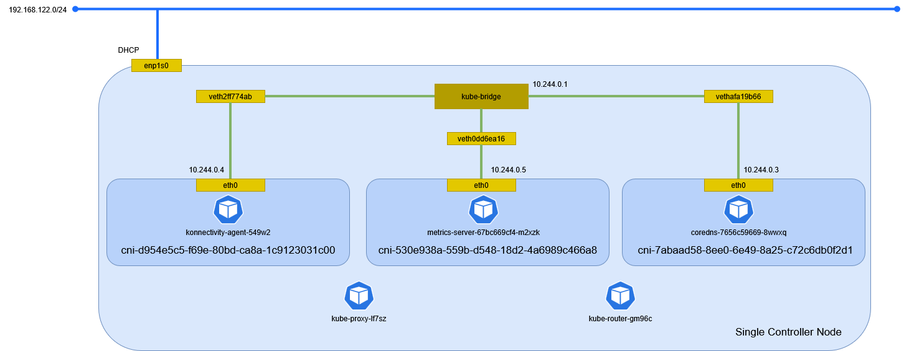

# k0s

シングルノード用に k0s を構築する。

## 事前準備

### ネットワーク

ホスト名を設定する。

```sh
hostnamectl set-hostname centos10.home.local
```

ファイアウォールを設定する。

```sh
firewall-cmd --set-default-zone trusted
firewall-cmd --permanent --zone=public --change-interface=enp1s0

firewall-cmd --permanent --zone=public --add-port=112/tcp
firewall-cmd --permanent --zone=public --add-port=179/tcp
firewall-cmd --permanent --zone=public --add-port=2380/tcp
firewall-cmd --permanent --zone=public --add-port=4789/udp
firewall-cmd --permanent --zone=public --add-port=6443/tcp
firewall-cmd --permanent --zone=public --add-port=8132/tcp
firewall-cmd --permanent --zone=public --add-port=9443/tcp
firewall-cmd --permanent --zone=public --add-port=10250/tcp

firewall-cmd --permanent --zone=public --add-source=10.244.0.0/16

firewall-cmd --permanent --zone=public --add-masquerade

firewall-cmd --reload
```

## インストール

k0s バイナリをインストールする。

```sh
curl --proto '=https' --tlsv1.2 -sSf https://get.k0s.sh | sh
```

```text
Downloading k0s from URL: https://github.com/k0sproject/k0s/releases/download/v1.34.1+k0s.0/k0s-v1.34.1+k0s.0-amd64
k0s is now executable in /usr/local/bin
You can use it to complete the installation of k0s on this node,
see https://docs.k0sproject.io/stable/install/ for more information.
```

バイナリを確認する。

```sh
k0s version
```

```text
v1.34.1+k0s.0
```

シングルノードで Controller Node を有効化する。

```sh
k0s install controller --enable-worker --no-taints
```

```text
[  499.342326] systemd-rc-local-generator[1527]: /etc/rc.d/rc.local is not marked executable, skipping.
[  499.499595] systemd-rc-local-generator[1563]: /etc/rc.d/rc.local is not marked executable, skipping.
```

ユニットファイルを確認する。

```sh
cat /etc/systemd/system/k0scontroller.service
```

```ini
[Unit]
Description=k0s - Zero Friction Kubernetes
Documentation=https://docs.k0sproject.io
ConditionFileIsExecutable=/usr/local/bin/k0s

After=network-online.target
Wants=network-online.target

[Service]
StartLimitInterval=5
StartLimitBurst=10
ExecStart=/usr/local/bin/k0s controller --enable-worker=true --no-taints=true

RestartSec=10
Delegate=yes
KillMode=process
LimitCORE=infinity
TasksMax=infinity
TimeoutStartSec=0
LimitNOFILE=999999
Restart=always

[Install]
WantedBy=multi-user.target
```

## サービス起動

サービスを起動する。

```sh
k0s start
```

サービスの状況を確認する。

```sh
k0s status
```

```text
Version: v1.34.1+k0s.0
Process ID: 1592
Role: controller
Workloads: true
SingleNode: false
Kube-api probing successful: true
Kube-api probing last error:
```

ノードを確認する。

```sh
k0s kubectl get nodes
```

```text
NAME                  STATUS   ROLES           AGE   VERSION
centos10.home.local   Ready    control-plane   86s   v1.34.1+k0s
```

## 環境確認

Controller Node でネットワーク構成を確認する。



### ネットワーク名前空間

ネットワーク名前空間を確認する。

```sh
ip netns
```

```text
cni-7abaad58-8ee0-6e49-8a25-c72c6db0f2d1 (id: 2)
cni-d954e5c5-f69e-80bd-ca8a-1c9123031c00 (id: 0)
cni-530e938a-559b-d548-18d2-4a6989c466a8 (id: 1)
```

### デバイス

デバイスを確認する。

```sh
ip -d link show
```

```text
1: lo: <LOOPBACK,UP,LOWER_UP> mtu 65536 qdisc noqueue state UNKNOWN mode DEFAULT group default qlen 1000
    link/loopback 00:00:00:00:00:00 brd 00:00:00:00:00:00 promiscuity 0 allmulti 0 minmtu 0 maxmtu 0 addrgenmode eui64 numtxqueues 1 numrxqueues 1 gso_max_size 65536 gso_max_segs 65535 tso_max_size 524280 tso_max_segs 65535 gro_max_size 65536 gso_ipv4_max_size 65536 gro_ipv4_max_size 65536
2: enp1s0: <BROADCAST,MULTICAST,UP,LOWER_UP> mtu 1500 qdisc fq_codel state UP mode DEFAULT group default qlen 1000
    link/ether 52:54:00:da:28:19 brd ff:ff:ff:ff:ff:ff promiscuity 0 allmulti 0 minmtu 68 maxmtu 65535 addrgenmode none numtxqueues 1 numrxqueues 1 gso_max_size 65536 gso_max_segs 65535 tso_max_size 65536 tso_max_segs 65535 gro_max_size 65536 gso_ipv4_max_size 65536 gro_ipv4_max_size 65536 parentbus virtio parentdev virtio1
    altname enx525400da2819
3: kube-bridge: <BROADCAST,MULTICAST,UP,LOWER_UP> mtu 1500 qdisc noqueue state UP mode DEFAULT group default qlen 1000
    link/ether 22:ef:53:73:aa:bd brd ff:ff:ff:ff:ff:ff promiscuity 0 allmulti 0 minmtu 68 maxmtu 65535
    bridge forward_delay 1500 hello_time 200 max_age 2000 ageing_time 30000 stp_state 0 priority 32768 vlan_filtering 0 vlan_protocol 802.1Q bridge_id 8000.22:ef:53:73:aa:bd designated_root 8000.22:ef:53:73:aa:bd root_port 0 root_path_cost 0 topology_change 0 topology_change_detected 0 hello_timer    0.00 tcn_timer    0.00 topology_change_timer    0.00 gc_timer  269.77 fdb_n_learned 3 fdb_max_learned 0 vlan_default_pvid 1 vlan_stats_enabled 0 vlan_stats_per_port 0 group_fwd_mask 0 group_address 01:80:c2:00:00:00 mcast_snooping 1 no_linklocal_learn 0 mcast_vlan_snooping 0 mst_enabled 0 mcast_router 1 mcast_query_use_ifaddr 0 mcast_querier 0 mcast_hash_elasticity 16 mcast_hash_max 4096 mcast_last_member_count 2 mcast_startup_query_count 2 mcast_last_member_interval 100 mcast_membership_interval 26000 mcast_querier_interval 25500 mcast_query_interval 12500 mcast_query_response_interval 1000 mcast_startup_query_interval 3125 mcast_stats_enabled 0 mcast_igmp_version 2 mcast_mld_version 1 nf_call_iptables 0 nf_call_ip6tables 0 nf_call_arptables 0 addrgenmode eui64 numtxqueues 1 numrxqueues 1 gso_max_size 65536 gso_max_segs 65535 tso_max_size 524280 tso_max_segs 65535 gro_max_size 65536 gso_ipv4_max_size 65536 gro_ipv4_max_size 65536
6: vethafa19b66@if2: <BROADCAST,MULTICAST,UP,LOWER_UP> mtu 1500 qdisc noqueue master kube-bridge state UP mode DEFAULT group default
    link/ether b6:51:12:18:a3:85 brd ff:ff:ff:ff:ff:ff link-netns cni-7abaad58-8ee0-6e49-8a25-c72c6db0f2d1 promiscuity 1 allmulti 1 minmtu 68 maxmtu 65535
    veth
    bridge_slave state forwarding priority 32 cost 2 hairpin on guard off root_block off fastleave off learning on flood on port_id 0x8001 port_no 0x1 designated_port 32769 designated_cost 0 designated_bridge 8000.22:ef:53:73:aa:bd designated_root 8000.22:ef:53:73:aa:bd hold_timer    0.00 message_age_timer    0.00 forward_delay_timer    0.00 topology_change_ack 0 config_pending 0 proxy_arp off proxy_arp_wifi off mcast_router 1 mcast_fast_leave off mcast_flood on bcast_flood on mcast_to_unicast off neigh_suppress off neigh_vlan_suppress off group_fwd_mask 0 group_fwd_mask_str 0x0 vlan_tunnel off isolated off locked off mab off addrgenmode eui64 numtxqueues 4 numrxqueues 4 gso_max_size 65536 gso_max_segs 65535 tso_max_size 524280 tso_max_segs 65535 gro_max_size 65536 gso_ipv4_max_size 65536 gro_ipv4_max_size 65536
7: veth2ff774ab@if2: <BROADCAST,MULTICAST,UP,LOWER_UP> mtu 1500 qdisc noqueue master kube-bridge state UP mode DEFAULT group default
    link/ether 22:ef:53:73:aa:bd brd ff:ff:ff:ff:ff:ff link-netns cni-d954e5c5-f69e-80bd-ca8a-1c9123031c00 promiscuity 1 allmulti 1 minmtu 68 maxmtu 65535
    veth
    bridge_slave state forwarding priority 32 cost 2 hairpin on guard off root_block off fastleave off learning on flood on port_id 0x8002 port_no 0x2 designated_port 32770 designated_cost 0 designated_bridge 8000.22:ef:53:73:aa:bd designated_root 8000.22:ef:53:73:aa:bd hold_timer    0.00 message_age_timer    0.00 forward_delay_timer    0.00 topology_change_ack 0 config_pending 0 proxy_arp off proxy_arp_wifi off mcast_router 1 mcast_fast_leave off mcast_flood on bcast_flood on mcast_to_unicast off neigh_suppress off neigh_vlan_suppress off group_fwd_mask 0 group_fwd_mask_str 0x0 vlan_tunnel off isolated off locked off mab off addrgenmode eui64 numtxqueues 4 numrxqueues 4 gso_max_size 65536 gso_max_segs 65535 tso_max_size 524280 tso_max_segs 65535 gro_max_size 65536 gso_ipv4_max_size 65536 gro_ipv4_max_size 65536
8: veth0dd6ea16@if2: <BROADCAST,MULTICAST,UP,LOWER_UP> mtu 1500 qdisc noqueue master kube-bridge state UP mode DEFAULT group default
    link/ether a6:fd:5d:55:d3:b6 brd ff:ff:ff:ff:ff:ff link-netns cni-530e938a-559b-d548-18d2-4a6989c466a8 promiscuity 1 allmulti 1 minmtu 68 maxmtu 65535
    veth
    bridge_slave state forwarding priority 32 cost 2 hairpin on guard off root_block off fastleave off learning on flood on port_id 0x8003 port_no 0x3 designated_port 32771 designated_cost 0 designated_bridge 8000.22:ef:53:73:aa:bd designated_root 8000.22:ef:53:73:aa:bd hold_timer    0.00 message_age_timer    0.00 forward_delay_timer    0.00 topology_change_ack 0 config_pending 0 proxy_arp off proxy_arp_wifi off mcast_router 1 mcast_fast_leave off mcast_flood on bcast_flood on mcast_to_unicast off neigh_suppress off neigh_vlan_suppress off group_fwd_mask 0 group_fwd_mask_str 0x0 vlan_tunnel off isolated off locked off mab off addrgenmode eui64 numtxqueues 4 numrxqueues 4 gso_max_size 65536 gso_max_segs 65535 tso_max_size 524280 tso_max_segs 65535 gro_max_size 65536 gso_ipv4_max_size 65536 gro_ipv4_max_size 65536
```

ネットワーク名前空間内のデバイスを確認する。

```sh
ip netns exec cni-d954e5c5-f69e-80bd-ca8a-1c9123031c00 ip -d link show
```

```text
1: lo: <LOOPBACK,UP,LOWER_UP> mtu 65536 qdisc noqueue state UNKNOWN mode DEFAULT group default qlen 1000
    link/loopback 00:00:00:00:00:00 brd 00:00:00:00:00:00 promiscuity 0 allmulti 0 minmtu 0 maxmtu 0 addrgenmode eui64 numtxqueues 1 numrxqueues 1 gso_max_size 65536 gso_max_segs 65535 tso_max_size 524280 tso_max_segs 65535 gro_max_size 65536 gso_ipv4_max_size 65536 gro_ipv4_max_size 65536
2: eth0@if7: <BROADCAST,MULTICAST,UP,LOWER_UP> mtu 1500 qdisc noqueue state UP mode DEFAULT group default qlen 1000
    link/ether 02:bd:5e:9d:ce:65 brd ff:ff:ff:ff:ff:ff link-netnsid 0 promiscuity 0 allmulti 0 minmtu 68 maxmtu 65535
    veth addrgenmode eui64 numtxqueues 4 numrxqueues 4 gso_max_size 65536 gso_max_segs 65535 tso_max_size 524280 tso_max_segs 65535 gro_max_size 65536 gso_ipv4_max_size 65536 gro_ipv4_max_size 65536
```

ネットワーク名前空間内のデバイスを確認する。

```sh
ip netns exec cni-530e938a-559b-d548-18d2-4a6989c466a8 ip -d link show
```

```text
1: lo: <LOOPBACK,UP,LOWER_UP> mtu 65536 qdisc noqueue state UNKNOWN mode DEFAULT group default qlen 1000
    link/loopback 00:00:00:00:00:00 brd 00:00:00:00:00:00 promiscuity 0 allmulti 0 minmtu 0 maxmtu 0 addrgenmode eui64 numtxqueues 1 numrxqueues 1 gso_max_size 65536 gso_max_segs 65535 tso_max_size 524280 tso_max_segs 65535 gro_max_size 65536 gso_ipv4_max_size 65536 gro_ipv4_max_size 65536
2: eth0@if8: <BROADCAST,MULTICAST,UP,LOWER_UP> mtu 1500 qdisc noqueue state UP mode DEFAULT group default qlen 1000
    link/ether 7a:39:d6:52:2b:ef brd ff:ff:ff:ff:ff:ff link-netnsid 0 promiscuity 0 allmulti 0 minmtu 68 maxmtu 65535
    veth addrgenmode eui64 numtxqueues 4 numrxqueues 4 gso_max_size 65536 gso_max_segs 65535 tso_max_size 524280 tso_max_segs 65535 gro_max_size 65536 gso_ipv4_max_size 65536 gro_ipv4_max_size 65536
```

ネットワーク名前空間内のデバイスを確認する。

```sh
ip netns exec cni-7abaad58-8ee0-6e49-8a25-c72c6db0f2d1 ip -d link show
```

```text
1: lo: <LOOPBACK,UP,LOWER_UP> mtu 65536 qdisc noqueue state UNKNOWN mode DEFAULT group default qlen 1000
    link/loopback 00:00:00:00:00:00 brd 00:00:00:00:00:00 promiscuity 0 allmulti 0 minmtu 0 maxmtu 0 addrgenmode eui64 numtxqueues 1 numrxqueues 1 gso_max_size 65536 gso_max_segs 65535 tso_max_size 524280 tso_max_segs 65535 gro_max_size 65536 gso_ipv4_max_size 65536 gro_ipv4_max_size 65536
2: eth0@if6: <BROADCAST,MULTICAST,UP,LOWER_UP> mtu 1500 qdisc noqueue state UP mode DEFAULT group default qlen 1000
    link/ether 8e:43:9b:07:8a:79 brd ff:ff:ff:ff:ff:ff link-netnsid 0 promiscuity 0 allmulti 0 minmtu 68 maxmtu 65535
    veth addrgenmode eui64 numtxqueues 4 numrxqueues 4 gso_max_size 65536 gso_max_segs 65535 tso_max_size 524280 tso_max_segs 65535 gro_max_size 65536 gso_ipv4_max_size 65536 gro_ipv4_max_size 65536
```

### イーサネット

イーサネットの情報を確認する。

```sh
ip addr show
```

```text
1: lo: <LOOPBACK,UP,LOWER_UP> mtu 65536 qdisc noqueue state UNKNOWN group default qlen 1000
    link/loopback 00:00:00:00:00:00 brd 00:00:00:00:00:00
    inet 127.0.0.1/8 scope host lo
       valid_lft forever preferred_lft forever
    inet6 ::1/128 scope host noprefixroute
       valid_lft forever preferred_lft forever
2: enp1s0: <BROADCAST,MULTICAST,UP,LOWER_UP> mtu 1500 qdisc fq_codel state UP group default qlen 1000
    link/ether 52:54:00:da:28:19 brd ff:ff:ff:ff:ff:ff
    altname enx525400da2819
    inet 192.168.122.161/24 brd 192.168.122.255 scope global dynamic noprefixroute enp1s0
       valid_lft 2367sec preferred_lft 2367sec
    inet6 fe80::5054:ff:feda:2819/64 scope link noprefixroute
       valid_lft forever preferred_lft forever
3: kube-bridge: <BROADCAST,MULTICAST,UP,LOWER_UP> mtu 1500 qdisc noqueue state UP group default qlen 1000
    link/ether 22:ef:53:73:aa:bd brd ff:ff:ff:ff:ff:ff
    inet 10.244.0.1/24 brd 10.244.0.255 scope global kube-bridge
       valid_lft forever preferred_lft forever
    inet6 fe80::3c70:aeff:feed:177a/64 scope link proto kernel_ll
       valid_lft forever preferred_lft forever
6: vethafa19b66@if2: <BROADCAST,MULTICAST,UP,LOWER_UP> mtu 1500 qdisc noqueue master kube-bridge state UP group default
    link/ether b6:51:12:18:a3:85 brd ff:ff:ff:ff:ff:ff link-netns cni-7abaad58-8ee0-6e49-8a25-c72c6db0f2d1
    inet6 fe80::b451:12ff:fe18:a385/64 scope link proto kernel_ll
       valid_lft forever preferred_lft forever
7: veth2ff774ab@if2: <BROADCAST,MULTICAST,UP,LOWER_UP> mtu 1500 qdisc noqueue master kube-bridge state UP group default
    link/ether 22:ef:53:73:aa:bd brd ff:ff:ff:ff:ff:ff link-netns cni-d954e5c5-f69e-80bd-ca8a-1c9123031c00
    inet6 fe80::20ef:53ff:fe73:aabd/64 scope link proto kernel_ll
       valid_lft forever preferred_lft forever
8: veth0dd6ea16@if2: <BROADCAST,MULTICAST,UP,LOWER_UP> mtu 1500 qdisc noqueue master kube-bridge state UP group default
    link/ether a6:fd:5d:55:d3:b6 brd ff:ff:ff:ff:ff:ff link-netns cni-530e938a-559b-d548-18d2-4a6989c466a8
    inet6 fe80::a4fd:5dff:fe55:d3b6/64 scope link proto kernel_ll
       valid_lft forever preferred_lft forever
```

ネットワーク名前空間内のイーサネットの情報を確認する。

```sh
ip netns exec cni-d954e5c5-f69e-80bd-ca8a-1c9123031c00 ip addr show
```

```text
1: lo: <LOOPBACK,UP,LOWER_UP> mtu 65536 qdisc noqueue state UNKNOWN group default qlen 1000
    link/loopback 00:00:00:00:00:00 brd 00:00:00:00:00:00
    inet 127.0.0.1/8 scope host lo
       valid_lft forever preferred_lft forever
    inet6 ::1/128 scope host proto kernel_lo
       valid_lft forever preferred_lft forever
2: eth0@if7: <BROADCAST,MULTICAST,UP,LOWER_UP> mtu 1500 qdisc noqueue state UP group default qlen 1000
    link/ether 02:bd:5e:9d:ce:65 brd ff:ff:ff:ff:ff:ff link-netnsid 0
    inet 10.244.0.4/24 brd 10.244.0.255 scope global eth0
       valid_lft forever preferred_lft forever
    inet6 fe80::bd:5eff:fe9d:ce65/64 scope link proto kernel_ll
       valid_lft forever preferred_lft forever
```

ネットワーク名前空間内のイーサネットの情報を確認する。

```sh
ip netns exec cni-530e938a-559b-d548-18d2-4a6989c466a8 ip addr show
```

```text
1: lo: <LOOPBACK,UP,LOWER_UP> mtu 65536 qdisc noqueue state UNKNOWN group default qlen 1000
    link/loopback 00:00:00:00:00:00 brd 00:00:00:00:00:00
    inet 127.0.0.1/8 scope host lo
       valid_lft forever preferred_lft forever
    inet6 ::1/128 scope host proto kernel_lo
       valid_lft forever preferred_lft forever
2: eth0@if8: <BROADCAST,MULTICAST,UP,LOWER_UP> mtu 1500 qdisc noqueue state UP group default qlen 1000
    link/ether 7a:39:d6:52:2b:ef brd ff:ff:ff:ff:ff:ff link-netnsid 0
    inet 10.244.0.5/24 brd 10.244.0.255 scope global eth0
       valid_lft forever preferred_lft forever
    inet6 fe80::7839:d6ff:fe52:2bef/64 scope link proto kernel_ll
       valid_lft forever preferred_lft forever
```

ネットワーク名前空間内のイーサネットの情報を確認する。

```sh
ip netns exec cni-7abaad58-8ee0-6e49-8a25-c72c6db0f2d1 ip addr show
```

```text
1: lo: <LOOPBACK,UP,LOWER_UP> mtu 65536 qdisc noqueue state UNKNOWN group default qlen 1000
    link/loopback 00:00:00:00:00:00 brd 00:00:00:00:00:00
    inet 127.0.0.1/8 scope host lo
       valid_lft forever preferred_lft forever
    inet6 ::1/128 scope host proto kernel_lo
       valid_lft forever preferred_lft forever
2: eth0@if6: <BROADCAST,MULTICAST,UP,LOWER_UP> mtu 1500 qdisc noqueue state UP group default qlen 1000
    link/ether 8e:43:9b:07:8a:79 brd ff:ff:ff:ff:ff:ff link-netnsid 0
    inet 10.244.0.3/24 brd 10.244.0.255 scope global eth0
       valid_lft forever preferred_lft forever
    inet6 fe80::8c43:9bff:fe07:8a79/64 scope link proto kernel_ll
       valid_lft forever preferred_lft forever
```

### ルート

ルーティングを確認する。

```sh
ip route show
```

```text
default via 192.168.122.1 dev enp1s0 proto dhcp src 192.168.122.161 metric 100
10.244.0.0/24 dev kube-bridge proto kernel scope link src 10.244.0.1
192.168.122.0/24 dev enp1s0 proto kernel scope link src 192.168.122.161 metric 100
```

ネットワーク名前空間内のルーティングを確認する。

```sh
ip netns exec cni-d954e5c5-f69e-80bd-ca8a-1c9123031c00 ip route show
```

```text
default via 10.244.0.1 dev eth0
10.244.0.0/24 dev eth0 proto kernel scope link src 10.244.0.4
```

ネットワーク名前空間内のルーティングを確認する。

```sh
ip netns exec cni-530e938a-559b-d548-18d2-4a6989c466a8 ip route show
```

```text
default via 10.244.0.1 dev eth0
10.244.0.0/24 dev eth0 proto kernel scope link src 10.244.0.5
```

ネットワーク名前空間内のルーティングを確認する。

```sh
ip netns exec cni-7abaad58-8ee0-6e49-8a25-c72c6db0f2d1 ip route show
```

```text
default via 10.244.0.1 dev eth0
10.244.0.0/24 dev eth0 proto kernel scope link src 10.244.0.3
```

### nftables

ルールセットを確認する。

```sh
nft list ruleset ip
```

```text
table ip mangle {
        chain KUBE-IPTABLES-HINT {
        }

        chain KUBE-KUBELET-CANARY {
        }

        chain KUBE-PROXY-CANARY {
        }
}
# Warning: table ip nat is managed by iptables-nft, do not touch!
table ip nat {
        chain KUBE-KUBELET-CANARY {
        }

        chain KUBE-PROXY-CANARY {
        }

        chain KUBE-SERVICES {
                ip daddr 10.98.223.45 ip protocol tcp  tcp dport 443 counter packets 6 bytes 360 jump KUBE-SVC-Z4ANX4WAEWEBLCTM
                ip daddr 10.96.0.1 ip protocol tcp  tcp dport 443 counter packets 0 bytes 0 jump KUBE-SVC-NPX46M4PTMTKRN6Y
                ip daddr 10.96.0.10 ip protocol tcp  tcp dport 9153 counter packets 0 bytes 0 jump KUBE-SVC-JD5MR3NA4I4DYORP
                ip daddr 10.96.0.10 ip protocol udp  udp dport 53 counter packets 0 bytes 0 jump KUBE-SVC-TCOU7JCQXEZGVUNU
                ip daddr 10.96.0.10 ip protocol tcp  tcp dport 53 counter packets 0 bytes 0 jump KUBE-SVC-ERIFXISQEP7F7OF4
                 fib daddr type local counter packets 346 bytes 20760 jump KUBE-NODEPORTS
        }

        chain OUTPUT {
                type nat hook output priority dstnat; policy accept;
                 counter packets 2027 bytes 140982 jump KUBE-SERVICES
        }

        chain PREROUTING {
                type nat hook prerouting priority dstnat; policy accept;
                 counter packets 20 bytes 1225 jump KUBE-SERVICES
        }

        chain KUBE-POSTROUTING {
                meta mark & 0x00004000 != 0x00004000 counter packets 1313 bytes 84942 return
                counter packets 0 bytes 0 meta mark set mark xor 0x4000
                 counter packets 0 bytes 0 masquerade fully-random
        }

        chain POSTROUTING {
                type nat hook postrouting priority srcnat; policy accept;
                 counter packets 2040 bytes 141787 jump KUBE-POSTROUTING
                xt match "set" xt match "set" xt match "set" counter packets 8 bytes 485 masquerade fully-random
        }

        chain KUBE-NODEPORTS {
        }

        chain KUBE-MARK-MASQ {
                counter packets 0 bytes 0 meta mark set mark or 0x4000
        }

        chain KUBE-SVC-NPX46M4PTMTKRN6Y {
                ip saddr != 10.244.0.0/16 ip daddr 10.96.0.1 ip protocol tcp  tcp dport 443 counter packets 6 bytes 360 jump KUBE-MARK-MASQ
                 counter packets 10 bytes 600 jump KUBE-SEP-PT7B37VJQL3XIBAK
        }

        chain KUBE-SEP-PT7B37VJQL3XIBAK {
                ip saddr 192.168.122.161  counter packets 6 bytes 360 jump KUBE-MARK-MASQ
                ip protocol tcp  meta l4proto tcp counter packets 10 bytes 600 dnat to 192.168.122.161:6443
        }

        chain KUBE-SVC-TCOU7JCQXEZGVUNU {
                ip saddr != 10.244.0.0/16 ip daddr 10.96.0.10 ip protocol udp  udp dport 53 counter packets 0 bytes 0 jump KUBE-MARK-MASQ
                 counter packets 0 bytes 0 jump KUBE-SEP-6E7XQMQ4RAYOWTTM
        }

        chain KUBE-SEP-6E7XQMQ4RAYOWTTM {
                ip saddr 10.244.0.3  counter packets 0 bytes 0 jump KUBE-MARK-MASQ
                ip protocol udp  meta l4proto udp counter packets 0 bytes 0 dnat to 10.244.0.3:53
        }

        chain KUBE-SVC-ERIFXISQEP7F7OF4 {
                ip saddr != 10.244.0.0/16 ip daddr 10.96.0.10 ip protocol tcp  tcp dport 53 counter packets 0 bytes 0 jump KUBE-MARK-MASQ
                 counter packets 0 bytes 0 jump KUBE-SEP-ZXMNUKOKXUTL2MK2
        }

        chain KUBE-SEP-ZXMNUKOKXUTL2MK2 {
                ip saddr 10.244.0.3  counter packets 0 bytes 0 jump KUBE-MARK-MASQ
                ip protocol tcp  meta l4proto tcp counter packets 0 bytes 0 dnat to 10.244.0.3:53
        }

        chain KUBE-SVC-JD5MR3NA4I4DYORP {
                ip saddr != 10.244.0.0/16 ip daddr 10.96.0.10 ip protocol tcp  tcp dport 9153 counter packets 0 bytes 0 jump KUBE-MARK-MASQ
                 counter packets 0 bytes 0 jump KUBE-SEP-ZP3FB6NMPNCO4VBJ
        }

        chain KUBE-SEP-ZP3FB6NMPNCO4VBJ {
                ip saddr 10.244.0.3  counter packets 0 bytes 0 jump KUBE-MARK-MASQ
                ip protocol tcp  meta l4proto tcp counter packets 0 bytes 0 dnat to 10.244.0.3:9153
        }

        chain KUBE-SVC-Z4ANX4WAEWEBLCTM {
                ip saddr != 10.244.0.0/16 ip daddr 10.98.223.45 ip protocol tcp  tcp dport 443 counter packets 0 bytes 0 jump KUBE-MARK-MASQ
                 counter packets 6 bytes 360 jump KUBE-SEP-HJSM7V3JVNCWNEVI
        }

        chain KUBE-SEP-HJSM7V3JVNCWNEVI {
                ip saddr 10.244.0.5  counter packets 0 bytes 0 jump KUBE-MARK-MASQ
                ip protocol tcp  meta l4proto tcp counter packets 6 bytes 360 dnat to 10.244.0.5:10250
        }
}
# Warning: table ip filter is managed by iptables-nft, do not touch!
table ip filter {
        chain INPUT {
                type filter hook input priority filter; policy accept;
                 counter packets 7378 bytes 1242324 jump KUBE-ROUTER-INPUT
                ct state new  counter packets 58 bytes 3480 jump KUBE-PROXY-FIREWALL
                 counter packets 6652 bytes 1123847 jump KUBE-NODEPORTS
                ct state new  counter packets 58 bytes 3480 jump KUBE-EXTERNAL-SERVICES
                counter packets 6652 bytes 1123847 jump KUBE-FIREWALL
        }

        chain FORWARD {
                type filter hook forward priority filter; policy accept;
                 counter packets 117 bytes 16183 jump KUBE-ROUTER-FORWARD
                oifname "enp1s0"  counter packets 0 bytes 0 accept
                oifname "kube-bridge"  counter packets 0 bytes 0 accept
                iifname "kube-bridge"  counter packets 0 bytes 0 accept
                ct state new  counter packets 0 bytes 0 jump KUBE-PROXY-FIREWALL
                 counter packets 0 bytes 0 jump KUBE-FORWARD
                ct state new  counter packets 0 bytes 0 jump KUBE-SERVICES
                ct state new  counter packets 0 bytes 0 jump KUBE-EXTERNAL-SERVICES
        }

        chain OUTPUT {
                type filter hook output priority filter; policy accept;
                 counter packets 7465 bytes 1229637 jump KUBE-ROUTER-OUTPUT
                ct state new  counter packets 107 bytes 7435 jump KUBE-PROXY-FIREWALL
                ct state new  counter packets 107 bytes 7435 jump KUBE-SERVICES
                counter packets 6649 bytes 1125155 jump KUBE-FIREWALL
        }

        chain KUBE-EXTERNAL-SERVICES {
        }

        chain KUBE-FIREWALL {
                ip saddr != 127.0.0.0/8 ip daddr 127.0.0.0/8  ct status dnat counter packets 0 bytes 0 drop
        }

        chain KUBE-FORWARD {
                ct state invalid counter packets 0 bytes 0 drop
                 meta mark & 0x00004000 == 0x00004000 counter packets 0 bytes 0 accept
                 ct state related,established counter packets 0 bytes 0 accept
        }

        chain KUBE-KUBELET-CANARY {
        }

        chain KUBE-NODEPORTS {
        }

        chain KUBE-NWPLCY-COMMON {
                 ct state invalid counter packets 0 bytes 0 drop
                 ct state related,established counter packets 1554 bytes 232842 accept
                ip protocol icmp  icmp type echo-request counter packets 0 bytes 0 accept
                ip protocol icmp  icmp type destination-unreachable counter packets 0 bytes 0 accept
                ip protocol icmp  icmp type time-exceeded counter packets 0 bytes 0 accept
        }

        chain KUBE-NWPLCY-DEFAULT {
                 counter packets 0 bytes 0 meta mark set mark or 0x10000
        }

        chain KUBE-PROXY-CANARY {
        }

        chain KUBE-PROXY-FIREWALL {
        }

        chain KUBE-ROUTER-FORWARD {
                ip daddr 10.244.0.3  counter packets 0 bytes 0 jump KUBE-POD-FW-A7GHKP2J34Z5Y7ZZ
                ip daddr 10.244.0.3 xt match "physdev"  counter packets 0 bytes 0 jump KUBE-POD-FW-A7GHKP2J34Z5Y7ZZ
                ip saddr 10.244.0.3  counter packets 0 bytes 0 jump KUBE-POD-FW-A7GHKP2J34Z5Y7ZZ
                ip saddr 10.244.0.3 xt match "physdev"  counter packets 0 bytes 0 jump KUBE-POD-FW-A7GHKP2J34Z5Y7ZZ
                ip daddr 10.244.0.4  counter packets 55 bytes 11768 jump KUBE-POD-FW-Y3QHWU455JSZ6DPU
                ip daddr 10.244.0.4 xt match "physdev"  counter packets 0 bytes 0 jump KUBE-POD-FW-Y3QHWU455JSZ6DPU
                ip saddr 10.244.0.4  counter packets 62 bytes 4415 jump KUBE-POD-FW-Y3QHWU455JSZ6DPU
                ip saddr 10.244.0.4 xt match "physdev"  counter packets 0 bytes 0 jump KUBE-POD-FW-Y3QHWU455JSZ6DPU
                ip daddr 10.244.0.5  counter packets 0 bytes 0 jump KUBE-POD-FW-LF5XTPGAWZO3FEWV
                ip daddr 10.244.0.5 xt match "physdev"  counter packets 0 bytes 0 jump KUBE-POD-FW-LF5XTPGAWZO3FEWV
                ip saddr 10.244.0.5  counter packets 0 bytes 0 jump KUBE-POD-FW-LF5XTPGAWZO3FEWV
                ip saddr 10.244.0.5 xt match "physdev"  counter packets 0 bytes 0 jump KUBE-POD-FW-LF5XTPGAWZO3FEWV
                 meta mark & 0x00020000 == 0x00020000 counter packets 0 bytes 0 accept
        }

        chain KUBE-ROUTER-INPUT {
                ip daddr 10.96.0.0/12  counter packets 0 bytes 0 return
                ip protocol tcp  fib daddr type local tcp dport 30000-32767 counter packets 0 bytes 0 return
                ip protocol udp  fib daddr type local udp dport 30000-32767 counter packets 0 bytes 0 return
                ip saddr 10.244.0.3  counter packets 315 bytes 25593 jump KUBE-POD-FW-A7GHKP2J34Z5Y7ZZ
                ip saddr 10.244.0.4  counter packets 153 bytes 22062 jump KUBE-POD-FW-Y3QHWU455JSZ6DPU
                ip saddr 10.244.0.5  counter packets 258 bytes 70822 jump KUBE-POD-FW-LF5XTPGAWZO3FEWV
                 meta mark & 0x00020000 == 0x00020000 counter packets 0 bytes 0 accept
        }

        chain KUBE-ROUTER-OUTPUT {
                ip daddr 10.244.0.3  counter packets 342 bytes 25685 jump KUBE-POD-FW-A7GHKP2J34Z5Y7ZZ
                ip saddr 10.244.0.3  counter packets 0 bytes 0 jump KUBE-POD-FW-A7GHKP2J34Z5Y7ZZ
                ip daddr 10.244.0.4  counter packets 174 bytes 14792 jump KUBE-POD-FW-Y3QHWU455JSZ6DPU
                ip saddr 10.244.0.4  counter packets 0 bytes 0 jump KUBE-POD-FW-Y3QHWU455JSZ6DPU
                ip daddr 10.244.0.5  counter packets 300 bytes 64005 jump KUBE-POD-FW-LF5XTPGAWZO3FEWV
                ip saddr 10.244.0.5  counter packets 0 bytes 0 jump KUBE-POD-FW-LF5XTPGAWZO3FEWV
                 meta mark & 0x00020000 == 0x00020000 counter packets 0 bytes 0 accept
        }

        chain KUBE-SERVICES {
        }

        chain KUBE-POD-FW-A7GHKP2J34Z5Y7ZZ {
                 counter packets 657 bytes 51278 jump KUBE-NWPLCY-COMMON
                ip daddr 10.244.0.3  fib saddr type local counter packets 63 bytes 3780 accept
                ip saddr 10.244.0.3  counter packets 0 bytes 0 jump KUBE-NWPLCY-DEFAULT
                ip daddr 10.244.0.3  counter packets 0 bytes 0 jump KUBE-NWPLCY-DEFAULT
                 meta mark & 0x00010000 != 0x00010000 limit rate 10/minute burst 10 packets counter packets 0 bytes 0 log group 100
                 meta mark & 0x00010000 != 0x00010000 counter packets 0 bytes 0 reject
                counter packets 0 bytes 0 meta mark set mark and 0xfffeffff
                 counter packets 0 bytes 0 meta mark set mark or 0x20000
        }

        chain KUBE-POD-FW-Y3QHWU455JSZ6DPU {
                 counter packets 444 bytes 53037 jump KUBE-NWPLCY-COMMON
                ip daddr 10.244.0.4  fib saddr type local counter packets 21 bytes 1260 accept
                ip saddr 10.244.0.4  counter packets 0 bytes 0 jump KUBE-NWPLCY-DEFAULT
                ip daddr 10.244.0.4  counter packets 0 bytes 0 jump KUBE-NWPLCY-DEFAULT
                 meta mark & 0x00010000 != 0x00010000 limit rate 10/minute burst 10 packets counter packets 0 bytes 0 log group 100
                 meta mark & 0x00010000 != 0x00010000 counter packets 0 bytes 0 reject
                counter packets 0 bytes 0 meta mark set mark and 0xfffeffff
                 counter packets 0 bytes 0 meta mark set mark or 0x20000
        }

        chain KUBE-POD-FW-LF5XTPGAWZO3FEWV {
                 counter packets 558 bytes 134827 jump KUBE-NWPLCY-COMMON
                ip daddr 10.244.0.5  fib saddr type local counter packets 21 bytes 1260 accept
                ip saddr 10.244.0.5  counter packets 0 bytes 0 jump KUBE-NWPLCY-DEFAULT
                ip daddr 10.244.0.5  counter packets 0 bytes 0 jump KUBE-NWPLCY-DEFAULT
                 meta mark & 0x00010000 != 0x00010000 limit rate 10/minute burst 10 packets counter packets 0 bytes 0 log group 100
                 meta mark & 0x00010000 != 0x00010000 counter packets 0 bytes 0 reject
                counter packets 0 bytes 0 meta mark set mark and 0xfffeffff
                 counter packets 0 bytes 0 meta mark set mark or 0x20000
        }
}
```

### Kubernetes リソース

クラスタにあるリソースを確認する。

```sh
k0s kubectl get all --all-namespaces -o wide
```

```text
NAMESPACE     NAME                                  READY   STATUS    RESTARTS   AGE   IP                NODE                  NOMINATED NODE   READINESS GATES
kube-system   pod/coredns-7656c59669-8wwxq          1/1     Running   0          12m   10.244.0.3        centos10.home.local   <none>           <none>
kube-system   pod/konnectivity-agent-549w2          1/1     Running   0          12m   10.244.0.4        centos10.home.local   <none>           <none>
kube-system   pod/kube-proxy-lf7sz                  1/1     Running   0          12m   192.168.122.161   centos10.home.local   <none>           <none>
kube-system   pod/kube-router-gm96c                 1/1     Running   0          12m   192.168.122.161   centos10.home.local   <none>           <none>
kube-system   pod/metrics-server-67bc669cf4-m2xzk   1/1     Running   0          12m   10.244.0.5        centos10.home.local   <none>           <none>

NAMESPACE     NAME                     TYPE        CLUSTER-IP     EXTERNAL-IP   PORT(S)                  AGE   SELECTOR
default       service/kubernetes       ClusterIP   10.96.0.1      <none>        443/TCP                  13m   <none>
kube-system   service/kube-dns         ClusterIP   10.96.0.10     <none>        53/UDP,53/TCP,9153/TCP   12m   k8s-app=kube-dns
kube-system   service/metrics-server   ClusterIP   10.98.223.45   <none>        443/TCP                  12m   k8s-app=metrics-server

NAMESPACE     NAME                                DESIRED   CURRENT   READY   UP-TO-DATE   AVAILABLE   NODE SELECTOR            AGE   CONTAINERS           IMAGES                                                     SELECTOR
kube-system   daemonset.apps/konnectivity-agent   1         1         1       1            1           kubernetes.io/os=linux   12m   konnectivity-agent   quay.io/k0sproject/apiserver-network-proxy-agent:v0.33.0   k8s-app=konnectivity-agent
kube-system   daemonset.apps/kube-proxy           1         1         1       1            1           kubernetes.io/os=linux   12m   kube-proxy           quay.io/k0sproject/kube-proxy:v1.34.1                      k8s-app=kube-proxy
kube-system   daemonset.apps/kube-router          1         1         1       1            1           kubernetes.io/os=linux   12m   kube-router          quay.io/k0sproject/kube-router:v2.6.1-iptables1.8.11-0     k8s-app=kube-router,tier=node

NAMESPACE     NAME                             READY   UP-TO-DATE   AVAILABLE   AGE   CONTAINERS       IMAGES                                       SELECTOR
kube-system   deployment.apps/coredns          1/1     1            1           12m   coredns          quay.io/k0sproject/coredns:1.13.1            k8s-app=kube-dns
kube-system   deployment.apps/metrics-server   1/1     1            1           12m   metrics-server   quay.io/k0sproject/metrics-server:v0.7.2-0   k8s-app=metrics-server

NAMESPACE     NAME                                        DESIRED   CURRENT   READY   AGE   CONTAINERS       IMAGES                                       SELECTOR
kube-system   replicaset.apps/coredns-7656c59669          1         1         1       12m   coredns          quay.io/k0sproject/coredns:1.13.1            k8s-app=kube-dns,pod-template-hash=7656c59669
kube-system   replicaset.apps/metrics-server-67bc669cf4   1         1         1       12m   metrics-server   quay.io/k0sproject/metrics-server:v0.7.2-0   k8s-app=metrics-server,pod-template-hash=67bc669cf4
```

ノードを確認する。

```sh
k0s kubectl get nodes
```

```text
NAME                  STATUS   ROLES           AGE   VERSION
centos10.home.local   Ready    control-plane   14m   v1.34.1+k0s
```

### コンテナ

コンテナを確認する。

```sh
k0s ctr container list
```

```text
CONTAINER                                                           IMAGE                                                       RUNTIME
110ffac1d7421d080ed761b88b7fa1987c07445a62288ca0f1f4608788fc9aff    quay.io/k0sproject/cni-node:1.8.0-k0s.0                     io.containerd.runc.v2
15db5749fd16e566f37851d0e5efee8538316fc5c046cd4ce62a2459adef3d69    quay.io/k0sproject/coredns:1.13.1                           io.containerd.runc.v2
299d6412a109b526a4873b03b60d4db831bec5e1502e8dc30cf517e0cbbc8ae6    quay.io/k0sproject/pause:3.10.1                             io.containerd.runc.v2
29a4af45d1fc3013c4b48b1ec56c7960277633f6cd7c118ebe31efa55c5f4ea5    quay.io/k0sproject/pause:3.10.1                             io.containerd.runc.v2
376c65bb07a293ecff719212923c316f8ba7b0092a359e9d58d35c9f74fe31e0    quay.io/k0sproject/kube-router:v2.6.1-iptables1.8.11-0      io.containerd.runc.v2
3e507436cb5fe416d7e694aecc85572e3f67569b13cb1b02bd8763a295d23f96    quay.io/k0sproject/apiserver-network-proxy-agent:v0.33.0    io.containerd.runc.v2
4fe637f3fc51ae929f857f203b0bd49a3505ee8fce6aab295d7692113cdc11cd    quay.io/k0sproject/pause:3.10.1                             io.containerd.runc.v2
8f3c33dc3bb5c8cd317484354180d58a6a0d14247cfbfebffb888502e45575b6    quay.io/k0sproject/metrics-server:v0.7.2-0                  io.containerd.runc.v2
a356f9d0a5608486a915da9f7d65a2a2ca2c214a5e4bbea3b27c3ef65f2c55fa    quay.io/k0sproject/pause:3.10.1                             io.containerd.runc.v2
bc47c19c9eea99e499c3023ac9b4048349c5e2375a2eebdd3f25634227c1fa5d    quay.io/k0sproject/kube-proxy:v1.34.1                       io.containerd.runc.v2
e7a4f15763d77ebe8d2ffba3d4287f790da12ef16559af1be51882369dd4e270    quay.io/k0sproject/pause:3.10.1                             io.containerd.runc.v2
f99dc255a01047aacf2e73371786fa5704e99c2e1d3b5058ab55ce415e5af02e    quay.io/k0sproject/kube-router:v2.6.1-iptables1.8.11-0      io.containerd.runc.v2
```

プロセスを確認する。

```sh
k0s ctr task list
```

```text
TASK                                                                PID     STATUS
376c65bb07a293ecff719212923c316f8ba7b0092a359e9d58d35c9f74fe31e0    2311    RUNNING
e7a4f15763d77ebe8d2ffba3d4287f790da12ef16559af1be51882369dd4e270    2665    RUNNING
3e507436cb5fe416d7e694aecc85572e3f67569b13cb1b02bd8763a295d23f96    2934    RUNNING
8f3c33dc3bb5c8cd317484354180d58a6a0d14247cfbfebffb888502e45575b6    3051    RUNNING
a356f9d0a5608486a915da9f7d65a2a2ca2c214a5e4bbea3b27c3ef65f2c55fa    1832    RUNNING
299d6412a109b526a4873b03b60d4db831bec5e1502e8dc30cf517e0cbbc8ae6    2557    RUNNING
15db5749fd16e566f37851d0e5efee8538316fc5c046cd4ce62a2459adef3d69    2705    RUNNING
4fe637f3fc51ae929f857f203b0bd49a3505ee8fce6aab295d7692113cdc11cd    2895    RUNNING
29a4af45d1fc3013c4b48b1ec56c7960277633f6cd7c118ebe31efa55c5f4ea5    1835    RUNNING
bc47c19c9eea99e499c3023ac9b4048349c5e2375a2eebdd3f25634227c1fa5d    1888    RUNNING
```

apiserver-network-proxy-agent が属するネットワーク名前空間を確認する。

```sh
ip netns pids cni-d954e5c5-f69e-80bd-ca8a-1c9123031c00
```

```text
2665
2934
```

metrics-server が属するネットワーク名前空間を確認する。

```sh
ip netns pids cni-530e938a-559b-d548-18d2-4a6989c466a8
```

```text
2895
3051
```

coredns が属するネットワーク名前空間を確認する。

```sh
ip netns pids cni-7abaad58-8ee0-6e49-8a25-c72c6db0f2d1
```

```text
2557
2705
```

コンテナイメージを確認する。

```sh
k0s ctr image list
```

```text
REF                                                                                                                      TYPE                                    DIGEST                                                                  SIZE     PLATFORMS                                          LABELS
quay.io/k0sproject/apiserver-network-proxy-agent:v0.33.0                                                                 application/vnd.oci.image.index.v1+json sha256:a80026cc450fb3ab02cfde6fb3c57ce2dff156c9359706490f25692656b47952 14.5 MiB linux/amd64,linux/arm/v7,linux/arm64,linux/riscv64 io.cri-containerd.image=managed
quay.io/k0sproject/apiserver-network-proxy-agent@sha256:a80026cc450fb3ab02cfde6fb3c57ce2dff156c9359706490f25692656b47952 application/vnd.oci.image.index.v1+json sha256:a80026cc450fb3ab02cfde6fb3c57ce2dff156c9359706490f25692656b47952 14.5 MiB linux/amd64,linux/arm/v7,linux/arm64,linux/riscv64 io.cri-containerd.image=managed
quay.io/k0sproject/cni-node:1.8.0-k0s.0                                                                                  application/vnd.oci.image.index.v1+json sha256:36b7c7adff10443d659aec184d0188e252a74ecbcdbefb5269f0d20d96704800 30.6 MiB linux/amd64,linux/arm/v7,linux/arm64,linux/riscv64 io.cri-containerd.image=managed
quay.io/k0sproject/cni-node@sha256:36b7c7adff10443d659aec184d0188e252a74ecbcdbefb5269f0d20d96704800                      application/vnd.oci.image.index.v1+json sha256:36b7c7adff10443d659aec184d0188e252a74ecbcdbefb5269f0d20d96704800 30.6 MiB linux/amd64,linux/arm/v7,linux/arm64,linux/riscv64 io.cri-containerd.image=managed
quay.io/k0sproject/coredns:1.13.1                                                                                        application/vnd.oci.image.index.v1+json sha256:3a685ca5adb65420ed8b1cabe848632025ec91f414db634bc7eae0af2787d6d4 21.8 MiB linux/amd64,linux/arm/v7,linux/arm64,linux/riscv64 io.cri-containerd.image=managed
quay.io/k0sproject/coredns@sha256:3a685ca5adb65420ed8b1cabe848632025ec91f414db634bc7eae0af2787d6d4                       application/vnd.oci.image.index.v1+json sha256:3a685ca5adb65420ed8b1cabe848632025ec91f414db634bc7eae0af2787d6d4 21.8 MiB linux/amd64,linux/arm/v7,linux/arm64,linux/riscv64 io.cri-containerd.image=managed
quay.io/k0sproject/kube-proxy:v1.34.1                                                                                    application/vnd.oci.image.index.v1+json sha256:65cdbf1bc2b6bf556adb42cd01be7b79712e8d5796bd5865916431c9b77ced42 19.5 MiB linux/amd64,linux/arm/v7,linux/arm64,linux/riscv64 io.cri-containerd.image=managed
quay.io/k0sproject/kube-proxy@sha256:65cdbf1bc2b6bf556adb42cd01be7b79712e8d5796bd5865916431c9b77ced42                    application/vnd.oci.image.index.v1+json sha256:65cdbf1bc2b6bf556adb42cd01be7b79712e8d5796bd5865916431c9b77ced42 19.5 MiB linux/amd64,linux/arm/v7,linux/arm64,linux/riscv64 io.cri-containerd.image=managed
quay.io/k0sproject/kube-router:v2.6.1-iptables1.8.11-0                                                                   application/vnd.oci.image.index.v1+json sha256:37413179e6395c5a394eef764e6edacc9bae97326cfed3da58b15d7a49577a86 33.6 MiB linux/amd64,linux/arm/v7,linux/arm64,linux/riscv64 io.cri-containerd.image=managed
quay.io/k0sproject/kube-router@sha256:37413179e6395c5a394eef764e6edacc9bae97326cfed3da58b15d7a49577a86                   application/vnd.oci.image.index.v1+json sha256:37413179e6395c5a394eef764e6edacc9bae97326cfed3da58b15d7a49577a86 33.6 MiB linux/amd64,linux/arm/v7,linux/arm64,linux/riscv64 io.cri-containerd.image=managed
quay.io/k0sproject/metrics-server:v0.7.2-0                                                                               application/vnd.oci.image.index.v1+json sha256:30448389455ab61c1373882fe9a2620c4c238b9150c4adee49ff736bd4c40740 17.9 MiB linux/amd64,linux/arm/v7,linux/arm64,linux/riscv64 io.cri-containerd.image=managed
quay.io/k0sproject/metrics-server@sha256:30448389455ab61c1373882fe9a2620c4c238b9150c4adee49ff736bd4c40740                application/vnd.oci.image.index.v1+json sha256:30448389455ab61c1373882fe9a2620c4c238b9150c4adee49ff736bd4c40740 17.9 MiB linux/amd64,linux/arm/v7,linux/arm64,linux/riscv64 io.cri-containerd.image=managed
quay.io/k0sproject/pause:3.10.1                                                                                          application/vnd.oci.image.index.v1+json sha256:aea0552a7e49596ce610e4ef9a7ecc2304e6ba7c76d8fdbea628c48c1d515347 17.8 KiB linux/amd64,linux/arm/v7,linux/arm64,linux/riscv64 io.cri-containerd.image=managed,io.cri-containerd.pinned=pinned
quay.io/k0sproject/pause@sha256:aea0552a7e49596ce610e4ef9a7ecc2304e6ba7c76d8fdbea628c48c1d515347                         application/vnd.oci.image.index.v1+json sha256:aea0552a7e49596ce610e4ef9a7ecc2304e6ba7c76d8fdbea628c48c1d515347 17.8 KiB linux/amd64,linux/arm/v7,linux/arm64,linux/riscv64 io.cri-containerd.image=managed,io.cri-containerd.pinned=pinned
sha256:14185ca2e7ecfcf605a06776a46796612062dcec4e22bd40cee652560d64f38f                                                  application/vnd.oci.image.index.v1+json sha256:aea0552a7e49596ce610e4ef9a7ecc2304e6ba7c76d8fdbea628c48c1d515347 17.8 KiB linux/amd64,linux/arm/v7,linux/arm64,linux/riscv64 io.cri-containerd.image=managed,io.cri-containerd.pinned=pinned
sha256:33871297f2c609770ed238c9e667237b3cc6e63a9ffb554512cf3cf805fed9b9                                                  application/vnd.oci.image.index.v1+json sha256:30448389455ab61c1373882fe9a2620c4c238b9150c4adee49ff736bd4c40740 17.9 MiB linux/amd64,linux/arm/v7,linux/arm64,linux/riscv64 io.cri-containerd.image=managed
sha256:8bc8d343077a86ca72a6a58c42fe797d148a13d6d4231ea4799248c402a6a4f0                                                  application/vnd.oci.image.index.v1+json sha256:3a685ca5adb65420ed8b1cabe848632025ec91f414db634bc7eae0af2787d6d4 21.8 MiB linux/amd64,linux/arm/v7,linux/arm64,linux/riscv64 io.cri-containerd.image=managed
sha256:9a82eefa443a7d4d20e9d8c899710755a67767639c6ca529af40663c346f4c08                                                  application/vnd.oci.image.index.v1+json sha256:36b7c7adff10443d659aec184d0188e252a74ecbcdbefb5269f0d20d96704800 30.6 MiB linux/amd64,linux/arm/v7,linux/arm64,linux/riscv64 io.cri-containerd.image=managed
sha256:aae821f3f39fe652e16de68c880eac70461e51bbccb55bb35fdd8577801aa139                                                  application/vnd.oci.image.index.v1+json sha256:a80026cc450fb3ab02cfde6fb3c57ce2dff156c9359706490f25692656b47952 14.5 MiB linux/amd64,linux/arm/v7,linux/arm64,linux/riscv64 io.cri-containerd.image=managed
sha256:e219851ed8771c0b407c2185949bea12bf97fc71c2746d23a29bacb0728136c5                                                  application/vnd.oci.image.index.v1+json sha256:65cdbf1bc2b6bf556adb42cd01be7b79712e8d5796bd5865916431c9b77ced42 19.5 MiB linux/amd64,linux/arm/v7,linux/arm64,linux/riscv64 io.cri-containerd.image=managed
sha256:fe9a9b2d08900bf7e2e95c1de5f66dd68f27a33c761d1e00a0286b8a4ab7c96a                                                  application/vnd.oci.image.index.v1+json sha256:37413179e6395c5a394eef764e6edacc9bae97326cfed3da58b15d7a49577a86 33.6 MiB linux/amd64,linux/arm/v7,linux/arm64,linux/riscv64 io.cri-containerd.image=managed
```

## 動作確認

ポッドを作成する。

```sh
k0s kubectl create deployment demo --image=httpd --port=80
```

```text
deployment.apps/demo created
```

ポッドを確認する。

```sh
k0s kubectl get all -o wide
```

```text
NAME                        READY   STATUS    RESTARTS   AGE   IP           NODE                  NOMINATED NODE   READINESS GATES
pod/demo-68c6d5bdd8-tvplj   1/1     Running   0          20s   10.244.0.6   centos10.home.local   <none>           <none>

NAME                 TYPE        CLUSTER-IP   EXTERNAL-IP   PORT(S)   AGE    SELECTOR
service/kubernetes   ClusterIP   10.96.0.1    <none>        443/TCP   119m   <none>

NAME                   READY   UP-TO-DATE   AVAILABLE   AGE   CONTAINERS   IMAGES   SELECTOR
deployment.apps/demo   1/1     1            1           20s   httpd        httpd    app=demo

NAME                              DESIRED   CURRENT   READY   AGE   CONTAINERS   IMAGES   SELECTOR
replicaset.apps/demo-68c6d5bdd8   1         1         1       20s   httpd        httpd    app=demo,pod-template-hash=68c6d5bdd8
```

サービスを作成する。

```sh
k0s kubectl expose deployment demo --type=NodePort
```

```text
service/demo exposed
```

サービスを確認する。

```sh
k0s kubectl get service
```

```text
NAME         TYPE        CLUSTER-IP      EXTERNAL-IP   PORT(S)        AGE
demo         NodePort    10.109.65.191   <none>        80:30094/TCP   23s
kubernetes   ClusterIP   10.96.0.1       <none>        443/TCP        121m
```

接続確認する。

```sh
curl http://127.0.0.1:30094
```

```text
<html><body><h1>It works!</h1></body></html>
```
