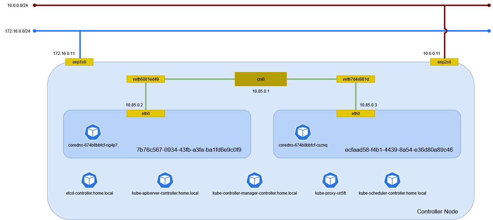

# クラスタ

## コントロールプレーンの構築

コントロールプレーンを構築する。

```sh
kubeadm init --control-plane-endpoint=controller.home.local --pod-network-cidr=172.17.0.0/16
```

```
[init] Using Kubernetes version: v1.31.0
[preflight] Running pre-flight checks
        [WARNING Firewalld]: firewalld is active, please ensure ports [6443 10250] are open or your cluster may not function correctly
        [WARNING FileExisting-socat]: socat not found in system path
        [WARNING Service-Kubelet]: kubelet service is not enabled, please run 'systemctl enable kubelet.service'
[preflight] Pulling images required for setting up a Kubernetes cluster
[preflight] This might take a minute or two, depending on the speed of your internet connection
[preflight] You can also perform this action beforehand using 'kubeadm config images pull'
[certs] Using certificateDir folder "/etc/kubernetes/pki"
[certs] Generating "ca" certificate and key
[certs] Generating "apiserver" certificate and key
[certs] apiserver serving cert is signed for DNS names [controller.home.local kubernetes kubernetes.default kubernetes.default.svc kubernetes.default.svc.cluster.local] and IPs [10.96.0.1 172.16.0.11]
[certs] Generating "apiserver-kubelet-client" certificate and key
[certs] Generating "front-proxy-ca" certificate and key
[certs] Generating "front-proxy-client" certificate and key
[certs] Generating "etcd/ca" certificate and key
[certs] Generating "etcd/server" certificate and key
[certs] etcd/server serving cert is signed for DNS names [controller.home.local localhost] and IPs [172.16.0.11 127.0.0.1 ::1]
[certs] Generating "etcd/peer" certificate and key
[certs] etcd/peer serving cert is signed for DNS names [controller.home.local localhost] and IPs [172.16.0.11 127.0.0.1 ::1]
[certs] Generating "etcd/healthcheck-client" certificate and key
[certs] Generating "apiserver-etcd-client" certificate and key
[certs] Generating "sa" key and public key
[kubeconfig] Using kubeconfig folder "/etc/kubernetes"
[kubeconfig] Writing "admin.conf" kubeconfig file
[kubeconfig] Writing "super-admin.conf" kubeconfig file
[kubeconfig] Writing "kubelet.conf" kubeconfig file
[kubeconfig] Writing "controller-manager.conf" kubeconfig file
[kubeconfig] Writing "scheduler.conf" kubeconfig file
[etcd] Creating static Pod manifest for local etcd in "/etc/kubernetes/manifests"
[control-plane] Using manifest folder "/etc/kubernetes/manifests"
[control-plane] Creating static Pod manifest for "kube-apiserver"
[control-plane] Creating static Pod manifest for "kube-controller-manager"
[control-plane] Creating static Pod manifest for "kube-scheduler"
[kubelet-start] Writing kubelet environment file with flags to file "/var/lib/kubelet/kubeadm-flags.env"
[kubelet-start] Writing kubelet configuration to file "/var/lib/kubelet/config.yaml"
[kubelet-start] Starting the kubelet
[wait-control-plane] Waiting for the kubelet to boot up the control plane as static Pods from directory "/etc/kubernetes/manifests"
[kubelet-check] Waiting for a healthy kubelet at http://127.0.0.1:10248/healthz. This can take up to 4m0s
[kubelet-check] The kubelet is healthy after 10.501895878s
[api-check] Waiting for a healthy API server. This can take up to 4m0s
[api-check] The API server is healthy after 3.001288635s
[upload-config] Storing the configuration used in ConfigMap "kubeadm-config" in the "kube-system" Namespace
[kubelet] Creating a ConfigMap "kubelet-config" in namespace kube-system with the configuration for the kubelets in the cluster
[upload-certs] Skipping phase. Please see --upload-certs
[mark-control-plane] Marking the node controller.home.local as control-plane by adding the labels: [node-role.kubernetes.io/control-plane node.kubernetes.io/exclude-from-external-load-balancers]
[mark-control-plane] Marking the node controller.home.local as control-plane by adding the taints [node-role.kubernetes.io/control-plane:NoSchedule]
[bootstrap-token] Using token: uko9ek.0g7wje5trztdsc8d
[bootstrap-token] Configuring bootstrap tokens, cluster-info ConfigMap, RBAC Roles
[bootstrap-token] Configured RBAC rules to allow Node Bootstrap tokens to get nodes
[bootstrap-token] Configured RBAC rules to allow Node Bootstrap tokens to post CSRs in order for nodes to get long term certificate credentials
[bootstrap-token] Configured RBAC rules to allow the csrapprover controller automatically approve CSRs from a Node Bootstrap Token
[bootstrap-token] Configured RBAC rules to allow certificate rotation for all node client certificates in the cluster
[bootstrap-token] Creating the "cluster-info" ConfigMap in the "kube-public" namespace
[kubelet-finalize] Updating "/etc/kubernetes/kubelet.conf" to point to a rotatable kubelet client certificate and key
[addons] Applied essential addon: CoreDNS
[addons] Applied essential addon: kube-proxy

Your Kubernetes control-plane has initialized successfully!

To start using your cluster, you need to run the following as a regular user:

  mkdir -p $HOME/.kube
  sudo cp -i /etc/kubernetes/admin.conf $HOME/.kube/config
  sudo chown $(id -u):$(id -g) $HOME/.kube/config

Alternatively, if you are the root user, you can run:

  export KUBECONFIG=/etc/kubernetes/admin.conf

You should now deploy a pod network to the cluster.
Run "kubectl apply -f [podnetwork].yaml" with one of the options listed at:
  https://kubernetes.io/docs/concepts/cluster-administration/addons/

You can now join any number of control-plane nodes by copying certificate authorities
and service account keys on each node and then running the following as root:

  kubeadm join controller.home.local:6443 --token uko9ek.0g7wje5trztdsc8d \
        --discovery-token-ca-cert-hash sha256:a9e19ff35745b233a452c780fa4f73fbd6b1e7927ad4dfcd95d17ce40ba7b755 \
        --control-plane

Then you can join any number of worker nodes by running the following on each as root:

kubeadm join controller.home.local:6443 --token uko9ek.0g7wje5trztdsc8d \
        --discovery-token-ca-cert-hash sha256:a9e19ff35745b233a452c780fa4f73fbd6b1e7927ad4dfcd95d17ce40ba7b755
```

マシン起動時の自動起動を設定する。

```sh
systemctl enable kubelet
```

クラスタの接続設定をコピーする。

```sh
mkdir -p $HOME/.kube
cp -i /etc/kubernetes/admin.conf $HOME/.kube/config
chown $(id -u):$(id -g) $HOME/.kube/config
```

## 環境確認

Controller Node でネットワーク構成を確認する。



### ネットワーク名前空間

ネットワーク名前空間を確認する。

```sh
ip netns
```

```
0a18661a-bf87-4b92-bf3a-02fd92e2f4ca
19be561a-e22f-4e6d-8562-5abf81ac1183 (id: 0)
4cfbb0ee-341e-4786-b6b7-3d9804b5979c (id: 1)
c971a8f9-2335-4a7d-b5a8-acfb26417def
b52eddf9-a979-4298-85d5-9537dcf99217
a92692ef-63ca-4f51-ae44-a6d1a9beaaba
8305da93-f5f6-4446-a2ef-1991904aca58
```

### デバイス

デバイスを確認する。

```sh
ip -d link show
```

```
1: lo: <LOOPBACK,UP,LOWER_UP> mtu 65536 qdisc noqueue state UNKNOWN mode DEFAULT group default qlen 1000
    link/loopback 00:00:00:00:00:00 brd 00:00:00:00:00:00 promiscuity 0  allmulti 0 minmtu 0 maxmtu 0 addrgenmode eui64 numtxqueues 1 numrxqueues 1 gso_max_size 65536 gso_max_segs 65535 tso_max_size 524280 tso_max_segs 65535 gro_max_size 65536
2: enp1s0: <BROADCAST,MULTICAST,UP,LOWER_UP> mtu 1500 qdisc fq_codel state UP mode DEFAULT group default qlen 1000
    link/ether 52:54:00:80:ad:b6 brd ff:ff:ff:ff:ff:ff promiscuity 0  allmulti 0 minmtu 68 maxmtu 65535 addrgenmode none numtxqueues 1 numrxqueues 1 gso_max_size 65536 gso_max_segs 65535 tso_max_size 65536 tso_max_segs 65535 gro_max_size 65536 parentbus virtio parentdev virtio0
3: enp2s0: <BROADCAST,MULTICAST,UP,LOWER_UP> mtu 1500 qdisc fq_codel state UP mode DEFAULT group default qlen 1000
    link/ether 52:54:00:6a:9d:95 brd ff:ff:ff:ff:ff:ff promiscuity 0  allmulti 0 minmtu 68 maxmtu 65535 addrgenmode none numtxqueues 1 numrxqueues 1 gso_max_size 65536 gso_max_segs 65535 tso_max_size 65536 tso_max_segs 65535 gro_max_size 65536 parentbus virtio parentdev virtio1
4: cni0: <BROADCAST,MULTICAST,UP,LOWER_UP> mtu 1500 qdisc noqueue state UP mode DEFAULT group default qlen 1000
    link/ether 4a:74:1b:6d:d1:82 brd ff:ff:ff:ff:ff:ff promiscuity 0  allmulti 0 minmtu 68 maxmtu 65535
    bridge forward_delay 1500 hello_time 200 max_age 2000 ageing_time 30000 stp_state 0 priority 32768 vlan_filtering 0 vlan_protocol 802.1Q bridge_id 8000.4a:74:1b:6d:d1:82 designated_root 8000.4a:74:1b:6d:d1:82 root_port 0 root_path_cost 0 topology_change 0 topology_change_detected 0 hello_timer    0.00 tcn_timer    0.00 topology_change_timer    0.00 gc_timer  104.46 vlan_default_pvid 1 vlan_stats_enabled 0 vlan_stats_per_port 0 group_fwd_mask 0 group_address 01:80:c2:00:00:00 mcast_snooping 1 no_linklocal_learn 0 mcast_vlan_snooping 0 mcast_router 1 mcast_query_use_ifaddr 0 mcast_querier 0 mcast_hash_elasticity 16 mcast_hash_max 4096 mcast_last_member_count 2 mcast_startup_query_count 2 mcast_last_member_interval 100 mcast_membership_interval 26000 mcast_querier_interval 25500 mcast_query_interval 12500 mcast_query_response_interval 1000 mcast_startup_query_interval 3125 mcast_stats_enabled 0 mcast_igmp_version 2 mcast_mld_version 1 nf_call_iptables 0 nf_call_ip6tables 0 nf_call_arptables 0 addrgenmode eui64 numtxqueues 1 numrxqueues 1 gso_max_size 65536 gso_max_segs 65535 tso_max_size 524280 tso_max_segs 65535 gro_max_size 65536
5: veth5abaf068@if2: <BROADCAST,MULTICAST,UP,LOWER_UP> mtu 1500 qdisc noqueue master cni0 state UP mode DEFAULT group default
    link/ether d6:87:62:2a:3d:b6 brd ff:ff:ff:ff:ff:ff link-netns 19be561a-e22f-4e6d-8562-5abf81ac1183 promiscuity 1  allmulti 1 minmtu 68 maxmtu 65535
    veth
    bridge_slave state forwarding priority 32 cost 2 hairpin on guard off root_block off fastleave off learning on flood on port_id 0x8001 port_no 0x1 designated_port 32769 designated_cost 0 designated_bridge 8000.4a:74:1b:6d:d1:82 designated_root 8000.4a:74:1b:6d:d1:82 hold_timer    0.00 message_age_timer    0.00 forward_delay_timer    0.00 topology_change_ack 0 config_pending 0 proxy_arp off proxy_arp_wifi off mcast_router 1 mcast_fast_leave off mcast_flood on bcast_flood on mcast_to_unicast off neigh_suppress off group_fwd_mask 0 group_fwd_mask_str 0x0 vlan_tunnel off isolated off locked off mab off addrgenmode eui64 numtxqueues 4 numrxqueues 4 gso_max_size 65536 gso_max_segs 65535 tso_max_size 524280 tso_max_segs 65535 gro_max_size 65536
6: veth0715fe81@if2: <BROADCAST,MULTICAST,UP,LOWER_UP> mtu 1500 qdisc noqueue master cni0 state UP mode DEFAULT group default
    link/ether c6:5a:dc:60:11:b7 brd ff:ff:ff:ff:ff:ff link-netns 4cfbb0ee-341e-4786-b6b7-3d9804b5979c promiscuity 1  allmulti 1 minmtu 68 maxmtu 65535
    veth
    bridge_slave state forwarding priority 32 cost 2 hairpin on guard off root_block off fastleave off learning on flood on port_id 0x8002 port_no 0x2 designated_port 32770 designated_cost 0 designated_bridge 8000.4a:74:1b:6d:d1:82 designated_root 8000.4a:74:1b:6d:d1:82 hold_timer    0.00 message_age_timer    0.00 forward_delay_timer    0.00 topology_change_ack 0 config_pending 0 proxy_arp off proxy_arp_wifi off mcast_router 1 mcast_fast_leave off mcast_flood on bcast_flood on mcast_to_unicast off neigh_suppress off group_fwd_mask 0 group_fwd_mask_str 0x0 vlan_tunnel off isolated off locked off mab off addrgenmode eui64 numtxqueues 4 numrxqueues 4 gso_max_size 65536 gso_max_segs 65535 tso_max_size 524280 tso_max_segs 65535 gro_max_size 65536
```

ネットワーク名前空間内のデバイスを確認する。

```sh
ip netns exec 19be561a-e22f-4e6d-8562-5abf81ac1183 ip -d link show
```

```
1: lo: <LOOPBACK,UP,LOWER_UP> mtu 65536 qdisc noqueue state UNKNOWN mode DEFAULT group default qlen 1000
    link/loopback 00:00:00:00:00:00 brd 00:00:00:00:00:00 promiscuity 0  allmulti 0 minmtu 0 maxmtu 0 addrgenmode eui64 numtxqueues 1 numrxqueues 1 gso_max_size 65536 gso_max_segs 65535 tso_max_size 524280 tso_max_segs 65535 gro_max_size 65536
2: eth0@if5: <BROADCAST,MULTICAST,UP,LOWER_UP> mtu 1500 qdisc noqueue state UP mode DEFAULT group default
    link/ether d6:69:ec:c0:c9:61 brd ff:ff:ff:ff:ff:ff link-netns 0a18661a-bf87-4b92-bf3a-02fd92e2f4ca promiscuity 0  allmulti 0 minmtu 68 maxmtu 65535
    veth addrgenmode eui64 numtxqueues 4 numrxqueues 4 gso_max_size 65536 gso_max_segs 65535 tso_max_size 524280 tso_max_segs 65535 gro_max_size 65536
```

ネットワーク名前空間内のデバイスを確認する。

```sh
ip netns exec 4cfbb0ee-341e-4786-b6b7-3d9804b5979c ip -d link show
```

```
1: lo: <LOOPBACK,UP,LOWER_UP> mtu 65536 qdisc noqueue state UNKNOWN mode DEFAULT group default qlen 1000
    link/loopback 00:00:00:00:00:00 brd 00:00:00:00:00:00 promiscuity 0  allmulti 0 minmtu 0 maxmtu 0 addrgenmode eui64 numtxqueues 1 numrxqueues 1 gso_max_size 65536 gso_max_segs 65535 tso_max_size 524280 tso_max_segs 65535 gro_max_size 65536
2: eth0@if6: <BROADCAST,MULTICAST,UP,LOWER_UP> mtu 1500 qdisc noqueue state UP mode DEFAULT group default
    link/ether ba:da:46:14:24:10 brd ff:ff:ff:ff:ff:ff link-netns 0a18661a-bf87-4b92-bf3a-02fd92e2f4ca promiscuity 0  allmulti 0 minmtu 68 maxmtu 65535
    veth addrgenmode eui64 numtxqueues 4 numrxqueues 4 gso_max_size 65536 gso_max_segs 65535 tso_max_size 524280 tso_max_segs 65535 gro_max_size 65536
```

### イーサネット

イーサネットの情報を確認する。

```sh
ip addr show
```

```
1: lo: <LOOPBACK,UP,LOWER_UP> mtu 65536 qdisc noqueue state UNKNOWN group default qlen 1000
    link/loopback 00:00:00:00:00:00 brd 00:00:00:00:00:00
    inet 127.0.0.1/8 scope host lo
       valid_lft forever preferred_lft forever
2: enp1s0: <BROADCAST,MULTICAST,UP,LOWER_UP> mtu 1500 qdisc fq_codel state UP group default qlen 1000
    link/ether 52:54:00:80:ad:b6 brd ff:ff:ff:ff:ff:ff
    inet 172.16.0.11/24 brd 172.16.0.255 scope global noprefixroute enp1s0
       valid_lft forever preferred_lft forever
3: enp2s0: <BROADCAST,MULTICAST,UP,LOWER_UP> mtu 1500 qdisc fq_codel state UP group default qlen 1000
    link/ether 52:54:00:6a:9d:95 brd ff:ff:ff:ff:ff:ff
    inet 10.0.0.11/24 brd 10.0.0.255 scope global noprefixroute enp2s0
       valid_lft forever preferred_lft forever
4: cni0: <BROADCAST,MULTICAST,UP,LOWER_UP> mtu 1500 qdisc noqueue state UP group default qlen 1000
    link/ether 4a:74:1b:6d:d1:82 brd ff:ff:ff:ff:ff:ff
    inet 10.85.0.1/16 brd 10.85.255.255 scope global cni0
       valid_lft forever preferred_lft forever
5: veth5abaf068@if2: <BROADCAST,MULTICAST,UP,LOWER_UP> mtu 1500 qdisc noqueue master cni0 state UP group default
    link/ether d6:87:62:2a:3d:b6 brd ff:ff:ff:ff:ff:ff link-netns 19be561a-e22f-4e6d-8562-5abf81ac1183
6: veth0715fe81@if2: <BROADCAST,MULTICAST,UP,LOWER_UP> mtu 1500 qdisc noqueue master cni0 state UP group default
    link/ether c6:5a:dc:60:11:b7 brd ff:ff:ff:ff:ff:ff link-netns 4cfbb0ee-341e-4786-b6b7-3d9804b5979c
```

ネットワーク名前空間内のイーサネットの情報を確認する。

```sh
ip netns exec 19be561a-e22f-4e6d-8562-5abf81ac1183 ip addr show
```

```
1: lo: <LOOPBACK,UP,LOWER_UP> mtu 65536 qdisc noqueue state UNKNOWN group default qlen 1000
    link/loopback 00:00:00:00:00:00 brd 00:00:00:00:00:00
    inet 127.0.0.1/8 scope host lo
       valid_lft forever preferred_lft forever
    inet6 ::1/128 scope host
       valid_lft forever preferred_lft forever
2: eth0@if5: <BROADCAST,MULTICAST,UP,LOWER_UP> mtu 1500 qdisc noqueue state UP group default
    link/ether d6:69:ec:c0:c9:61 brd ff:ff:ff:ff:ff:ff link-netns 0a18661a-bf87-4b92-bf3a-02fd92e2f4ca
    inet 10.85.0.2/16 brd 10.85.255.255 scope global eth0
       valid_lft forever preferred_lft forever
    inet6 fe80::d469:ecff:fec0:c961/64 scope link
       valid_lft forever preferred_lft forever
```

ネットワーク名前空間内のイーサネットの情報を確認する。

```sh
ip netns exec 4cfbb0ee-341e-4786-b6b7-3d9804b5979c ip addr show
```

```
1: lo: <LOOPBACK,UP,LOWER_UP> mtu 65536 qdisc noqueue state UNKNOWN group default qlen 1000
    link/loopback 00:00:00:00:00:00 brd 00:00:00:00:00:00
    inet 127.0.0.1/8 scope host lo
       valid_lft forever preferred_lft forever
    inet6 ::1/128 scope host
       valid_lft forever preferred_lft forever
2: eth0@if6: <BROADCAST,MULTICAST,UP,LOWER_UP> mtu 1500 qdisc noqueue state UP group default
    link/ether ba:da:46:14:24:10 brd ff:ff:ff:ff:ff:ff link-netns 0a18661a-bf87-4b92-bf3a-02fd92e2f4ca
    inet 10.85.0.3/16 brd 10.85.255.255 scope global eth0
       valid_lft forever preferred_lft forever
    inet6 fe80::b8da:46ff:fe14:2410/64 scope link
       valid_lft forever preferred_lft forever
```

### ルート

ルーティングを確認する。

```sh
ip route show
```

```
default via 172.16.0.254 dev enp1s0 proto static metric 100
10.0.0.0/24 dev enp2s0 proto kernel scope link src 10.0.0.11 metric 101
10.85.0.0/16 dev cni0 proto kernel scope link src 10.85.0.1
172.16.0.0/24 dev enp1s0 proto kernel scope link src 172.16.0.11 metric 100
```

ネットワーク名前空間内のルーティングを確認する。

```sh
ip netns exec 19be561a-e22f-4e6d-8562-5abf81ac1183 ip route show
```

```
default via 10.85.0.1 dev eth0
10.85.0.0/16 dev eth0 proto kernel scope link src 10.85.0.2
```

ネットワーク名前空間内のルーティングを確認する。

```sh
ip netns exec 4cfbb0ee-341e-4786-b6b7-3d9804b5979c ip route show
```

```
default via 10.85.0.1 dev eth0
10.85.0.0/16 dev eth0 proto kernel scope link src 10.85.0.3
```

### nftables

ルールセットを確認する。

```sh
nft list ruleset ip
```

```
table ip mangle {
        chain KUBE-IPTABLES-HINT {
        }

        chain KUBE-KUBELET-CANARY {
        }

        chain KUBE-PROXY-CANARY {
        }
}
# Warning: table ip filter is managed by iptables-nft, do not touch!
table ip filter {
        chain KUBE-FIREWALL {
                ip saddr != 127.0.0.0/8 ip daddr 127.0.0.0/8  ct status dnat counter packets 0 bytes 0 drop
        }

        chain OUTPUT {
                type filter hook output priority filter; policy accept;
                ct state new  counter packets 4534 bytes 274172 jump KUBE-PROXY-FIREWALL
                ct state new  counter packets 4534 bytes 274172 jump KUBE-SERVICES
                counter packets 235191 bytes 37261620 jump KUBE-FIREWALL
        }

        chain INPUT {
                type filter hook input priority filter; policy accept;
                ct state new  counter packets 3628 bytes 217680 jump KUBE-PROXY-FIREWALL
                 counter packets 220405 bytes 32514993 jump KUBE-NODEPORTS
                ct state new  counter packets 3628 bytes 217680 jump KUBE-EXTERNAL-SERVICES
                counter packets 234620 bytes 36919770 jump KUBE-FIREWALL
        }

        chain KUBE-KUBELET-CANARY {
        }

        chain KUBE-PROXY-CANARY {
        }

        chain KUBE-EXTERNAL-SERVICES {
        }

        chain FORWARD {
                type filter hook forward priority filter; policy accept;
                ct state new  counter packets 26 bytes 1609 jump KUBE-PROXY-FIREWALL
                 counter packets 28 bytes 1928 jump KUBE-FORWARD
                ct state new  counter packets 26 bytes 1609 jump KUBE-SERVICES
                ct state new  counter packets 26 bytes 1609 jump KUBE-EXTERNAL-SERVICES
        }

        chain KUBE-NODEPORTS {
        }

        chain KUBE-SERVICES {
        }

        chain KUBE-FORWARD {
                ct state invalid counter packets 0 bytes 0 drop
                 meta mark & 0x00004000 == 0x00004000 counter packets 0 bytes 0 accept
                 ct state related,established counter packets 0 bytes 0 accept
        }

        chain KUBE-PROXY-FIREWALL {
        }
}
# Warning: table ip nat is managed by iptables-nft, do not touch!
table ip nat {
        chain KUBE-KUBELET-CANARY {
        }

        chain CNI-212a101fca52a5d9ec806890 {
                ip daddr 10.85.0.0/16  counter packets 0 bytes 0 accept
                ip daddr != 224.0.0.0/4  counter packets 4 bytes 265 masquerade
        }

        chain CNI-4b6bc106fb7f5815bbb60748 {
                ip daddr 10.85.0.0/16  counter packets 0 bytes 0 accept
                ip daddr != 224.0.0.0/4  counter packets 4 bytes 264 masquerade
        }

        chain POSTROUTING {
                type nat hook postrouting priority srcnat; policy accept;
                 counter packets 4382 bytes 264049 jump KUBE-POSTROUTING
                ip saddr 10.85.0.2  counter packets 4 bytes 265 jump CNI-212a101fca52a5d9ec806890
                ip saddr 10.85.0.3  counter packets 4 bytes 264 jump CNI-4b6bc106fb7f5815bbb60748
        }

        chain KUBE-PROXY-CANARY {
        }

        chain KUBE-SERVICES {
                meta l4proto tcp ip daddr 10.96.0.1  tcp dport 443 counter packets 0 bytes 0 jump KUBE-SVC-NPX46M4PTMTKRN6Y
                meta l4proto udp ip daddr 10.96.0.10  udp dport 53 counter packets 0 bytes 0 jump KUBE-SVC-TCOU7JCQXEZGVUNU
                meta l4proto tcp ip daddr 10.96.0.10  tcp dport 53 counter packets 0 bytes 0 jump KUBE-SVC-ERIFXISQEP7F7OF4
                meta l4proto tcp ip daddr 10.96.0.10  tcp dport 9153 counter packets 0 bytes 0 jump KUBE-SVC-JD5MR3NA4I4DYORP
                 fib daddr type local counter packets 3538 bytes 212280 jump KUBE-NODEPORTS
        }

        chain OUTPUT {
                type nat hook output priority dstnat; policy accept;
                 counter packets 4380 bytes 263880 jump KUBE-SERVICES
        }

        chain PREROUTING {
                type nat hook prerouting priority dstnat; policy accept;
                 counter packets 4 bytes 289 jump KUBE-SERVICES
        }

        chain KUBE-POSTROUTING {
                meta mark & 0x00004000 != 0x00004000 counter packets 4277 bytes 257692 return
                counter packets 0 bytes 0 meta mark set mark xor 0x4000
                 counter packets 0 bytes 0 masquerade fully-random
        }

        chain KUBE-NODEPORTS {
        }

        chain KUBE-MARK-MASQ {
                counter packets 0 bytes 0 meta mark set mark or 0x4000
        }

        chain KUBE-SVC-NPX46M4PTMTKRN6Y {
                meta l4proto tcp ip saddr != 172.17.0.0/16 ip daddr 10.96.0.1  tcp dport 443 counter packets 2 bytes 120 jump KUBE-MARK-MASQ
                 counter packets 2 bytes 120 jump KUBE-SEP-23Y66C2VAJ3WDEMI
        }

        chain KUBE-SEP-23Y66C2VAJ3WDEMI {
                ip saddr 172.16.0.11  counter packets 0 bytes 0 jump KUBE-MARK-MASQ
                meta l4proto tcp   counter packets 2 bytes 120 dnat to 172.16.0.11:6443
        }

        chain KUBE-SVC-TCOU7JCQXEZGVUNU {
                meta l4proto udp ip saddr != 172.17.0.0/16 ip daddr 10.96.0.10  udp dport 53 counter packets 0 bytes 0 jump KUBE-MARK-MASQ
                 meta random & 2147483647 < 1073741824 counter packets 0 bytes 0 jump KUBE-SEP-7SDR2WXD6EFFJZ42
                 counter packets 0 bytes 0 jump KUBE-SEP-YQTUGCSRGBQ7MJXA
        }

        chain KUBE-SEP-7SDR2WXD6EFFJZ42 {
                ip saddr 10.85.0.2  counter packets 0 bytes 0 jump KUBE-MARK-MASQ
                meta l4proto udp   counter packets 0 bytes 0 dnat to 10.85.0.2:53
        }

        chain KUBE-SVC-ERIFXISQEP7F7OF4 {
                meta l4proto tcp ip saddr != 172.17.0.0/16 ip daddr 10.96.0.10  tcp dport 53 counter packets 0 bytes 0 jump KUBE-MARK-MASQ
                 meta random & 2147483647 < 1073741824 counter packets 0 bytes 0 jump KUBE-SEP-BCWYETF6BYLYKE2H
                 counter packets 0 bytes 0 jump KUBE-SEP-HMFIVQIFQZV23PVT
        }

        chain KUBE-SEP-BCWYETF6BYLYKE2H {
                ip saddr 10.85.0.2  counter packets 0 bytes 0 jump KUBE-MARK-MASQ
                meta l4proto tcp   counter packets 0 bytes 0 dnat to 10.85.0.2:53
        }

        chain KUBE-SVC-JD5MR3NA4I4DYORP {
                meta l4proto tcp ip saddr != 172.17.0.0/16 ip daddr 10.96.0.10  tcp dport 9153 counter packets 0 bytes 0 jump KUBE-MARK-MASQ
                 meta random & 2147483647 < 1073741824 counter packets 0 bytes 0 jump KUBE-SEP-55JPH7H2U4SL23HX
                 counter packets 0 bytes 0 jump KUBE-SEP-GNLGM655BVXRF66F
        }

        chain KUBE-SEP-55JPH7H2U4SL23HX {
                ip saddr 10.85.0.2  counter packets 0 bytes 0 jump KUBE-MARK-MASQ
                meta l4proto tcp   counter packets 0 bytes 0 dnat to 10.85.0.2:9153
        }

        chain KUBE-SEP-YQTUGCSRGBQ7MJXA {
                ip saddr 10.85.0.3  counter packets 0 bytes 0 jump KUBE-MARK-MASQ
                meta l4proto udp   counter packets 0 bytes 0 dnat to 10.85.0.3:53
        }

        chain KUBE-SEP-HMFIVQIFQZV23PVT {
                ip saddr 10.85.0.3  counter packets 0 bytes 0 jump KUBE-MARK-MASQ
                meta l4proto tcp   counter packets 0 bytes 0 dnat to 10.85.0.3:53
        }

        chain KUBE-SEP-GNLGM655BVXRF66F {
                ip saddr 10.85.0.3  counter packets 0 bytes 0 jump KUBE-MARK-MASQ
                meta l4proto tcp   counter packets 0 bytes 0 dnat to 10.85.0.3:9153
        }
}
```

### Kubernetes リソース

クラスタにあるリソースを確認する。

```sh
kubectl get all --all-namespaces -o wide
```

```
NAMESPACE     NAME                                                READY   STATUS    RESTARTS   AGE   IP            NODE                    NOMINATED NODE   READINESS GATES
kube-system   pod/coredns-7c65d6cfc9-sr5mk                        1/1     Running   0          28m   10.85.0.2     controller.home.local   <none>           <none>
kube-system   pod/coredns-7c65d6cfc9-zczmd                        1/1     Running   0          28m   10.85.0.3     controller.home.local   <none>           <none>
kube-system   pod/etcd-controller.home.local                      1/1     Running   0          28m   172.16.0.11   controller.home.local   <none>           <none>
kube-system   pod/kube-apiserver-controller.home.local            1/1     Running   0          28m   172.16.0.11   controller.home.local   <none>           <none>
kube-system   pod/kube-controller-manager-controller.home.local   1/1     Running   0          28m   172.16.0.11   controller.home.local   <none>           <none>
kube-system   pod/kube-proxy-7zqsq                                1/1     Running   0          28m   172.16.0.11   controller.home.local   <none>           <none>
kube-system   pod/kube-scheduler-controller.home.local            1/1     Running   0          28m   172.16.0.11   controller.home.local   <none>           <none>

NAMESPACE     NAME                 TYPE        CLUSTER-IP   EXTERNAL-IP   PORT(S)                  AGE   SELECTOR
default       service/kubernetes   ClusterIP   10.96.0.1    <none>        443/TCP                  28m   <none>
kube-system   service/kube-dns     ClusterIP   10.96.0.10   <none>        53/UDP,53/TCP,9153/TCP   28m   k8s-app=kube-dns

NAMESPACE     NAME                        DESIRED   CURRENT   READY   UP-TO-DATE   AVAILABLE   NODE SELECTOR            AGE   CONTAINERS   IMAGES                               SELECTOR
kube-system   daemonset.apps/kube-proxy   1         1         1       1            1           kubernetes.io/os=linux   28m   kube-proxy   registry.k8s.io/kube-proxy:v1.31.0   k8s-app=kube-proxy

NAMESPACE     NAME                      READY   UP-TO-DATE   AVAILABLE   AGE   CONTAINERS   IMAGES                                    SELECTOR
kube-system   deployment.apps/coredns   2/2     2            2           28m   coredns      registry.k8s.io/coredns/coredns:v1.11.3   k8s-app=kube-dns

NAMESPACE     NAME                                 DESIRED   CURRENT   READY   AGE   CONTAINERS   IMAGES                                    SELECTOR
kube-system   replicaset.apps/coredns-7c65d6cfc9   2         2         2       28m   coredns      registry.k8s.io/coredns/coredns:v1.11.3   k8s-app=kube-dns,pod-template-hash=7c65d6cfc9
```

ノードを確認する。

```sh
kubectl get nodes
```

```
NAME                    STATUS   ROLES           AGE   VERSION
controller.home.local   Ready    control-plane   27m   v1.31.1
```

### コンテナ

コンテナを確認する。

```sh
crictl ps -a
```

```
CONTAINER           IMAGE                                                              CREATED             STATE               NAME                      ATTEMPT             POD ID              POD
8517fb7aa7f80       ad83b2ca7b09e6162f96f933eecded731cbebf049c78f941fd0ce560a86b6494   28 minutes ago      Running             kube-proxy                0                   a0f9bfca47a19       kube-proxy-7zqsq
92d23a6b648bf       c69fa2e9cbf5f42dc48af631e956d3f95724c13f91596bc567591790e5e36db6   28 minutes ago      Running             coredns                   0                   457293a70d58c       coredns-7c65d6cfc9-sr5mk
f78ec2ba93f77       c69fa2e9cbf5f42dc48af631e956d3f95724c13f91596bc567591790e5e36db6   28 minutes ago      Running             coredns                   0                   27889e984d144       coredns-7c65d6cfc9-zczmd
a45d43d324275       2e96e5913fc06e3d26915af3d0f2ca5048cc4b6327e661e80da792cbf8d8d9d4   28 minutes ago      Running             etcd                      0                   fbaabcf1ff22d       etcd-controller.home.local
142c67043270c       1766f54c897f0e57040741e6741462f2e3a7d754705f446c9f729c7e1230fb94   28 minutes ago      Running             kube-scheduler            0                   00da5f84eb9dc       kube-scheduler-controller.home.local
c84f3fd628818       604f5db92eaa823d11c141d8825f1460206f6bf29babca2a909a698dc22055d3   28 minutes ago      Running             kube-apiserver            0                   dd872d4361d33       kube-apiserver-controller.home.local
38a538aefb127       045733566833c40b15806c9b87d27f08e455e069833752e0e6ad7a76d37cb2b1   28 minutes ago      Running             kube-controller-manager   0                   58f5ec39069fd       kube-controller-manager-controller.home.local
```

kube-proxy が属するネットワーク名前空間を確認する。

```sh
ip netns identify $(crictl inspect 8517fb7aa7f80 | jq '.info.pid')
```

```
8305da93-f5f6-4446-a2ef-1991904aca58
```

coredns が属するネットワーク名前空間を確認する。

```sh
ip netns identify $(crictl inspect 92d23a6b648bf | jq '.info.pid')
```

```
19be561a-e22f-4e6d-8562-5abf81ac1183
```

```sh
ip netns identify $(crictl inspect f78ec2ba93f77 | jq '.info.pid')
```

```
4cfbb0ee-341e-4786-b6b7-3d9804b5979c
```

etcd が属するネットワーク名前空間を確認する。

```sh
ip netns identify $(crictl inspect a45d43d324275 | jq '.info.pid')
```

```
8305da93-f5f6-4446-a2ef-1991904aca58
```

kube-scheduler が属するネットワーク名前空間を確認する。

```sh
ip netns identify $(crictl inspect 142c67043270c | jq '.info.pid')
```

```
8305da93-f5f6-4446-a2ef-1991904aca58
```

kube-apiserver が属するネットワーク名前空間を確認する。

```sh
ip netns identify $(crictl inspect c84f3fd628818 | jq '.info.pid')
```

```
8305da93-f5f6-4446-a2ef-1991904aca58
```

kube-controller-manager が属するネットワーク名前空間を確認する。

```sh
ip netns identify $(crictl inspect 38a538aefb127 | jq '.info.pid')
```

```
8305da93-f5f6-4446-a2ef-1991904aca58
```

コンテナイメージを確認する。

```sh
crictl images
```

```
IMAGE                                     TAG                 IMAGE ID            SIZE
registry.k8s.io/coredns/coredns           v1.11.3             c69fa2e9cbf5f       63.3MB
registry.k8s.io/etcd                      3.5.15-0            2e96e5913fc06       152MB
registry.k8s.io/kube-apiserver            v1.31.0             604f5db92eaa8       95.2MB
registry.k8s.io/kube-controller-manager   v1.31.0             045733566833c       89.4MB
registry.k8s.io/kube-proxy                v1.31.0             ad83b2ca7b09e       92.7MB
registry.k8s.io/kube-scheduler            v1.31.0             1766f54c897f0       68.4MB
registry.k8s.io/pause                     3.10                873ed75102791       742kB
```
