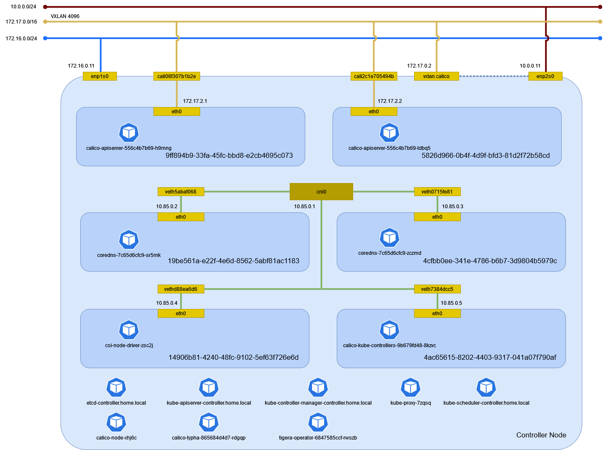

# ネットワークアドオン

## Calico

### ファイアウォール

すべてのノードで ファイアウォールを開ける。

```sh
firewall-cmd --permanent --zone=public --add-port=179/tcp
firewall-cmd --permanent --zone=public --add-port=4789/udp
firewall-cmd --permanent --zone=public --add-port=5473/tcp
firewall-cmd --permanent --zone=public --add-port=51820-51821/udp
firewall-cmd --reload
```

vxlan は enp2s0 がローカル IP アドレスになるので internal を開ける。

```{note}
どこで決まる？
```

```sh
firewall-cmd --permanent --zone=internal --add-port=4789/udp
firewall-cmd --reload
```

### NetworkManager

すべてのノードで Calico が制御するデバイスは NetworkManager の制御対象から外す。

```sh
cat > /etc/NetworkManager/conf.d/calico.conf <<EOF
[keyfile]
unmanaged-devices=interface-name:cali*;interface-name:tunl*;interface-name:vxlan.calico;interface-name:vxlan-v6.calico;interface-name:wireguard.cali;interface-name:wg-v6.cali
EOF
```

firewalld の trusted ゾーンに明示的に追加する([参考](https://github.com/projectcalico/calico/issues/5232))。

```sh
firewall-cmd --permanent --zone=trusted --add-interface="cali+"
firewall-cmd --permanent --zone=trusted --add-interface="tunl+"
firewall-cmd --permanent --zone=trusted --add-interface="vxlan.calico"
firewall-cmd --permanent --zone=trusted --add-interface="vxlan-v6.calico"
firewall-cmd --permanent --zone=trusted --add-interface="wireguard.cali"
firewall-cmd --permanent --zone=trusted --add-interface="wg-v6.cali"
firewall-cmd --reload
```

### インストール

Calico の Operator を構築する。

```sh
kubectl create -f https://raw.githubusercontent.com/projectcalico/calico/v3.28.0/manifests/tigera-operator.yaml
```

```
namespace/tigera-operator created
customresourcedefinition.apiextensions.k8s.io/bgpconfigurations.crd.projectcalico.org created
customresourcedefinition.apiextensions.k8s.io/bgpfilters.crd.projectcalico.org created
customresourcedefinition.apiextensions.k8s.io/bgppeers.crd.projectcalico.org created
customresourcedefinition.apiextensions.k8s.io/blockaffinities.crd.projectcalico.org created
customresourcedefinition.apiextensions.k8s.io/caliconodestatuses.crd.projectcalico.org created
customresourcedefinition.apiextensions.k8s.io/clusterinformations.crd.projectcalico.org created
customresourcedefinition.apiextensions.k8s.io/felixconfigurations.crd.projectcalico.org created
customresourcedefinition.apiextensions.k8s.io/globalnetworkpolicies.crd.projectcalico.org created
customresourcedefinition.apiextensions.k8s.io/globalnetworksets.crd.projectcalico.org created
customresourcedefinition.apiextensions.k8s.io/hostendpoints.crd.projectcalico.org created
customresourcedefinition.apiextensions.k8s.io/ipamblocks.crd.projectcalico.org created
customresourcedefinition.apiextensions.k8s.io/ipamconfigs.crd.projectcalico.org created
customresourcedefinition.apiextensions.k8s.io/ipamhandles.crd.projectcalico.org created
customresourcedefinition.apiextensions.k8s.io/ippools.crd.projectcalico.org created
customresourcedefinition.apiextensions.k8s.io/ipreservations.crd.projectcalico.org created
customresourcedefinition.apiextensions.k8s.io/kubecontrollersconfigurations.crd.projectcalico.org created
customresourcedefinition.apiextensions.k8s.io/networkpolicies.crd.projectcalico.org created
customresourcedefinition.apiextensions.k8s.io/networksets.crd.projectcalico.org created
customresourcedefinition.apiextensions.k8s.io/apiservers.operator.tigera.io created
customresourcedefinition.apiextensions.k8s.io/imagesets.operator.tigera.io created
customresourcedefinition.apiextensions.k8s.io/installations.operator.tigera.io created
customresourcedefinition.apiextensions.k8s.io/tigerastatuses.operator.tigera.io created
serviceaccount/tigera-operator created
clusterrole.rbac.authorization.k8s.io/tigera-operator created
clusterrolebinding.rbac.authorization.k8s.io/tigera-operator created
deployment.apps/tigera-operator created
```

Calico を構築する。

```sh
kubectl create -f https://raw.githubusercontent.com/projectcalico/calico/v3.28.0/manifests/custom-resources.yaml
```

```
installation.operator.tigera.io/default created
apiserver.operator.tigera.io/default created
```

IP Pool の CIDR の既定値が 192.168.0.0/16 のため 172.17.0.0/16 に変更する。

```sh
kubectl edit installation default
```

```
installation.operator.tigera.io/default edited
```

すべての Pod が起動するまで待つ。

```sh
watch kubectl get pods -n calico-system
```

```
NAME                                      READY   STATUS    RESTARTS   AGE
calico-kube-controllers-9b679fd48-8kzvc   1/1     Running   0          2m9s
calico-node-xhj6c                         1/1     Running   0          2m8s
calico-typha-865684d4d7-rdgqp             1/1     Running   0          2m9s
csi-node-driver-zsc2j                     2/2     Running   0          2m9s
```

### クライアント

Calico クライアントをインストールする。

```sh
mkdir -p $HOME/.local/bin
curl -L https://github.com/projectcalico/calico/releases/download/v3.28.0/calicoctl-linux-amd64 --output-dir $HOME/.local/bin -o calicoctl
chmod +x $HOME/.local/bin/calicoctl
```

```sh
mkdir -p $HOME/.local/bin
curl -L https://github.com/projectcalico/calico/releases/download/v3.28.0/calicoctl-linux-amd64 --output-dir $HOME/.local/bin -o kubectl-calico
chmod +x $HOME/.local/bin/kubectl-calico
```

### 環境確認

```{warning}
- システムを再起動すると構成が変更されたので再確認する。
- ネットワークアドインのインストールする前後の `kubelet` の引数を確認する。
```

Controller Node でネットワーク構成を確認する。



```{note}
- arp テーブルを確認する(`ip neigh`)。
- Fowarding Database を確認する。(`bridge fdb show dev vxlan.calico`)
```

#### ネットワーク名前空間

ネットワーク名前空間を確認する。

```sh
ip netns
```

```
5826d966-0b4f-4d9f-bfd3-81d2f72b58cd (id: 5)
9ff894b9-33fa-45fc-bbd8-e2cb4695c073 (id: 4)
e8fed744-e9f8-4a53-b704-48430a74156e
1778e129-79cb-4a9b-b633-3c207a4ffa88
4ac65615-8202-4403-9317-041a07f790af (id: 3)
14906b81-4240-48fc-9102-5ef63f726e6d (id: 2)
7107fd1d-a9e1-48d4-b727-b10eeedf336f
0a18661a-bf87-4b92-bf3a-02fd92e2f4ca
19be561a-e22f-4e6d-8562-5abf81ac1183 (id: 0)
4cfbb0ee-341e-4786-b6b7-3d9804b5979c (id: 1)
c971a8f9-2335-4a7d-b5a8-acfb26417def
b52eddf9-a979-4298-85d5-9537dcf99217
a92692ef-63ca-4f51-ae44-a6d1a9beaaba
8305da93-f5f6-4446-a2ef-1991904aca58
```

#### デバイス

デバイスを確認する。

```sh
ip -d link show
```

```
1: lo: <LOOPBACK,UP,LOWER_UP> mtu 65536 qdisc noqueue state UNKNOWN mode DEFAULT group default qlen 1000
    link/loopback 00:00:00:00:00:00 brd 00:00:00:00:00:00 promiscuity 0  allmulti 0 minmtu 0 maxmtu 0 addrgenmode eui64 numtxqueues 1 numrxqueues 1 gso_max_size 65536 gso_max_segs 65535 tso_max_size 524280 tso_max_segs 65535 gro_max_size 65536
2: enp1s0: <BROADCAST,MULTICAST,UP,LOWER_UP> mtu 1500 qdisc fq_codel state UP mode DEFAULT group default qlen 1000
    link/ether 52:54:00:80:ad:b6 brd ff:ff:ff:ff:ff:ff promiscuity 0  allmulti 0 minmtu 68 maxmtu 65535 addrgenmode none numtxqueues 1 numrxqueues 1 gso_max_size 65536 gso_max_segs 65535 tso_max_size 65536 tso_max_segs 65535 gro_max_size 65536 parentbus virtio parentdev virtio0
3: enp2s0: <BROADCAST,MULTICAST,UP,LOWER_UP> mtu 1500 qdisc fq_codel state UP mode DEFAULT group default qlen 1000
    link/ether 52:54:00:6a:9d:95 brd ff:ff:ff:ff:ff:ff promiscuity 0  allmulti 0 minmtu 68 maxmtu 65535 addrgenmode none numtxqueues 1 numrxqueues 1 gso_max_size 65536 gso_max_segs 65535 tso_max_size 65536 tso_max_segs 65535 gro_max_size 65536 parentbus virtio parentdev virtio1
4: cni0: <BROADCAST,MULTICAST,UP,LOWER_UP> mtu 1500 qdisc noqueue state UP mode DEFAULT group default qlen 1000
    link/ether 4a:74:1b:6d:d1:82 brd ff:ff:ff:ff:ff:ff promiscuity 0  allmulti 0 minmtu 68 maxmtu 65535
    bridge forward_delay 1500 hello_time 200 max_age 2000 ageing_time 30000 stp_state 0 priority 32768 vlan_filtering 0 vlan_protocol 802.1Q bridge_id 8000.4a:74:1b:6d:d1:82 designated_root 8000.4a:74:1b:6d:d1:82 root_port 0 root_path_cost 0 topology_change 0 topology_change_detected 0 hello_timer    0.00 tcn_timer    0.00 topology_change_timer    0.00 gc_timer   94.33 vlan_default_pvid 1 vlan_stats_enabled 0 vlan_stats_per_port 0 group_fwd_mask 0 group_address 01:80:c2:00:00:00 mcast_snooping 1 no_linklocal_learn 0 mcast_vlan_snooping 0 mcast_router 1 mcast_query_use_ifaddr 0 mcast_querier 0 mcast_hash_elasticity 16 mcast_hash_max 4096 mcast_last_member_count 2 mcast_startup_query_count 2 mcast_last_member_interval 100 mcast_membership_interval 26000 mcast_querier_interval 25500 mcast_query_interval 12500 mcast_query_response_interval 1000 mcast_startup_query_interval 3125 mcast_stats_enabled 0 mcast_igmp_version 2 mcast_mld_version 1 nf_call_iptables 0 nf_call_ip6tables 0 nf_call_arptables 0 addrgenmode eui64 numtxqueues 1 numrxqueues 1 gso_max_size 65536 gso_max_segs 65535 tso_max_size 524280 tso_max_segs 65535 gro_max_size 65536
5: veth5abaf068@if2: <BROADCAST,MULTICAST,UP,LOWER_UP> mtu 1500 qdisc noqueue master cni0 state UP mode DEFAULT group default
    link/ether d6:87:62:2a:3d:b6 brd ff:ff:ff:ff:ff:ff link-netns 19be561a-e22f-4e6d-8562-5abf81ac1183 promiscuity 1  allmulti 1 minmtu 68 maxmtu 65535
    veth
    bridge_slave state forwarding priority 32 cost 2 hairpin on guard off root_block off fastleave off learning on flood on port_id 0x8001 port_no 0x1 designated_port 32769 designated_cost 0 designated_bridge 8000.4a:74:1b:6d:d1:82 designated_root 8000.4a:74:1b:6d:d1:82 hold_timer    0.00 message_age_timer    0.00 forward_delay_timer    0.00 topology_change_ack 0 config_pending 0 proxy_arp off proxy_arp_wifi off mcast_router 1 mcast_fast_leave off mcast_flood on bcast_flood on mcast_to_unicast off neigh_suppress off group_fwd_mask 0 group_fwd_mask_str 0x0 vlan_tunnel off isolated off locked off mab off addrgenmode eui64 numtxqueues 4 numrxqueues 4 gso_max_size 65536 gso_max_segs 65535 tso_max_size 524280 tso_max_segs 65535 gro_max_size 65536
6: veth0715fe81@if2: <BROADCAST,MULTICAST,UP,LOWER_UP> mtu 1500 qdisc noqueue master cni0 state UP mode DEFAULT group default
    link/ether c6:5a:dc:60:11:b7 brd ff:ff:ff:ff:ff:ff link-netns 4cfbb0ee-341e-4786-b6b7-3d9804b5979c promiscuity 1  allmulti 1 minmtu 68 maxmtu 65535
    veth
    bridge_slave state forwarding priority 32 cost 2 hairpin on guard off root_block off fastleave off learning on flood on port_id 0x8002 port_no 0x2 designated_port 32770 designated_cost 0 designated_bridge 8000.4a:74:1b:6d:d1:82 designated_root 8000.4a:74:1b:6d:d1:82 hold_timer    0.00 message_age_timer    0.00 forward_delay_timer    0.00 topology_change_ack 0 config_pending 0 proxy_arp off proxy_arp_wifi off mcast_router 1 mcast_fast_leave off mcast_flood on bcast_flood on mcast_to_unicast off neigh_suppress off group_fwd_mask 0 group_fwd_mask_str 0x0 vlan_tunnel off isolated off locked off mab off addrgenmode eui64 numtxqueues 4 numrxqueues 4 gso_max_size 65536 gso_max_segs 65535 tso_max_size 524280 tso_max_segs 65535 gro_max_size 65536
7: vethd88ea6d6@if2: <BROADCAST,MULTICAST,UP,LOWER_UP> mtu 1500 qdisc noqueue master cni0 state UP mode DEFAULT group default
    link/ether 26:11:24:e6:07:8a brd ff:ff:ff:ff:ff:ff link-netns 14906b81-4240-48fc-9102-5ef63f726e6d promiscuity 1  allmulti 1 minmtu 68 maxmtu 65535
    veth
    bridge_slave state forwarding priority 32 cost 2 hairpin on guard off root_block off fastleave off learning on flood on port_id 0x8003 port_no 0x3 designated_port 32771 designated_cost 0 designated_bridge 8000.4a:74:1b:6d:d1:82 designated_root 8000.4a:74:1b:6d:d1:82 hold_timer    0.00 message_age_timer    0.00 forward_delay_timer    0.00 topology_change_ack 0 config_pending 0 proxy_arp off proxy_arp_wifi off mcast_router 1 mcast_fast_leave off mcast_flood on bcast_flood on mcast_to_unicast off neigh_suppress off group_fwd_mask 0 group_fwd_mask_str 0x0 vlan_tunnel off isolated off locked off mab off addrgenmode eui64 numtxqueues 4 numrxqueues 4 gso_max_size 65536 gso_max_segs 65535 tso_max_size 524280 tso_max_segs 65535 gro_max_size 65536
8: veth7384dcc5@if2: <BROADCAST,MULTICAST,UP,LOWER_UP> mtu 1500 qdisc noqueue master cni0 state UP mode DEFAULT group default
    link/ether 0e:f6:d4:52:89:da brd ff:ff:ff:ff:ff:ff link-netns 4ac65615-8202-4403-9317-041a07f790af promiscuity 1  allmulti 1 minmtu 68 maxmtu 65535
    veth
    bridge_slave state forwarding priority 32 cost 2 hairpin on guard off root_block off fastleave off learning on flood on port_id 0x8004 port_no 0x4 designated_port 32772 designated_cost 0 designated_bridge 8000.4a:74:1b:6d:d1:82 designated_root 8000.4a:74:1b:6d:d1:82 hold_timer    0.00 message_age_timer    0.00 forward_delay_timer    0.00 topology_change_ack 0 config_pending 0 proxy_arp off proxy_arp_wifi off mcast_router 1 mcast_fast_leave off mcast_flood on bcast_flood on mcast_to_unicast off neigh_suppress off group_fwd_mask 0 group_fwd_mask_str 0x0 vlan_tunnel off isolated off locked off mab off addrgenmode eui64 numtxqueues 4 numrxqueues 4 gso_max_size 65536 gso_max_segs 65535 tso_max_size 524280 tso_max_segs 65535 gro_max_size 65536
9: vxlan.calico: <BROADCAST,MULTICAST,UP,LOWER_UP> mtu 1450 qdisc noqueue state UNKNOWN mode DEFAULT group default qlen 1000
    link/ether 66:b9:7e:86:1e:53 brd ff:ff:ff:ff:ff:ff promiscuity 0  allmulti 0 minmtu 68 maxmtu 65535
    vxlan id 4096 local 10.0.0.11 dev enp2s0 srcport 0 0 dstport 4789 nolearning ttl auto ageing 300 udpcsum noudp6zerocsumtx noudp6zerocsumrx addrgenmode eui64 numtxqueues 1 numrxqueues 1 gso_max_size 65536 gso_max_segs 65535 tso_max_size 65536 tso_max_segs 65535 gro_max_size 65536
12: cali08f307b1b2e@if2: <BROADCAST,MULTICAST,UP,LOWER_UP> mtu 1450 qdisc noqueue state UP mode DEFAULT group default qlen 1000
    link/ether ee:ee:ee:ee:ee:ee brd ff:ff:ff:ff:ff:ff link-netns 9ff894b9-33fa-45fc-bbd8-e2cb4695c073 promiscuity 0  allmulti 0 minmtu 68 maxmtu 65535
    veth addrgenmode eui64 numtxqueues 1 numrxqueues 1 gso_max_size 65536 gso_max_segs 65535 tso_max_size 524280 tso_max_segs 65535 gro_max_size 65536
13: cali2c1e705494b@if2: <BROADCAST,MULTICAST,UP,LOWER_UP> mtu 1450 qdisc noqueue state UP mode DEFAULT group default qlen 1000
    link/ether ee:ee:ee:ee:ee:ee brd ff:ff:ff:ff:ff:ff link-netns 5826d966-0b4f-4d9f-bfd3-81d2f72b58cd promiscuity 0  allmulti 0 minmtu 68 maxmtu 65535
    veth addrgenmode eui64 numtxqueues 1 numrxqueues 1 gso_max_size 65536 gso_max_segs 65535 tso_max_size 524280 tso_max_segs 65535 gro_max_size 65536
```

ネットワーク名前空間内のデバイスを確認する。

```sh
ip netns exec 19be561a-e22f-4e6d-8562-5abf81ac1183 ip -d link show
```

```
1: lo: <LOOPBACK,UP,LOWER_UP> mtu 65536 qdisc noqueue state UNKNOWN mode DEFAULT group default qlen 1000
    link/loopback 00:00:00:00:00:00 brd 00:00:00:00:00:00 promiscuity 0  allmulti 0 minmtu 0 maxmtu 0 addrgenmode eui64 numtxqueues 1 numrxqueues 1 gso_max_size 65536 gso_max_segs 65535 tso_max_size 524280 tso_max_segs 65535 gro_max_size 65536
2: eth0@if5: <BROADCAST,MULTICAST,UP,LOWER_UP> mtu 1500 qdisc noqueue state UP mode DEFAULT group default
    link/ether d6:69:ec:c0:c9:61 brd ff:ff:ff:ff:ff:ff link-netns e8fed744-e9f8-4a53-b704-48430a74156e promiscuity 0  allmulti 0 minmtu 68 maxmtu 65535
    veth addrgenmode eui64 numtxqueues 4 numrxqueues 4 gso_max_size 65536 gso_max_segs 65535 tso_max_size 524280 tso_max_segs 65535 gro_max_size 65536
```

ネットワーク名前空間内のデバイスを確認する。

```sh
ip netns exec 4cfbb0ee-341e-4786-b6b7-3d9804b5979c ip -d link show
```

```
1: lo: <LOOPBACK,UP,LOWER_UP> mtu 65536 qdisc noqueue state UNKNOWN mode DEFAULT group default qlen 1000
    link/loopback 00:00:00:00:00:00 brd 00:00:00:00:00:00 promiscuity 0  allmulti 0 minmtu 0 maxmtu 0 addrgenmode eui64 numtxqueues 1 numrxqueues 1 gso_max_size 65536 gso_max_segs 65535 tso_max_size 524280 tso_max_segs 65535 gro_max_size 65536
2: eth0@if6: <BROADCAST,MULTICAST,UP,LOWER_UP> mtu 1500 qdisc noqueue state UP mode DEFAULT group default
    link/ether ba:da:46:14:24:10 brd ff:ff:ff:ff:ff:ff link-netns e8fed744-e9f8-4a53-b704-48430a74156e promiscuity 0  allmulti 0 minmtu 68 maxmtu 65535
    veth addrgenmode eui64 numtxqueues 4 numrxqueues 4 gso_max_size 65536 gso_max_segs 65535 tso_max_size 524280 tso_max_segs 65535 gro_max_size 65536
```

ネットワーク名前空間内のデバイスを確認する。

```sh
ip netns exec 14906b81-4240-48fc-9102-5ef63f726e6d ip -d link show
```

```
1: lo: <LOOPBACK,UP,LOWER_UP> mtu 65536 qdisc noqueue state UNKNOWN mode DEFAULT group default qlen 1000
    link/loopback 00:00:00:00:00:00 brd 00:00:00:00:00:00 promiscuity 0  allmulti 0 minmtu 0 maxmtu 0 addrgenmode eui64 numtxqueues 1 numrxqueues 1 gso_max_size 65536 gso_max_segs 65535 tso_max_size 524280 tso_max_segs 65535 gro_max_size 65536
2: eth0@if7: <BROADCAST,MULTICAST,UP,LOWER_UP> mtu 1500 qdisc noqueue state UP mode DEFAULT group default
    link/ether 3e:a4:f6:f9:e6:12 brd ff:ff:ff:ff:ff:ff link-netns e8fed744-e9f8-4a53-b704-48430a74156e promiscuity 0  allmulti 0 minmtu 68 maxmtu 65535
    veth addrgenmode eui64 numtxqueues 4 numrxqueues 4 gso_max_size 65536 gso_max_segs 65535 tso_max_size 524280 tso_max_segs 65535 gro_max_size 65536
```

ネットワーク名前空間内のデバイスを確認する。

```sh
ip netns exec 4ac65615-8202-4403-9317-041a07f790af ip -d link show
```

```
1: lo: <LOOPBACK,UP,LOWER_UP> mtu 65536 qdisc noqueue state UNKNOWN mode DEFAULT group default qlen 1000
    link/loopback 00:00:00:00:00:00 brd 00:00:00:00:00:00 promiscuity 0  allmulti 0 minmtu 0 maxmtu 0 addrgenmode eui64 numtxqueues 1 numrxqueues 1 gso_max_size 65536 gso_max_segs 65535 tso_max_size 524280 tso_max_segs 65535 gro_max_size 65536
2: eth0@if8: <BROADCAST,MULTICAST,UP,LOWER_UP> mtu 1500 qdisc noqueue state UP mode DEFAULT group default
    link/ether 02:62:f3:1d:28:e2 brd ff:ff:ff:ff:ff:ff link-netns e8fed744-e9f8-4a53-b704-48430a74156e promiscuity 0  allmulti 0 minmtu 68 maxmtu 65535
    veth addrgenmode eui64 numtxqueues 4 numrxqueues 4 gso_max_size 65536 gso_max_segs 65535 tso_max_size 524280 tso_max_segs 65535 gro_max_size 65536
```

ネットワーク名前空間内のデバイスを確認する。

```sh
ip netns exec 9ff894b9-33fa-45fc-bbd8-e2cb4695c073 ip -d link show
```

```
1: lo: <LOOPBACK,UP,LOWER_UP> mtu 65536 qdisc noqueue state UNKNOWN mode DEFAULT group default qlen 1000
    link/loopback 00:00:00:00:00:00 brd 00:00:00:00:00:00 promiscuity 0  allmulti 0 minmtu 0 maxmtu 0 addrgenmode eui64 numtxqueues 1 numrxqueues 1 gso_max_size 65536 gso_max_segs 65535 tso_max_size 524280 tso_max_segs 65535 gro_max_size 65536
2: eth0@if12: <BROADCAST,MULTICAST,UP,LOWER_UP> mtu 1450 qdisc noqueue state UP mode DEFAULT group default qlen 1000
    link/ether 66:99:d5:23:0c:b6 brd ff:ff:ff:ff:ff:ff link-netns e8fed744-e9f8-4a53-b704-48430a74156e promiscuity 0  allmulti 0 minmtu 68 maxmtu 65535
    veth addrgenmode eui64 numtxqueues 1 numrxqueues 1 gso_max_size 65536 gso_max_segs 65535 tso_max_size 524280 tso_max_segs 65535 gro_max_size 65536
```

ネットワーク名前空間内のデバイスを確認する。

```sh
ip netns exec 5826d966-0b4f-4d9f-bfd3-81d2f72b58cd ip -d link show
```

```
1: lo: <LOOPBACK,UP,LOWER_UP> mtu 65536 qdisc noqueue state UNKNOWN mode DEFAULT group default qlen 1000
    link/loopback 00:00:00:00:00:00 brd 00:00:00:00:00:00 promiscuity 0  allmulti 0 minmtu 0 maxmtu 0 addrgenmode eui64 numtxqueues 1 numrxqueues 1 gso_max_size 65536 gso_max_segs 65535 tso_max_size 524280 tso_max_segs 65535 gro_max_size 65536
2: eth0@if13: <BROADCAST,MULTICAST,UP,LOWER_UP> mtu 1450 qdisc noqueue state UP mode DEFAULT group default qlen 1000
    link/ether 02:c0:99:42:6c:8a brd ff:ff:ff:ff:ff:ff link-netns e8fed744-e9f8-4a53-b704-48430a74156e promiscuity 0  allmulti 0 minmtu 68 maxmtu 65535
    veth addrgenmode eui64 numtxqueues 1 numrxqueues 1 gso_max_size 65536 gso_max_segs 65535 tso_max_size 524280 tso_max_segs 65535 gro_max_size 65536
```

#### イーサネット

イーサネットの情報を確認する。

```sh
ip addr show
```

```
1: lo: <LOOPBACK,UP,LOWER_UP> mtu 65536 qdisc noqueue state UNKNOWN group default qlen 1000
    link/loopback 00:00:00:00:00:00 brd 00:00:00:00:00:00
    inet 127.0.0.1/8 scope host lo
       valid_lft forever preferred_lft forever
2: enp1s0: <BROADCAST,MULTICAST,UP,LOWER_UP> mtu 1500 qdisc fq_codel state UP group default qlen 1000
    link/ether 52:54:00:80:ad:b6 brd ff:ff:ff:ff:ff:ff
    inet 172.16.0.11/24 brd 172.16.0.255 scope global noprefixroute enp1s0
       valid_lft forever preferred_lft forever
3: enp2s0: <BROADCAST,MULTICAST,UP,LOWER_UP> mtu 1500 qdisc fq_codel state UP group default qlen 1000
    link/ether 52:54:00:6a:9d:95 brd ff:ff:ff:ff:ff:ff
    inet 10.0.0.11/24 brd 10.0.0.255 scope global noprefixroute enp2s0
       valid_lft forever preferred_lft forever
4: cni0: <BROADCAST,MULTICAST,UP,LOWER_UP> mtu 1500 qdisc noqueue state UP group default qlen 1000
    link/ether 4a:74:1b:6d:d1:82 brd ff:ff:ff:ff:ff:ff
    inet 10.85.0.1/16 brd 10.85.255.255 scope global cni0
       valid_lft forever preferred_lft forever
5: veth5abaf068@if2: <BROADCAST,MULTICAST,UP,LOWER_UP> mtu 1500 qdisc noqueue master cni0 state UP group default
    link/ether d6:87:62:2a:3d:b6 brd ff:ff:ff:ff:ff:ff link-netns 19be561a-e22f-4e6d-8562-5abf81ac1183
6: veth0715fe81@if2: <BROADCAST,MULTICAST,UP,LOWER_UP> mtu 1500 qdisc noqueue master cni0 state UP group default
    link/ether c6:5a:dc:60:11:b7 brd ff:ff:ff:ff:ff:ff link-netns 4cfbb0ee-341e-4786-b6b7-3d9804b5979c
7: vethd88ea6d6@if2: <BROADCAST,MULTICAST,UP,LOWER_UP> mtu 1500 qdisc noqueue master cni0 state UP group default
    link/ether 26:11:24:e6:07:8a brd ff:ff:ff:ff:ff:ff link-netns 14906b81-4240-48fc-9102-5ef63f726e6d
8: veth7384dcc5@if2: <BROADCAST,MULTICAST,UP,LOWER_UP> mtu 1500 qdisc noqueue master cni0 state UP group default
    link/ether 0e:f6:d4:52:89:da brd ff:ff:ff:ff:ff:ff link-netns 4ac65615-8202-4403-9317-041a07f790af
9: vxlan.calico: <BROADCAST,MULTICAST,UP,LOWER_UP> mtu 1450 qdisc noqueue state UNKNOWN group default qlen 1000
    link/ether 66:b9:7e:86:1e:53 brd ff:ff:ff:ff:ff:ff
    inet 172.17.2.0/32 scope global vxlan.calico
       valid_lft forever preferred_lft forever
12: cali08f307b1b2e@if2: <BROADCAST,MULTICAST,UP,LOWER_UP> mtu 1450 qdisc noqueue state UP group default qlen 1000
    link/ether ee:ee:ee:ee:ee:ee brd ff:ff:ff:ff:ff:ff link-netns 9ff894b9-33fa-45fc-bbd8-e2cb4695c073
13: cali2c1e705494b@if2: <BROADCAST,MULTICAST,UP,LOWER_UP> mtu 1450 qdisc noqueue state UP group default qlen 1000
    link/ether ee:ee:ee:ee:ee:ee brd ff:ff:ff:ff:ff:ff link-netns 5826d966-0b4f-4d9f-bfd3-81d2f72b58cd
```

ネットワーク名前空間内のイーサネットの情報を確認する。

```sh
ip netns exec 19be561a-e22f-4e6d-8562-5abf81ac1183 ip addr show
```

```
1: lo: <LOOPBACK,UP,LOWER_UP> mtu 65536 qdisc noqueue state UNKNOWN group default qlen 1000
    link/loopback 00:00:00:00:00:00 brd 00:00:00:00:00:00
    inet 127.0.0.1/8 scope host lo
       valid_lft forever preferred_lft forever
    inet6 ::1/128 scope host
       valid_lft forever preferred_lft forever
2: eth0@if5: <BROADCAST,MULTICAST,UP,LOWER_UP> mtu 1500 qdisc noqueue state UP group default
    link/ether d6:69:ec:c0:c9:61 brd ff:ff:ff:ff:ff:ff link-netns e8fed744-e9f8-4a53-b704-48430a74156e
    inet 10.85.0.2/16 brd 10.85.255.255 scope global eth0
       valid_lft forever preferred_lft forever
    inet6 fe80::d469:ecff:fec0:c961/64 scope link
       valid_lft forever preferred_lft forever
```

ネットワーク名前空間内のイーサネットの情報を確認する。

```sh
ip netns exec 4cfbb0ee-341e-4786-b6b7-3d9804b5979c ip addr show
```

```
1: lo: <LOOPBACK,UP,LOWER_UP> mtu 65536 qdisc noqueue state UNKNOWN group default qlen 1000
    link/loopback 00:00:00:00:00:00 brd 00:00:00:00:00:00
    inet 127.0.0.1/8 scope host lo
       valid_lft forever preferred_lft forever
    inet6 ::1/128 scope host
       valid_lft forever preferred_lft forever
2: eth0@if6: <BROADCAST,MULTICAST,UP,LOWER_UP> mtu 1500 qdisc noqueue state UP group default
    link/ether ba:da:46:14:24:10 brd ff:ff:ff:ff:ff:ff link-netns e8fed744-e9f8-4a53-b704-48430a74156e
    inet 10.85.0.3/16 brd 10.85.255.255 scope global eth0
       valid_lft forever preferred_lft forever
    inet6 fe80::b8da:46ff:fe14:2410/64 scope link
       valid_lft forever preferred_lft forever
```

ネットワーク名前空間内のイーサネットの情報を確認する。

```sh
ip netns exec 14906b81-4240-48fc-9102-5ef63f726e6d ip addr show
```

```
1: lo: <LOOPBACK,UP,LOWER_UP> mtu 65536 qdisc noqueue state UNKNOWN group default qlen 1000
    link/loopback 00:00:00:00:00:00 brd 00:00:00:00:00:00
    inet 127.0.0.1/8 scope host lo
       valid_lft forever preferred_lft forever
    inet6 ::1/128 scope host
       valid_lft forever preferred_lft forever
2: eth0@if7: <BROADCAST,MULTICAST,UP,LOWER_UP> mtu 1500 qdisc noqueue state UP group default
    link/ether 3e:a4:f6:f9:e6:12 brd ff:ff:ff:ff:ff:ff link-netns e8fed744-e9f8-4a53-b704-48430a74156e
    inet 10.85.0.4/16 brd 10.85.255.255 scope global eth0
       valid_lft forever preferred_lft forever
    inet6 fe80::3ca4:f6ff:fef9:e612/64 scope link
       valid_lft forever preferred_lft forever
```

ネットワーク名前空間内のイーサネットの情報を確認する。

```sh
ip netns exec 4ac65615-8202-4403-9317-041a07f790af ip addr show
```

```
1: lo: <LOOPBACK,UP,LOWER_UP> mtu 65536 qdisc noqueue state UNKNOWN group default qlen 1000
    link/loopback 00:00:00:00:00:00 brd 00:00:00:00:00:00
    inet 127.0.0.1/8 scope host lo
       valid_lft forever preferred_lft forever
    inet6 ::1/128 scope host
       valid_lft forever preferred_lft forever
2: eth0@if8: <BROADCAST,MULTICAST,UP,LOWER_UP> mtu 1500 qdisc noqueue state UP group default
    link/ether 02:62:f3:1d:28:e2 brd ff:ff:ff:ff:ff:ff link-netns e8fed744-e9f8-4a53-b704-48430a74156e
    inet 10.85.0.5/16 brd 10.85.255.255 scope global eth0
       valid_lft forever preferred_lft forever
    inet6 fe80::62:f3ff:fe1d:28e2/64 scope link
       valid_lft forever preferred_lft forever
```

ネットワーク名前空間内のイーサネットの情報を確認する。

```sh
ip netns exec 9ff894b9-33fa-45fc-bbd8-e2cb4695c073 ip addr show
```

```
1: lo: <LOOPBACK,UP,LOWER_UP> mtu 65536 qdisc noqueue state UNKNOWN group default qlen 1000
    link/loopback 00:00:00:00:00:00 brd 00:00:00:00:00:00
    inet 127.0.0.1/8 scope host lo
       valid_lft forever preferred_lft forever
    inet6 ::1/128 scope host
       valid_lft forever preferred_lft forever
2: eth0@if12: <BROADCAST,MULTICAST,UP,LOWER_UP> mtu 1450 qdisc noqueue state UP group default qlen 1000
    link/ether 66:99:d5:23:0c:b6 brd ff:ff:ff:ff:ff:ff link-netns e8fed744-e9f8-4a53-b704-48430a74156e
    inet 172.17.2.1/32 scope global eth0
       valid_lft forever preferred_lft forever
    inet6 fe80::6499:d5ff:fe23:cb6/64 scope link
       valid_lft forever preferred_lft forever
```

ネットワーク名前空間内のイーサネットの情報を確認する。

```sh
ip netns exec 5826d966-0b4f-4d9f-bfd3-81d2f72b58cd ip addr show
```

```
1: lo: <LOOPBACK,UP,LOWER_UP> mtu 65536 qdisc noqueue state UNKNOWN group default qlen 1000
    link/loopback 00:00:00:00:00:00 brd 00:00:00:00:00:00
    inet 127.0.0.1/8 scope host lo
       valid_lft forever preferred_lft forever
    inet6 ::1/128 scope host
       valid_lft forever preferred_lft forever
2: eth0@if13: <BROADCAST,MULTICAST,UP,LOWER_UP> mtu 1450 qdisc noqueue state UP group default qlen 1000
    link/ether 02:c0:99:42:6c:8a brd ff:ff:ff:ff:ff:ff link-netns e8fed744-e9f8-4a53-b704-48430a74156e
    inet 172.17.2.2/32 scope global eth0
       valid_lft forever preferred_lft forever
    inet6 fe80::c0:99ff:fe42:6c8a/64 scope link
       valid_lft forever preferred_lft forever
```

#### ルート

ルーティングを確認する。

```sh
ip route show
```

```
default via 172.16.0.254 dev enp1s0 proto static metric 100
10.0.0.0/24 dev enp2s0 proto kernel scope link src 10.0.0.11 metric 101
10.85.0.0/16 dev cni0 proto kernel scope link src 10.85.0.1
172.16.0.0/24 dev enp1s0 proto kernel scope link src 172.16.0.11 metric 100
blackhole 172.17.2.0/26 proto 80
172.17.2.1 dev cali08f307b1b2e scope link
172.17.2.2 dev cali2c1e705494b scope link
```

ネットワーク名前空間内のルーティングを確認する。

```sh
ip netns exec 19be561a-e22f-4e6d-8562-5abf81ac1183 ip route show
```

```
default via 10.85.0.1 dev eth0
10.85.0.0/16 dev eth0 proto kernel scope link src 10.85.0.2
```

ネットワーク名前空間内のルーティングを確認する。

```sh
ip netns exec 4cfbb0ee-341e-4786-b6b7-3d9804b5979c ip route show
```

```
default via 10.85.0.1 dev eth0
10.85.0.0/16 dev eth0 proto kernel scope link src 10.85.0.3
```

ネットワーク名前空間内のルーティングを確認する。

```sh
ip netns exec 14906b81-4240-48fc-9102-5ef63f726e6d ip route show
```

```
default via 10.85.0.1 dev eth0
10.85.0.0/16 dev eth0 proto kernel scope link src 10.85.0.4
```

ネットワーク名前空間内のルーティングを確認する。

```sh
ip netns exec 4ac65615-8202-4403-9317-041a07f790af ip route show
```

```
default via 10.85.0.1 dev eth0
10.85.0.0/16 dev eth0 proto kernel scope link src 10.85.0.5
```

ネットワーク名前空間内のルーティングを確認する。

```sh
ip netns exec 9ff894b9-33fa-45fc-bbd8-e2cb4695c073 ip route show
```

```
default via 169.254.1.1 dev eth0
169.254.1.1 dev eth0 scope link
```

ネットワーク名前空間内のルーティングを確認する。

```sh
ip netns exec 5826d966-0b4f-4d9f-bfd3-81d2f72b58cd ip route show
```

```
default via 169.254.1.1 dev eth0
169.254.1.1 dev eth0 scope link
```

#### nftables

ルールセットを確認する。

```sh
nft list ruleset ip
```

```
# Warning: table ip mangle is managed by iptables-nft, do not touch!
table ip mangle {
        chain KUBE-IPTABLES-HINT {
        }

        chain KUBE-KUBELET-CANARY {
        }

        chain KUBE-PROXY-CANARY {
        }

        chain cali-POSTROUTING {
                 meta mark & 0x00010000 == 0x00010000 counter packets 0 bytes 0 return
                 counter packets 250410 bytes 70914661 meta mark set mark and 0xfff0ffff
                 ct status dnat counter packets 29587 bytes 24252418 jump cali-to-host-endpoint
                  meta mark & 0x00010000 == 0x00010000 counter packets 0 bytes 0 return
        }

        chain cali-to-host-endpoint {
        }

        chain cali-PREROUTING {
                 ct state related,established counter packets 262229 bytes 111896673 accept
                 meta mark & 0x00010000 == 0x00010000 counter packets 0 bytes 0 accept
                 counter packets 2614 bytes 156840 jump cali-from-host-endpoint
                  meta mark & 0x00010000 == 0x00010000 counter packets 0 bytes 0 accept
        }

        chain cali-from-host-endpoint {
        }

        chain PREROUTING {
                type filter hook prerouting priority mangle; policy accept;
                 counter packets 264843 bytes 112053513 jump cali-PREROUTING
        }

        chain POSTROUTING {
                type filter hook postrouting priority mangle; policy accept;
                 counter packets 250410 bytes 70914661 jump cali-POSTROUTING
        }
}
# Warning: table ip filter is managed by iptables-nft, do not touch!
table ip filter {
        chain KUBE-FIREWALL {
                ip saddr != 127.0.0.0/8 ip daddr 127.0.0.0/8  ct status dnat counter packets 0 bytes 0 drop
        }

        chain OUTPUT {
                type filter hook output priority filter; policy accept;
                 counter packets 250428 bytes 70915741 jump cali-OUTPUT
                ct state new  counter packets 20022 bytes 1216026 jump KUBE-PROXY-FIREWALL
                ct state new  counter packets 20022 bytes 1216026 jump KUBE-SERVICES
                counter packets 1225817 bytes 264840825 jump KUBE-FIREWALL
        }

        chain INPUT {
                type filter hook input priority filter; policy accept;
                 counter packets 264843 bytes 112053513 jump cali-INPUT
                ct state new  counter packets 15754 bytes 945240 jump KUBE-PROXY-FIREWALL
                 counter packets 1358919 bytes 622848028 jump KUBE-NODEPORTS
                ct state new  counter packets 15754 bytes 945240 jump KUBE-EXTERNAL-SERVICES
                counter packets 1373134 bytes 627252805 jump KUBE-FIREWALL
        }

        chain KUBE-KUBELET-CANARY {
        }

        chain KUBE-PROXY-CANARY {
        }

        chain KUBE-EXTERNAL-SERVICES {
        }

        chain FORWARD {
                type filter hook forward priority filter; policy accept;
                 counter packets 0 bytes 0 jump cali-FORWARD
                ct state new  counter packets 26 bytes 1609 jump KUBE-PROXY-FIREWALL
                 counter packets 28 bytes 1928 jump KUBE-FORWARD
                ct state new  counter packets 26 bytes 1609 jump KUBE-SERVICES
                ct state new  counter packets 26 bytes 1609 jump KUBE-EXTERNAL-SERVICES
                  meta mark & 0x00010000 == 0x00010000 counter packets 0 bytes 0 accept
                 counter packets 0 bytes 0 meta mark set mark or 0x10000
        }

        chain KUBE-NODEPORTS {
        }

        chain KUBE-SERVICES {
        }

        chain KUBE-FORWARD {
                ct state invalid counter packets 0 bytes 0 drop
                 meta mark & 0x00004000 == 0x00004000 counter packets 0 bytes 0 accept
                 ct state related,established counter packets 0 bytes 0 accept
        }

        chain KUBE-PROXY-FIREWALL {
        }

        chain cali-fw-cali7c8d0655eb4 {
                 ct state related,established counter packets 0 bytes 0 accept
                 ct state invalid counter packets 0 bytes 0 drop
                 counter packets 0 bytes 0 meta mark set mark and 0xfffcffff
                meta l4proto udp   udp dport 4789 counter packets 0 bytes 0 drop
                meta l4proto ipv4   counter packets 0 bytes 0 drop
                 counter packets 0 bytes 0 jump cali-pro-kns.kube-system
                  meta mark & 0x00010000 == 0x00010000 counter packets 0 bytes 0 return
                 counter packets 0 bytes 0 jump cali-pro-_u2Tn2rSoAPffvE7JO6
                  meta mark & 0x00010000 == 0x00010000 counter packets 0 bytes 0 return
                  counter packets 0 bytes 0 drop
        }

        chain cali-fw-caliae6e03f9ad8 {
                 ct state related,established counter packets 0 bytes 0 accept
                 ct state invalid counter packets 0 bytes 0 drop
                 counter packets 0 bytes 0 meta mark set mark and 0xfffcffff
                meta l4proto udp   udp dport 4789 counter packets 0 bytes 0 drop
                meta l4proto ipv4   counter packets 0 bytes 0 drop
                 counter packets 0 bytes 0 jump cali-pro-kns.kube-system
                  meta mark & 0x00010000 == 0x00010000 counter packets 0 bytes 0 return
                 counter packets 0 bytes 0 jump cali-pro-_u2Tn2rSoAPffvE7JO6
                  meta mark & 0x00010000 == 0x00010000 counter packets 0 bytes 0 return
                  counter packets 0 bytes 0 drop
        }

        chain cali-to-wl-dispatch {
                oifname "cali08f307b1b2e"  counter packets 0 bytes 0 goto cali-tw-cali08f307b1b2e
                oifname "cali2c1e705494b"  counter packets 0 bytes 0 goto cali-tw-cali2c1e705494b
                oifname "cali43b5da37371"  counter packets 0 bytes 0 goto cali-tw-cali43b5da37371
                oifname "cali7*"  counter packets 0 bytes 0 goto cali-to-wl-dispatch-7
                oifname "caliae6e03f9ad8"  counter packets 0 bytes 0 goto cali-tw-caliae6e03f9ad8
                  counter packets 0 bytes 0 drop
        }

        chain cali-cidr-block {
        }

        chain cali-from-wl-dispatch-7 {
                iifname "cali7c8d0655eb4"  counter packets 0 bytes 0 goto cali-fw-cali7c8d0655eb4
                iifname "cali7ec6f9dc1d6"  counter packets 0 bytes 0 goto cali-fw-cali7ec6f9dc1d6
                  counter packets 0 bytes 0 drop
        }

        chain cali-tw-cali43b5da37371 {
                 ct state related,established counter packets 0 bytes 0 accept
                 ct state invalid counter packets 0 bytes 0 drop
                 counter packets 0 bytes 0 meta mark set mark and 0xfffcffff
                 counter packets 0 bytes 0 jump cali-pri-kns.calico-system
                  meta mark & 0x00010000 == 0x00010000 counter packets 0 bytes 0 return
                 counter packets 0 bytes 0 jump cali-pri-_nzzjLvInId1gPHmQz_
                  meta mark & 0x00010000 == 0x00010000 counter packets 0 bytes 0 return
                  counter packets 0 bytes 0 drop
        }

        chain cali-pro-_og73BH3DuNOZrbBKFW {
                  counter packets 0 bytes 0
        }

        chain cali-pri-kns.kube-system {
                  counter packets 0 bytes 0 meta mark set mark or 0x10000
        }

        chain cali-from-hep-forward {
        }

        chain cali-to-hep-forward {
        }

        chain cali-fw-cali7ec6f9dc1d6 {
                 ct state related,established counter packets 0 bytes 0 accept
                 ct state invalid counter packets 0 bytes 0 drop
                 counter packets 0 bytes 0 meta mark set mark and 0xfffcffff
                meta l4proto udp   udp dport 4789 counter packets 0 bytes 0 drop
                meta l4proto ipv4   counter packets 0 bytes 0 drop
                 counter packets 0 bytes 0 jump cali-pro-kns.calico-system
                  meta mark & 0x00010000 == 0x00010000 counter packets 0 bytes 0 return
                 counter packets 0 bytes 0 jump cali-pro-_og73BH3DuNOZrbBKFW
                  meta mark & 0x00010000 == 0x00010000 counter packets 0 bytes 0 return
                  counter packets 0 bytes 0 drop
        }

        chain cali-pri-_u2Tn2rSoAPffvE7JO6 {
                  counter packets 0 bytes 0
        }

        chain cali-from-host-endpoint {
        }

        chain cali-pro-_u2Tn2rSoAPffvE7JO6 {
                  counter packets 0 bytes 0
        }

        chain cali-pri-kns.calico-system {
                  counter packets 0 bytes 0 meta mark set mark or 0x10000
        }

        chain cali-fw-cali43b5da37371 {
                 ct state related,established counter packets 0 bytes 0 accept
                 ct state invalid counter packets 0 bytes 0 drop
                 counter packets 0 bytes 0 meta mark set mark and 0xfffcffff
                meta l4proto udp   udp dport 4789 counter packets 0 bytes 0 drop
                meta l4proto ipv4   counter packets 0 bytes 0 drop
                 counter packets 0 bytes 0 jump cali-pro-kns.calico-system
                  meta mark & 0x00010000 == 0x00010000 counter packets 0 bytes 0 return
                 counter packets 0 bytes 0 jump cali-pro-_nzzjLvInId1gPHmQz_
                  meta mark & 0x00010000 == 0x00010000 counter packets 0 bytes 0 return
                  counter packets 0 bytes 0 drop
        }

        chain cali-pri-_og73BH3DuNOZrbBKFW {
                  counter packets 0 bytes 0
        }

        chain cali-pri-_nzzjLvInId1gPHmQz_ {
                  counter packets 0 bytes 0
        }

        chain cali-tw-cali7c8d0655eb4 {
                 ct state related,established counter packets 0 bytes 0 accept
                 ct state invalid counter packets 0 bytes 0 drop
                 counter packets 0 bytes 0 meta mark set mark and 0xfffcffff
                 counter packets 0 bytes 0 jump cali-pri-kns.kube-system
                  meta mark & 0x00010000 == 0x00010000 counter packets 0 bytes 0 return
                 counter packets 0 bytes 0 jump cali-pri-_u2Tn2rSoAPffvE7JO6
                  meta mark & 0x00010000 == 0x00010000 counter packets 0 bytes 0 return
                  counter packets 0 bytes 0 drop
        }

        chain cali-tw-cali7ec6f9dc1d6 {
                 ct state related,established counter packets 0 bytes 0 accept
                 ct state invalid counter packets 0 bytes 0 drop
                 counter packets 0 bytes 0 meta mark set mark and 0xfffcffff
                 counter packets 0 bytes 0 jump cali-pri-kns.calico-system
                  meta mark & 0x00010000 == 0x00010000 counter packets 0 bytes 0 return
                 counter packets 0 bytes 0 jump cali-pri-_og73BH3DuNOZrbBKFW
                  meta mark & 0x00010000 == 0x00010000 counter packets 0 bytes 0 return
                  counter packets 0 bytes 0 drop
        }

        chain cali-from-wl-dispatch {
                iifname "cali08f307b1b2e"  counter packets 1833 bytes 1100470 goto cali-fw-cali08f307b1b2e
                iifname "cali2c1e705494b"  counter packets 463 bytes 86466 goto cali-fw-cali2c1e705494b
                iifname "cali43b5da37371"  counter packets 0 bytes 0 goto cali-fw-cali43b5da37371
                iifname "cali7*"  counter packets 0 bytes 0 goto cali-from-wl-dispatch-7
                iifname "caliae6e03f9ad8"  counter packets 0 bytes 0 goto cali-fw-caliae6e03f9ad8
                  counter packets 0 bytes 0 drop
        }

        chain cali-OUTPUT {
                 meta mark & 0x00010000 == 0x00010000 counter packets 0 bytes 0 accept
                oifname "cali*"  counter packets 1436 bytes 405344 return
                meta l4proto udp   udp dport 4789 fib saddr type local xt match "set" counter packets 0 bytes 0 accept
                 counter packets 248992 bytes 70510397 meta mark set mark and 0xfff0ffff
                 ct status dnat counter packets 220428 bytes 46622975 jump cali-to-host-endpoint
                  meta mark & 0x00010000 == 0x00010000 counter packets 0 bytes 0 accept
        }

        chain cali-pro-kns.calico-system {
                  counter packets 0 bytes 0 meta mark set mark or 0x10000
        }

        chain cali-pro-kns.kube-system {
                  counter packets 0 bytes 0 meta mark set mark or 0x10000
        }

        chain cali-to-wl-dispatch-7 {
                oifname "cali7c8d0655eb4"  counter packets 0 bytes 0 goto cali-tw-cali7c8d0655eb4
                oifname "cali7ec6f9dc1d6"  counter packets 0 bytes 0 goto cali-tw-cali7ec6f9dc1d6
                  counter packets 0 bytes 0 drop
        }

        chain cali-tw-caliae6e03f9ad8 {
                 ct state related,established counter packets 0 bytes 0 accept
                 ct state invalid counter packets 0 bytes 0 drop
                 counter packets 0 bytes 0 meta mark set mark and 0xfffcffff
                 counter packets 0 bytes 0 jump cali-pri-kns.kube-system
                  meta mark & 0x00010000 == 0x00010000 counter packets 0 bytes 0 return
                 counter packets 0 bytes 0 jump cali-pri-_u2Tn2rSoAPffvE7JO6
                  meta mark & 0x00010000 == 0x00010000 counter packets 0 bytes 0 return
                  counter packets 0 bytes 0 drop
        }

        chain cali-FORWARD {
                 counter packets 0 bytes 0 meta mark set mark and 0xfff1ffff
                 meta mark & 0x00010000 == 0x00000000 counter packets 0 bytes 0 jump cali-from-hep-forward
                iifname "cali*"  counter packets 0 bytes 0 jump cali-from-wl-dispatch
                oifname "cali*"  counter packets 0 bytes 0 jump cali-to-wl-dispatch
                 counter packets 0 bytes 0 jump cali-to-hep-forward
                 counter packets 0 bytes 0 jump cali-cidr-block
        }

        chain cali-INPUT {
                meta l4proto udp   udp dport 4789 xt match "set" fib daddr type local counter packets 0 bytes 0 accept
                meta l4proto udp   udp dport 4789 fib daddr type local counter packets 0 bytes 0 drop
                iifname "cali*"  counter packets 2296 bytes 1186936 goto cali-wl-to-host
                 meta mark & 0x00010000 == 0x00010000 counter packets 0 bytes 0 accept
                 counter packets 262547 bytes 110866577 meta mark set mark and 0xfff0ffff
                 counter packets 262547 bytes 110866577 jump cali-from-host-endpoint
                  meta mark & 0x00010000 == 0x00010000 counter packets 0 bytes 0 accept
        }

        chain cali-pro-_nzzjLvInId1gPHmQz_ {
                  counter packets 0 bytes 0
        }

        chain cali-wl-to-host {
                 counter packets 2296 bytes 1186936 jump cali-from-wl-dispatch
                  counter packets 2 bytes 120 accept
        }

        chain cali-to-host-endpoint {
        }

        chain cali-tw-cali08f307b1b2e {
                 ct state related,established counter packets 0 bytes 0 accept
                 ct state invalid counter packets 0 bytes 0 drop
                 counter packets 0 bytes 0 meta mark set mark and 0xfffcffff
                 meta mark & 0x00020000 == 0x00000000 counter packets 0 bytes 0 jump cali-pi-_3CJ_GmvE9pcCktVJ2ep
                  meta mark & 0x00010000 == 0x00010000 counter packets 0 bytes 0 return
                  meta mark & 0x00020000 == 0x00000000 counter packets 0 bytes 0 drop
                 counter packets 0 bytes 0 jump cali-pri-_kJqfZpgUe7r2t4A-14
                  meta mark & 0x00010000 == 0x00010000 counter packets 0 bytes 0 return
                 counter packets 0 bytes 0 jump cali-pri-_4yi5_iSUAwsU8zMHTk
                  meta mark & 0x00010000 == 0x00010000 counter packets 0 bytes 0 return
                  counter packets 0 bytes 0 drop
        }

        chain cali-pri-_4yi5_iSUAwsU8zMHTk {
                  counter packets 0 bytes 0
        }

        chain cali-fw-cali08f307b1b2e {
                 ct state related,established counter packets 1832 bytes 1100410 accept
                 ct state invalid counter packets 0 bytes 0 drop
                 counter packets 1 bytes 60 meta mark set mark and 0xfffcffff
                meta l4proto udp   udp dport 4789 counter packets 0 bytes 0 drop
                meta l4proto ipv4   counter packets 0 bytes 0 drop
                 counter packets 1 bytes 60 jump cali-pro-_kJqfZpgUe7r2t4A-14
                  meta mark & 0x00010000 == 0x00010000 counter packets 1 bytes 60 return
                 counter packets 0 bytes 0 jump cali-pro-_4yi5_iSUAwsU8zMHTk
                  meta mark & 0x00010000 == 0x00010000 counter packets 0 bytes 0 return
                  counter packets 0 bytes 0 drop
        }

        chain cali-pro-_4yi5_iSUAwsU8zMHTk {
                  counter packets 0 bytes 0
        }

        chain cali-pi-_3CJ_GmvE9pcCktVJ2ep {
                meta l4proto tcp   tcp dport 5443 counter packets 0 bytes 0 meta mark set mark or 0x10000
        }

        chain cali-pri-_kJqfZpgUe7r2t4A-14 {
                  counter packets 0 bytes 0 meta mark set mark or 0x10000
        }

        chain cali-pro-_kJqfZpgUe7r2t4A-14 {
                  counter packets 2 bytes 120 meta mark set mark or 0x10000
        }

        chain cali-fw-cali2c1e705494b {
                 ct state related,established counter packets 462 bytes 86406 accept
                 ct state invalid counter packets 0 bytes 0 drop
                 counter packets 1 bytes 60 meta mark set mark and 0xfffcffff
                meta l4proto udp   udp dport 4789 counter packets 0 bytes 0 drop
                meta l4proto ipv4   counter packets 0 bytes 0 drop
                 counter packets 1 bytes 60 jump cali-pro-_kJqfZpgUe7r2t4A-14
                  meta mark & 0x00010000 == 0x00010000 counter packets 1 bytes 60 return
                 counter packets 0 bytes 0 jump cali-pro-_4yi5_iSUAwsU8zMHTk
                  meta mark & 0x00010000 == 0x00010000 counter packets 0 bytes 0 return
                  counter packets 0 bytes 0 drop
        }

        chain cali-tw-cali2c1e705494b {
                 ct state related,established counter packets 0 bytes 0 accept
                 ct state invalid counter packets 0 bytes 0 drop
                 counter packets 0 bytes 0 meta mark set mark and 0xfffcffff
                 meta mark & 0x00020000 == 0x00000000 counter packets 0 bytes 0 jump cali-pi-_3CJ_GmvE9pcCktVJ2ep
                  meta mark & 0x00010000 == 0x00010000 counter packets 0 bytes 0 return
                  meta mark & 0x00020000 == 0x00000000 counter packets 0 bytes 0 drop
                 counter packets 0 bytes 0 jump cali-pri-_kJqfZpgUe7r2t4A-14
                  meta mark & 0x00010000 == 0x00010000 counter packets 0 bytes 0 return
                 counter packets 0 bytes 0 jump cali-pri-_4yi5_iSUAwsU8zMHTk
                  meta mark & 0x00010000 == 0x00010000 counter packets 0 bytes 0 return
                  counter packets 0 bytes 0 drop
        }
}
# Warning: table ip nat is managed by iptables-nft, do not touch!
table ip nat {
        chain KUBE-KUBELET-CANARY {
        }

        chain CNI-212a101fca52a5d9ec806890 {
                ip daddr 10.85.0.0/16  counter packets 0 bytes 0 accept
                ip daddr != 224.0.0.0/4  counter packets 4 bytes 265 masquerade
        }

        chain CNI-4b6bc106fb7f5815bbb60748 {
                ip daddr 10.85.0.0/16  counter packets 0 bytes 0 accept
                ip daddr != 224.0.0.0/4  counter packets 4 bytes 264 masquerade
        }

        chain POSTROUTING {
                type nat hook postrouting priority srcnat; policy accept;
                 counter packets 3278 bytes 199344 jump cali-POSTROUTING
                 counter packets 19370 bytes 1172535 jump KUBE-POSTROUTING
                ip saddr 10.85.0.2  counter packets 4 bytes 265 jump CNI-212a101fca52a5d9ec806890
                ip saddr 10.85.0.3  counter packets 4 bytes 264 jump CNI-4b6bc106fb7f5815bbb60748
                ip saddr 10.85.0.4  counter packets 0 bytes 0 jump CNI-3934ef4779ba113271123d1d
                ip saddr 10.85.0.5  counter packets 0 bytes 0 jump CNI-2a53c5118502a7345ba07ae7
        }

        chain KUBE-PROXY-CANARY {
        }

        chain KUBE-SERVICES {
                meta l4proto tcp ip daddr 10.96.0.1  tcp dport 443 counter packets 0 bytes 0 jump KUBE-SVC-NPX46M4PTMTKRN6Y
                meta l4proto udp ip daddr 10.96.0.10  udp dport 53 counter packets 0 bytes 0 jump KUBE-SVC-TCOU7JCQXEZGVUNU
                meta l4proto tcp ip daddr 10.96.0.10  tcp dport 53 counter packets 0 bytes 0 jump KUBE-SVC-ERIFXISQEP7F7OF4
                meta l4proto tcp ip daddr 10.96.0.10  tcp dport 9153 counter packets 0 bytes 0 jump KUBE-SVC-JD5MR3NA4I4DYORP
                meta l4proto tcp ip daddr 10.105.183.5  tcp dport 5473 counter packets 0 bytes 0 jump KUBE-SVC-RK657RLKDNVNU64O
                meta l4proto tcp ip daddr 10.107.6.141  tcp dport 443 counter packets 0 bytes 0 jump KUBE-SVC-I24EZXP75AX5E7TU
                 fib daddr type local counter packets 2539 bytes 152340 jump KUBE-NODEPORTS
        }

        chain OUTPUT {
                type nat hook output priority dstnat; policy accept;
                 counter packets 3295 bytes 200364 jump cali-OUTPUT
                 counter packets 19385 bytes 1173386 jump KUBE-SERVICES
        }

        chain PREROUTING {
                type nat hook prerouting priority dstnat; policy accept;
                 counter packets 2 bytes 120 jump cali-PREROUTING
                 counter packets 7 bytes 469 jump KUBE-SERVICES
        }

        chain KUBE-POSTROUTING {
                meta mark & 0x00004000 != 0x00004000 counter packets 3144 bytes 190747 return
                counter packets 0 bytes 0 meta mark set mark xor 0x4000
                 counter packets 0 bytes 0 masquerade fully-random
        }

        chain KUBE-NODEPORTS {
        }

        chain KUBE-MARK-MASQ {
                counter packets 0 bytes 0 meta mark set mark or 0x4000
        }

        chain KUBE-SVC-NPX46M4PTMTKRN6Y {
                meta l4proto tcp ip saddr != 172.17.0.0/16 ip daddr 10.96.0.1  tcp dport 443 counter packets 18 bytes 1080 jump KUBE-MARK-MASQ
                 counter packets 20 bytes 1200 jump KUBE-SEP-23Y66C2VAJ3WDEMI
        }

        chain KUBE-SEP-23Y66C2VAJ3WDEMI {
                ip saddr 172.16.0.11  counter packets 15 bytes 900 jump KUBE-MARK-MASQ
                meta l4proto tcp   counter packets 20 bytes 1200 dnat to 172.16.0.11:6443
        }

        chain KUBE-SVC-TCOU7JCQXEZGVUNU {
                meta l4proto udp ip saddr != 172.17.0.0/16 ip daddr 10.96.0.10  udp dport 53 counter packets 0 bytes 0 jump KUBE-MARK-MASQ
                 meta random & 2147483647 < 1073741824 counter packets 0 bytes 0 jump KUBE-SEP-7SDR2WXD6EFFJZ42
                 counter packets 0 bytes 0 jump KUBE-SEP-YQTUGCSRGBQ7MJXA
        }

        chain KUBE-SEP-7SDR2WXD6EFFJZ42 {
                ip saddr 10.85.0.2  counter packets 0 bytes 0 jump KUBE-MARK-MASQ
                meta l4proto udp   counter packets 0 bytes 0 dnat to 10.85.0.2:53
        }

        chain KUBE-SVC-ERIFXISQEP7F7OF4 {
                meta l4proto tcp ip saddr != 172.17.0.0/16 ip daddr 10.96.0.10  tcp dport 53 counter packets 0 bytes 0 jump KUBE-MARK-MASQ
                 meta random & 2147483647 < 1073741824 counter packets 0 bytes 0 jump KUBE-SEP-BCWYETF6BYLYKE2H
                 counter packets 0 bytes 0 jump KUBE-SEP-HMFIVQIFQZV23PVT
        }

        chain KUBE-SEP-BCWYETF6BYLYKE2H {
                ip saddr 10.85.0.2  counter packets 0 bytes 0 jump KUBE-MARK-MASQ
                meta l4proto tcp   counter packets 0 bytes 0 dnat to 10.85.0.2:53
        }

        chain KUBE-SVC-JD5MR3NA4I4DYORP {
                meta l4proto tcp ip saddr != 172.17.0.0/16 ip daddr 10.96.0.10  tcp dport 9153 counter packets 0 bytes 0 jump KUBE-MARK-MASQ
                 meta random & 2147483647 < 1073741824 counter packets 0 bytes 0 jump KUBE-SEP-55JPH7H2U4SL23HX
                 counter packets 0 bytes 0 jump KUBE-SEP-GNLGM655BVXRF66F
        }

        chain KUBE-SEP-55JPH7H2U4SL23HX {
                ip saddr 10.85.0.2  counter packets 0 bytes 0 jump KUBE-MARK-MASQ
                meta l4proto tcp   counter packets 0 bytes 0 dnat to 10.85.0.2:9153
        }

        chain KUBE-SEP-YQTUGCSRGBQ7MJXA {
                ip saddr 10.85.0.3  counter packets 0 bytes 0 jump KUBE-MARK-MASQ
                meta l4proto udp   counter packets 0 bytes 0 dnat to 10.85.0.3:53
        }

        chain KUBE-SEP-HMFIVQIFQZV23PVT {
                ip saddr 10.85.0.3  counter packets 0 bytes 0 jump KUBE-MARK-MASQ
                meta l4proto tcp   counter packets 0 bytes 0 dnat to 10.85.0.3:53
        }

        chain KUBE-SEP-GNLGM655BVXRF66F {
                ip saddr 10.85.0.3  counter packets 0 bytes 0 jump KUBE-MARK-MASQ
                meta l4proto tcp   counter packets 0 bytes 0 dnat to 10.85.0.3:9153
        }

        chain CNI-3934ef4779ba113271123d1d {
                ip daddr 10.85.0.0/16  counter packets 0 bytes 0 accept
                ip daddr != 224.0.0.0/4  counter packets 0 bytes 0 masquerade
        }

        chain CNI-2a53c5118502a7345ba07ae7 {
                ip daddr 10.85.0.0/16  counter packets 0 bytes 0 accept
                ip daddr != 224.0.0.0/4  counter packets 0 bytes 0 masquerade
        }

        chain KUBE-SVC-RK657RLKDNVNU64O {
                meta l4proto tcp ip saddr != 172.17.0.0/16 ip daddr 10.105.183.5  tcp dport 5473 counter packets 0 bytes 0 jump KUBE-MARK-MASQ
                 counter packets 0 bytes 0 jump KUBE-SEP-T7B34ACBXBTVP7YI
        }

        chain KUBE-SEP-T7B34ACBXBTVP7YI {
                ip saddr 172.16.0.11  counter packets 0 bytes 0 jump KUBE-MARK-MASQ
                meta l4proto tcp   counter packets 0 bytes 0 dnat to 172.16.0.11:5473
        }

        chain cali-PREROUTING {
                 counter packets 2 bytes 120 jump cali-fip-dnat
        }

        chain cali-fip-dnat {
        }

        chain cali-POSTROUTING {
                 counter packets 3278 bytes 199344 jump cali-fip-snat
                 counter packets 3278 bytes 199344 jump cali-nat-outgoing
                oifname "vxlan.calico"  fib saddr . oif type != local fib saddr type local counter packets 0 bytes 0 masquerade fully-random
        }

        chain cali-fip-snat {
        }

        chain cali-nat-outgoing {
                 xt match "set" xt match "set" counter packets 0 bytes 0 masquerade fully-random
        }

        chain cali-OUTPUT {
                 counter packets 3295 bytes 200364 jump cali-fip-dnat
        }

        chain KUBE-SVC-I24EZXP75AX5E7TU {
                meta l4proto tcp ip saddr != 172.17.0.0/16 ip daddr 10.107.6.141  tcp dport 443 counter packets 0 bytes 0 jump KUBE-MARK-MASQ
                 meta random & 2147483647 < 1073741824 counter packets 0 bytes 0 jump KUBE-SEP-BYMVAU5NO3Z2MVDN
                 counter packets 0 bytes 0 jump KUBE-SEP-GHWKYFECEAZYMYFW
        }

        chain KUBE-SEP-BYMVAU5NO3Z2MVDN {
                ip saddr 172.17.2.1  counter packets 0 bytes 0 jump KUBE-MARK-MASQ
                meta l4proto tcp   counter packets 0 bytes 0 dnat to 172.17.2.1:5443
        }

        chain KUBE-SEP-GHWKYFECEAZYMYFW {
                ip saddr 172.17.2.2  counter packets 0 bytes 0 jump KUBE-MARK-MASQ
                meta l4proto tcp   counter packets 0 bytes 0 dnat to 172.17.2.2:5443
        }
}
# Warning: table ip raw is managed by iptables-nft, do not touch!
table ip raw {
        chain cali-PREROUTING {
                 counter packets 264843 bytes 112053513 meta mark set mark and 0xfff0ffff
                iifname "cali*"  counter packets 2296 bytes 1186936 meta mark set mark or 0x40000
                 meta mark & 0x00040000 == 0x00040000 counter packets 2296 bytes 1186936 jump cali-rpf-skip
                 meta mark & 0x00040000 == 0x00040000 fib saddr . mark . iif oif 0 counter packets 0 bytes 0 drop
                 meta mark & 0x00040000 == 0x00000000 counter packets 262547 bytes 110866577 jump cali-from-host-endpoint
                 meta mark & 0x00010000 == 0x00010000 counter packets 0 bytes 0 accept
        }

        chain cali-rpf-skip {
        }

        chain cali-from-host-endpoint {
        }

        chain cali-OUTPUT {
                 counter packets 250428 bytes 70915741 meta mark set mark and 0xfff0ffff
                 counter packets 250428 bytes 70915741 jump cali-to-host-endpoint
                 meta mark & 0x00010000 == 0x00010000 counter packets 0 bytes 0 accept
        }

        chain cali-to-host-endpoint {
        }

        chain PREROUTING {
                type filter hook prerouting priority raw; policy accept;
                 counter packets 264843 bytes 112053513 jump cali-PREROUTING
        }

        chain OUTPUT {
                type filter hook output priority raw; policy accept;
                 counter packets 250428 bytes 70915741 jump cali-OUTPUT
        }
}
```

#### Kubernetes リソース

クラスタにあるリソースを確認する。

```sh
kubectl get all --all-namespaces -o wide
```

```
NAMESPACE          NAME                                                READY   STATUS    RESTARTS   AGE    IP            NODE                    NOMINATED NODE   READINESS GATES
calico-apiserver   pod/calico-apiserver-556c4b7b69-h9mng               1/1     Running   0          18m    172.17.2.1    controller.home.local   <none>           <none>
calico-apiserver   pod/calico-apiserver-556c4b7b69-tdbq5               1/1     Running   0          18m    172.17.2.2    controller.home.local   <none>           <none>
calico-system      pod/calico-kube-controllers-9b679fd48-8kzvc         1/1     Running   0          19m    10.85.0.5     controller.home.local   <none>           <none>
calico-system      pod/calico-node-xhj6c                               1/1     Running   0          19m    172.16.0.11   controller.home.local   <none>           <none>
calico-system      pod/calico-typha-865684d4d7-rdgqp                   1/1     Running   0          19m    172.16.0.11   controller.home.local   <none>           <none>
calico-system      pod/csi-node-driver-zsc2j                           2/2     Running   0          19m    10.85.0.4     controller.home.local   <none>           <none>
kube-system        pod/coredns-7c65d6cfc9-sr5mk                        1/1     Running   0          107m   10.85.0.2     controller.home.local   <none>           <none>
kube-system        pod/coredns-7c65d6cfc9-zczmd                        1/1     Running   0          107m   10.85.0.3     controller.home.local   <none>           <none>
kube-system        pod/etcd-controller.home.local                      1/1     Running   0          108m   172.16.0.11   controller.home.local   <none>           <none>
kube-system        pod/kube-apiserver-controller.home.local            1/1     Running   0          108m   172.16.0.11   controller.home.local   <none>           <none>
kube-system        pod/kube-controller-manager-controller.home.local   1/1     Running   0          108m   172.16.0.11   controller.home.local   <none>           <none>
kube-system        pod/kube-proxy-7zqsq                                1/1     Running   0          107m   172.16.0.11   controller.home.local   <none>           <none>
kube-system        pod/kube-scheduler-controller.home.local            1/1     Running   0          108m   172.16.0.11   controller.home.local   <none>           <none>
tigera-operator    pod/tigera-operator-6847585ccf-rwszb                1/1     Running   0          34m    172.16.0.11   controller.home.local   <none>           <none>

NAMESPACE          NAME                                      TYPE        CLUSTER-IP     EXTERNAL-IP   PORT(S)                  AGE    SELECTOR
calico-apiserver   service/calico-api                        ClusterIP   10.107.6.141   <none>        443/TCP                  18m    apiserver=true
calico-system      service/calico-kube-controllers-metrics   ClusterIP   None           <none>        9094/TCP                 19m    k8s-app=calico-kube-controllers
calico-system      service/calico-typha                      ClusterIP   10.105.183.5   <none>        5473/TCP                 19m    k8s-app=calico-typha
default            service/kubernetes                        ClusterIP   10.96.0.1      <none>        443/TCP                  108m   <none>
kube-system        service/kube-dns                          ClusterIP   10.96.0.10     <none>        53/UDP,53/TCP,9153/TCP   108m   k8s-app=kube-dns

NAMESPACE       NAME                             DESIRED   CURRENT   READY   UP-TO-DATE   AVAILABLE   NODE SELECTOR            AGE    CONTAINERS                             IMAGES                                                                        SELECTOR
calico-system   daemonset.apps/calico-node       1         1         1       1            1           kubernetes.io/os=linux   19m    calico-node                            docker.io/calico/node:v3.28.0                                                 k8s-app=calico-node
calico-system   daemonset.apps/csi-node-driver   1         1         1       1            1           kubernetes.io/os=linux   19m    calico-csi,csi-node-driver-registrar   docker.io/calico/csi:v3.28.0,docker.io/calico/node-driver-registrar:v3.28.0   k8s-app=csi-node-driver
kube-system     daemonset.apps/kube-proxy        1         1         1       1            1           kubernetes.io/os=linux   108m   kube-proxy                             registry.k8s.io/kube-proxy:v1.31.0                                            k8s-app=kube-proxy

NAMESPACE          NAME                                      READY   UP-TO-DATE   AVAILABLE   AGE    CONTAINERS                IMAGES                                      SELECTOR
calico-apiserver   deployment.apps/calico-apiserver          2/2     2            2           18m    calico-apiserver          docker.io/calico/apiserver:v3.28.0          apiserver=true
calico-system      deployment.apps/calico-kube-controllers   1/1     1            1           19m    calico-kube-controllers   docker.io/calico/kube-controllers:v3.28.0   k8s-app=calico-kube-controllers
calico-system      deployment.apps/calico-typha              1/1     1            1           19m    calico-typha              docker.io/calico/typha:v3.28.0              k8s-app=calico-typha
kube-system        deployment.apps/coredns                   2/2     2            2           108m   coredns                   registry.k8s.io/coredns/coredns:v1.11.3     k8s-app=kube-dns
tigera-operator    deployment.apps/tigera-operator           1/1     1            1           34m    tigera-operator           quay.io/tigera/operator:v1.34.0             name=tigera-operator

NAMESPACE          NAME                                                DESIRED   CURRENT   READY   AGE    CONTAINERS                IMAGES                                      SELECTOR
calico-apiserver   replicaset.apps/calico-apiserver-556c4b7b69         2         2         2       18m    calico-apiserver          docker.io/calico/apiserver:v3.28.0          apiserver=true,pod-template-hash=556c4b7b69
calico-system      replicaset.apps/calico-kube-controllers-9b679fd48   1         1         1       19m    calico-kube-controllers   docker.io/calico/kube-controllers:v3.28.0   k8s-app=calico-kube-controllers,pod-template-hash=9b679fd48
calico-system      replicaset.apps/calico-typha-865684d4d7             1         1         1       19m    calico-typha              docker.io/calico/typha:v3.28.0              k8s-app=calico-typha,pod-template-hash=865684d4d7
kube-system        replicaset.apps/coredns-7c65d6cfc9                  2         2         2       107m   coredns                   registry.k8s.io/coredns/coredns:v1.11.3     k8s-app=kube-dns,pod-template-hash=7c65d6cfc9
tigera-operator    replicaset.apps/tigera-operator-6847585ccf          1         1         1       34m    tigera-operator           quay.io/tigera/operator:v1.34.0             name=tigera-operator,pod-template-hash=6847585ccf
```

#### コンテナ

コンテナを確認する。

```sh
crictl ps -a
```

```
CONTAINER           IMAGE                                                                                                            CREATED             STATE               NAME                        ATTEMPT             POD ID              POD
bfbd630515d52       docker.io/calico/apiserver@sha256:97ddbfa56602907922de2af0e1c2cda1052d1abadb72a9568501ca5697e4f487               20 minutes ago      Running             calico-apiserver            0                   927072f54ed0e       calico-apiserver-556c4b7b69-tdbq5
a2f9acddce6a9       docker.io/calico/apiserver@sha256:97ddbfa56602907922de2af0e1c2cda1052d1abadb72a9568501ca5697e4f487               20 minutes ago      Running             calico-apiserver            0                   497f8f9f6adc5       calico-apiserver-556c4b7b69-h9mng
30ab39aad824c       docker.io/calico/node@sha256:3c0e24adecc39e89780e807400def972deb0ec9de9fbbbaceade072a8c6ae94f                    20 minutes ago      Running             calico-node                 0                   f5af5f2c5a1c6       calico-node-xhj6c
5845edc6870c0       docker.io/calico/cni@sha256:7a3a5cf6c79243ba2de9eef8cb20fac7c46ef75b858956b9884b0ce87b9a354d                     21 minutes ago      Exited              install-cni                 0                   f5af5f2c5a1c6       calico-node-xhj6c
5ab903438542f       docker.io/calico/node-driver-registrar@sha256:f44b460f2684d33042970a7703c2b3bfa0c026980528e3b582833baf15384486   21 minutes ago      Running             csi-node-driver-registrar   0                   32a25e4b97103       csi-node-driver-zsc2j
e28874dbc4da7       docker.io/calico/pod2daemon-flexvol@sha256:cbb5788040c97b63dbdb9cadea3b4937ff9069d0cdbb7e9c04671583da7452a6      21 minutes ago      Exited              flexvol-driver              0                   f5af5f2c5a1c6       calico-node-xhj6c
3c1530c08352a       docker.io/calico/typha@sha256:dc37e0ef67d141bea4bccee6f6488007b5ce7f560768a654246fa65ccf157b63                   21 minutes ago      Running             calico-typha                0                   9a565868a3229       calico-typha-865684d4d7-rdgqp
05a04edbec1db       docker.io/calico/kube-controllers@sha256:206926f6f12f01eab89dd5f8f1e2b33b7b8f2174a85e7dab69cd9008d6062f0f        21 minutes ago      Running             calico-kube-controllers     0                   778128a943d77       calico-kube-controllers-9b679fd48-8kzvc
0f9c217a10abe       docker.io/calico/csi@sha256:8375b443b2b51f04eed6d29e889bc4ce7e30d9d88a26608579de22d691473a3f                     21 minutes ago      Running             calico-csi                  0                   32a25e4b97103       csi-node-driver-zsc2j
009416c6c6fd2       quay.io/tigera/operator@sha256:7abec3cd0b2b9173a11184e648d7b1b569553e30a864751d478a20a194f43388                  37 minutes ago      Running             tigera-operator             0                   71c24bcbea964       tigera-operator-6847585ccf-rwszb
8517fb7aa7f80       ad83b2ca7b09e6162f96f933eecded731cbebf049c78f941fd0ce560a86b6494                                                 2 hours ago         Running             kube-proxy                  0                   a0f9bfca47a19       kube-proxy-7zqsq
92d23a6b648bf       c69fa2e9cbf5f42dc48af631e956d3f95724c13f91596bc567591790e5e36db6                                                 2 hours ago         Running             coredns                     0                   457293a70d58c       coredns-7c65d6cfc9-sr5mk
f78ec2ba93f77       c69fa2e9cbf5f42dc48af631e956d3f95724c13f91596bc567591790e5e36db6                                                 2 hours ago         Running             coredns                     0                   27889e984d144       coredns-7c65d6cfc9-zczmd
a45d43d324275       2e96e5913fc06e3d26915af3d0f2ca5048cc4b6327e661e80da792cbf8d8d9d4                                                 2 hours ago         Running             etcd                        0                   fbaabcf1ff22d       etcd-controller.home.local
142c67043270c       1766f54c897f0e57040741e6741462f2e3a7d754705f446c9f729c7e1230fb94                                                 2 hours ago         Running             kube-scheduler              0                   00da5f84eb9dc       kube-scheduler-controller.home.local
c84f3fd628818       604f5db92eaa823d11c141d8825f1460206f6bf29babca2a909a698dc22055d3                                                 2 hours ago         Running             kube-apiserver              0                   dd872d4361d33       kube-apiserver-controller.home.local
38a538aefb127       045733566833c40b15806c9b87d27f08e455e069833752e0e6ad7a76d37cb2b1                                                 2 hours ago         Running             kube-controller-manager     0                   58f5ec39069fd       kube-controller-manager-controller.home.local
```

calico-apiserver が属するネットワーク名前空間を確認する。

```sh
ip netns identify $(crictl inspect bfbd630515d52 | jq '.info.pid')
```

```
5826d966-0b4f-4d9f-bfd3-81d2f72b58cd
```

```sh
ip netns identify $(crictl inspect a2f9acddce6a9 | jq '.info.pid')
```

```
9ff894b9-33fa-45fc-bbd8-e2cb4695c073
```

calico-node が属するネットワーク名前空間を確認する。

```sh
ip netns identify $(crictl inspect 30ab39aad824c | jq '.info.pid')
```

```
8305da93-f5f6-4446-a2ef-1991904aca58
```

csi-node-driver-registrar が属するネットワーク名前空間を確認する。

```sh
ip netns identify $(crictl inspect 5ab903438542f | jq '.info.pid')
```

```
14906b81-4240-48fc-9102-5ef63f726e6d
```

calico-typha が属するネットワーク名前空間を確認する。

```sh
ip netns identify $(crictl inspect 3c1530c08352a | jq '.info.pid')
```

```
8305da93-f5f6-4446-a2ef-1991904aca58
```

calico-kube-controllers が属するネットワーク名前空間を確認する。

```sh
ip netns identify $(crictl inspect 05a04edbec1db | jq '.info.pid')
```

```
4ac65615-8202-4403-9317-041a07f790af
```

calico-csi が属するネットワーク名前空間を確認する。

```sh
ip netns identify $(crictl inspect 0f9c217a10abe | jq '.info.pid')
```

```
14906b81-4240-48fc-9102-5ef63f726e6d
```

tigera-operator が属するネットワーク名前空間を確認する。

```sh
ip netns identify $(crictl inspect 009416c6c6fd2 | jq '.info.pid')
```

```
8305da93-f5f6-4446-a2ef-1991904aca58
```

コンテナイメージを確認する。

```sh
crictl images
```

```
IMAGE                                     TAG                 IMAGE ID            SIZE
docker.io/calico/apiserver                v3.28.0             6c07591fd1cfa       97.9MB
docker.io/calico/cni                      v3.28.0             107014d9f4c89       209MB
docker.io/calico/csi                      v3.28.0             1a094aeaf1521       18.3MB
docker.io/calico/kube-controllers         v3.28.0             428d92b022539       79.2MB
docker.io/calico/node-driver-registrar    v3.28.0             0f80feca743f4       23.5MB
docker.io/calico/node                     v3.28.0             4e42b6f329bc1       355MB
docker.io/calico/pod2daemon-flexvol       v3.28.0             587b28ecfc62e       13.4MB
docker.io/calico/typha                    v3.28.0             a9372c0f51b54       71.2MB
quay.io/tigera/operator                   v1.34.0             01249e32d0f6f       73.7MB
registry.k8s.io/coredns/coredns           v1.11.3             c69fa2e9cbf5f       63.3MB
registry.k8s.io/etcd                      3.5.15-0            2e96e5913fc06       152MB
registry.k8s.io/kube-apiserver            v1.31.0             604f5db92eaa8       95.2MB
registry.k8s.io/kube-controller-manager   v1.31.0             045733566833c       89.4MB
registry.k8s.io/kube-proxy                v1.31.0             ad83b2ca7b09e       92.7MB
registry.k8s.io/kube-scheduler            v1.31.0             1766f54c897f0       68.4MB
registry.k8s.io/pause                     3.10                873ed75102791       742kB
```

#### BGP

ペアリングを確認する。

```sh
kubectl calico node status
```

```
Calico process is running.

IPv4 BGP status
+--------------+-------------------+-------+----------+-------------+
| PEER ADDRESS |     PEER TYPE     | STATE |  SINCE   |    INFO     |
+--------------+-------------------+-------+----------+-------------+
| 10.0.0.31    | node-to-node mesh | up    | 00:52:09 | Established |
| 10.0.0.32    | node-to-node mesh | up    | 00:52:10 | Established |
+--------------+-------------------+-------+----------+-------------+

IPv6 BGP status
No IPv6 peers found.
```

IP プールを確認する。

```sh
kubectl calico ipam show
```

```
+----------+---------------+-----------+------------+--------------+
| GROUPING |     CIDR      | IPS TOTAL | IPS IN USE |   IPS FREE   |
+----------+---------------+-----------+------------+--------------+
| IP Pool  | 172.17.0.0/16 |     65536 | 13 (0%)    | 65523 (100%) |
+----------+---------------+-----------+------------+--------------+
```
