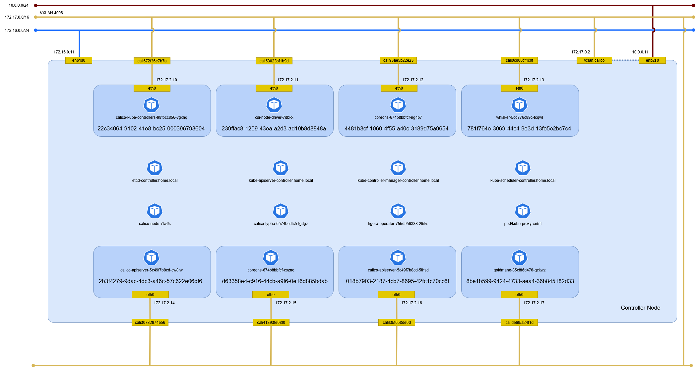

# ネットワークアドオン

## Calico

### ファイアウォール

すべてのノードで ファイアウォールを開ける。

```sh
firewall-cmd --permanent --zone=public --add-port=179/tcp
firewall-cmd --permanent --zone=public --add-port=4789/udp
firewall-cmd --permanent --zone=public --add-port=5473/tcp
firewall-cmd --permanent --zone=public --add-port=51820-51821/udp
firewall-cmd --reload
```

vxlan は enp2s0 がローカル IP アドレスになるので internal を開ける。

```{note}
どこで決まる？
```

```sh
firewall-cmd --permanent --zone=internal --add-port=4789/udp
firewall-cmd --reload
```

### NetworkManager

すべてのノードで Calico が制御するデバイスは NetworkManager の制御対象から外す。

```sh
cat > /etc/NetworkManager/conf.d/calico.conf <<EOF
[keyfile]
unmanaged-devices=interface-name:cali*;interface-name:tunl*;interface-name:vxlan.calico;interface-name:vxlan-v6.calico;interface-name:wireguard.cali;interface-name:wg-v6.cali
EOF
```

firewalld の trusted ゾーンに明示的に追加する([参考](https://github.com/projectcalico/calico/issues/5232))。

```sh
firewall-cmd --permanent --zone=trusted --add-interface="cali+"
firewall-cmd --permanent --zone=trusted --add-interface="tunl+"
firewall-cmd --permanent --zone=trusted --add-interface="vxlan.calico"
firewall-cmd --permanent --zone=trusted --add-interface="vxlan-v6.calico"
firewall-cmd --permanent --zone=trusted --add-interface="wireguard.cali"
firewall-cmd --permanent --zone=trusted --add-interface="wg-v6.cali"
firewall-cmd --reload
```

### インストール

Calico のカスタムリソース定義を構築する。

```sh
kubectl create -f https://raw.githubusercontent.com/projectcalico/calico/v3.30.3/manifests/operator-crds.yaml
```

```text
customresourcedefinition.apiextensions.k8s.io/apiservers.operator.tigera.io created
customresourcedefinition.apiextensions.k8s.io/gatewayapis.operator.tigera.io created
customresourcedefinition.apiextensions.k8s.io/goldmanes.operator.tigera.io created
customresourcedefinition.apiextensions.k8s.io/imagesets.operator.tigera.io created
customresourcedefinition.apiextensions.k8s.io/installations.operator.tigera.io created
customresourcedefinition.apiextensions.k8s.io/managementclusterconnections.operator.tigera.io created
customresourcedefinition.apiextensions.k8s.io/tigerastatuses.operator.tigera.io created
customresourcedefinition.apiextensions.k8s.io/whiskers.operator.tigera.io created
customresourcedefinition.apiextensions.k8s.io/bgpconfigurations.crd.projectcalico.org created
customresourcedefinition.apiextensions.k8s.io/bgpfilters.crd.projectcalico.org created
customresourcedefinition.apiextensions.k8s.io/bgppeers.crd.projectcalico.org created
customresourcedefinition.apiextensions.k8s.io/blockaffinities.crd.projectcalico.org created
customresourcedefinition.apiextensions.k8s.io/caliconodestatuses.crd.projectcalico.org created
customresourcedefinition.apiextensions.k8s.io/clusterinformations.crd.projectcalico.org created
customresourcedefinition.apiextensions.k8s.io/felixconfigurations.crd.projectcalico.org created
customresourcedefinition.apiextensions.k8s.io/globalnetworkpolicies.crd.projectcalico.org created
customresourcedefinition.apiextensions.k8s.io/globalnetworksets.crd.projectcalico.org created
customresourcedefinition.apiextensions.k8s.io/hostendpoints.crd.projectcalico.org created
customresourcedefinition.apiextensions.k8s.io/ipamblocks.crd.projectcalico.org created
customresourcedefinition.apiextensions.k8s.io/ipamconfigs.crd.projectcalico.org created
customresourcedefinition.apiextensions.k8s.io/ipamhandles.crd.projectcalico.org created
customresourcedefinition.apiextensions.k8s.io/ippools.crd.projectcalico.org created
customresourcedefinition.apiextensions.k8s.io/ipreservations.crd.projectcalico.org created
customresourcedefinition.apiextensions.k8s.io/kubecontrollersconfigurations.crd.projectcalico.org created
customresourcedefinition.apiextensions.k8s.io/networkpolicies.crd.projectcalico.org created
customresourcedefinition.apiextensions.k8s.io/networksets.crd.projectcalico.org created
customresourcedefinition.apiextensions.k8s.io/stagedglobalnetworkpolicies.crd.projectcalico.org created
customresourcedefinition.apiextensions.k8s.io/stagedkubernetesnetworkpolicies.crd.projectcalico.org created
customresourcedefinition.apiextensions.k8s.io/stagednetworkpolicies.crd.projectcalico.org created
customresourcedefinition.apiextensions.k8s.io/tiers.crd.projectcalico.org created
customresourcedefinition.apiextensions.k8s.io/adminnetworkpolicies.policy.networking.k8s.io created
customresourcedefinition.apiextensions.k8s.io/baselineadminnetworkpolicies.policy.networking.k8s.io created
```

Calico の Operator を構築する。

```sh
kubectl create -f https://raw.githubusercontent.com/projectcalico/calico/v3.30.3/manifests/tigera-operator.yaml
```

```text
namespace/tigera-operator created
serviceaccount/tigera-operator created
clusterrole.rbac.authorization.k8s.io/tigera-operator-secrets created
clusterrole.rbac.authorization.k8s.io/tigera-operator created
clusterrolebinding.rbac.authorization.k8s.io/tigera-operator created
rolebinding.rbac.authorization.k8s.io/tigera-operator-secrets created
deployment.apps/tigera-operator created
```

Calico を構築する。

```sh
kubectl create -f https://raw.githubusercontent.com/projectcalico/calico/v3.30.3/manifests/custom-resources.yaml
```

```text
installation.operator.tigera.io/default created
apiserver.operator.tigera.io/default created
goldmane.operator.tigera.io/default created
whisker.operator.tigera.io/default created
```

IP Pool の CIDR の既定値が 192.168.0.0/16 のため 172.17.0.0/16 に変更する。

```sh
kubectl edit installation default
```

```text
installation.operator.tigera.io/default edited
```

すべての Pod が起動するまで待つ。

```sh
watch kubectl get pods -n calico-system
```

```text
NAME                                      READY   STATUS    RESTARTS   AGE
calico-kube-controllers-98fbcc856-vgxhq   1/1     Running   0          2m
calico-node-7lw6s                         1/1     Running   0          46s
calico-typha-6574bcdfc5-fgdgz             1/1     Running   0          2m1s
csi-node-driver-7dbkx                     2/2     Running   0          2m1s
goldmane-85c8f6d476-qckwz                 1/1     Running   0          114s
whisker-5cd776c89c-tcqwl                  2/2     Running   0          43s
```

### クライアント

Calico クライアントをインストールする。

```sh
mkdir -p $HOME/.local/bin
curl -L https://github.com/projectcalico/calico/releases/download/v3.30.3/calicoctl-linux-amd64 --output-dir $HOME/.local/bin -o calicoctl
chmod +x $HOME/.local/bin/calicoctl
```

```sh
mkdir -p $HOME/.local/bin
curl -L https://github.com/projectcalico/calico/releases/download/v3.30.3/calicoctl-linux-amd64 --output-dir $HOME/.local/bin -o kubectl-calico
chmod +x $HOME/.local/bin/kubectl-calico
```

### 環境確認

Controller Node を再起動後に Controller Node でネットワーク構成を確認する。



#### ネットワーク名前空間

ネットワーク名前空間を確認する。

```sh
ip netns
```

```text
9aff30be-081c-4026-a352-fbac45faf19d
8bed4c5b-8143-43b6-ac03-a954a9266cf9
7a76ca1d-6c90-42c3-a2ca-e65ea6467c6d
295825a4-7a49-4339-b3da-f568dfa228a1
4e111709-7866-412d-a22f-40218b3826ad
5d787ef5-0bdb-41d0-8241-c330cca02e2a
5f3859db-54a2-4161-a2c3-82e9584b261d
40d96ff5-da8b-44fe-8f07-a6296a84b937
22c34064-9102-41e8-bc25-000396798604 (id: 0)
239ffac8-1209-43ea-a2d3-ad19b8d8848a (id: 1)
4481b8cf-1060-4f55-a40c-3189d75a9654 (id: 2)
781f764e-3969-44c4-9e3d-13fe5e2bc7c4 (id: 3)
2b3f4279-9dac-4dc3-a46c-57c622e06df6 (id: 4)
d63358e4-c916-44cb-a9f6-0e16d885bdab (id: 5)
018b7903-2187-4cb7-8695-42fc1c70cc6f (id: 6)
8be1b599-9424-4733-aea4-36b845182d33 (id: 7)
```

#### デバイス

デバイスを確認する。

```sh
ip -d link show
```

```text
1: lo: <LOOPBACK,UP,LOWER_UP> mtu 65536 qdisc noqueue state UNKNOWN mode DEFAULT group default qlen 1000
    link/loopback 00:00:00:00:00:00 brd 00:00:00:00:00:00 promiscuity 0 allmulti 0 minmtu 0 maxmtu 0 addrgenmode eui64 numtxqueues 1 numrxqueues 1 gso_max_size 65536 gso_max_segs 65535 tso_max_size 524280 tso_max_segs 65535 gro_max_size 65536 gso_ipv4_max_size 65536 gro_ipv4_max_size 65536
2: enp1s0: <BROADCAST,MULTICAST,UP,LOWER_UP> mtu 1500 qdisc fq_codel state UP mode DEFAULT group default qlen 1000
    link/ether 52:54:00:49:41:b8 brd ff:ff:ff:ff:ff:ff promiscuity 0 allmulti 0 minmtu 68 maxmtu 65535 addrgenmode none numtxqueues 1 numrxqueues 1 gso_max_size 65536 gso_max_segs 65535 tso_max_size 65536 tso_max_segs 65535 gro_max_size 65536 gso_ipv4_max_size 65536 gro_ipv4_max_size 65536 parentbus virtio parentdev virtio1
    altname enx5254004941b8
3: enp2s0: <BROADCAST,MULTICAST,UP,LOWER_UP> mtu 1500 qdisc fq_codel state UP mode DEFAULT group default qlen 1000
    link/ether 52:54:00:91:a0:96 brd ff:ff:ff:ff:ff:ff promiscuity 0 allmulti 0 minmtu 68 maxmtu 65535 addrgenmode none numtxqueues 1 numrxqueues 1 gso_max_size 65536 gso_max_segs 65535 tso_max_size 65536 tso_max_segs 65535 gro_max_size 65536 gso_ipv4_max_size 65536 gro_ipv4_max_size 65536 parentbus virtio parentdev virtio2
    altname enx52540091a096
4: cali672f36e7b7a@if2: <BROADCAST,MULTICAST,UP,LOWER_UP> mtu 1450 qdisc noqueue state UP mode DEFAULT group default qlen 1000
    link/ether ee:ee:ee:ee:ee:ee brd ff:ff:ff:ff:ff:ff link-netns 22c34064-9102-41e8-bc25-000396798604 promiscuity 0 allmulti 0 minmtu 68 maxmtu 65535
    veth addrgenmode eui64 numtxqueues 1 numrxqueues 1 gso_max_size 65536 gso_max_segs 65535 tso_max_size 524280 tso_max_segs 65535 gro_max_size 65536 gso_ipv4_max_size 65536 gro_ipv4_max_size 65536
5: cali53023bf1b9d@if2: <BROADCAST,MULTICAST,UP,LOWER_UP> mtu 1450 qdisc noqueue state UP mode DEFAULT group default qlen 1000
    link/ether ee:ee:ee:ee:ee:ee brd ff:ff:ff:ff:ff:ff link-netns 239ffac8-1209-43ea-a2d3-ad19b8d8848a promiscuity 0 allmulti 0 minmtu 68 maxmtu 65535
    veth addrgenmode eui64 numtxqueues 1 numrxqueues 1 gso_max_size 65536 gso_max_segs 65535 tso_max_size 524280 tso_max_segs 65535 gro_max_size 65536 gso_ipv4_max_size 65536 gro_ipv4_max_size 65536
6: cali93ae5b22e23@if2: <BROADCAST,MULTICAST,UP,LOWER_UP> mtu 1450 qdisc noqueue state UP mode DEFAULT group default qlen 1000
    link/ether ee:ee:ee:ee:ee:ee brd ff:ff:ff:ff:ff:ff link-netns 4481b8cf-1060-4f55-a40c-3189d75a9654 promiscuity 0 allmulti 0 minmtu 68 maxmtu 65535
    veth addrgenmode eui64 numtxqueues 1 numrxqueues 1 gso_max_size 65536 gso_max_segs 65535 tso_max_size 524280 tso_max_segs 65535 gro_max_size 65536 gso_ipv4_max_size 65536 gro_ipv4_max_size 65536
7: cali0cd00cf4c0f@if2: <BROADCAST,MULTICAST,UP,LOWER_UP> mtu 1450 qdisc noqueue state UP mode DEFAULT group default qlen 1000
    link/ether ee:ee:ee:ee:ee:ee brd ff:ff:ff:ff:ff:ff link-netns 781f764e-3969-44c4-9e3d-13fe5e2bc7c4 promiscuity 0 allmulti 0 minmtu 68 maxmtu 65535
    veth addrgenmode eui64 numtxqueues 1 numrxqueues 1 gso_max_size 65536 gso_max_segs 65535 tso_max_size 524280 tso_max_segs 65535 gro_max_size 65536 gso_ipv4_max_size 65536 gro_ipv4_max_size 65536
8: cali30782974e56@if2: <BROADCAST,MULTICAST,UP,LOWER_UP> mtu 1450 qdisc noqueue state UP mode DEFAULT group default qlen 1000
    link/ether ee:ee:ee:ee:ee:ee brd ff:ff:ff:ff:ff:ff link-netns 2b3f4279-9dac-4dc3-a46c-57c622e06df6 promiscuity 0 allmulti 0 minmtu 68 maxmtu 65535
    veth addrgenmode eui64 numtxqueues 1 numrxqueues 1 gso_max_size 65536 gso_max_segs 65535 tso_max_size 524280 tso_max_segs 65535 gro_max_size 65536 gso_ipv4_max_size 65536 gro_ipv4_max_size 65536
9: cali41393fe08f0@if2: <BROADCAST,MULTICAST,UP,LOWER_UP> mtu 1450 qdisc noqueue state UP mode DEFAULT group default qlen 1000
    link/ether ee:ee:ee:ee:ee:ee brd ff:ff:ff:ff:ff:ff link-netns d63358e4-c916-44cb-a9f6-0e16d885bdab promiscuity 0 allmulti 0 minmtu 68 maxmtu 65535
    veth addrgenmode eui64 numtxqueues 1 numrxqueues 1 gso_max_size 65536 gso_max_segs 65535 tso_max_size 524280 tso_max_segs 65535 gro_max_size 65536 gso_ipv4_max_size 65536 gro_ipv4_max_size 65536
10: calif35f658de0d@if2: <BROADCAST,MULTICAST,UP,LOWER_UP> mtu 1450 qdisc noqueue state UP mode DEFAULT group default qlen 1000
    link/ether ee:ee:ee:ee:ee:ee brd ff:ff:ff:ff:ff:ff link-netns 018b7903-2187-4cb7-8695-42fc1c70cc6f promiscuity 0 allmulti 0 minmtu 68 maxmtu 65535
    veth addrgenmode eui64 numtxqueues 1 numrxqueues 1 gso_max_size 65536 gso_max_segs 65535 tso_max_size 524280 tso_max_segs 65535 gro_max_size 65536 gso_ipv4_max_size 65536 gro_ipv4_max_size 65536
11: calide6f5a24f1d@if2: <BROADCAST,MULTICAST,UP,LOWER_UP> mtu 1450 qdisc noqueue state UP mode DEFAULT group default qlen 1000
    link/ether ee:ee:ee:ee:ee:ee brd ff:ff:ff:ff:ff:ff link-netns 8be1b599-9424-4733-aea4-36b845182d33 promiscuity 0 allmulti 0 minmtu 68 maxmtu 65535
    veth addrgenmode eui64 numtxqueues 1 numrxqueues 1 gso_max_size 65536 gso_max_segs 65535 tso_max_size 524280 tso_max_segs 65535 gro_max_size 65536 gso_ipv4_max_size 65536 gro_ipv4_max_size 65536
12: vxlan.calico: <BROADCAST,MULTICAST,UP,LOWER_UP> mtu 1450 qdisc noqueue state UNKNOWN mode DEFAULT group default qlen 1000
    link/ether 66:b9:7e:86:1e:53 brd ff:ff:ff:ff:ff:ff promiscuity 0 allmulti 0 minmtu 68 maxmtu 65535
    vxlan id 4096 local 10.0.0.11 dev enp2s0 srcport 0 0 dstport 4789 ttl auto ageing 300 nolearning addrgenmode eui64 numtxqueues 1 numrxqueues 1 gso_max_size 65536 gso_max_segs 65535 tso_max_size 65536 tso_max_segs 65535 gro_max_size 65536 gso_ipv4_max_size 65536 gro_ipv4_max_size 65536
```

ネットワーク名前空間内のデバイスを確認する。

```sh
ip netns exec 22c34064-9102-41e8-bc25-000396798604 ip -d link show
```

```text
1: lo: <LOOPBACK,UP,LOWER_UP> mtu 65536 qdisc noqueue state UNKNOWN mode DEFAULT group default qlen 1000
    link/loopback 00:00:00:00:00:00 brd 00:00:00:00:00:00 promiscuity 0 allmulti 0 minmtu 0 maxmtu 0 addrgenmode eui64 numtxqueues 1 numrxqueues 1 gso_max_size 65536 gso_max_segs 65535 tso_max_size 524280 tso_max_segs 65535 gro_max_size 65536 gso_ipv4_max_size 65536 gro_ipv4_max_size 65536
2: eth0@if4: <BROADCAST,MULTICAST,UP,LOWER_UP> mtu 1450 qdisc noqueue state UP mode DEFAULT group default qlen 1000
    link/ether 8a:67:37:08:6e:e1 brd ff:ff:ff:ff:ff:ff link-netns 9aff30be-081c-4026-a352-fbac45faf19d promiscuity 0 allmulti 0 minmtu 68 maxmtu 65535
    veth addrgenmode eui64 numtxqueues 1 numrxqueues 1 gso_max_size 65536 gso_max_segs 65535 tso_max_size 524280 tso_max_segs 65535 gro_max_size 65536 gso_ipv4_max_size 65536 gro_ipv4_max_size 65536
```

ネットワーク名前空間内のデバイスを確認する。

```sh
ip netns exec 239ffac8-1209-43ea-a2d3-ad19b8d8848a ip -d link show
```

```text
1: lo: <LOOPBACK,UP,LOWER_UP> mtu 65536 qdisc noqueue state UNKNOWN mode DEFAULT group default qlen 1000
    link/loopback 00:00:00:00:00:00 brd 00:00:00:00:00:00 promiscuity 0 allmulti 0 minmtu 0 maxmtu 0 addrgenmode eui64 numtxqueues 1 numrxqueues 1 gso_max_size 65536 gso_max_segs 65535 tso_max_size 524280 tso_max_segs 65535 gro_max_size 65536 gso_ipv4_max_size 65536 gro_ipv4_max_size 65536
2: eth0@if5: <BROADCAST,MULTICAST,UP,LOWER_UP> mtu 1450 qdisc noqueue state UP mode DEFAULT group default qlen 1000
    link/ether 6e:65:7e:1f:1a:b0 brd ff:ff:ff:ff:ff:ff link-netns 9aff30be-081c-4026-a352-fbac45faf19d promiscuity 0 allmulti 0 minmtu 68 maxmtu 65535
    veth addrgenmode eui64 numtxqueues 1 numrxqueues 1 gso_max_size 65536 gso_max_segs 65535 tso_max_size 524280 tso_max_segs 65535 gro_max_size 65536 gso_ipv4_max_size 65536 gro_ipv4_max_size 65536
```

ネットワーク名前空間内のデバイスを確認する。

```sh
ip netns exec 4481b8cf-1060-4f55-a40c-3189d75a9654 ip -d link show
```

```text
1: lo: <LOOPBACK,UP,LOWER_UP> mtu 65536 qdisc noqueue state UNKNOWN mode DEFAULT group default qlen 1000
    link/loopback 00:00:00:00:00:00 brd 00:00:00:00:00:00 promiscuity 0 allmulti 0 minmtu 0 maxmtu 0 addrgenmode eui64 numtxqueues 1 numrxqueues 1 gso_max_size 65536 gso_max_segs 65535 tso_max_size 524280 tso_max_segs 65535 gro_max_size 65536 gso_ipv4_max_size 65536 gro_ipv4_max_size 65536
2: eth0@if6: <BROADCAST,MULTICAST,UP,LOWER_UP> mtu 1450 qdisc noqueue state UP mode DEFAULT group default qlen 1000
    link/ether de:47:01:a6:23:36 brd ff:ff:ff:ff:ff:ff link-netns 9aff30be-081c-4026-a352-fbac45faf19d promiscuity 0 allmulti 0 minmtu 68 maxmtu 65535
    veth addrgenmode eui64 numtxqueues 1 numrxqueues 1 gso_max_size 65536 gso_max_segs 65535 tso_max_size 524280 tso_max_segs 65535 gro_max_size 65536 gso_ipv4_max_size 65536 gro_ipv4_max_size 65536
```

ネットワーク名前空間内のデバイスを確認する。

```sh
ip netns exec 781f764e-3969-44c4-9e3d-13fe5e2bc7c4 ip -d link show
```

```text
1: lo: <LOOPBACK,UP,LOWER_UP> mtu 65536 qdisc noqueue state UNKNOWN mode DEFAULT group default qlen 1000
    link/loopback 00:00:00:00:00:00 brd 00:00:00:00:00:00 promiscuity 0 allmulti 0 minmtu 0 maxmtu 0 addrgenmode eui64 numtxqueues 1 numrxqueues 1 gso_max_size 65536 gso_max_segs 65535 tso_max_size 524280 tso_max_segs 65535 gro_max_size 65536 gso_ipv4_max_size 65536 gro_ipv4_max_size 65536
2: eth0@if7: <BROADCAST,MULTICAST,UP,LOWER_UP> mtu 1450 qdisc noqueue state UP mode DEFAULT group default qlen 1000
    link/ether 16:bb:fa:d9:3a:8c brd ff:ff:ff:ff:ff:ff link-netns 9aff30be-081c-4026-a352-fbac45faf19d promiscuity 0 allmulti 0 minmtu 68 maxmtu 65535
    veth addrgenmode eui64 numtxqueues 1 numrxqueues 1 gso_max_size 65536 gso_max_segs 65535 tso_max_size 524280 tso_max_segs 65535 gro_max_size 65536 gso_ipv4_max_size 65536 gro_ipv4_max_size 65536
```

ネットワーク名前空間内のデバイスを確認する。

```sh
ip netns exec 2b3f4279-9dac-4dc3-a46c-57c622e06df6 ip -d link show
```

```text
1: lo: <LOOPBACK,UP,LOWER_UP> mtu 65536 qdisc noqueue state UNKNOWN mode DEFAULT group default qlen 1000
    link/loopback 00:00:00:00:00:00 brd 00:00:00:00:00:00 promiscuity 0 allmulti 0 minmtu 0 maxmtu 0 addrgenmode eui64 numtxqueues 1 numrxqueues 1 gso_max_size 65536 gso_max_segs 65535 tso_max_size 524280 tso_max_segs 65535 gro_max_size 65536 gso_ipv4_max_size 65536 gro_ipv4_max_size 65536
2: eth0@if8: <BROADCAST,MULTICAST,UP,LOWER_UP> mtu 1450 qdisc noqueue state UP mode DEFAULT group default qlen 1000
    link/ether 06:7b:37:72:06:f8 brd ff:ff:ff:ff:ff:ff link-netns 9aff30be-081c-4026-a352-fbac45faf19d promiscuity 0 allmulti 0 minmtu 68 maxmtu 65535
    veth addrgenmode eui64 numtxqueues 1 numrxqueues 1 gso_max_size 65536 gso_max_segs 65535 tso_max_size 524280 tso_max_segs 65535 gro_max_size 65536 gso_ipv4_max_size 65536 gro_ipv4_max_size 65536
```

ネットワーク名前空間内のデバイスを確認する。

```sh
ip netns exec d63358e4-c916-44cb-a9f6-0e16d885bdab ip -d link show
```

```text
1: lo: <LOOPBACK,UP,LOWER_UP> mtu 65536 qdisc noqueue state UNKNOWN mode DEFAULT group default qlen 1000
    link/loopback 00:00:00:00:00:00 brd 00:00:00:00:00:00 promiscuity 0 allmulti 0 minmtu 0 maxmtu 0 addrgenmode eui64 numtxqueues 1 numrxqueues 1 gso_max_size 65536 gso_max_segs 65535 tso_max_size 524280 tso_max_segs 65535 gro_max_size 65536 gso_ipv4_max_size 65536 gro_ipv4_max_size 65536
2: eth0@if9: <BROADCAST,MULTICAST,UP,LOWER_UP> mtu 1450 qdisc noqueue state UP mode DEFAULT group default qlen 1000
    link/ether 6a:a6:1d:2d:0a:b7 brd ff:ff:ff:ff:ff:ff link-netns 9aff30be-081c-4026-a352-fbac45faf19d promiscuity 0 allmulti 0 minmtu 68 maxmtu 65535
    veth addrgenmode eui64 numtxqueues 1 numrxqueues 1 gso_max_size 65536 gso_max_segs 65535 tso_max_size 524280 tso_max_segs 65535 gro_max_size 65536 gso_ipv4_max_size 65536 gro_ipv4_max_size 65536
```

ネットワーク名前空間内のデバイスを確認する。

```sh
ip netns exec 018b7903-2187-4cb7-8695-42fc1c70cc6f ip -d link show
```

```text
1: lo: <LOOPBACK,UP,LOWER_UP> mtu 65536 qdisc noqueue state UNKNOWN mode DEFAULT group default qlen 1000
    link/loopback 00:00:00:00:00:00 brd 00:00:00:00:00:00 promiscuity 0 allmulti 0 minmtu 0 maxmtu 0 addrgenmode eui64 numtxqueues 1 numrxqueues 1 gso_max_size 65536 gso_max_segs 65535 tso_max_size 524280 tso_max_segs 65535 gro_max_size 65536 gso_ipv4_max_size 65536 gro_ipv4_max_size 65536
2: eth0@if10: <BROADCAST,MULTICAST,UP,LOWER_UP> mtu 1450 qdisc noqueue state UP mode DEFAULT group default qlen 1000
    link/ether aa:cc:4a:61:51:80 brd ff:ff:ff:ff:ff:ff link-netns 9aff30be-081c-4026-a352-fbac45faf19d promiscuity 0 allmulti 0 minmtu 68 maxmtu 65535
    veth addrgenmode eui64 numtxqueues 1 numrxqueues 1 gso_max_size 65536 gso_max_segs 65535 tso_max_size 524280 tso_max_segs 65535 gro_max_size 65536 gso_ipv4_max_size 65536 gro_ipv4_max_size 65536
```

ネットワーク名前空間内のデバイスを確認する。

```sh
ip netns exec 8be1b599-9424-4733-aea4-36b845182d33 ip -d link show
```

```text
1: lo: <LOOPBACK,UP,LOWER_UP> mtu 65536 qdisc noqueue state UNKNOWN mode DEFAULT group default qlen 1000
    link/loopback 00:00:00:00:00:00 brd 00:00:00:00:00:00 promiscuity 0 allmulti 0 minmtu 0 maxmtu 0 addrgenmode eui64 numtxqueues 1 numrxqueues 1 gso_max_size 65536 gso_max_segs 65535 tso_max_size 524280 tso_max_segs 65535 gro_max_size 65536 gso_ipv4_max_size 65536 gro_ipv4_max_size 65536
2: eth0@if11: <BROADCAST,MULTICAST,UP,LOWER_UP> mtu 1450 qdisc noqueue state UP mode DEFAULT group default qlen 1000
    link/ether da:2f:c2:fc:35:10 brd ff:ff:ff:ff:ff:ff link-netns 9aff30be-081c-4026-a352-fbac45faf19d promiscuity 0 allmulti 0 minmtu 68 maxmtu 65535
    veth addrgenmode eui64 numtxqueues 1 numrxqueues 1 gso_max_size 65536 gso_max_segs 65535 tso_max_size 524280 tso_max_segs 65535 gro_max_size 65536 gso_ipv4_max_size 65536 gro_ipv4_max_size 65536
```

#### イーサネット

イーサネットの情報を確認する。

```sh
ip addr show
```

```text
1: lo: <LOOPBACK,UP,LOWER_UP> mtu 65536 qdisc noqueue state UNKNOWN group default qlen 1000
    link/loopback 00:00:00:00:00:00 brd 00:00:00:00:00:00
    inet 127.0.0.1/8 scope host lo
       valid_lft forever preferred_lft forever
    inet6 ::1/128 scope host noprefixroute
       valid_lft forever preferred_lft forever
2: enp1s0: <BROADCAST,MULTICAST,UP,LOWER_UP> mtu 1500 qdisc fq_codel state UP group default qlen 1000
    link/ether 52:54:00:49:41:b8 brd ff:ff:ff:ff:ff:ff
    altname enx5254004941b8
    inet 172.16.0.11/24 brd 172.16.0.255 scope global noprefixroute enp1s0
       valid_lft forever preferred_lft forever
3: enp2s0: <BROADCAST,MULTICAST,UP,LOWER_UP> mtu 1500 qdisc fq_codel state UP group default qlen 1000
    link/ether 52:54:00:91:a0:96 brd ff:ff:ff:ff:ff:ff
    altname enx52540091a096
    inet 10.0.0.11/24 brd 10.0.0.255 scope global noprefixroute enp2s0
       valid_lft forever preferred_lft forever
4: cali672f36e7b7a@if2: <BROADCAST,MULTICAST,UP,LOWER_UP> mtu 1450 qdisc noqueue state UP group default qlen 1000
    link/ether ee:ee:ee:ee:ee:ee brd ff:ff:ff:ff:ff:ff link-netns 22c34064-9102-41e8-bc25-000396798604
    inet6 fe80::ecee:eeff:feee:eeee/64 scope link proto kernel_ll
       valid_lft forever preferred_lft forever
5: cali53023bf1b9d@if2: <BROADCAST,MULTICAST,UP,LOWER_UP> mtu 1450 qdisc noqueue state UP group default qlen 1000
    link/ether ee:ee:ee:ee:ee:ee brd ff:ff:ff:ff:ff:ff link-netns 239ffac8-1209-43ea-a2d3-ad19b8d8848a
    inet6 fe80::ecee:eeff:feee:eeee/64 scope link proto kernel_ll
       valid_lft forever preferred_lft forever
6: cali93ae5b22e23@if2: <BROADCAST,MULTICAST,UP,LOWER_UP> mtu 1450 qdisc noqueue state UP group default qlen 1000
    link/ether ee:ee:ee:ee:ee:ee brd ff:ff:ff:ff:ff:ff link-netns 4481b8cf-1060-4f55-a40c-3189d75a9654
    inet6 fe80::ecee:eeff:feee:eeee/64 scope link proto kernel_ll
       valid_lft forever preferred_lft forever
7: cali0cd00cf4c0f@if2: <BROADCAST,MULTICAST,UP,LOWER_UP> mtu 1450 qdisc noqueue state UP group default qlen 1000
    link/ether ee:ee:ee:ee:ee:ee brd ff:ff:ff:ff:ff:ff link-netns 781f764e-3969-44c4-9e3d-13fe5e2bc7c4
    inet6 fe80::ecee:eeff:feee:eeee/64 scope link proto kernel_ll
       valid_lft forever preferred_lft forever
8: cali30782974e56@if2: <BROADCAST,MULTICAST,UP,LOWER_UP> mtu 1450 qdisc noqueue state UP group default qlen 1000
    link/ether ee:ee:ee:ee:ee:ee brd ff:ff:ff:ff:ff:ff link-netns 2b3f4279-9dac-4dc3-a46c-57c622e06df6
    inet6 fe80::ecee:eeff:feee:eeee/64 scope link proto kernel_ll
       valid_lft forever preferred_lft forever
9: cali41393fe08f0@if2: <BROADCAST,MULTICAST,UP,LOWER_UP> mtu 1450 qdisc noqueue state UP group default qlen 1000
    link/ether ee:ee:ee:ee:ee:ee brd ff:ff:ff:ff:ff:ff link-netns d63358e4-c916-44cb-a9f6-0e16d885bdab
    inet6 fe80::ecee:eeff:feee:eeee/64 scope link proto kernel_ll
       valid_lft forever preferred_lft forever
10: calif35f658de0d@if2: <BROADCAST,MULTICAST,UP,LOWER_UP> mtu 1450 qdisc noqueue state UP group default qlen 1000
    link/ether ee:ee:ee:ee:ee:ee brd ff:ff:ff:ff:ff:ff link-netns 018b7903-2187-4cb7-8695-42fc1c70cc6f
    inet6 fe80::ecee:eeff:feee:eeee/64 scope link proto kernel_ll
       valid_lft forever preferred_lft forever
11: calide6f5a24f1d@if2: <BROADCAST,MULTICAST,UP,LOWER_UP> mtu 1450 qdisc noqueue state UP group default qlen 1000
    link/ether ee:ee:ee:ee:ee:ee brd ff:ff:ff:ff:ff:ff link-netns 8be1b599-9424-4733-aea4-36b845182d33
    inet6 fe80::ecee:eeff:feee:eeee/64 scope link proto kernel_ll
       valid_lft forever preferred_lft forever
12: vxlan.calico: <BROADCAST,MULTICAST,UP,LOWER_UP> mtu 1450 qdisc noqueue state UNKNOWN group default qlen 1000
    link/ether 66:b9:7e:86:1e:53 brd ff:ff:ff:ff:ff:ff
    inet 172.17.2.0/32 scope global vxlan.calico
       valid_lft forever preferred_lft forever
    inet6 fe80::64b9:7eff:fe86:1e53/64 scope link proto kernel_ll
       valid_lft forever preferred_lft forever
```

ネットワーク名前空間内のイーサネットの情報を確認する。

```sh
ip netns exec 22c34064-9102-41e8-bc25-000396798604 ip addr show
```

```text
1: lo: <LOOPBACK,UP,LOWER_UP> mtu 65536 qdisc noqueue state UNKNOWN group default qlen 1000
    link/loopback 00:00:00:00:00:00 brd 00:00:00:00:00:00
    inet 127.0.0.1/8 scope host lo
       valid_lft forever preferred_lft forever
    inet6 ::1/128 scope host proto kernel_lo
       valid_lft forever preferred_lft forever
2: eth0@if4: <BROADCAST,MULTICAST,UP,LOWER_UP> mtu 1450 qdisc noqueue state UP group default qlen 1000
    link/ether 8a:67:37:08:6e:e1 brd ff:ff:ff:ff:ff:ff link-netns 9aff30be-081c-4026-a352-fbac45faf19d
    inet 172.17.2.10/32 scope global eth0
       valid_lft forever preferred_lft forever
    inet6 fe80::8867:37ff:fe08:6ee1/64 scope link proto kernel_ll
       valid_lft forever preferred_lft forever
```

ネットワーク名前空間内のイーサネットの情報を確認する。

```sh
ip netns exec 239ffac8-1209-43ea-a2d3-ad19b8d8848a ip addr show
```

```text
1: lo: <LOOPBACK,UP,LOWER_UP> mtu 65536 qdisc noqueue state UNKNOWN group default qlen 1000
    link/loopback 00:00:00:00:00:00 brd 00:00:00:00:00:00
    inet 127.0.0.1/8 scope host lo
       valid_lft forever preferred_lft forever
    inet6 ::1/128 scope host proto kernel_lo
       valid_lft forever preferred_lft forever
2: eth0@if5: <BROADCAST,MULTICAST,UP,LOWER_UP> mtu 1450 qdisc noqueue state UP group default qlen 1000
    link/ether 6e:65:7e:1f:1a:b0 brd ff:ff:ff:ff:ff:ff link-netns 9aff30be-081c-4026-a352-fbac45faf19d
    inet 172.17.2.11/32 scope global eth0
       valid_lft forever preferred_lft forever
    inet6 fe80::6c65:7eff:fe1f:1ab0/64 scope link proto kernel_ll
       valid_lft forever preferred_lft forever
```

ネットワーク名前空間内のイーサネットの情報を確認する。

```sh
ip netns exec 4481b8cf-1060-4f55-a40c-3189d75a9654 ip addr show
```

```text
1: lo: <LOOPBACK,UP,LOWER_UP> mtu 65536 qdisc noqueue state UNKNOWN group default qlen 1000
    link/loopback 00:00:00:00:00:00 brd 00:00:00:00:00:00
    inet 127.0.0.1/8 scope host lo
       valid_lft forever preferred_lft forever
    inet6 ::1/128 scope host proto kernel_lo
       valid_lft forever preferred_lft forever
2: eth0@if6: <BROADCAST,MULTICAST,UP,LOWER_UP> mtu 1450 qdisc noqueue state UP group default qlen 1000
    link/ether de:47:01:a6:23:36 brd ff:ff:ff:ff:ff:ff link-netns 9aff30be-081c-4026-a352-fbac45faf19d
    inet 172.17.2.12/32 scope global eth0
       valid_lft forever preferred_lft forever
    inet6 fe80::dc47:1ff:fea6:2336/64 scope link proto kernel_ll
       valid_lft forever preferred_lft forever
```

ネットワーク名前空間内のイーサネットの情報を確認する。

```sh
ip netns exec 781f764e-3969-44c4-9e3d-13fe5e2bc7c4 ip addr show
```

```text
1: lo: <LOOPBACK,UP,LOWER_UP> mtu 65536 qdisc noqueue state UNKNOWN group default qlen 1000
    link/loopback 00:00:00:00:00:00 brd 00:00:00:00:00:00
    inet 127.0.0.1/8 scope host lo
       valid_lft forever preferred_lft forever
    inet6 ::1/128 scope host proto kernel_lo
       valid_lft forever preferred_lft forever
2: eth0@if7: <BROADCAST,MULTICAST,UP,LOWER_UP> mtu 1450 qdisc noqueue state UP group default qlen 1000
    link/ether 16:bb:fa:d9:3a:8c brd ff:ff:ff:ff:ff:ff link-netns 9aff30be-081c-4026-a352-fbac45faf19d
    inet 172.17.2.13/32 scope global eth0
       valid_lft forever preferred_lft forever
    inet6 fe80::14bb:faff:fed9:3a8c/64 scope link proto kernel_ll
       valid_lft forever preferred_lft forever
```

ネットワーク名前空間内のイーサネットの情報を確認する。

```sh
ip netns exec 2b3f4279-9dac-4dc3-a46c-57c622e06df6 ip addr show
```

```text
1: lo: <LOOPBACK,UP,LOWER_UP> mtu 65536 qdisc noqueue state UNKNOWN group default qlen 1000
    link/loopback 00:00:00:00:00:00 brd 00:00:00:00:00:00
    inet 127.0.0.1/8 scope host lo
       valid_lft forever preferred_lft forever
    inet6 ::1/128 scope host proto kernel_lo
       valid_lft forever preferred_lft forever
2: eth0@if8: <BROADCAST,MULTICAST,UP,LOWER_UP> mtu 1450 qdisc noqueue state UP group default qlen 1000
    link/ether 06:7b:37:72:06:f8 brd ff:ff:ff:ff:ff:ff link-netns 9aff30be-081c-4026-a352-fbac45faf19d
    inet 172.17.2.14/32 scope global eth0
       valid_lft forever preferred_lft forever
    inet6 fe80::47b:37ff:fe72:6f8/64 scope link proto kernel_ll
       valid_lft forever preferred_lft forever
```

ネットワーク名前空間内のイーサネットの情報を確認する。

```sh
ip netns exec d63358e4-c916-44cb-a9f6-0e16d885bdab ip addr show
```

```text
1: lo: <LOOPBACK,UP,LOWER_UP> mtu 65536 qdisc noqueue state UNKNOWN group default qlen 1000
    link/loopback 00:00:00:00:00:00 brd 00:00:00:00:00:00
    inet 127.0.0.1/8 scope host lo
       valid_lft forever preferred_lft forever
    inet6 ::1/128 scope host proto kernel_lo
       valid_lft forever preferred_lft forever
2: eth0@if9: <BROADCAST,MULTICAST,UP,LOWER_UP> mtu 1450 qdisc noqueue state UP group default qlen 1000
    link/ether 6a:a6:1d:2d:0a:b7 brd ff:ff:ff:ff:ff:ff link-netns 9aff30be-081c-4026-a352-fbac45faf19d
    inet 172.17.2.15/32 scope global eth0
       valid_lft forever preferred_lft forever
    inet6 fe80::68a6:1dff:fe2d:ab7/64 scope link proto kernel_ll
       valid_lft forever preferred_lft forever
```

ネットワーク名前空間内のイーサネットの情報を確認する。

```sh
ip netns exec 018b7903-2187-4cb7-8695-42fc1c70cc6f ip addr show
```

```text
1: lo: <LOOPBACK,UP,LOWER_UP> mtu 65536 qdisc noqueue state UNKNOWN group default qlen 1000
    link/loopback 00:00:00:00:00:00 brd 00:00:00:00:00:00
    inet 127.0.0.1/8 scope host lo
       valid_lft forever preferred_lft forever
    inet6 ::1/128 scope host proto kernel_lo
       valid_lft forever preferred_lft forever
2: eth0@if10: <BROADCAST,MULTICAST,UP,LOWER_UP> mtu 1450 qdisc noqueue state UP group default qlen 1000
    link/ether aa:cc:4a:61:51:80 brd ff:ff:ff:ff:ff:ff link-netns 9aff30be-081c-4026-a352-fbac45faf19d
    inet 172.17.2.16/32 scope global eth0
       valid_lft forever preferred_lft forever
    inet6 fe80::a8cc:4aff:fe61:5180/64 scope link proto kernel_ll
       valid_lft forever preferred_lft forever
```

ネットワーク名前空間内のイーサネットの情報を確認する。

```sh
ip netns exec 8be1b599-9424-4733-aea4-36b845182d33 ip addr show
```

```text
1: lo: <LOOPBACK,UP,LOWER_UP> mtu 65536 qdisc noqueue state UNKNOWN group default qlen 1000
    link/loopback 00:00:00:00:00:00 brd 00:00:00:00:00:00
    inet 127.0.0.1/8 scope host lo
       valid_lft forever preferred_lft forever
    inet6 ::1/128 scope host proto kernel_lo
       valid_lft forever preferred_lft forever
2: eth0@if11: <BROADCAST,MULTICAST,UP,LOWER_UP> mtu 1450 qdisc noqueue state UP group default qlen 1000
    link/ether da:2f:c2:fc:35:10 brd ff:ff:ff:ff:ff:ff link-netns 9aff30be-081c-4026-a352-fbac45faf19d
    inet 172.17.2.17/32 scope global eth0
       valid_lft forever preferred_lft forever
    inet6 fe80::d82f:c2ff:fefc:3510/64 scope link proto kernel_ll
       valid_lft forever preferred_lft forever
```

#### ルート

ルーティングを確認する。

```sh
ip route show
```

```text
default via 172.16.0.254 dev enp1s0 proto static metric 100
10.0.0.0/24 dev enp2s0 proto kernel scope link src 10.0.0.11 metric 101
172.16.0.0/24 dev enp1s0 proto kernel scope link src 172.16.0.11 metric 100
blackhole 172.17.2.0/26 proto 80
172.17.2.10 dev cali672f36e7b7a scope link
172.17.2.11 dev cali53023bf1b9d scope link
172.17.2.12 dev cali93ae5b22e23 scope link
172.17.2.13 dev cali0cd00cf4c0f scope link
172.17.2.14 dev cali30782974e56 scope link
172.17.2.15 dev cali41393fe08f0 scope link
172.17.2.16 dev calif35f658de0d scope link
172.17.2.17 dev calide6f5a24f1d scope link
```

ネットワーク名前空間内のルーティングを確認する。

```sh
ip netns exec 22c34064-9102-41e8-bc25-000396798604 ip route show
```

```text
default via 169.254.1.1 dev eth0
169.254.1.1 dev eth0 scope link
```

ネットワーク名前空間内のルーティングを確認する。

```sh
ip netns exec 239ffac8-1209-43ea-a2d3-ad19b8d8848a ip route show
```

```text
default via 169.254.1.1 dev eth0
169.254.1.1 dev eth0 scope link
```

ネットワーク名前空間内のルーティングを確認する。

```sh
ip netns exec 4481b8cf-1060-4f55-a40c-3189d75a9654 ip route show
```

```text
default via 169.254.1.1 dev eth0
169.254.1.1 dev eth0 scope link
```

ネットワーク名前空間内のルーティングを確認する。

```sh
ip netns exec 781f764e-3969-44c4-9e3d-13fe5e2bc7c4 ip route show
```

```text
default via 169.254.1.1 dev eth0
169.254.1.1 dev eth0 scope link
```

ネットワーク名前空間内のルーティングを確認する。

```sh
ip netns exec 2b3f4279-9dac-4dc3-a46c-57c622e06df6 ip route show
```

```text
default via 169.254.1.1 dev eth0
169.254.1.1 dev eth0 scope link
```

ネットワーク名前空間内のルーティングを確認する。

```sh
ip netns exec d63358e4-c916-44cb-a9f6-0e16d885bdab ip route show
```

```text
default via 169.254.1.1 dev eth0
169.254.1.1 dev eth0 scope link
```

ネットワーク名前空間内のルーティングを確認する。

```sh
ip netns exec 018b7903-2187-4cb7-8695-42fc1c70cc6f ip route show
```

```text
default via 169.254.1.1 dev eth0
169.254.1.1 dev eth0 scope link
```

ネットワーク名前空間内のルーティングを確認する。

```sh
ip netns exec 8be1b599-9424-4733-aea4-36b845182d33 ip route show
```

```text
default via 169.254.1.1 dev eth0
169.254.1.1 dev eth0 scope link
```

#### ARP テーブル

ARP テーブルを確認する。

```sh
ip neigh
```

```text
172.17.2.15 dev cali41393fe08f0 lladdr 6a:a6:1d:2d:0a:b7 REACHABLE
172.16.0.199 dev enp1s0 lladdr fe:54:00:49:41:b8 REACHABLE
172.17.2.17 dev calide6f5a24f1d lladdr da:2f:c2:fc:35:10 DELAY
172.17.2.16 dev calif35f658de0d lladdr aa:cc:4a:61:51:80 REACHABLE
172.17.2.12 dev cali93ae5b22e23 lladdr de:47:01:a6:23:36 REACHABLE
172.16.0.254 dev enp1s0 lladdr 52:54:00:65:c6:68 REACHABLE
172.17.2.14 dev cali30782974e56 lladdr 06:7b:37:72:06:f8 REACHABLE
172.17.2.10 dev cali672f36e7b7a lladdr 8a:67:37:08:6e:e1 REACHABLE
```

ネットワーク名前空間内の ARP テーブルを確認する。

```sh
ip netns exec 22c34064-9102-41e8-bc25-000396798604 ip neigh
```

```text
169.254.1.1 dev eth0 lladdr ee:ee:ee:ee:ee:ee REACHABLE
```

ネットワーク名前空間内の ARP テーブルを確認する。

```sh
ip netns exec 239ffac8-1209-43ea-a2d3-ad19b8d8848a ip neigh
```

```text
(出力なし)
```

ネットワーク名前空間内の ARP テーブルを確認する。

```sh
ip netns exec 4481b8cf-1060-4f55-a40c-3189d75a9654 ip neigh
```

```text
169.254.1.1 dev eth0 lladdr ee:ee:ee:ee:ee:ee REACHABLE
```

ネットワーク名前空間内の ARP テーブルを確認する。

```sh
ip netns exec 781f764e-3969-44c4-9e3d-13fe5e2bc7c4 ip neigh
```

```text
(出力なし)
```

ネットワーク名前空間内の ARP テーブルを確認する。

```sh
ip netns exec 2b3f4279-9dac-4dc3-a46c-57c622e06df6 ip neigh
```

```text
172.16.0.11 dev eth0 lladdr ee:ee:ee:ee:ee:ee STALE
169.254.1.1 dev eth0 lladdr ee:ee:ee:ee:ee:ee DELAY
```

ネットワーク名前空間内の ARP テーブルを確認する。

```sh
ip netns exec d63358e4-c916-44cb-a9f6-0e16d885bdab ip neigh
```

```text
169.254.1.1 dev eth0 lladdr ee:ee:ee:ee:ee:ee REACHABLE
```

ネットワーク名前空間内の ARP テーブルを確認する。

```sh
ip netns exec 018b7903-2187-4cb7-8695-42fc1c70cc6f ip neigh
```

```text
169.254.1.1 dev eth0 lladdr ee:ee:ee:ee:ee:ee REACHABLE
```

ネットワーク名前空間内の ARP テーブルを確認する。

```sh
ip netns exec 8be1b599-9424-4733-aea4-36b845182d33 ip neigh
```

```text
169.254.1.1 dev eth0 lladdr ee:ee:ee:ee:ee:ee STALE
172.16.0.11 dev eth0 lladdr ee:ee:ee:ee:ee:ee STALE
```

#### nftables

ルールセットを確認する。

```sh
nft list ruleset ip
```

```text
# Warning: table ip mangle is managed by iptables-nft, do not touch!
table ip mangle {
        chain KUBE-IPTABLES-HINT {
        }

        chain KUBE-KUBELET-CANARY {
        }

        chain KUBE-PROXY-CANARY {
        }

        chain cali-PREROUTING {
                 ct state related,established counter packets 698296 bytes 276626940 accept
                 meta mark & 0x00010000 == 0x00010000 counter packets 0 bytes 0 accept
                 counter packets 9195 bytes 551912 jump cali-from-host-endpoint
                  meta mark & 0x00010000 == 0x00010000 counter packets 0 bytes 0 accept
        }

        chain cali-from-host-endpoint {
        }

        chain cali-POSTROUTING {
                 meta mark & 0x00010000 == 0x00010000 counter packets 6 bytes 572 return
                 counter packets 708199 bytes 276918373 meta mark set mark and 0xffe4ffff
                 ct status dnat counter packets 87431 bytes 107801418 jump cali-to-host-endpoint
                  meta mark & 0x00010000 == 0x00010000 counter packets 0 bytes 0 return
        }

        chain cali-to-host-endpoint {
        }

        chain PREROUTING {
                type filter hook prerouting priority mangle; policy accept;
                 counter packets 707491 bytes 277178852 jump cali-PREROUTING
        }

        chain POSTROUTING {
                type filter hook postrouting priority mangle; policy accept;
                 counter packets 708205 bytes 276918945 jump cali-POSTROUTING
        }
}
# Warning: table ip filter is managed by iptables-nft, do not touch!
table ip filter {
        chain KUBE-FIREWALL {
                ip saddr != 127.0.0.0/8 ip daddr 127.0.0.0/8  ct status dnat counter packets 0 bytes 0 drop
        }

        chain OUTPUT {
                type filter hook output priority filter; policy accept;
                 counter packets 708209 bytes 276917983 jump cali-OUTPUT
                ct state new  counter packets 11752 bytes 714406 jump KUBE-PROXY-FIREWALL
                ct state new  counter packets 11752 bytes 714406 jump KUBE-SERVICES
                counter packets 755225 bytes 304104996 jump KUBE-FIREWALL
        }

        chain INPUT {
                type filter hook input priority filter; policy accept;
                 counter packets 707473 bytes 277176570 jump cali-INPUT
                ct state new  counter packets 9648 bytes 578880 jump KUBE-PROXY-FIREWALL
                 counter packets 730044 bytes 294195526 jump KUBE-NODEPORTS
                ct state new  counter packets 9648 bytes 578880 jump KUBE-EXTERNAL-SERVICES
                counter packets 736771 bytes 299337385 jump KUBE-FIREWALL
        }

        chain KUBE-KUBELET-CANARY {
        }

        chain KUBE-PROXY-CANARY {
        }

        chain KUBE-EXTERNAL-SERVICES {
        }

        chain FORWARD {
                type filter hook forward priority filter; policy accept;
                 counter packets 16 bytes 2178 jump cali-FORWARD
                ct state new  counter packets 10 bytes 944 jump KUBE-PROXY-FIREWALL
                 counter packets 14 bytes 1616 jump KUBE-FORWARD
                ct state new  counter packets 10 bytes 944 jump KUBE-SERVICES
                ct state new  counter packets 10 bytes 944 jump KUBE-EXTERNAL-SERVICES
                  meta mark & 0x00010000 == 0x00010000 counter packets 6 bytes 572 accept
                 counter packets 0 bytes 0 meta mark set mark or 0x10000
        }

        chain KUBE-NODEPORTS {
        }

        chain KUBE-SERVICES {
        }

        chain KUBE-FORWARD {
                ct state invalid counter packets 0 bytes 0 drop
                 meta mark & 0x00004000 == 0x00004000 counter packets 0 bytes 0 accept
                 ct state related,established counter packets 0 bytes 0 accept
        }

        chain KUBE-PROXY-FIREWALL {
        }

        chain cali-to-hep-forward {
        }

        chain cali-wl-to-host {
                 counter packets 17514 bytes 4283696 jump cali-from-wl-dispatch
                  counter packets 0 bytes 0 accept
        }

        chain cali-OUTPUT {
                 meta mark & 0x00010000 == 0x00010000 counter packets 0 bytes 0 accept
                oifname "cali*"  counter packets 15257 bytes 3646135 return
                meta l4proto udp   udp dport 4789 fib saddr type local xt match "set" counter packets 0 bytes 0 accept
                 counter packets 692952 bytes 273271848 meta mark set mark and 0xffe4ffff
                 ct status dnat counter packets 614119 bytes 168491465 jump cali-to-host-endpoint
                  meta mark & 0x00010000 == 0x00010000 counter packets 0 bytes 0 accept
        }

        chain cali-pro-_kJqfZpgUe7r2t4A-14 {
                  counter packets 0 bytes 0 meta mark set mark or 0x10000
                 meta mark & 0x00010000 == 0x00010000 counter packets 0 bytes 0 log prefix "ARE0|kns.calico-apiserver" group 2 snaplen 80
        }

        chain cali-pri-kns.calico-system {
                  counter packets 0 bytes 0 meta mark set mark or 0x10000
                 meta mark & 0x00010000 == 0x00010000 counter packets 0 bytes 0 log prefix "ARI0|kns.calico-system" group 1 snaplen 80
        }

        chain cali-pri-_nzzjLvInId1gPHmQz_ {
                  counter packets 0 bytes 0
        }

        chain cali-tw-calide6f5a24f1d {
                 ct state related,established counter packets 0 bytes 0 accept
                 ct state invalid counter packets 0 bytes 0 drop
                 counter packets 0 bytes 0 meta mark set mark and 0xfffcffff
                  counter packets 0 bytes 0 meta mark set mark and 0xfffdffff
                 meta mark & 0x00020000 == 0x00000000 counter packets 0 bytes 0 jump cali-pi-_U7WUiLyTu5Vc3j6v19u
                  meta mark & 0x00010000 == 0x00010000 counter packets 0 bytes 0 return
                 meta mark & 0x00020000 == 0x00000000 counter packets 0 bytes 0 log prefix "DPI|default" group 1 snaplen 80
                  meta mark & 0x00020000 == 0x00000000 counter packets 0 bytes 0 drop
                 counter packets 0 bytes 0 jump cali-pri-kns.calico-system
                  meta mark & 0x00010000 == 0x00010000 counter packets 0 bytes 0 return
                 counter packets 0 bytes 0 jump cali-pri-_eY4Bnp6m80Op5FOwqd
                  meta mark & 0x00010000 == 0x00010000 counter packets 0 bytes 0 return
                 counter packets 0 bytes 0 log prefix "DRI" group 1 snaplen 80
                  counter packets 0 bytes 0 drop
        }

        chain cali-from-wl-dispatch {
                iifname "cali0cd00cf4c0f"  counter packets 0 bytes 0 goto cali-fw-cali0cd00cf4c0f
                iifname "cali30782974e56"  counter packets 1591 bytes 288322 goto cali-fw-cali30782974e56
                iifname "cali41393fe08f0"  counter packets 2741 bytes 222677 goto cali-fw-cali41393fe08f0
                iifname "cali53023bf1b9d"  counter packets 0 bytes 0 goto cali-fw-cali53023bf1b9d
                iifname "cali672f36e7b7a"  counter packets 4372 bytes 571538 goto cali-fw-cali672f36e7b7a
                iifname "cali93ae5b22e23"  counter packets 2800 bytes 228781 goto cali-fw-cali93ae5b22e23
                iifname "calide6f5a24f1d"  counter packets 205 bytes 15360 goto cali-fw-calide6f5a24f1d
                iifname "calif35f658de0d"  counter packets 5813 bytes 2957766 goto cali-fw-calif35f658de0d
                  counter packets 0 bytes 0 drop
        }

        chain cali-fw-cali0cd00cf4c0f {
                 ct state related,established counter packets 0 bytes 0 accept
                 ct state invalid counter packets 0 bytes 0 drop
                 counter packets 0 bytes 0 meta mark set mark and 0xfffcffff
                meta l4proto udp   udp dport 4789 counter packets 0 bytes 0 drop
                meta l4proto ipv4   counter packets 0 bytes 0 drop
                  counter packets 0 bytes 0 meta mark set mark and 0xfffdffff
                 meta mark & 0x00020000 == 0x00000000 counter packets 0 bytes 0 jump cali-po-_YYnSgB46MA1TYU44kJq
                  meta mark & 0x00010000 == 0x00010000 counter packets 0 bytes 0 return
                 meta mark & 0x00020000 == 0x00000000 counter packets 0 bytes 0 log prefix "DPE|default" group 2 snaplen 80
                  meta mark & 0x00020000 == 0x00000000 counter packets 0 bytes 0 drop
                 counter packets 0 bytes 0 jump cali-pro-kns.calico-system
                  meta mark & 0x00010000 == 0x00010000 counter packets 0 bytes 0 return
                 counter packets 0 bytes 0 jump cali-pro-_jtt6i-KVVwZ-74H4ov
                  meta mark & 0x00010000 == 0x00010000 counter packets 0 bytes 0 return
                 counter packets 0 bytes 0 log prefix "DRE" group 2 snaplen 80
                  counter packets 0 bytes 0 drop
        }

        chain cali-pro-_ymJUz7yzI6NOKJhG2- {
                  counter packets 0 bytes 0
        }

        chain cali-fw-cali93ae5b22e23 {
                 ct state related,established counter packets 2796 bytes 228407 accept
                 ct state invalid counter packets 0 bytes 0 drop
                 counter packets 4 bytes 374 meta mark set mark and 0xfffcffff
                meta l4proto udp   udp dport 4789 counter packets 0 bytes 0 drop
                meta l4proto ipv4   counter packets 0 bytes 0 drop
                 counter packets 4 bytes 374 jump cali-pro-kns.kube-system
                  meta mark & 0x00010000 == 0x00010000 counter packets 4 bytes 374 return
                 counter packets 0 bytes 0 jump cali-pro-_u2Tn2rSoAPffvE7JO6
                  meta mark & 0x00010000 == 0x00010000 counter packets 0 bytes 0 return
                 counter packets 0 bytes 0 log prefix "DRE" group 2 snaplen 80
                  counter packets 0 bytes 0 drop
        }

        chain cali-tw-cali30782974e56 {
                 ct state related,established counter packets 0 bytes 0 accept
                 ct state invalid counter packets 0 bytes 0 drop
                 counter packets 0 bytes 0 meta mark set mark and 0xfffcffff
                  counter packets 0 bytes 0 meta mark set mark and 0xfffdffff
                 meta mark & 0x00020000 == 0x00000000 counter packets 0 bytes 0 jump cali-pi-_FDiLImilezd09cpg5ci
                  meta mark & 0x00010000 == 0x00010000 counter packets 0 bytes 0 return
                 meta mark & 0x00020000 == 0x00000000 counter packets 0 bytes 0 log prefix "DPI|default" group 1 snaplen 80
                  meta mark & 0x00020000 == 0x00000000 counter packets 0 bytes 0 drop
                 counter packets 0 bytes 0 jump cali-pri-_kJqfZpgUe7r2t4A-14
                  meta mark & 0x00010000 == 0x00010000 counter packets 0 bytes 0 return
                 counter packets 0 bytes 0 jump cali-pri-_4yi5_iSUAwsU8zMHTk
                  meta mark & 0x00010000 == 0x00010000 counter packets 0 bytes 0 return
                 counter packets 0 bytes 0 log prefix "DRI" group 1 snaplen 80
                  counter packets 0 bytes 0 drop
        }

        chain cali-tw-cali672f36e7b7a {
                 ct state related,established counter packets 0 bytes 0 accept
                 ct state invalid counter packets 0 bytes 0 drop
                 counter packets 0 bytes 0 meta mark set mark and 0xfffcffff
                 counter packets 0 bytes 0 jump cali-pri-kns.calico-system
                  meta mark & 0x00010000 == 0x00010000 counter packets 0 bytes 0 return
                 counter packets 0 bytes 0 jump cali-pri-_nzzjLvInId1gPHmQz_
                  meta mark & 0x00010000 == 0x00010000 counter packets 0 bytes 0 return
                 counter packets 0 bytes 0 log prefix "DRI" group 1 snaplen 80
                  counter packets 0 bytes 0 drop
        }

        chain cali-pi-_U7WUiLyTu5Vc3j6v19u {
                meta l4proto tcp   tcp dport 7443 counter packets 0 bytes 0 meta mark set mark or 0x10000
                 meta mark & 0x00010000 == 0x00010000 counter packets 0 bytes 0 log prefix "API0|calico-system/knp.default.goldmane" group 1 snaplen 80
        }

        chain cali-po-_YYnSgB46MA1TYU44kJq {
                meta l4proto tcp   xt match "set" tcp dport 7443 counter packets 0 bytes 0 meta mark set mark or 0x10000
                 meta mark & 0x00010000 == 0x00010000 counter packets 0 bytes 0 log prefix "APE0|calico-system/knp.default.whisker" group 2 snaplen 80
                 meta mark & 0x00010000 == 0x00010000 counter packets 0 bytes 0 return
                meta l4proto tcp  xt match "set" tcp dport 53 counter packets 0 bytes 0 meta mark set mark or 0x10000
                 meta mark & 0x00010000 == 0x00010000 counter packets 0 bytes 0 log prefix "APE1|calico-system/knp.default.whisker" group 2 snaplen 80
                 meta mark & 0x00010000 == 0x00010000 counter packets 0 bytes 0 return
                meta l4proto udp  xt match "set" udp dport 53 counter packets 0 bytes 0 meta mark set mark or 0x10000
                 meta mark & 0x00010000 == 0x00010000 counter packets 0 bytes 0 log prefix "APE2|calico-system/knp.default.whisker" group 2 snaplen 80
        }

        chain cali-pro-_4yi5_iSUAwsU8zMHTk {
                  counter packets 0 bytes 0
        }

        chain cali-fw-cali41393fe08f0 {
                 ct state related,established counter packets 2739 bytes 222479 accept
                 ct state invalid counter packets 0 bytes 0 drop
                 counter packets 2 bytes 198 meta mark set mark and 0xfffcffff
                meta l4proto udp   udp dport 4789 counter packets 0 bytes 0 drop
                meta l4proto ipv4   counter packets 0 bytes 0 drop
                 counter packets 2 bytes 198 jump cali-pro-kns.kube-system
                  meta mark & 0x00010000 == 0x00010000 counter packets 2 bytes 198 return
                 counter packets 0 bytes 0 jump cali-pro-_u2Tn2rSoAPffvE7JO6
                  meta mark & 0x00010000 == 0x00010000 counter packets 0 bytes 0 return
                 counter packets 0 bytes 0 log prefix "DRE" group 2 snaplen 80
                  counter packets 0 bytes 0 drop
        }

        chain cali-fw-cali53023bf1b9d {
                 ct state related,established counter packets 0 bytes 0 accept
                 ct state invalid counter packets 0 bytes 0 drop
                 counter packets 0 bytes 0 meta mark set mark and 0xfffcffff
                meta l4proto udp   udp dport 4789 counter packets 0 bytes 0 drop
                meta l4proto ipv4   counter packets 0 bytes 0 drop
                 counter packets 0 bytes 0 jump cali-pro-kns.calico-system
                  meta mark & 0x00010000 == 0x00010000 counter packets 0 bytes 0 return
                 counter packets 0 bytes 0 jump cali-pro-_ymJUz7yzI6NOKJhG2-
                  meta mark & 0x00010000 == 0x00010000 counter packets 0 bytes 0 return
                 counter packets 0 bytes 0 log prefix "DRE" group 2 snaplen 80
                  counter packets 0 bytes 0 drop
        }

        chain cali-pro-_nzzjLvInId1gPHmQz_ {
                  counter packets 0 bytes 0
        }

        chain cali-pri-_jtt6i-KVVwZ-74H4ov {
                  counter packets 0 bytes 0
        }

        chain cali-pi-_FDiLImilezd09cpg5ci {
                meta l4proto tcp   tcp dport 5443 counter packets 0 bytes 0 meta mark set mark or 0x10000
                 meta mark & 0x00010000 == 0x00010000 counter packets 0 bytes 0 log prefix "API0|calico-apiserver/knp.default.allow-apiserver" group 1 snaplen 80
        }

        chain cali-tw-cali41393fe08f0 {
                 ct state related,established counter packets 2 bytes 348 accept
                 ct state invalid counter packets 0 bytes 0 drop
                 counter packets 0 bytes 0 meta mark set mark and 0xfffcffff
                 counter packets 0 bytes 0 jump cali-pri-kns.kube-system
                  meta mark & 0x00010000 == 0x00010000 counter packets 0 bytes 0 return
                 counter packets 0 bytes 0 jump cali-pri-_u2Tn2rSoAPffvE7JO6
                  meta mark & 0x00010000 == 0x00010000 counter packets 0 bytes 0 return
                 counter packets 0 bytes 0 log prefix "DRI" group 1 snaplen 80
                  counter packets 0 bytes 0 drop
        }

        chain cali-fw-cali30782974e56 {
                 ct state related,established counter packets 1591 bytes 288322 accept
                 ct state invalid counter packets 0 bytes 0 drop
                 counter packets 0 bytes 0 meta mark set mark and 0xfffcffff
                meta l4proto udp   udp dport 4789 counter packets 0 bytes 0 drop
                meta l4proto ipv4   counter packets 0 bytes 0 drop
                 counter packets 0 bytes 0 jump cali-pro-_kJqfZpgUe7r2t4A-14
                  meta mark & 0x00010000 == 0x00010000 counter packets 0 bytes 0 return
                 counter packets 0 bytes 0 jump cali-pro-_4yi5_iSUAwsU8zMHTk
                  meta mark & 0x00010000 == 0x00010000 counter packets 0 bytes 0 return
                 counter packets 0 bytes 0 log prefix "DRE" group 2 snaplen 80
                  counter packets 0 bytes 0 drop
        }

        chain cali-pro-kns.kube-system {
                  counter packets 6 bytes 572 meta mark set mark or 0x10000
                 meta mark & 0x00010000 == 0x00010000 counter packets 6 bytes 572 log prefix "ARE0|kns.kube-system" group 2 snaplen 80
        }

        chain cali-pro-_u2Tn2rSoAPffvE7JO6 {
                  counter packets 0 bytes 0
        }

        chain cali-pro-_eY4Bnp6m80Op5FOwqd {
                  counter packets 0 bytes 0
        }

        chain cali-fw-calif35f658de0d {
                 ct state related,established counter packets 5813 bytes 2957766 accept
                 ct state invalid counter packets 0 bytes 0 drop
                 counter packets 0 bytes 0 meta mark set mark and 0xfffcffff
                meta l4proto udp   udp dport 4789 counter packets 0 bytes 0 drop
                meta l4proto ipv4   counter packets 0 bytes 0 drop
                 counter packets 0 bytes 0 jump cali-pro-_kJqfZpgUe7r2t4A-14
                  meta mark & 0x00010000 == 0x00010000 counter packets 0 bytes 0 return
                 counter packets 0 bytes 0 jump cali-pro-_4yi5_iSUAwsU8zMHTk
                  meta mark & 0x00010000 == 0x00010000 counter packets 0 bytes 0 return
                 counter packets 0 bytes 0 log prefix "DRE" group 2 snaplen 80
                  counter packets 0 bytes 0 drop
        }

        chain cali-tw-cali0cd00cf4c0f {
                 ct state related,established counter packets 0 bytes 0 accept
                 ct state invalid counter packets 0 bytes 0 drop
                 counter packets 0 bytes 0 meta mark set mark and 0xfffcffff
                  counter packets 0 bytes 0 meta mark set mark and 0xfffdffff
                 meta mark & 0x00020000 == 0x00000000 counter packets 0 bytes 0 jump cali-pi-_YYnSgB46MA1TYU44kJq
                  meta mark & 0x00010000 == 0x00010000 counter packets 0 bytes 0 return
                 meta mark & 0x00020000 == 0x00000000 counter packets 0 bytes 0 log prefix "DPI|default" group 1 snaplen 80
                  meta mark & 0x00020000 == 0x00000000 counter packets 0 bytes 0 drop
                 counter packets 0 bytes 0 jump cali-pri-kns.calico-system
                  meta mark & 0x00010000 == 0x00010000 counter packets 0 bytes 0 return
                 counter packets 0 bytes 0 jump cali-pri-_jtt6i-KVVwZ-74H4ov
                  meta mark & 0x00010000 == 0x00010000 counter packets 0 bytes 0 return
                 counter packets 0 bytes 0 log prefix "DRI" group 1 snaplen 80
                  counter packets 0 bytes 0 drop
        }

        chain cali-pri-_kJqfZpgUe7r2t4A-14 {
                  counter packets 0 bytes 0 meta mark set mark or 0x10000
                 meta mark & 0x00010000 == 0x00010000 counter packets 0 bytes 0 log prefix "ARI0|kns.calico-apiserver" group 1 snaplen 80
        }

        chain cali-pri-_4yi5_iSUAwsU8zMHTk {
                  counter packets 0 bytes 0
        }

        chain cali-INPUT {
                meta l4proto udp   udp dport 4789 xt match "set" fib daddr type local counter packets 0 bytes 0 accept
                meta l4proto udp   udp dport 4789 fib daddr type local counter packets 0 bytes 0 drop
                iifname "cali*"  counter packets 17514 bytes 4283696 goto cali-wl-to-host
                 meta mark & 0x00010000 == 0x00010000 counter packets 0 bytes 0 accept
                 counter packets 689959 bytes 272892874 meta mark set mark and 0xffe4ffff
                 counter packets 689959 bytes 272892874 jump cali-from-host-endpoint
                  meta mark & 0x00010000 == 0x00010000 counter packets 0 bytes 0 accept
        }

        chain cali-from-host-endpoint {
        }

        chain cali-pri-_u2Tn2rSoAPffvE7JO6 {
                  counter packets 0 bytes 0
        }

        chain cali-tw-cali53023bf1b9d {
                 ct state related,established counter packets 0 bytes 0 accept
                 ct state invalid counter packets 0 bytes 0 drop
                 counter packets 0 bytes 0 meta mark set mark and 0xfffcffff
                 counter packets 0 bytes 0 jump cali-pri-kns.calico-system
                  meta mark & 0x00010000 == 0x00010000 counter packets 0 bytes 0 return
                 counter packets 0 bytes 0 jump cali-pri-_ymJUz7yzI6NOKJhG2-
                  meta mark & 0x00010000 == 0x00010000 counter packets 0 bytes 0 return
                 counter packets 0 bytes 0 log prefix "DRI" group 1 snaplen 80
                  counter packets 0 bytes 0 drop
        }

        chain cali-fw-calide6f5a24f1d {
                 ct state related,established counter packets 205 bytes 15360 accept
                 ct state invalid counter packets 0 bytes 0 drop
                 counter packets 0 bytes 0 meta mark set mark and 0xfffcffff
                meta l4proto udp   udp dport 4789 counter packets 0 bytes 0 drop
                meta l4proto ipv4   counter packets 0 bytes 0 drop
                 counter packets 0 bytes 0 jump cali-pro-kns.calico-system
                  meta mark & 0x00010000 == 0x00010000 counter packets 0 bytes 0 return
                 counter packets 0 bytes 0 jump cali-pro-_eY4Bnp6m80Op5FOwqd
                  meta mark & 0x00010000 == 0x00010000 counter packets 0 bytes 0 return
                 counter packets 0 bytes 0 log prefix "DRE" group 2 snaplen 80
                  counter packets 0 bytes 0 drop
        }

        chain cali-to-wl-dispatch {
                oifname "cali0cd00cf4c0f"  counter packets 0 bytes 0 goto cali-tw-cali0cd00cf4c0f
                oifname "cali30782974e56"  counter packets 0 bytes 0 goto cali-tw-cali30782974e56
                oifname "cali41393fe08f0"  counter packets 2 bytes 348 goto cali-tw-cali41393fe08f0
                oifname "cali53023bf1b9d"  counter packets 0 bytes 0 goto cali-tw-cali53023bf1b9d
                oifname "cali672f36e7b7a"  counter packets 0 bytes 0 goto cali-tw-cali672f36e7b7a
                oifname "cali93ae5b22e23"  counter packets 6 bytes 1082 goto cali-tw-cali93ae5b22e23
                oifname "calide6f5a24f1d"  counter packets 0 bytes 0 goto cali-tw-calide6f5a24f1d
                oifname "calif35f658de0d"  counter packets 0 bytes 0 goto cali-tw-calif35f658de0d
                  counter packets 0 bytes 0 drop
        }

        chain cali-cidr-block {
        }

        chain cali-pro-_jtt6i-KVVwZ-74H4ov {
                  counter packets 0 bytes 0
        }

        chain cali-fw-cali672f36e7b7a {
                 ct state related,established counter packets 4372 bytes 571538 accept
                 ct state invalid counter packets 0 bytes 0 drop
                 counter packets 0 bytes 0 meta mark set mark and 0xfffcffff
                meta l4proto udp   udp dport 4789 counter packets 0 bytes 0 drop
                meta l4proto ipv4   counter packets 0 bytes 0 drop
                 counter packets 0 bytes 0 jump cali-pro-kns.calico-system
                  meta mark & 0x00010000 == 0x00010000 counter packets 0 bytes 0 return
                 counter packets 0 bytes 0 jump cali-pro-_nzzjLvInId1gPHmQz_
                  meta mark & 0x00010000 == 0x00010000 counter packets 0 bytes 0 return
                 counter packets 0 bytes 0 log prefix "DRE" group 2 snaplen 80
                  counter packets 0 bytes 0 drop
        }

        chain cali-pri-kns.kube-system {
                  counter packets 0 bytes 0 meta mark set mark or 0x10000
                 meta mark & 0x00010000 == 0x00010000 counter packets 0 bytes 0 log prefix "ARI0|kns.kube-system" group 1 snaplen 80
        }

        chain cali-tw-cali93ae5b22e23 {
                 ct state related,established counter packets 6 bytes 1082 accept
                 ct state invalid counter packets 0 bytes 0 drop
                 counter packets 0 bytes 0 meta mark set mark and 0xfffcffff
                 counter packets 0 bytes 0 jump cali-pri-kns.kube-system
                  meta mark & 0x00010000 == 0x00010000 counter packets 0 bytes 0 return
                 counter packets 0 bytes 0 jump cali-pri-_u2Tn2rSoAPffvE7JO6
                  meta mark & 0x00010000 == 0x00010000 counter packets 0 bytes 0 return
                 counter packets 0 bytes 0 log prefix "DRI" group 1 snaplen 80
                  counter packets 0 bytes 0 drop
        }

        chain cali-from-hep-forward {
        }

        chain cali-to-host-endpoint {
        }

        chain cali-pro-kns.calico-system {
                  counter packets 0 bytes 0 meta mark set mark or 0x10000
                 meta mark & 0x00010000 == 0x00010000 counter packets 0 bytes 0 log prefix "ARE0|kns.calico-system" group 2 snaplen 80
        }

        chain cali-pri-_eY4Bnp6m80Op5FOwqd {
                  counter packets 0 bytes 0
        }

        chain cali-tw-calif35f658de0d {
                 ct state related,established counter packets 0 bytes 0 accept
                 ct state invalid counter packets 0 bytes 0 drop
                 counter packets 0 bytes 0 meta mark set mark and 0xfffcffff
                  counter packets 0 bytes 0 meta mark set mark and 0xfffdffff
                 meta mark & 0x00020000 == 0x00000000 counter packets 0 bytes 0 jump cali-pi-_FDiLImilezd09cpg5ci
                  meta mark & 0x00010000 == 0x00010000 counter packets 0 bytes 0 return
                 meta mark & 0x00020000 == 0x00000000 counter packets 0 bytes 0 log prefix "DPI|default" group 1 snaplen 80
                  meta mark & 0x00020000 == 0x00000000 counter packets 0 bytes 0 drop
                 counter packets 0 bytes 0 jump cali-pri-_kJqfZpgUe7r2t4A-14
                  meta mark & 0x00010000 == 0x00010000 counter packets 0 bytes 0 return
                 counter packets 0 bytes 0 jump cali-pri-_4yi5_iSUAwsU8zMHTk
                  meta mark & 0x00010000 == 0x00010000 counter packets 0 bytes 0 return
                 counter packets 0 bytes 0 log prefix "DRI" group 1 snaplen 80
                  counter packets 0 bytes 0 drop
        }

        chain cali-FORWARD {
                 counter packets 16 bytes 2178 meta mark set mark and 0xffe5ffff
                 meta mark & 0x00010000 == 0x00000000 counter packets 16 bytes 2178 jump cali-from-hep-forward
                iifname "cali*"  counter packets 8 bytes 748 jump cali-from-wl-dispatch
                oifname "cali*"  counter packets 8 bytes 1430 jump cali-to-wl-dispatch
                 counter packets 6 bytes 572 jump cali-to-hep-forward
                 counter packets 6 bytes 572 jump cali-cidr-block
        }

        chain cali-pi-_YYnSgB46MA1TYU44kJq {
                  counter packets 0 bytes 0
        }

        chain cali-pri-_ymJUz7yzI6NOKJhG2- {
                  counter packets 0 bytes 0
        }
}
# Warning: table ip nat is managed by iptables-nft, do not touch!
table ip nat {
        chain KUBE-KUBELET-CANARY {
        }

        chain KUBE-PROXY-CANARY {
        }

        chain KUBE-SERVICES {
                meta l4proto udp ip daddr 10.96.0.10  udp dport 53 counter packets 32 bytes 3312 jump KUBE-SVC-TCOU7JCQXEZGVUNU
                meta l4proto tcp ip daddr 10.96.0.10  tcp dport 53 counter packets 0 bytes 0 jump KUBE-SVC-ERIFXISQEP7F7OF4
                meta l4proto tcp ip daddr 10.96.0.10  tcp dport 9153 counter packets 0 bytes 0 jump KUBE-SVC-JD5MR3NA4I4DYORP
                meta l4proto tcp ip daddr 10.111.96.199  tcp dport 443 counter packets 0 bytes 0 jump KUBE-SVC-I24EZXP75AX5E7TU
                meta l4proto tcp ip daddr 10.98.161.214  tcp dport 5473 counter packets 0 bytes 0 jump KUBE-SVC-RK657RLKDNVNU64O
                meta l4proto tcp ip daddr 10.107.225.207  tcp dport 7443 counter packets 0 bytes 0 jump KUBE-SVC-RMIM2MJTF3UE534N
                meta l4proto tcp ip daddr 10.104.39.6  tcp dport 8081 counter packets 0 bytes 0 jump KUBE-SVC-UA7HCJMIMBJJDU4H
                meta l4proto tcp ip daddr 10.96.0.1  tcp dport 443 counter packets 0 bytes 0 jump KUBE-SVC-NPX46M4PTMTKRN6Y
                 fib daddr type local counter packets 9088 bytes 545280 jump KUBE-NODEPORTS
        }

        chain OUTPUT {
                type nat hook output priority dstnat; policy accept;
                 counter packets 10659 bytes 643276 jump cali-OUTPUT
                 counter packets 11242 bytes 681970 jump KUBE-SERVICES
        }

        chain PREROUTING {
                type nat hook prerouting priority dstnat; policy accept;
                 counter packets 7 bytes 632 jump cali-PREROUTING
                 counter packets 21 bytes 1604 jump KUBE-SERVICES
        }

        chain KUBE-POSTROUTING {
                meta mark & 0x00004000 != 0x00004000 counter packets 10491 bytes 631995 return
                counter packets 32 bytes 3312 meta mark set mark xor 0x4000
                 counter packets 32 bytes 3312 masquerade fully-random
        }

        chain POSTROUTING {
                type nat hook postrouting priority srcnat; policy accept;
                 counter packets 11154 bytes 674378 jump KUBE-POSTROUTING
                 counter packets 10603 bytes 638736 jump cali-POSTROUTING
        }

        chain KUBE-NODEPORTS {
        }

        chain KUBE-MARK-MASQ {
                counter packets 32 bytes 3312 meta mark set mark or 0x4000
        }

        chain KUBE-SVC-NPX46M4PTMTKRN6Y {
                meta l4proto tcp ip saddr != 172.17.0.0/16 ip daddr 10.96.0.1  tcp dport 443 counter packets 154 bytes 9240 jump KUBE-MARK-MASQ
                 counter packets 164 bytes 9840 jump KUBE-SEP-23Y66C2VAJ3WDEMI
        }

        chain KUBE-SEP-23Y66C2VAJ3WDEMI {
                ip saddr 172.16.0.11  counter packets 154 bytes 9240 jump KUBE-MARK-MASQ
                meta l4proto tcp  meta l4proto tcp counter packets 164 bytes 9840 dnat to 172.16.0.11:6443
        }

        chain KUBE-SVC-TCOU7JCQXEZGVUNU {
                meta l4proto udp ip saddr != 172.17.0.0/16 ip daddr 10.96.0.10  udp dport 53 counter packets 43 bytes 4493 jump KUBE-MARK-MASQ
                 meta random & 2147483647 < 1073741824 counter packets 27 bytes 2812 jump KUBE-SEP-5FL5ISI2YRT6Y7BH
                 counter packets 16 bytes 1681 jump KUBE-SEP-UHAP4MO6KX56B2GW
        }

        chain KUBE-SEP-5FL5ISI2YRT6Y7BH {
                ip saddr 172.17.2.12  counter packets 0 bytes 0 jump KUBE-MARK-MASQ
                meta l4proto udp  meta l4proto udp counter packets 27 bytes 2812 dnat to 172.17.2.12:53
        }

        chain KUBE-SVC-ERIFXISQEP7F7OF4 {
                meta l4proto tcp ip saddr != 172.17.0.0/16 ip daddr 10.96.0.10  tcp dport 53 counter packets 0 bytes 0 jump KUBE-MARK-MASQ
                 meta random & 2147483647 < 1073741824 counter packets 0 bytes 0 jump KUBE-SEP-MOTGC5ZSJDYEK44E
                 counter packets 0 bytes 0 jump KUBE-SEP-NZCOKNBUF6VLEG7M
        }

        chain KUBE-SEP-MOTGC5ZSJDYEK44E {
                ip saddr 172.17.2.12  counter packets 0 bytes 0 jump KUBE-MARK-MASQ
                meta l4proto tcp  meta l4proto tcp counter packets 0 bytes 0 dnat to 172.17.2.12:53
        }

        chain KUBE-SVC-JD5MR3NA4I4DYORP {
                meta l4proto tcp ip saddr != 172.17.0.0/16 ip daddr 10.96.0.10  tcp dport 9153 counter packets 0 bytes 0 jump KUBE-MARK-MASQ
                 meta random & 2147483647 < 1073741824 counter packets 0 bytes 0 jump KUBE-SEP-YES4TO7LVIGUXIUO
                 counter packets 0 bytes 0 jump KUBE-SEP-UNOTEOHYEEQBAMPD
        }

        chain KUBE-SEP-YES4TO7LVIGUXIUO {
                ip saddr 172.17.2.12  counter packets 0 bytes 0 jump KUBE-MARK-MASQ
                meta l4proto tcp  meta l4proto tcp counter packets 0 bytes 0 dnat to 172.17.2.12:9153
        }

        chain KUBE-SEP-NZCOKNBUF6VLEG7M {
                ip saddr 172.17.2.15  counter packets 0 bytes 0 jump KUBE-MARK-MASQ
                meta l4proto tcp  meta l4proto tcp counter packets 0 bytes 0 dnat to 172.17.2.15:53
        }

        chain KUBE-SEP-UNOTEOHYEEQBAMPD {
                ip saddr 172.17.2.15  counter packets 0 bytes 0 jump KUBE-MARK-MASQ
                meta l4proto tcp  meta l4proto tcp counter packets 0 bytes 0 dnat to 172.17.2.15:9153
        }

        chain KUBE-SEP-UHAP4MO6KX56B2GW {
                ip saddr 172.17.2.15  counter packets 0 bytes 0 jump KUBE-MARK-MASQ
                meta l4proto udp  meta l4proto udp counter packets 16 bytes 1681 dnat to 172.17.2.15:53
        }

        chain KUBE-SVC-UA7HCJMIMBJJDU4H {
                meta l4proto tcp ip saddr != 172.17.0.0/16 ip daddr 10.104.39.6  tcp dport 8081 counter packets 0 bytes 0 jump KUBE-MARK-MASQ
                 counter packets 0 bytes 0 jump KUBE-SEP-V3NSGPAOEZAZASIS
        }

        chain KUBE-SEP-V3NSGPAOEZAZASIS {
                ip saddr 172.17.2.13  counter packets 0 bytes 0 jump KUBE-MARK-MASQ
                meta l4proto tcp  meta l4proto tcp counter packets 0 bytes 0 dnat to 172.17.2.13:8081
        }

        chain KUBE-SVC-RK657RLKDNVNU64O {
                meta l4proto tcp ip saddr != 172.17.0.0/16 ip daddr 10.98.161.214  tcp dport 5473 counter packets 0 bytes 0 jump KUBE-MARK-MASQ
                 counter packets 0 bytes 0 jump KUBE-SEP-T7B34ACBXBTVP7YI
        }

        chain KUBE-SEP-T7B34ACBXBTVP7YI {
                ip saddr 172.16.0.11  counter packets 0 bytes 0 jump KUBE-MARK-MASQ
                meta l4proto tcp  meta l4proto tcp counter packets 0 bytes 0 dnat to 172.16.0.11:5473
        }

        chain cali-PREROUTING {
                 counter packets 7 bytes 632 jump cali-fip-dnat
        }

        chain cali-fip-dnat {
        }

        chain cali-POSTROUTING {
                 counter packets 10603 bytes 638736 jump cali-fip-snat
                 counter packets 10603 bytes 638736 jump cali-nat-outgoing
                oifname "vxlan.calico"  fib saddr . oif type != local fib saddr type local counter packets 0 bytes 0 masquerade fully-random
        }

        chain cali-fip-snat {
        }

        chain cali-nat-outgoing {
                 xt match "set" xt match "set" counter packets 6 bytes 572 masquerade fully-random
        }

        chain cali-OUTPUT {
                 counter packets 10659 bytes 643276 jump cali-fip-dnat
        }

        chain KUBE-SVC-RMIM2MJTF3UE534N {
                meta l4proto tcp ip saddr != 172.17.0.0/16 ip daddr 10.107.225.207  tcp dport 7443 counter packets 1 bytes 60 jump KUBE-MARK-MASQ
                 counter packets 1 bytes 60 jump KUBE-SEP-UZGLWGTNAGZINNAV
        }

        chain KUBE-SEP-UZGLWGTNAGZINNAV {
                ip saddr 172.17.2.17  counter packets 0 bytes 0 jump KUBE-MARK-MASQ
                meta l4proto tcp  meta l4proto tcp counter packets 1 bytes 60 dnat to 172.17.2.17:7443
        }

        chain KUBE-SVC-I24EZXP75AX5E7TU {
                meta l4proto tcp ip saddr != 172.17.0.0/16 ip daddr 10.111.96.199  tcp dport 443 counter packets 0 bytes 0 jump KUBE-MARK-MASQ
                 meta random & 2147483647 < 1073741824 counter packets 0 bytes 0 jump KUBE-SEP-ALWVLIDVD2HVXGAQ
                 counter packets 0 bytes 0 jump KUBE-SEP-GTOCSUPK2KFVQLBE
        }

        chain KUBE-SEP-GTOCSUPK2KFVQLBE {
                ip saddr 172.17.2.16  counter packets 0 bytes 0 jump KUBE-MARK-MASQ
                meta l4proto tcp  meta l4proto tcp counter packets 0 bytes 0 dnat to 172.17.2.16:5443
        }

        chain KUBE-SEP-ALWVLIDVD2HVXGAQ {
                ip saddr 172.17.2.14  counter packets 0 bytes 0 jump KUBE-MARK-MASQ
                meta l4proto tcp  meta l4proto tcp counter packets 0 bytes 0 dnat to 172.17.2.14:5443
        }
}
# Warning: table ip raw is managed by iptables-nft, do not touch!
table ip raw {
        chain cali-PREROUTING {
                 counter packets 707491 bytes 277178852 meta mark set mark and 0xffe4ffff
                meta l4proto udp  udp dport 4789 counter packets 0 bytes 0 notrack
                iifname "cali*"  counter packets 17522 bytes 4284444 meta mark set mark or 0x80000
                 meta mark & 0x00080000 == 0x00080000 counter packets 17522 bytes 4284444 jump cali-rpf-skip
                 meta mark & 0x00080000 == 0x00080000 fib saddr . mark . iif oif 0 counter packets 0 bytes 0 drop
                 meta mark & 0x00080000 == 0x00000000 counter packets 689969 bytes 272894408 jump cali-from-host-endpoint
                 meta mark & 0x00010000 == 0x00010000 counter packets 0 bytes 0 accept
        }

        chain cali-rpf-skip {
        }

        chain cali-from-host-endpoint {
        }

        chain cali-OUTPUT {
                 counter packets 708211 bytes 276918087 meta mark set mark and 0xffe4ffff
                 counter packets 708211 bytes 276918087 jump cali-to-host-endpoint
                meta l4proto udp  udp dport 4789 counter packets 0 bytes 0 notrack
                 meta mark & 0x00010000 == 0x00010000 counter packets 0 bytes 0 accept
        }

        chain cali-to-host-endpoint {
        }

        chain PREROUTING {
                type filter hook prerouting priority raw; policy accept;
                 counter packets 707491 bytes 277178852 jump cali-PREROUTING
        }

        chain OUTPUT {
                type filter hook output priority raw; policy accept;
                 counter packets 708211 bytes 276918087 jump cali-OUTPUT
        }
}
```

#### Kubernetes リソース

クラスタにあるリソースを確認する。

```sh
kubectl get all --all-namespaces -o wide
```

```text
NAMESPACE          NAME                                                READY   STATUS    RESTARTS   AGE   IP            NODE                    NOMINATED NODE   READINESS GATES
calico-apiserver   pod/calico-apiserver-5c49f7b8cd-5thsd               1/1     Running   2          66m   172.17.2.16   controller.home.local   <none>           <none>
calico-apiserver   pod/calico-apiserver-5c49f7b8cd-cw8rw               1/1     Running   2          66m   172.17.2.14   controller.home.local   <none>           <none>
calico-system      pod/calico-kube-controllers-98fbcc856-vgxhq         1/1     Running   2          65m   172.17.2.10   controller.home.local   <none>           <none>
calico-system      pod/calico-node-7lw6s                               1/1     Running   2          63m   172.16.0.11   controller.home.local   <none>           <none>
calico-system      pod/calico-typha-6574bcdfc5-fgdgz                   1/1     Running   2          65m   172.16.0.11   controller.home.local   <none>           <none>
calico-system      pod/csi-node-driver-7dbkx                           2/2     Running   4          65m   172.17.2.11   controller.home.local   <none>           <none>
calico-system      pod/goldmane-85c8f6d476-qckwz                       1/1     Running   2          65m   172.17.2.17   controller.home.local   <none>           <none>
calico-system      pod/whisker-5cd776c89c-tcqwl                        2/2     Running   4          63m   172.17.2.13   controller.home.local   <none>           <none>
kube-system        pod/coredns-674b8bbfcf-csznq                        1/1     Running   2          89m   172.17.2.15   controller.home.local   <none>           <none>
kube-system        pod/coredns-674b8bbfcf-ng4p7                        1/1     Running   2          89m   172.17.2.12   controller.home.local   <none>           <none>
kube-system        pod/etcd-controller.home.local                      1/1     Running   3          89m   172.16.0.11   controller.home.local   <none>           <none>
kube-system        pod/kube-apiserver-controller.home.local            1/1     Running   3          89m   172.16.0.11   controller.home.local   <none>           <none>
kube-system        pod/kube-controller-manager-controller.home.local   1/1     Running   3          89m   172.16.0.11   controller.home.local   <none>           <none>
kube-system        pod/kube-proxy-xn5ft                                1/1     Running   2          89m   172.16.0.11   controller.home.local   <none>           <none>
kube-system        pod/kube-scheduler-controller.home.local            1/1     Running   3          89m   172.16.0.11   controller.home.local   <none>           <none>
tigera-operator    pod/tigera-operator-755d956888-2l5ks                1/1     Running   2          67m   172.16.0.11   controller.home.local   <none>           <none>

NAMESPACE          NAME                                      TYPE        CLUSTER-IP       EXTERNAL-IP   PORT(S)                  AGE   SELECTOR
calico-apiserver   service/calico-api                        ClusterIP   10.111.96.199    <none>        443/TCP                  66m   apiserver=true
calico-system      service/calico-kube-controllers-metrics   ClusterIP   None             <none>        9094/TCP                 64m   k8s-app=calico-kube-controllers
calico-system      service/calico-typha                      ClusterIP   10.98.161.214    <none>        5473/TCP                 65m   k8s-app=calico-typha
calico-system      service/goldmane                          ClusterIP   10.107.225.207   <none>        7443/TCP                 65m   k8s-app=goldmane
calico-system      service/whisker                           ClusterIP   10.104.39.6      <none>        8081/TCP                 65m   k8s-app=whisker
default            service/kubernetes                        ClusterIP   10.96.0.1        <none>        443/TCP                  89m   <none>
kube-system        service/kube-dns                          ClusterIP   10.96.0.10       <none>        53/UDP,53/TCP,9153/TCP   89m   k8s-app=kube-dns

NAMESPACE       NAME                             DESIRED   CURRENT   READY   UP-TO-DATE   AVAILABLE   NODE SELECTOR            AGE   CONTAINERS                             IMAGES                                                                        SELECTOR
calico-system   daemonset.apps/calico-node       1         1         1       1            1           kubernetes.io/os=linux   65m   calico-node                            docker.io/calico/node:v3.30.3                                                 k8s-app=calico-node
calico-system   daemonset.apps/csi-node-driver   1         1         1       1            1           kubernetes.io/os=linux   65m   calico-csi,csi-node-driver-registrar   docker.io/calico/csi:v3.30.3,docker.io/calico/node-driver-registrar:v3.30.3   k8s-app=csi-node-driver
kube-system     daemonset.apps/kube-proxy        1         1         1       1            1           kubernetes.io/os=linux   89m   kube-proxy                             registry.k8s.io/kube-proxy:v1.33.5                                            k8s-app=kube-proxy

NAMESPACE          NAME                                      READY   UP-TO-DATE   AVAILABLE   AGE   CONTAINERS                IMAGES                                                                      SELECTOR
calico-apiserver   deployment.apps/calico-apiserver          2/2     2            2           66m   calico-apiserver          docker.io/calico/apiserver:v3.30.3                                          apiserver=true
calico-system      deployment.apps/calico-kube-controllers   1/1     1            1           65m   calico-kube-controllers   docker.io/calico/kube-controllers:v3.30.3                                   k8s-app=calico-kube-controllers
calico-system      deployment.apps/calico-typha              1/1     1            1           65m   calico-typha              docker.io/calico/typha:v3.30.3                                              k8s-app=calico-typha
calico-system      deployment.apps/goldmane                  1/1     1            1           65m   goldmane                  docker.io/calico/goldmane:v3.30.3                                           k8s-app=goldmane
calico-system      deployment.apps/whisker                   1/1     1            1           65m   whisker,whisker-backend   docker.io/calico/whisker:v3.30.3,docker.io/calico/whisker-backend:v3.30.3   k8s-app=whisker
kube-system        deployment.apps/coredns                   2/2     2            2           89m   coredns                   registry.k8s.io/coredns/coredns:v1.12.0                                     k8s-app=kube-dns
tigera-operator    deployment.apps/tigera-operator           1/1     1            1           67m   tigera-operator           quay.io/tigera/operator:v1.38.6                                             name=tigera-operator

NAMESPACE          NAME                                                DESIRED   CURRENT   READY   AGE   CONTAINERS                IMAGES                                                                      SELECTOR
calico-apiserver   replicaset.apps/calico-apiserver-5c49f7b8cd         2         2         2       66m   calico-apiserver          docker.io/calico/apiserver:v3.30.3                                          apiserver=true,pod-template-hash=5c49f7b8cd
calico-apiserver   replicaset.apps/calico-apiserver-fc57dcffc          0         0         0       66m   calico-apiserver          docker.io/calico/apiserver:v3.30.3                                          apiserver=true,pod-template-hash=fc57dcffc
calico-system      replicaset.apps/calico-kube-controllers-98fbcc856   1         1         1       65m   calico-kube-controllers   docker.io/calico/kube-controllers:v3.30.3                                   k8s-app=calico-kube-controllers,pod-template-hash=98fbcc856
calico-system      replicaset.apps/calico-typha-6574bcdfc5             1         1         1       65m   calico-typha              docker.io/calico/typha:v3.30.3                                              k8s-app=calico-typha,pod-template-hash=6574bcdfc5
calico-system      replicaset.apps/goldmane-85c8f6d476                 1         1         1       65m   goldmane                  docker.io/calico/goldmane:v3.30.3                                           k8s-app=goldmane,pod-template-hash=85c8f6d476
calico-system      replicaset.apps/whisker-5498cd95f4                  0         0         0       64m   whisker,whisker-backend   docker.io/calico/whisker:v3.30.3,docker.io/calico/whisker-backend:v3.30.3   k8s-app=whisker,pod-template-hash=5498cd95f4
calico-system      replicaset.apps/whisker-5cd776c89c                  1         1         1       63m   whisker,whisker-backend   docker.io/calico/whisker:v3.30.3,docker.io/calico/whisker-backend:v3.30.3   k8s-app=whisker,pod-template-hash=5cd776c89c
calico-system      replicaset.apps/whisker-cfb844dbb                   0         0         0       65m   whisker,whisker-backend   docker.io/calico/whisker:v3.30.3,docker.io/calico/whisker-backend:v3.30.3   k8s-app=whisker,pod-template-hash=cfb844dbb
kube-system        replicaset.apps/coredns-674b8bbfcf                  2         2         2       89m   coredns                   registry.k8s.io/coredns/coredns:v1.12.0                                     k8s-app=kube-dns,pod-template-hash=674b8bbfcf
tigera-operator    replicaset.apps/tigera-operator-755d956888          1         1         1       67m   tigera-operator           quay.io/tigera/operator:v1.38.6                                             name=tigera-operator,pod-template-hash=755d956888
```

#### コンテナ

コンテナを確認する。

```sh
crictl ps -a
```

```text
CONTAINER           IMAGE                                                              CREATED             STATE               NAME                        ATTEMPT             POD ID              POD                                             NAMESPACE
7e86e0b89f60e       a7d029fd8f6be94c26af980675c1650818e1e6e19dbd2f8c13e6e61963f021e8   48 minutes ago      Running             goldmane                    2                   b6e6d502bdf37       goldmane-85c8f6d476-qckwz                       calico-system
a4efeced770df       879f2443aed0573271114108bfec35d3e76419f98282ef796c646d0986c5ba6a   48 minutes ago      Running             calico-apiserver            2                   b9a9f507e4213       calico-apiserver-5c49f7b8cd-5thsd               calico-apiserver
4be35211a40b9       1cf5f116067c67da67f97bff78c4bbc76913f59057c18627b96facaced73ea0b   48 minutes ago      Running             coredns                     2                   ed7589b8ee54a       coredns-674b8bbfcf-csznq                        kube-system
fa2c52c47e221       879f2443aed0573271114108bfec35d3e76419f98282ef796c646d0986c5ba6a   48 minutes ago      Running             calico-apiserver            2                   2303f2c3ebed6       calico-apiserver-5c49f7b8cd-cw8rw               calico-apiserver
2c32eaa41ddbb       7e29b0984d517678aab6ca138482c318989f6f28daf9d3b5dd6e4a5a3115ac16   48 minutes ago      Running             whisker-backend             2                   99c18ede38b56       whisker-5cd776c89c-tcqwl                        calico-system
dabfc11320849       9a4eedeed4a531acefb7f5d0a1b7e3856b1a9a24d9e7d25deef2134d7a734c2d   48 minutes ago      Running             whisker                     2                   99c18ede38b56       whisker-5cd776c89c-tcqwl                        calico-system
427dc8955c1dc       1cf5f116067c67da67f97bff78c4bbc76913f59057c18627b96facaced73ea0b   48 minutes ago      Running             coredns                     2                   5c91d08fb137b       coredns-674b8bbfcf-ng4p7                        kube-system
c883af54c988d       b8f31c4fdaed3fa08af64de3d37d65a4c2ea0d9f6f522cb60d2e0cb424f8dd8a   48 minutes ago      Running             csi-node-driver-registrar   2                   c72230aa478c2       csi-node-driver-7dbkx                           calico-system
c99ee13428df9       666f4e02e75c30547109a06ed75b415a990a970811173aa741379cfaac4d9dd7   48 minutes ago      Running             calico-csi                  2                   c72230aa478c2       csi-node-driver-7dbkx                           calico-system
8b259a4736bf6       df191a54fb79de3c693f8b1b864a1bd3bd14f63b3fff9d5fa4869c471ce3cd37   48 minutes ago      Running             calico-kube-controllers     2                   6fb73445c5b3a       calico-kube-controllers-98fbcc856-vgxhq         calico-system
b0bb7e3a28a19       ce9c4ac0f175f22c56e80844e65379d9ebe1d8a4e2bbb38dc1db0f53a8826f0f   48 minutes ago      Running             calico-node                 2                   401470c9b90cf       calico-node-7lw6s                               calico-system
2d63dd1aa09a5       034822460c2f667e1f4a7679c843cc35ce1bf2c25dec86f04e07fb403df7e458   49 minutes ago      Exited              install-cni                 2                   401470c9b90cf       calico-node-7lw6s                               calico-system
dbbc87a2e095e       4f2b088ed6fdfc6a97ac0650a4ba8171107d6656ce265c592e4c8423fd10e5c4   49 minutes ago      Exited              flexvol-driver              2                   401470c9b90cf       calico-node-7lw6s                               calico-system
5c60b077e08fd       1911afdd8478c6ca3036ff85614050d5d19acc0f0c3f6a5a7b3e34b38dd309c9   49 minutes ago      Running             tigera-operator             2                   b00e4ea97c8cd       tigera-operator-755d956888-2l5ks                tigera-operator
ce2a879a71387       2844ee7bb56c2c194e1f4adafb9e7b60b9ed16aa4d07ab8ad1f019362e2efab3   49 minutes ago      Running             kube-proxy                  2                   862ab4aed1086       kube-proxy-xn5ft                                kube-system
55ad4fde21a9f       1d7bb7b0cce2924d35c7c26f6b6600409ea7c9535074c3d2e517ffbb3a0e0b36   49 minutes ago      Running             calico-typha                2                   4d2521ead8ea9       calico-typha-6574bcdfc5-fgdgz                   calico-system
c64f172909e7e       33b680aadf474b7e5e73957fc00c6af86dd0484c699c8461ba33ee656d1823bf   49 minutes ago      Running             kube-scheduler              3                   0246fe2061ab7       kube-scheduler-controller.home.local            kube-system
4d4ad99f7cadb       8bb43160a0df4d7d34c89d9edbc48735bc2f830771e4b501937338221be0f668   49 minutes ago      Running             kube-controller-manager     3                   661ffd4ff1052       kube-controller-manager-controller.home.local   kube-system
886b87e7b5891       b7335a56022aba291f5df653c01b7ab98d64fb5cab221378617f4a1236e06a62   49 minutes ago      Running             kube-apiserver              3                   f17ac77d88354       kube-apiserver-controller.home.local            kube-system
c75beff2be6a1       499038711c0816eda03a1ad96a8eb0440c005baa6949698223c6176b7f5077e1   49 minutes ago      Running             etcd                        3                   0b701b25c64e8       etcd-controller.home.local                      kube-system
```

calico-apiserver が属するネットワーク名前空間を確認する。

```sh
ip netns identify $(crictl inspect a4efeced770df | jq '.info.pid')
```

```text
018b7903-2187-4cb7-8695-42fc1c70cc6f
```

```sh
ip netns identify $(crictl inspect fa2c52c47e221 | jq '.info.pid')
```

```text
2b3f4279-9dac-4dc3-a46c-57c622e06df6
```

calico-node が属するネットワーク名前空間を確認する。

```sh
ip netns identify $(crictl inspect b0bb7e3a28a19 | jq '.info.pid')
```

```text
40d96ff5-da8b-44fe-8f07-a6296a84b937
```

csi-node-driver-registrar が属するネットワーク名前空間を確認する。

```sh
ip netns identify $(crictl inspect c883af54c988d | jq '.info.pid')
```

```text
239ffac8-1209-43ea-a2d3-ad19b8d8848a
```

calico-typha が属するネットワーク名前空間を確認する。

```sh
ip netns identify $(crictl inspect 55ad4fde21a9f | jq '.info.pid')
```

```text
40d96ff5-da8b-44fe-8f07-a6296a84b937
```

calico-kube-controllers が属するネットワーク名前空間を確認する。

```sh
ip netns identify $(crictl inspect 8b259a4736bf6 | jq '.info.pid')
```

```text
22c34064-9102-41e8-bc25-000396798604
```

calico-csi が属するネットワーク名前空間を確認する。

```sh
ip netns identify $(crictl inspect c99ee13428df9 | jq '.info.pid')
```

```text
239ffac8-1209-43ea-a2d3-ad19b8d8848a
```

tigera-operator が属するネットワーク名前空間を確認する。

```sh
ip netns identify $(crictl inspect 5c60b077e08fd | jq '.info.pid')
```

```text
40d96ff5-da8b-44fe-8f07-a6296a84b937
```

goldmane が属するネットワーク名前空間を確認する。

```sh
ip netns identify $(crictl inspect 7e86e0b89f60e | jq '.info.pid')
```

```text
8be1b599-9424-4733-aea4-36b845182d33
```

whisker-backend が属するネットワーク名前空間を確認する。

```sh
ip netns identify $(crictl inspect 2c32eaa41ddbb | jq '.info.pid')
```

```text
781f764e-3969-44c4-9e3d-13fe5e2bc7c4
```

whisker が属するネットワーク名前空間を確認する。

```sh
ip netns identify $(crictl inspect dabfc11320849 | jq '.info.pid')
```

```text
781f764e-3969-44c4-9e3d-13fe5e2bc7c4
```

コンテナイメージを確認する。

```sh
crictl images
```

```text
IMAGE                                     TAG                 IMAGE ID            SIZE
docker.io/calico/apiserver                v3.30.3             879f2443aed05       118MB
docker.io/calico/cni                      v3.30.3             034822460c2f6       162MB
docker.io/calico/csi                      v3.30.3             666f4e02e75c3       20.6MB
docker.io/calico/goldmane                 v3.30.3             a7d029fd8f6be       151MB
docker.io/calico/kube-controllers         v3.30.3             df191a54fb79d       122MB
docker.io/calico/node-driver-registrar    v3.30.3             b8f31c4fdaed3       33.3MB
docker.io/calico/node                     v3.30.3             ce9c4ac0f175f       403MB
docker.io/calico/pod2daemon-flexvol       v3.30.3             4f2b088ed6fdf       12.1MB
docker.io/calico/typha                    v3.30.3             1d7bb7b0cce29       85.2MB
docker.io/calico/whisker-backend          v3.30.3             7e29b0984d517       75.5MB
docker.io/calico/whisker                  v3.30.3             9a4eedeed4a53       14.2MB
quay.io/tigera/operator                   v1.38.6             1911afdd8478c       87.2MB
registry.k8s.io/coredns/coredns           v1.12.0             1cf5f116067c6       71.2MB
registry.k8s.io/etcd                      3.5.21-0            499038711c081       154MB
registry.k8s.io/kube-apiserver            v1.33.5             b7335a56022ab       103MB
registry.k8s.io/kube-controller-manager   v1.33.5             8bb43160a0df4       95.8MB
registry.k8s.io/kube-proxy                v1.33.5             2844ee7bb56c2       99.3MB
registry.k8s.io/kube-scheduler            v1.33.5             33b680aadf474       74.6MB
registry.k8s.io/pause                     3.10                873ed75102791       742kB
```

#### BGP

ペアリングを確認する。

```sh
kubectl calico node status
```

```text
Calico process is running.

IPv4 BGP status
No IPv4 peers found.

IPv6 BGP status
No IPv6 peers found.
```

IP プールを確認する。

```sh
kubectl calico ipam show
```

```text
+----------+---------------+-----------+------------+--------------+
| GROUPING |     CIDR      | IPS TOTAL | IPS IN USE |   IPS FREE   |
+----------+---------------+-----------+------------+--------------+
| IP Pool  | 172.17.0.0/16 |     65536 | 11 (0%)    | 65525 (100%) |
+----------+---------------+-----------+------------+--------------+
```

#### VXLAN

フォワーディングテーブルを確認する。

```sh
bridge fdb show dev vxlan.calico
```

```text
(出力なし)
```
