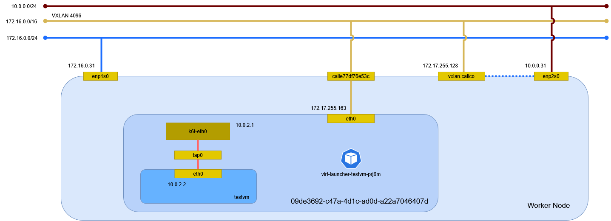

# 仮想マシン

仮想マシン基盤として KubeVirt を構築する。

## インストール

### 仮想化基盤

libvirt をインストールする。

```sh
dnf install -y qemu-kvm libvirt
```

仮想化環境を確認する。

```sh
virt-host-validate
```

```text
  QEMU: Checking for hardware virtualization                                 : 成功
  QEMU: Checking if device '/dev/kvm' exists                                 : 成功
  QEMU: Checking if device '/dev/kvm' is accessible                          : 成功
  QEMU: Checking if device '/dev/vhost-net' exists                           : 成功
  QEMU: Checking if device '/dev/net/tun' exists                             : 成功
  QEMU: Checking for cgroup 'cpu' controller support                         : 成功
  QEMU: Checking for cgroup 'cpuacct' controller support                     : 成功
  QEMU: Checking for cgroup 'cpuset' controller support                      : 成功
  QEMU: Checking for cgroup 'memory' controller support                      : 成功
  QEMU: Checking for cgroup 'devices' controller support                     : 成功
  QEMU: Checking for cgroup 'blkio' controller support                       : 成功
  QEMU: Checking for device assignment IOMMU support                         : WARN (No ACPI IVRS table found, IOMMU either disabled in BIOS or not supported by this hardware platform)
  QEMU: Checking for secure guest support                                    : WARN (Unknown if this platform has Secure Guest support)
```

### KubeVirt

オペレータを構築する。

```sh
VERSION=$(curl -s https://storage.googleapis.com/kubevirt-prow/release/kubevirt/kubevirt/stable.txt)
kubectl create -f "https://github.com/kubevirt/kubevirt/releases/download/${VERSION}/kubevirt-operator.yaml"
```

```text
namespace/kubevirt created
customresourcedefinition.apiextensions.k8s.io/kubevirts.kubevirt.io created
priorityclass.scheduling.k8s.io/kubevirt-cluster-critical created
clusterrole.rbac.authorization.k8s.io/kubevirt.io:operator created
serviceaccount/kubevirt-operator created
role.rbac.authorization.k8s.io/kubevirt-operator created
rolebinding.rbac.authorization.k8s.io/kubevirt-operator-rolebinding created
clusterrole.rbac.authorization.k8s.io/kubevirt-operator created
clusterrolebinding.rbac.authorization.k8s.io/kubevirt-operator created
deployment.apps/virt-operator created
```

すべてのポッドが起動するまで待つ。

```sh
watch kubectl -n kubevirt get pod -o wide
```

```text
NAME                            READY   STATUS    RESTARTS   AGE    IP               NODE                  NOMINATED NODE   READINESS GATES
virt-operator-d567bd999-7jgzq   1/1     Running   0          107s   172.17.51.190    worker02.home.local   <none>           <none>
virt-operator-d567bd999-c4hn5   1/1     Running   0          107s   172.17.255.161   worker01.home.local   <none>           <none>
```

KubeVirt のカスタムリソース定義を構築する。

```sh
kubectl create -f "https://github.com/kubevirt/kubevirt/releases/download/${VERSION}/kubevirt-cr.yaml"
```

```text
kubevirt.kubevirt.io/kubevirt created
```

デプロイが完了するまで待つ。

```sh
watch kubectl -n kubevirt get kubevirt
```

```text
NAME       AGE     PHASE
kubevirt   3m26s   Deployed
```

Kubernetes のリソースを確認する。

```sh
kubectl -n kubevirt get all -o wide
```

```text
Warning: kubevirt.io/v1 VirtualMachineInstancePresets is now deprecated and will be removed in v2.
NAME                                   READY   STATUS    RESTARTS   AGE     IP               NODE                    NOMINATED NODE   READINESS GATES
pod/virt-api-79cdcb6d65-4kjjc          1/1     Running   0          3m4s    172.17.2.12      controller.home.local   <none>           <none>
pod/virt-api-79cdcb6d65-ngwd2          1/1     Running   0          3m4s    172.17.2.34      controller.home.local   <none>           <none>
pod/virt-controller-69fc79b849-dfbfg   1/1     Running   0          2m34s   172.17.2.54      controller.home.local   <none>           <none>
pod/virt-controller-69fc79b849-j59vm   1/1     Running   0          2m34s   172.17.2.2       controller.home.local   <none>           <none>
pod/virt-handler-88k4q                 1/1     Running   0          2m34s   172.17.255.152   worker01.home.local     <none>           <none>
pod/virt-handler-nv8jl                 1/1     Running   0          2m34s   172.17.2.42      controller.home.local   <none>           <none>
pod/virt-handler-vzk8f                 1/1     Running   0          2m34s   172.17.51.191    worker02.home.local     <none>           <none>
pod/virt-operator-d567bd999-7jgzq      1/1     Running   0          9m16s   172.17.51.190    worker02.home.local     <none>           <none>
pod/virt-operator-d567bd999-c4hn5      1/1     Running   0          9m16s   172.17.255.161   worker01.home.local     <none>           <none>

NAME                                  TYPE        CLUSTER-IP       EXTERNAL-IP   PORT(S)   AGE    SELECTOR
service/kubevirt-operator-webhook     ClusterIP   10.106.243.98    <none>        443/TCP   3m8s   kubevirt.io=virt-operator
service/kubevirt-prometheus-metrics   ClusterIP   None             <none>        443/TCP   3m8s   prometheus.kubevirt.io=true
service/virt-api                      ClusterIP   10.99.163.170    <none>        443/TCP   3m8s   kubevirt.io=virt-api
service/virt-exportproxy              ClusterIP   10.100.104.183   <none>        443/TCP   3m8s   kubevirt.io=virt-exportproxy

NAME                          DESIRED   CURRENT   READY   UP-TO-DATE   AVAILABLE   NODE SELECTOR            AGE     CONTAINERS     IMAGES                                 SELECTOR
daemonset.apps/virt-handler   3         3         3       3            3           kubernetes.io/os=linux   2m34s   virt-handler   quay.io/kubevirt/virt-handler:v1.6.2   kubevirt.io=virt-handler

NAME                              READY   UP-TO-DATE   AVAILABLE   AGE     CONTAINERS        IMAGES                                    SELECTOR
deployment.apps/virt-api          2/2     2            2           3m4s    virt-api          quay.io/kubevirt/virt-api:v1.6.2          kubevirt.io=virt-api
deployment.apps/virt-controller   2/2     2            2           2m34s   virt-controller   quay.io/kubevirt/virt-controller:v1.6.2   kubevirt.io=virt-controller
deployment.apps/virt-operator     2/2     2            2           9m16s   virt-operator     quay.io/kubevirt/virt-operator:v1.6.2     kubevirt.io=virt-operator

NAME                                         DESIRED   CURRENT   READY   AGE     CONTAINERS        IMAGES                                    SELECTOR
replicaset.apps/virt-api-79cdcb6d65          2         2         2       3m4s    virt-api          quay.io/kubevirt/virt-api:v1.6.2          kubevirt.io=virt-api,pod-template-hash=79cdcb6d65
replicaset.apps/virt-controller-69fc79b849   2         2         2       2m34s   virt-controller   quay.io/kubevirt/virt-controller:v1.6.2   kubevirt.io=virt-controller,pod-template-hash=69fc79b849
replicaset.apps/virt-operator-d567bd999      2         2         2       9m16s   virt-operator     quay.io/kubevirt/virt-operator:v1.6.2     kubevirt.io=virt-operator,pod-template-hash=d567bd999

NAME                            AGE     PHASE
kubevirt.kubevirt.io/kubevirt   3m34s   Deployed
```

Nested VM のため設定を更新する。

```sh
kubectl -n kubevirt patch kubevirt kubevirt --type=merge --patch '{"spec":{"configuration":{"developerConfiguration":{"useEmulation":true}}}}'
```

```text
kubevirt.kubevirt.io/kubevirt patched
```

### クライアント

virtctl をインストールする。

```sh
VERSION=$(kubectl get kubevirt.kubevirt.io/kubevirt -n kubevirt -o=jsonpath="{.status.observedKubeVirtVersion}")

mkdir -p $HOME/.local/bin
curl -fSL https://github.com/kubevirt/kubevirt/releases/download/${VERSION}/virtctl-${VERSION}-linux-amd64 \
    --output-dir $HOME/.local/bin \
    -o virtctl
chmod +x $HOME/.local/bin/virtctl
cp $HOME/.local/bin/virtctl $HOME/.local/bin/kubectl-virt
```

## 動作確認

仮想マシンをデプロイする。

```sh
kubectl apply -f https://kubevirt.io/labs/manifests/vm.yaml
```

```text
virtualmachine.kubevirt.io/testvm created
```

仮想マシンを確認する。

```sh
kubectl get vm
```

```text
NAME     AGE     STATUS    READY
testvm   3m51s   Stopped   False
```

仮想マシンを起動する。

```sh
kubectl virt start testvm
```

```text
VM testvm was scheduled to start
```

仮想マシンを確認する。

```sh
kubectl get vm
```

```text
NAME     AGE     STATUS    READY
testvm   5m48s   Running   True
```

仮想マシンのインスタンスを確認する。

```sh
kubectl get vmi -o wide
```

```text
NAME     AGE   PHASE     IP               NODENAME              READY   LIVE-MIGRATABLE   PAUSED
testvm   65s   Running   172.17.255.163   worker01.home.local   True    True
```

仮想マシンのコンソールに接続する。

```sh
kubectl virt console testvm
```

```text
Successfully connected to testvm console. Press Ctrl+] or Ctrl+5 to exit console.

login as 'cirros' user. default password: 'gocubsgo'. use 'sudo' for root.
testvm login:
```

## 環境確認

デプロイされた仮想マシンを確認する。



### Kubernetes リソース

クラスタにあるリソースを確認する。

```sh
kubectl get all -o wide
```

```text
Warning: kubevirt.io/v1 VirtualMachineInstancePresets is now deprecated and will be removed in v2.
NAME                             READY   STATUS    RESTARTS   AGE    IP               NODE                  NOMINATED NODE   READINESS GATES
pod/virt-launcher-testvm-prj6m   3/3     Running   0          9m7s   172.17.255.163   worker01.home.local   <none>           1/1

NAME                 TYPE        CLUSTER-IP   EXTERNAL-IP   PORT(S)   AGE   SELECTOR
service/kubernetes   ClusterIP   10.96.0.1    <none>        443/TCP   13d   <none>

NAME                                        AGE    PHASE     IP               NODENAME              READY   LIVE-MIGRATABLE   PAUSED
virtualmachineinstance.kubevirt.io/testvm   9m7s   Running   172.17.255.163   worker01.home.local   True    True

NAME                                AGE   STATUS    READY
virtualmachine.kubevirt.io/testvm   14m   Running   True
```

### ネットワーク名前空間

ネットワーク名前空間を確認する。

```sh
ip netns
```

```text
 :
 :
09de3692-c47a-4d1c-ad0d-a22a7046407d (id: 11)
```

### デバイス

デバイスを確認する。

```sh
ip -d link show
```

```text
 :
 :
18: calie77df76e53c@if2: <BROADCAST,MULTICAST,UP,LOWER_UP> mtu 1450 qdisc noqueue state UP mode DEFAULT group default qlen 1000
    link/ether ee:ee:ee:ee:ee:ee brd ff:ff:ff:ff:ff:ff link-netns 09de3692-c47a-4d1c-ad0d-a22a7046407d promiscuity 0 allmulti 0 minmtu 68 maxmtu 65535
    veth addrgenmode eui64 numtxqueues 1 numrxqueues 1 gso_max_size 65536 gso_max_segs 65535 tso_max_size 524280 tso_max_segs 65535 gro_max_size 65536 gso_ipv4_max_size 65536 gro_ipv4_max_size 65536
```

ネットワーク名前空間内のデバイスを確認する。

```sh
ip netns exec 09de3692-c47a-4d1c-ad0d-a22a7046407d ip -d link show
```

```text
1: lo: <LOOPBACK,UP,LOWER_UP> mtu 65536 qdisc noqueue state UNKNOWN mode DEFAULT group default qlen 1000
    link/loopback 00:00:00:00:00:00 brd 00:00:00:00:00:00 promiscuity 0 allmulti 0 minmtu 0 maxmtu 0 addrgenmode eui64 numtxqueues 1 numrxqueues 1 gso_max_size 65536 gso_max_segs 65535 tso_max_size 524280 tso_max_segs 65535 gro_max_size 65536 gso_ipv4_max_size 65536 gro_ipv4_max_size 65536
2: eth0@if18: <BROADCAST,MULTICAST,UP,LOWER_UP> mtu 1450 qdisc noqueue state UP mode DEFAULT group default qlen 1000
    link/ether 72:c4:23:b8:30:d7 brd ff:ff:ff:ff:ff:ff link-netns d5dccfe8-d087-4f34-aa5b-486a1beeacdc promiscuity 0 allmulti 0 minmtu 68 maxmtu 65535
    veth addrgenmode eui64 numtxqueues 1 numrxqueues 1 gso_max_size 65536 gso_max_segs 65535 tso_max_size 524280 tso_max_segs 65535 gro_max_size 65536 gso_ipv4_max_size 65536 gro_ipv4_max_size 65536
3: k6t-eth0: <BROADCAST,MULTICAST,UP,LOWER_UP> mtu 1450 qdisc noqueue state UP mode DEFAULT group default qlen 1000
    link/ether 02:00:00:00:00:00 brd ff:ff:ff:ff:ff:ff promiscuity 0 allmulti 0 minmtu 68 maxmtu 65535
    bridge forward_delay 1500 hello_time 200 max_age 2000 ageing_time 30000 stp_state 0 priority 32768 vlan_filtering 0 vlan_protocol 802.1Q bridge_id 8000.2:0:0:0:0:0 designated_root 8000.2:0:0:0:0:0 root_port 0 root_path_cost 0 topology_change 0 topology_change_detected 0 hello_timer    0.00 tcn_timer    0.00 topology_change_timer    0.00 gc_timer  173.25 fdb_n_learned 0 fdb_max_learned 0 vlan_default_pvid 1 vlan_stats_enabled 0 vlan_stats_per_port 0 group_fwd_mask 0 group_address 01:80:c2:00:00:00 mcast_snooping 1 no_linklocal_learn 0 mcast_vlan_snooping 0 mst_enabled 0 mcast_router 1 mcast_query_use_ifaddr 0 mcast_querier 0 mcast_hash_elasticity 16 mcast_hash_max 4096 mcast_last_member_count 2 mcast_startup_query_count 2 mcast_last_member_interval 100 mcast_membership_interval 26000 mcast_querier_interval 25500 mcast_query_interval 12500 mcast_query_response_interval 1000 mcast_startup_query_interval 3125 mcast_stats_enabled 0 mcast_igmp_version 2 mcast_mld_version 1 nf_call_iptables 0 nf_call_ip6tables 0 nf_call_arptables 0 addrgenmode eui64 numtxqueues 1 numrxqueues 1 gso_max_size 65536 gso_max_segs 65535 tso_max_size 65536 tso_max_segs 65535 gro_max_size 65536 gso_ipv4_max_size 65536 gro_ipv4_max_size 65536
4: tap0: <BROADCAST,MULTICAST,UP,LOWER_UP> mtu 1450 qdisc fq_codel master k6t-eth0 state UP mode DEFAULT group default qlen 1000
    link/ether 8e:f5:32:de:41:b8 brd ff:ff:ff:ff:ff:ff promiscuity 1 allmulti 1 minmtu 68 maxmtu 65521
    tun type tap pi off vnet_hdr on persist on user qemu group qemu
    bridge_slave state forwarding priority 32 cost 2 hairpin off guard off root_block off fastleave off learning on flood on port_id 0x8001 port_no 0x1 designated_port 32769 designated_cost 0 designated_bridge 8000.2:0:0:0:0:0 designated_root 8000.2:0:0:0:0:0 hold_timer    0.00 message_age_timer    0.00 forward_delay_timer    0.00 topology_change_ack 0 config_pending 0 proxy_arp off proxy_arp_wifi off mcast_router 1 mcast_fast_leave off mcast_flood on bcast_flood on mcast_to_unicast off neigh_suppress off neigh_vlan_suppress off group_fwd_mask 0 group_fwd_mask_str 0x0 vlan_tunnel off isolated off locked off mab off addrgenmode eui64 numtxqueues 1 numrxqueues 1 gso_max_size 65536 gso_max_segs 65535 tso_max_size 65536 tso_max_segs 65535 gro_max_size 65536 gso_ipv4_max_size 65536 gro_ipv4_max_size 65536
```

仮想マシン内のデバイスを確認する。

```sh
ip link show
```

```text
1: lo: <LOOPBACK,UP,LOWER_UP> mtu 65536 qdisc noqueue qlen 1
    link/loopback 00:00:00:00:00:00 brd 00:00:00:00:00:00
2: eth0: <BROADCAST,MULTICAST,UP,LOWER_UP> mtu 1450 qdisc pfifo_fast qlen 1000
    link/ether 72:c4:23:b8:30:d7 brd ff:ff:ff:ff:ff:ff
```

ネットワーク名前空間内のブリッジを確認する。

```sh
ip netns exec 09de3692-c47a-4d1c-ad0d-a22a7046407d bridge link show
```

```text
4: tap0: <BROADCAST,MULTICAST,UP,LOWER_UP> mtu 1450 master k6t-eth0 state forwarding priority 32 cost 2
```

ネットワーク名前空間内の VLAN を確認する。

```sh
ip netns exec 09de3692-c47a-4d1c-ad0d-a22a7046407d bridge vlan show
```

```text
port              vlan-id
k6t-eth0          1 PVID Egress Untagged
tap0              1 PVID Egress Untagged
```

### イーサネット

イーサネットの情報を確認する。

```sh
ip addr show
```

```text
18: calie77df76e53c@if2: <BROADCAST,MULTICAST,UP,LOWER_UP> mtu 1450 qdisc noqueue state UP group default qlen 1000
    link/ether ee:ee:ee:ee:ee:ee brd ff:ff:ff:ff:ff:ff link-netns 09de3692-c47a-4d1c-ad0d-a22a7046407d
    inet6 fe80::ecee:eeff:feee:eeee/64 scope link proto kernel_ll
       valid_lft forever preferred_lft forever
```

ネットワーク名前空間内のイーサネットの情報を確認する。

```sh
ip netns exec 09de3692-c47a-4d1c-ad0d-a22a7046407d ip addr show
```

```text
1: lo: <LOOPBACK,UP,LOWER_UP> mtu 65536 qdisc noqueue state UNKNOWN group default qlen 1000
    link/loopback 00:00:00:00:00:00 brd 00:00:00:00:00:00
    inet 127.0.0.1/8 scope host lo
       valid_lft forever preferred_lft forever
    inet6 ::1/128 scope host proto kernel_lo
       valid_lft forever preferred_lft forever
2: eth0@if18: <BROADCAST,MULTICAST,UP,LOWER_UP> mtu 1450 qdisc noqueue state UP group default qlen 1000
    link/ether 72:c4:23:b8:30:d7 brd ff:ff:ff:ff:ff:ff link-netns d5dccfe8-d087-4f34-aa5b-486a1beeacdc
    inet 172.17.255.163/32 scope global eth0
       valid_lft forever preferred_lft forever
    inet6 fe80::70c4:23ff:feb8:30d7/64 scope link proto kernel_ll
       valid_lft forever preferred_lft forever
3: k6t-eth0: <BROADCAST,MULTICAST,UP,LOWER_UP> mtu 1450 qdisc noqueue state UP group default qlen 1000
    link/ether 02:00:00:00:00:00 brd ff:ff:ff:ff:ff:ff
    inet 10.0.2.1/24 brd 10.0.2.255 scope global k6t-eth0
       valid_lft forever preferred_lft forever
    inet6 fe80::ff:fe00:0/64 scope link proto kernel_ll
       valid_lft forever preferred_lft forever
4: tap0: <BROADCAST,MULTICAST,UP,LOWER_UP> mtu 1450 qdisc fq_codel master k6t-eth0 state UP group default qlen 1000
    link/ether 8e:f5:32:de:41:b8 brd ff:ff:ff:ff:ff:ff
    inet6 fe80::8cf5:32ff:fede:41b8/64 scope link proto kernel_ll
       valid_lft forever preferred_lft forever
```

仮想マシン内のイーサネットの情報を確認する。

```sh
ip addr show
```

```text
1: lo: <LOOPBACK,UP,LOWER_UP> mtu 65536 qdisc noqueue qlen 1
    link/loopback 00:00:00:00:00:00 brd 00:00:00:00:00:00
    inet 127.0.0.1/8 scope host lo
       valid_lft forever preferred_lft forever
    inet6 ::1/128 scope host
       valid_lft forever preferred_lft forever
2: eth0: <BROADCAST,MULTICAST,UP,LOWER_UP> mtu 1450 qdisc pfifo_fast qlen 1000
    link/ether 72:c4:23:b8:30:d7 brd ff:ff:ff:ff:ff:ff
    inet 10.0.2.2/24 brd 10.0.2.255 scope global eth0
       valid_lft forever preferred_lft forever
    inet6 fe80::70c4:23ff:feb8:30d7/64 scope link
       valid_lft forever preferred_lft forever
```

### ルート

ネットワーク名前空間内のルーティングを確認する。

```sh
ip netns exec 09de3692-c47a-4d1c-ad0d-a22a7046407d ip route show
```

```text
default via 169.254.1.1 dev eth0
10.0.2.0/24 dev k6t-eth0 proto kernel scope link src 10.0.2.1
169.254.1.1 dev eth0 scope link
```

仮想マシン内のルーティングを確認する。

```sh
ip route show
```

```text
default via 10.0.2.1 dev eth0
10.0.2.0/24 dev eth0  src 10.0.2.2
```

### nftables

ネットワーク名前空間内のルールセットを確認する。

```sh
ip netns exec 09de3692-c47a-4d1c-ad0d-a22a7046407d nft list ruleset ip
```

```text
table ip nat {
        chain prerouting {
                type nat hook prerouting priority dstnat; policy accept;
                iifname "eth0" counter packets 0 bytes 0 jump KUBEVIRT_PREINBOUND
        }

        chain input {
                type nat hook input priority srcnat; policy accept;
        }

        chain output {
                type nat hook output priority dstnat; policy accept;
                ip daddr 127.0.0.1 counter packets 0 bytes 0 dnat to 10.0.2.2
        }

        chain postrouting {
                type nat hook postrouting priority srcnat; policy accept;
                ip saddr 10.0.2.2 counter packets 3 bytes 202 masquerade
                oifname "k6t-eth0" counter packets 2 bytes 456 jump KUBEVIRT_POSTINBOUND
        }

        chain KUBEVIRT_PREINBOUND {
                counter packets 0 bytes 0 dnat to 10.0.2.2
        }

        chain KUBEVIRT_POSTINBOUND {
                ip saddr 127.0.0.1 counter packets 0 bytes 0 snat to 10.0.2.1
        }
}
```
