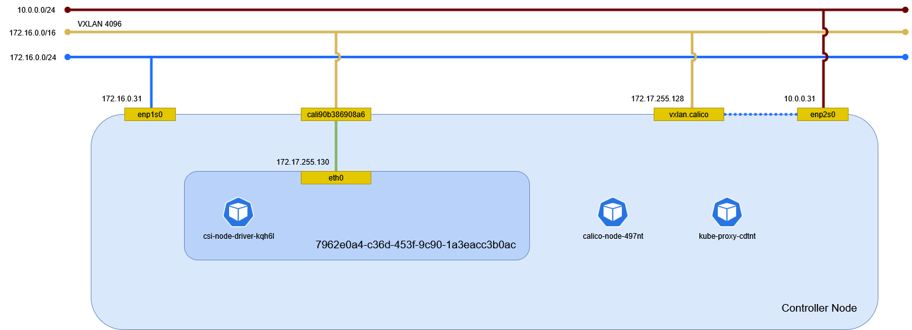

# クラスタ

## クラスタに参加

クラスタにワーカとして参加する。

```sh
kubeadm join controller.home.local:6443 \
    --token g47ok9.5byuxmpdmzfi714s \
    --discovery-token-ca-cert-hash sha256:84aff1be3e53133b56e6bbb9f7583ff3c32dde97a4fd89bfb3beff9e5babf071
```

```text
[preflight] Running pre-flight checks
        [WARNING Service-Kubelet]: kubelet service is not enabled, please run 'systemctl enable kubelet.service'
[preflight] Reading configuration from the "kubeadm-config" ConfigMap in namespace "kube-system"...
[preflight] Use 'kubeadm init phase upload-config --config your-config-file' to re-upload it.
[kubelet-start] Writing kubelet configuration to file "/var/lib/kubelet/config.yaml"
[kubelet-start] Writing kubelet environment file with flags to file "/var/lib/kubelet/kubeadm-flags.env"
[kubelet-start] Starting the kubelet
[kubelet-check] Waiting for a healthy kubelet at http://127.0.0.1:10248/healthz. This can take up to 4m0s
[kubelet-check] The kubelet is healthy after 500.973756ms
[kubelet-start] Waiting for the kubelet to perform the TLS Bootstrap

This node has joined the cluster:
* Certificate signing request was sent to apiserver and a response was received.
* The Kubelet was informed of the new secure connection details.

Run 'kubectl get nodes' on the control-plane to see this node join the cluster.
```

マシン起動時の自動起動を設定する。

```sh
systemctl enable kubelet
```

## ネットワークアドオン

[ネットワークアドオン](../controller/network_addon.md) のファイアウォールと NetworkManager を設定する。

## ロードバランサ

[ロードバランサ](../controller/loadbalancer.md) のファイアウォールを設定する。

## 仮想マシン

[仮想マシン](../controller/vm.md) の仮想化をインストールする。

## 環境確認

Worker Node を再起動後に Worker Node でネットワーク構成を確認する。



### ネットワーク名前空間

ネットワーク名前空間を確認する。

```sh
ip netns
```

```text
0958d61b-d770-4af2-9fbf-57d9b74089a7
6738ad1c-5915-4081-bb6b-a30b4d83052c
21be88c6-5ec6-4bf1-b446-eba4ce69f280
4017f422-c886-4ca7-9301-5f5e27076026
7962e0a4-c36d-453f-9c90-1a3eacc3b0ac (id: 0)
```

### デバイス

デバイスを確認する。

```sh
ip -d link show
```

```text
1: lo: <LOOPBACK,UP,LOWER_UP> mtu 65536 qdisc noqueue state UNKNOWN mode DEFAULT group default qlen 1000
    link/loopback 00:00:00:00:00:00 brd 00:00:00:00:00:00 promiscuity 0 allmulti 0 minmtu 0 maxmtu 0 addrgenmode eui64 numtxqueues 1 numrxqueues 1 gso_max_size 65536 gso_max_segs 65535 tso_max_size 524280 tso_max_segs 65535 gro_max_size 65536 gso_ipv4_max_size 65536 gro_ipv4_max_size 65536
2: enp1s0: <BROADCAST,MULTICAST,UP,LOWER_UP> mtu 1500 qdisc fq_codel state UP mode DEFAULT group default qlen 1000
    link/ether 52:54:00:2b:8a:0d brd ff:ff:ff:ff:ff:ff promiscuity 0 allmulti 0 minmtu 68 maxmtu 65535 addrgenmode none numtxqueues 1 numrxqueues 1 gso_max_size 65536 gso_max_segs 65535 tso_max_size 65536 tso_max_segs 65535 gro_max_size 65536 gso_ipv4_max_size 65536 gro_ipv4_max_size 65536 parentbus virtio parentdev virtio1
    altname enx5254002b8a0d
3: enp2s0: <BROADCAST,MULTICAST,UP,LOWER_UP> mtu 1500 qdisc fq_codel state UP mode DEFAULT group default qlen 1000
    link/ether 52:54:00:11:d1:97 brd ff:ff:ff:ff:ff:ff promiscuity 0 allmulti 0 minmtu 68 maxmtu 65535 addrgenmode none numtxqueues 1 numrxqueues 1 gso_max_size 65536 gso_max_segs 65535 tso_max_size 65536 tso_max_segs 65535 gro_max_size 65536 gso_ipv4_max_size 65536 gro_ipv4_max_size 65536 parentbus virtio parentdev virtio2
    altname enx52540011d197
4: vxlan.calico: <BROADCAST,MULTICAST,UP,LOWER_UP> mtu 1450 qdisc noqueue state UNKNOWN mode DEFAULT group default qlen 1000
    link/ether 66:ba:9d:ce:21:bb brd ff:ff:ff:ff:ff:ff promiscuity 0 allmulti 0 minmtu 68 maxmtu 65535
    vxlan id 4096 local 10.0.0.31 dev enp2s0 srcport 0 0 dstport 4789 ttl auto ageing 300 nolearning addrgenmode eui64 numtxqueues 1 numrxqueues 1 gso_max_size 65536 gso_max_segs 65535 tso_max_size 65536 tso_max_segs 65535 gro_max_size 65536 gso_ipv4_max_size 65536 gro_ipv4_max_size 65536
7: cali90b386908a6@if2: <BROADCAST,MULTICAST,UP,LOWER_UP> mtu 1450 qdisc noqueue state UP mode DEFAULT group default qlen 1000
    link/ether ee:ee:ee:ee:ee:ee brd ff:ff:ff:ff:ff:ff link-netns 7962e0a4-c36d-453f-9c90-1a3eacc3b0ac promiscuity 0 allmulti 0 minmtu 68 maxmtu 65535
    veth addrgenmode eui64 numtxqueues 1 numrxqueues 1 gso_max_size 65536 gso_max_segs 65535 tso_max_size 524280 tso_max_segs 65535 gro_max_size 65536 gso_ipv4_max_size 65536 gro_ipv4_max_size 65536
```

ネットワーク名前空間内のデバイスを確認する。

```sh
ip netns exec 7962e0a4-c36d-453f-9c90-1a3eacc3b0ac ip -d link show
```

```text
1: lo: <LOOPBACK,UP,LOWER_UP> mtu 65536 qdisc noqueue state UNKNOWN mode DEFAULT group default qlen 1000
    link/loopback 00:00:00:00:00:00 brd 00:00:00:00:00:00 promiscuity 0 allmulti 0 minmtu 0 maxmtu 0 addrgenmode eui64 numtxqueues 1 numrxqueues 1 gso_max_size 65536 gso_max_segs 65535 tso_max_size 524280 tso_max_segs 65535 gro_max_size 65536 gso_ipv4_max_size 65536 gro_ipv4_max_size 65536
2: eth0@if7: <BROADCAST,MULTICAST,UP,LOWER_UP> mtu 1450 qdisc noqueue state UP mode DEFAULT group default qlen 1000
    link/ether fa:c1:de:7f:7c:42 brd ff:ff:ff:ff:ff:ff link-netns 0958d61b-d770-4af2-9fbf-57d9b74089a7 promiscuity 0 allmulti 0 minmtu 68 maxmtu 65535
    veth addrgenmode eui64 numtxqueues 1 numrxqueues 1 gso_max_size 65536 gso_max_segs 65535 tso_max_size 524280 tso_max_segs 65535 gro_max_size 65536 gso_ipv4_max_size 65536 gro_ipv4_max_size 65536
```

### イーサネット

イーサネットの情報を確認する。

```sh
ip addr show
```

```text
1: lo: <LOOPBACK,UP,LOWER_UP> mtu 65536 qdisc noqueue state UNKNOWN group default qlen 1000
    link/loopback 00:00:00:00:00:00 brd 00:00:00:00:00:00
    inet 127.0.0.1/8 scope host lo
       valid_lft forever preferred_lft forever
    inet6 ::1/128 scope host noprefixroute
       valid_lft forever preferred_lft forever
2: enp1s0: <BROADCAST,MULTICAST,UP,LOWER_UP> mtu 1500 qdisc fq_codel state UP group default qlen 1000
    link/ether 52:54:00:2b:8a:0d brd ff:ff:ff:ff:ff:ff
    altname enx5254002b8a0d
    inet 172.16.0.31/24 brd 172.16.0.255 scope global noprefixroute enp1s0
       valid_lft forever preferred_lft forever
3: enp2s0: <BROADCAST,MULTICAST,UP,LOWER_UP> mtu 1500 qdisc fq_codel state UP group default qlen 1000
    link/ether 52:54:00:11:d1:97 brd ff:ff:ff:ff:ff:ff
    altname enx52540011d197
    inet 10.0.0.31/24 brd 10.0.0.255 scope global noprefixroute enp2s0
       valid_lft forever preferred_lft forever
4: vxlan.calico: <BROADCAST,MULTICAST,UP,LOWER_UP> mtu 1450 qdisc noqueue state UNKNOWN group default qlen 1000
    link/ether 66:ba:9d:ce:21:bb brd ff:ff:ff:ff:ff:ff
    inet 172.17.255.128/32 scope global vxlan.calico
       valid_lft forever preferred_lft forever
    inet6 fe80::64ba:9dff:fece:21bb/64 scope link proto kernel_ll
       valid_lft forever preferred_lft forever
7: cali90b386908a6@if2: <BROADCAST,MULTICAST,UP,LOWER_UP> mtu 1450 qdisc noqueue state UP group default qlen 1000
    link/ether ee:ee:ee:ee:ee:ee brd ff:ff:ff:ff:ff:ff link-netns 7962e0a4-c36d-453f-9c90-1a3eacc3b0ac
    inet6 fe80::ecee:eeff:feee:eeee/64 scope link proto kernel_ll
       valid_lft forever preferred_lft forever
```

ネットワーク名前空間内のイーサネットの情報を確認する。

```sh
ip netns exec 7962e0a4-c36d-453f-9c90-1a3eacc3b0ac ip addr show
```

```text
1: lo: <LOOPBACK,UP,LOWER_UP> mtu 65536 qdisc noqueue state UNKNOWN group default qlen 1000
    link/loopback 00:00:00:00:00:00 brd 00:00:00:00:00:00
    inet 127.0.0.1/8 scope host lo
       valid_lft forever preferred_lft forever
    inet6 ::1/128 scope host proto kernel_lo
       valid_lft forever preferred_lft forever
2: eth0@if7: <BROADCAST,MULTICAST,UP,LOWER_UP> mtu 1450 qdisc noqueue state UP group default qlen 1000
    link/ether fa:c1:de:7f:7c:42 brd ff:ff:ff:ff:ff:ff link-netns 0958d61b-d770-4af2-9fbf-57d9b74089a7
    inet 172.17.255.130/32 scope global eth0
       valid_lft forever preferred_lft forever
    inet6 fe80::f8c1:deff:fe7f:7c42/64 scope link proto kernel_ll
       valid_lft forever preferred_lft forever
```

### ルート

ルーティングを確認する。

```sh
ip route show
```

```text
default via 172.16.0.254 dev enp1s0 proto static metric 100
10.0.0.0/24 dev enp2s0 proto kernel scope link src 10.0.0.31 metric 101
172.16.0.0/24 dev enp1s0 proto kernel scope link src 172.16.0.31 metric 100
172.17.2.0 via 10.0.0.11 dev enp2s0 proto 80 onlink
172.17.2.0/26 via 10.0.0.11 dev enp2s0 proto 80 onlink
blackhole 172.17.255.128/26 proto 80
172.17.255.130 dev cali90b386908a6 scope link
```

ネットワーク名前空間内のルーティングを確認する。

```sh
ip netns exec 7962e0a4-c36d-453f-9c90-1a3eacc3b0ac ip route show
```

```text
default via 169.254.1.1 dev eth0
169.254.1.1 dev eth0 scope link
```

#### ARP テーブル

ARP テーブルを確認する。

```sh
ip neigh
```

```text
172.16.0.11 dev enp1s0 lladdr 52:54:00:49:41:b8 REACHABLE
172.16.0.254 dev enp1s0 lladdr 52:54:00:65:c6:68 DELAY
172.17.2.0 dev vxlan.calico lladdr 66:b9:7e:86:1e:53 PERMANENT
10.0.0.11 dev enp2s0 lladdr 52:54:00:91:a0:96 REACHABLE
172.16.0.199 dev enp1s0 lladdr fe:54:00:2b:8a:0d DELAY
```

ネットワーク名前空間内の ARP テーブルを確認する。

```sh
ip netns exec 7962e0a4-c36d-453f-9c90-1a3eacc3b0ac ip neigh
```

```text
(出力なし)
```

### nftables

ルールセットを確認する。

```sh
nft list ruleset ip
```

```text
# Warning: table ip mangle is managed by iptables-nft, do not touch!
table ip mangle {
        chain KUBE-IPTABLES-HINT {
        }

        chain KUBE-KUBELET-CANARY {
        }

        chain KUBE-PROXY-CANARY {
        }

        chain cali-to-host-endpoint {
        }

        chain cali-PREROUTING {
                 ct state related,established counter packets 3608 bytes 1373879 accept
                 meta mark & 0x00010000 == 0x00010000 counter packets 0 bytes 0 accept
                 counter packets 94 bytes 5640 jump cali-from-host-endpoint
                  meta mark & 0x00010000 == 0x00010000 counter packets 0 bytes 0 accept
        }

        chain cali-from-host-endpoint {
        }

        chain cali-POSTROUTING {
                 meta mark & 0x00010000 == 0x00010000 counter packets 0 bytes 0 return
                 counter packets 3723 bytes 1474104 meta mark set mark and 0xffe4ffff
                 ct status dnat counter packets 517 bytes 61205 jump cali-to-host-endpoint
                  meta mark & 0x00010000 == 0x00010000 counter packets 0 bytes 0 return
        }

        chain PREROUTING {
                type filter hook prerouting priority mangle; policy accept;
                 counter packets 3702 bytes 1379519 jump cali-PREROUTING
        }

        chain POSTROUTING {
                type filter hook postrouting priority mangle; policy accept;
                 counter packets 3723 bytes 1474104 jump cali-POSTROUTING
        }
}
# Warning: table ip filter is managed by iptables-nft, do not touch!
table ip filter {
        chain KUBE-FIREWALL {
                ip saddr != 127.0.0.0/8 ip daddr 127.0.0.0/8  ct status dnat counter packets 0 bytes 0 drop
        }

        chain OUTPUT {
                type filter hook output priority filter; policy accept;
                 counter packets 3722 bytes 1474044 jump cali-OUTPUT
                ct state new  counter packets 426 bytes 32152 jump KUBE-PROXY-FIREWALL
                ct state new  counter packets 426 bytes 32152 jump KUBE-SERVICES
                counter packets 4500 bytes 1652706 jump KUBE-FIREWALL
        }

        chain INPUT {
                type filter hook input priority filter; policy accept;
                 counter packets 3702 bytes 1379519 jump cali-INPUT
                ct state new  counter packets 96 bytes 5760 jump KUBE-PROXY-FIREWALL
                 counter packets 4053 bytes 1814041 jump KUBE-NODEPORTS
                ct state new  counter packets 96 bytes 5760 jump KUBE-EXTERNAL-SERVICES
                counter packets 4409 bytes 2317428 jump KUBE-FIREWALL
        }

        chain KUBE-KUBELET-CANARY {
        }

        chain KUBE-PROXY-CANARY {
        }

        chain KUBE-EXTERNAL-SERVICES {
                meta l4proto tcp ip daddr 172.16.0.102  tcp dport 443 counter packets 0 bytes 0 drop
                meta l4proto tcp  fib daddr type local tcp dport 32727 counter packets 0 bytes 0 drop
                meta l4proto tcp ip daddr 172.16.0.102  tcp dport 80 counter packets 0 bytes 0 drop
                meta l4proto tcp  fib daddr type local tcp dport 32476 counter packets 0 bytes 0 drop
        }

        chain FORWARD {
                type filter hook forward priority filter; policy accept;
                 counter packets 0 bytes 0 jump cali-FORWARD
                ct state new  counter packets 0 bytes 0 jump KUBE-PROXY-FIREWALL
                 counter packets 0 bytes 0 jump KUBE-FORWARD
                ct state new  counter packets 0 bytes 0 jump KUBE-SERVICES
                ct state new  counter packets 0 bytes 0 jump KUBE-EXTERNAL-SERVICES
                  meta mark & 0x00010000 == 0x00010000 counter packets 0 bytes 0 accept
                 counter packets 0 bytes 0 meta mark set mark or 0x10000
        }

        chain KUBE-NODEPORTS {
                meta l4proto tcp  tcp dport 31115 counter packets 0 bytes 0 accept
                meta l4proto tcp  tcp dport 31115 counter packets 0 bytes 0 accept
        }

        chain KUBE-SERVICES {
        }

        chain KUBE-FORWARD {
                ct state invalid counter packets 0 bytes 0 drop
                 meta mark & 0x00004000 == 0x00004000 counter packets 0 bytes 0 accept
                 ct state related,established counter packets 0 bytes 0 accept
        }

        chain KUBE-PROXY-FIREWALL {
        }

        chain cali-FORWARD {
                 counter packets 0 bytes 0 meta mark set mark and 0xffe5ffff
                 meta mark & 0x00010000 == 0x00000000 counter packets 0 bytes 0 jump cali-from-hep-forward
                iifname "cali*"  counter packets 0 bytes 0 jump cali-from-wl-dispatch
                oifname "cali*"  counter packets 0 bytes 0 jump cali-to-wl-dispatch
                 counter packets 0 bytes 0 jump cali-to-hep-forward
                 counter packets 0 bytes 0 jump cali-cidr-block
        }

        chain cali-to-host-endpoint {
        }

        chain cali-pro-kns.calico-system {
                  counter packets 0 bytes 0 meta mark set mark or 0x10000
                 meta mark & 0x00010000 == 0x00010000 counter packets 0 bytes 0 log prefix "ARE0|kns.calico-system" group 2 snaplen 80
        }

        chain cali-to-hep-forward {
        }

        chain cali-cidr-block {
        }

        chain cali-fw-cali90b386908a6 {
                 ct state related,established counter packets 0 bytes 0 accept
                 ct state invalid counter packets 0 bytes 0 drop
                 counter packets 0 bytes 0 meta mark set mark and 0xfffcffff
                meta l4proto udp   udp dport 4789 counter packets 0 bytes 0 drop
                meta l4proto ipv4   counter packets 0 bytes 0 drop
                 counter packets 0 bytes 0 jump cali-pro-kns.calico-system
                  meta mark & 0x00010000 == 0x00010000 counter packets 0 bytes 0 return
                 counter packets 0 bytes 0 jump cali-pro-_ymJUz7yzI6NOKJhG2-
                  meta mark & 0x00010000 == 0x00010000 counter packets 0 bytes 0 return
                 counter packets 0 bytes 0 log prefix "DRE" group 2 snaplen 80
                  counter packets 0 bytes 0 drop
        }

        chain cali-pro-_ymJUz7yzI6NOKJhG2- {
                  counter packets 0 bytes 0
        }

        chain cali-pri-kns.calico-system {
                  counter packets 0 bytes 0 meta mark set mark or 0x10000
                 meta mark & 0x00010000 == 0x00010000 counter packets 0 bytes 0 log prefix "ARI0|kns.calico-system" group 1 snaplen 80
        }

        chain cali-from-hep-forward {
        }

        chain cali-to-wl-dispatch {
                oifname "cali90b386908a6"  counter packets 0 bytes 0 goto cali-tw-cali90b386908a6
                  counter packets 0 bytes 0 drop
        }

        chain cali-wl-to-host {
                 counter packets 0 bytes 0 jump cali-from-wl-dispatch
                  counter packets 0 bytes 0 accept
        }

        chain cali-OUTPUT {
                 meta mark & 0x00010000 == 0x00010000 counter packets 0 bytes 0 accept
                oifname "cali*"  counter packets 0 bytes 0 return
                meta l4proto udp   udp dport 4789 fib saddr type local xt match "set" counter packets 0 bytes 0 accept
                 counter packets 3722 bytes 1474044 meta mark set mark and 0xffe4ffff
                 ct status dnat counter packets 3205 bytes 1412839 jump cali-to-host-endpoint
                  meta mark & 0x00010000 == 0x00010000 counter packets 0 bytes 0 accept
        }

        chain cali-tw-cali90b386908a6 {
                 ct state related,established counter packets 0 bytes 0 accept
                 ct state invalid counter packets 0 bytes 0 drop
                 counter packets 0 bytes 0 meta mark set mark and 0xfffcffff
                 counter packets 0 bytes 0 jump cali-pri-kns.calico-system
                  meta mark & 0x00010000 == 0x00010000 counter packets 0 bytes 0 return
                 counter packets 0 bytes 0 jump cali-pri-_ymJUz7yzI6NOKJhG2-
                  meta mark & 0x00010000 == 0x00010000 counter packets 0 bytes 0 return
                 counter packets 0 bytes 0 log prefix "DRI" group 1 snaplen 80
                  counter packets 0 bytes 0 drop
        }

        chain cali-from-wl-dispatch {
                iifname "cali90b386908a6"  counter packets 0 bytes 0 goto cali-fw-cali90b386908a6
                  counter packets 0 bytes 0 drop
        }

        chain cali-INPUT {
                meta l4proto udp   udp dport 4789 xt match "set" fib daddr type local counter packets 0 bytes 0 accept
                meta l4proto udp   udp dport 4789 fib daddr type local counter packets 0 bytes 0 drop
                iifname "cali*"  counter packets 0 bytes 0 goto cali-wl-to-host
                 meta mark & 0x00010000 == 0x00010000 counter packets 0 bytes 0 accept
                 counter packets 3702 bytes 1379519 meta mark set mark and 0xffe4ffff
                 counter packets 3702 bytes 1379519 jump cali-from-host-endpoint
                  meta mark & 0x00010000 == 0x00010000 counter packets 0 bytes 0 accept
        }

        chain cali-from-host-endpoint {
        }

        chain cali-pri-_ymJUz7yzI6NOKJhG2- {
                  counter packets 0 bytes 0
        }
}
# Warning: table ip nat is managed by iptables-nft, do not touch!
table ip nat {
        chain KUBE-KUBELET-CANARY {
        }

        chain KUBE-PROXY-CANARY {
        }

        chain KUBE-SERVICES {
                meta l4proto tcp ip daddr 10.96.228.71  tcp dport 8000 counter packets 0 bytes 0 jump KUBE-SVC-UH355S5XFIICXZAT
                meta l4proto tcp ip daddr 10.99.195.163  tcp dport 5558 counter packets 0 bytes 0 jump KUBE-SVC-CUVJNDXHQEILW4E2
                meta l4proto tcp ip daddr 10.97.13.6  tcp dport 6379 counter packets 0 bytes 0 jump KUBE-SVC-YSMKAOLNJHL3CGZS
                meta l4proto tcp ip daddr 10.96.0.10  tcp dport 53 counter packets 0 bytes 0 jump KUBE-SVC-ERIFXISQEP7F7OF4
                meta l4proto udp ip daddr 10.96.0.10  udp dport 53 counter packets 160 bytes 15680 jump KUBE-SVC-TCOU7JCQXEZGVUNU
                meta l4proto tcp ip daddr 10.105.186.19  tcp dport 8000 counter packets 0 bytes 0 jump KUBE-SVC-Z3G5L5WVMR7I7V6E
                meta l4proto tcp ip daddr 10.100.127.147  tcp dport 80 counter packets 0 bytes 0 jump KUBE-SVC-G4P4IPQ4JUEESJSA
                meta l4proto tcp ip daddr 172.16.0.100  tcp dport 80 counter packets 0 bytes 0 jump KUBE-EXT-G4P4IPQ4JUEESJSA
                meta l4proto tcp ip daddr 10.105.223.177  tcp dport 443 counter packets 0 bytes 0 jump KUBE-SVC-EDNDUDH2C75GIR6O
                meta l4proto tcp ip daddr 172.16.0.102  tcp dport 443 counter packets 0 bytes 0 jump KUBE-EXT-EDNDUDH2C75GIR6O
                meta l4proto tcp ip daddr 10.97.92.88  tcp dport 9090 counter packets 0 bytes 0 jump KUBE-SVC-IFO32E4YIRUTZPGJ
                meta l4proto tcp ip daddr 10.104.39.6  tcp dport 8081 counter packets 0 bytes 0 jump KUBE-SVC-UA7HCJMIMBJJDU4H
                meta l4proto tcp ip daddr 10.107.225.207  tcp dport 7443 counter packets 0 bytes 0 jump KUBE-SVC-RMIM2MJTF3UE534N
                meta l4proto tcp ip daddr 10.106.177.103  tcp dport 8000 counter packets 0 bytes 0 jump KUBE-SVC-PO536MSUZGLPFHIC
                meta l4proto tcp ip daddr 10.100.131.39  tcp dport 8082 counter packets 0 bytes 0 jump KUBE-SVC-SZWGFJCG7JW62ZG2
                meta l4proto tcp ip daddr 10.101.224.202  tcp dport 8080 counter packets 0 bytes 0 jump KUBE-SVC-5K3BHMUSKZYCGHUB
                meta l4proto tcp ip daddr 10.106.16.160  tcp dport 443 counter packets 0 bytes 0 jump KUBE-SVC-GRVIJZ6QHJZF73YT
                meta l4proto tcp ip daddr 10.105.223.177  tcp dport 80 counter packets 0 bytes 0 jump KUBE-SVC-CG5I4G2RS3ZVWGLK
                meta l4proto tcp ip daddr 172.16.0.102  tcp dport 80 counter packets 0 bytes 0 jump KUBE-EXT-CG5I4G2RS3ZVWGLK
                meta l4proto tcp ip daddr 10.105.48.93  tcp dport 443 counter packets 0 bytes 0 jump KUBE-SVC-SEU3WZYSL6OBXFRO
                meta l4proto tcp ip daddr 10.108.205.136  tcp dport 19115 counter packets 0 bytes 0 jump KUBE-SVC-ZNPCTIRB7RFNITAF
                meta l4proto tcp ip daddr 10.97.208.101  tcp dport 8080 counter packets 0 bytes 0 jump KUBE-SVC-QUEN2AXIYPY3YACA
                meta l4proto tcp ip daddr 10.104.116.112  tcp dport 3000 counter packets 0 bytes 0 jump KUBE-SVC-AWA2CQSXVI7X2GE5
                meta l4proto tcp ip daddr 10.99.161.198  tcp dport 443 counter packets 0 bytes 0 jump KUBE-SVC-GZ25SP4UFGF7SAVL
                meta l4proto tcp ip daddr 10.104.232.175  tcp dport 8081 counter packets 0 bytes 0 jump KUBE-SVC-QUERJKMLSZAETC2J
                meta l4proto tcp ip daddr 10.105.159.37  tcp dport 443 counter packets 0 bytes 0 jump KUBE-SVC-EZYNCFY2F7N6OQA2
                meta l4proto tcp ip daddr 10.98.161.214  tcp dport 5473 counter packets 0 bytes 0 jump KUBE-SVC-RK657RLKDNVNU64O
                meta l4proto tcp ip daddr 10.97.92.88  tcp dport 8080 counter packets 0 bytes 0 jump KUBE-SVC-3WB5HF6GHWTGD5QP
                meta l4proto tcp ip daddr 10.99.195.163  tcp dport 5556 counter packets 0 bytes 0 jump KUBE-SVC-B3N5Q5M4GYMHJ5EB
                meta l4proto tcp ip daddr 10.109.222.188  tcp dport 443 counter packets 0 bytes 0 jump KUBE-SVC-3JWJBWA3QD3XT7IS
                meta l4proto tcp ip daddr 10.107.241.223  tcp dport 8083 counter packets 0 bytes 0 jump KUBE-SVC-YJKRT3KAN3CW7VRD
                meta l4proto tcp ip daddr 10.111.96.199  tcp dport 443 counter packets 0 bytes 0 jump KUBE-SVC-I24EZXP75AX5E7TU
                meta l4proto tcp ip daddr 10.99.195.163  tcp dport 5557 counter packets 0 bytes 0 jump KUBE-SVC-UEX2T42OGTNVXVWJ
                meta l4proto tcp ip daddr 10.105.36.207  tcp dport 9001 counter packets 0 bytes 0 jump KUBE-SVC-KZKWQ6OUXCZC3R2R
                meta l4proto tcp ip daddr 10.96.143.206  tcp dport 80 counter packets 0 bytes 0 jump KUBE-SVC-N4YJNKFYLIDJNFRM
                meta l4proto tcp ip daddr 10.96.0.10  tcp dport 9153 counter packets 0 bytes 0 jump KUBE-SVC-JD5MR3NA4I4DYORP
                meta l4proto tcp ip daddr 10.101.224.202  tcp dport 9093 counter packets 0 bytes 0 jump KUBE-SVC-NAZP4SD6XLP35COK
                meta l4proto tcp ip daddr 10.102.152.48  tcp dport 8000 counter packets 0 bytes 0 jump KUBE-SVC-R565IXFGCJUYO2JX
                meta l4proto tcp ip daddr 10.108.205.136  tcp dport 9115 counter packets 0 bytes 0 jump KUBE-SVC-32JVTH6QXNL4MJ6I
                meta l4proto tcp ip daddr 10.97.208.101  tcp dport 7000 counter packets 0 bytes 0 jump KUBE-SVC-MWRHWWJJ5GR3VDOR
                meta l4proto tcp ip daddr 10.104.232.175  tcp dport 8084 counter packets 0 bytes 0 jump KUBE-SVC-WMHZRWPBLB277GS6
                meta l4proto tcp ip daddr 10.100.127.147  tcp dport 443 counter packets 0 bytes 0 jump KUBE-SVC-A32MGCDFPRQGQDBB
                meta l4proto tcp ip daddr 172.16.0.100  tcp dport 443 counter packets 0 bytes 0 jump KUBE-EXT-A32MGCDFPRQGQDBB
                meta l4proto tcp ip daddr 10.96.0.1  tcp dport 443 counter packets 12 bytes 720 jump KUBE-SVC-NPX46M4PTMTKRN6Y
                 fib daddr type local counter packets 96 bytes 5760 jump KUBE-NODEPORTS
        }

        chain OUTPUT {
                type nat hook output priority dstnat; policy accept;
                 counter packets 355 bytes 27636 jump cali-OUTPUT
                 counter packets 371 bytes 28738 jump KUBE-SERVICES
        }

        chain PREROUTING {
                type nat hook prerouting priority dstnat; policy accept;
                 counter packets 43 bytes 2580 jump cali-PREROUTING
                 counter packets 45 bytes 2700 jump KUBE-SERVICES
        }

        chain KUBE-POSTROUTING {
                meta mark & 0x00004000 != 0x00004000 counter packets 198 bytes 12262 return
                counter packets 172 bytes 16400 meta mark set mark xor 0x4000
                 counter packets 172 bytes 16400 masquerade fully-random
        }

        chain POSTROUTING {
                type nat hook postrouting priority srcnat; policy accept;
                 counter packets 371 bytes 28738 jump KUBE-POSTROUTING
                 counter packets 193 bytes 11946 jump cali-POSTROUTING
        }

        chain KUBE-NODEPORTS {
                meta l4proto tcp  tcp dport 32624 counter packets 0 bytes 0 jump KUBE-EXT-G4P4IPQ4JUEESJSA
                meta l4proto tcp  tcp dport 32727 counter packets 0 bytes 0 jump KUBE-EXT-EDNDUDH2C75GIR6O
                meta l4proto tcp  tcp dport 32476 counter packets 0 bytes 0 jump KUBE-EXT-CG5I4G2RS3ZVWGLK
                meta l4proto tcp  tcp dport 31163 counter packets 0 bytes 0 jump KUBE-EXT-A32MGCDFPRQGQDBB
        }

        chain KUBE-MARK-MASQ {
                counter packets 172 bytes 16400 meta mark set mark or 0x4000
        }

        chain KUBE-SVC-UH355S5XFIICXZAT {
                meta l4proto tcp ip saddr != 172.17.0.0/16 ip daddr 10.96.228.71  tcp dport 8000 counter packets 0 bytes 0 jump KUBE-MARK-MASQ
                 counter packets 0 bytes 0 jump KUBE-SEP-TWXND236D7CT6GXQ
        }

        chain KUBE-SEP-TWXND236D7CT6GXQ {
                ip saddr 172.17.2.42  counter packets 0 bytes 0 jump KUBE-MARK-MASQ
                meta l4proto tcp  meta l4proto tcp counter packets 0 bytes 0 dnat to 172.17.2.42:8000
        }

        chain KUBE-SVC-CUVJNDXHQEILW4E2 {
                meta l4proto tcp ip saddr != 172.17.0.0/16 ip daddr 10.99.195.163  tcp dport 5558 counter packets 0 bytes 0 jump KUBE-MARK-MASQ
                 counter packets 0 bytes 0 jump KUBE-SEP-4RC53ZV6ERW3HO2Z
        }

        chain KUBE-SEP-4RC53ZV6ERW3HO2Z {
                ip saddr 172.17.2.58  counter packets 0 bytes 0 jump KUBE-MARK-MASQ
                meta l4proto tcp  meta l4proto tcp counter packets 0 bytes 0 dnat to 172.17.2.58:5558
        }

        chain KUBE-SVC-YSMKAOLNJHL3CGZS {
                meta l4proto tcp ip saddr != 172.17.0.0/16 ip daddr 10.97.13.6  tcp dport 6379 counter packets 0 bytes 0 jump KUBE-MARK-MASQ
                 counter packets 0 bytes 0 jump KUBE-SEP-KFEIW6WA5X5ZOPAS
        }

        chain KUBE-SEP-KFEIW6WA5X5ZOPAS {
                ip saddr 172.17.2.62  counter packets 0 bytes 0 jump KUBE-MARK-MASQ
                meta l4proto tcp  meta l4proto tcp counter packets 0 bytes 0 dnat to 172.17.2.62:6379
        }

        chain KUBE-SVC-ERIFXISQEP7F7OF4 {
                meta l4proto tcp ip saddr != 172.17.0.0/16 ip daddr 10.96.0.10  tcp dport 53 counter packets 0 bytes 0 jump KUBE-MARK-MASQ
                 meta random & 2147483647 < 1073741824 counter packets 0 bytes 0 jump KUBE-SEP-6KGXXPGGOVI4Y5V6
                 counter packets 0 bytes 0 jump KUBE-SEP-4JQTMLAN5H7TOZMR
        }

        chain KUBE-SEP-6KGXXPGGOVI4Y5V6 {
                ip saddr 172.17.2.41  counter packets 0 bytes 0 jump KUBE-MARK-MASQ
                meta l4proto tcp  meta l4proto tcp counter packets 0 bytes 0 dnat to 172.17.2.41:53
        }

        chain KUBE-SEP-4JQTMLAN5H7TOZMR {
                ip saddr 172.17.2.44  counter packets 0 bytes 0 jump KUBE-MARK-MASQ
                meta l4proto tcp  meta l4proto tcp counter packets 0 bytes 0 dnat to 172.17.2.44:53
        }

        chain KUBE-SVC-TCOU7JCQXEZGVUNU {
                meta l4proto udp ip saddr != 172.17.0.0/16 ip daddr 10.96.0.10  udp dport 53 counter packets 160 bytes 15680 jump KUBE-MARK-MASQ
                 meta random & 2147483647 < 1073741824 counter packets 75 bytes 7347 jump KUBE-SEP-GI62KAGXGGBAQBIJ
                 counter packets 85 bytes 8333 jump KUBE-SEP-3KBCNPG6B3GFUSL2
        }

        chain KUBE-SEP-GI62KAGXGGBAQBIJ {
                ip saddr 172.17.2.41  counter packets 0 bytes 0 jump KUBE-MARK-MASQ
                meta l4proto udp  meta l4proto udp counter packets 75 bytes 7347 dnat to 172.17.2.41:53
        }

        chain KUBE-SEP-3KBCNPG6B3GFUSL2 {
                ip saddr 172.17.2.44  counter packets 0 bytes 0 jump KUBE-MARK-MASQ
                meta l4proto udp  meta l4proto udp counter packets 85 bytes 8333 dnat to 172.17.2.44:53
        }

        chain KUBE-SVC-Z3G5L5WVMR7I7V6E {
                meta l4proto tcp ip saddr != 172.17.0.0/16 ip daddr 10.105.186.19  tcp dport 8000 counter packets 0 bytes 0 jump KUBE-MARK-MASQ
                 counter packets 0 bytes 0 jump KUBE-SEP-QC5N6WQCST66OZR7
        }

        chain KUBE-SEP-QC5N6WQCST66OZR7 {
                ip saddr 172.17.2.46  counter packets 0 bytes 0 jump KUBE-MARK-MASQ
                meta l4proto tcp  meta l4proto tcp counter packets 0 bytes 0 dnat to 172.17.2.46:8000
        }

        chain KUBE-EXT-G4P4IPQ4JUEESJSA {
                 counter packets 0 bytes 0 jump KUBE-MARK-MASQ
                counter packets 0 bytes 0 jump KUBE-SVC-G4P4IPQ4JUEESJSA
        }

        chain KUBE-SVC-G4P4IPQ4JUEESJSA {
                meta l4proto tcp ip saddr != 172.17.0.0/16 ip daddr 10.100.127.147  tcp dport 80 counter packets 0 bytes 0 jump KUBE-MARK-MASQ
                 counter packets 0 bytes 0 jump KUBE-SEP-FFQFDBKHO64TSS6V
        }

        chain KUBE-SEP-FFQFDBKHO64TSS6V {
                ip saddr 172.17.2.57  counter packets 0 bytes 0 jump KUBE-MARK-MASQ
                meta l4proto tcp  meta l4proto tcp counter packets 0 bytes 0 dnat to 172.17.2.57:8080
        }

        chain KUBE-EXT-EDNDUDH2C75GIR6O {
                ip saddr 172.17.0.0/16  counter packets 0 bytes 0 jump KUBE-SVC-EDNDUDH2C75GIR6O
                 fib saddr type local counter packets 0 bytes 0 jump KUBE-MARK-MASQ
                 fib saddr type local counter packets 0 bytes 0 jump KUBE-SVC-EDNDUDH2C75GIR6O
        }

        chain KUBE-SVC-EDNDUDH2C75GIR6O {
                meta l4proto tcp ip saddr != 172.17.0.0/16 ip daddr 10.105.223.177  tcp dport 443 counter packets 0 bytes 0 jump KUBE-MARK-MASQ
                 counter packets 0 bytes 0 jump KUBE-SEP-GFQNLXWJH2E7EPYQ
        }

        chain KUBE-SEP-GFQNLXWJH2E7EPYQ {
                ip saddr 172.17.2.49  counter packets 0 bytes 0 jump KUBE-MARK-MASQ
                meta l4proto tcp  meta l4proto tcp counter packets 0 bytes 0 dnat to 172.17.2.49:443
        }

        chain KUBE-SVC-IFO32E4YIRUTZPGJ {
                meta l4proto tcp ip saddr != 172.17.0.0/16 ip daddr 10.97.92.88  tcp dport 9090 counter packets 0 bytes 0 jump KUBE-MARK-MASQ
                 xt match "recent" counter packets 0 bytes 0 jump KUBE-SEP-23IECGSBQRS224WV
                 xt match "recent" counter packets 0 bytes 0 jump KUBE-SEP-OT62YZLIDGJH4YFB
                 meta random & 2147483647 < 1073741824 counter packets 0 bytes 0 jump KUBE-SEP-23IECGSBQRS224WV
                 counter packets 0 bytes 0 jump KUBE-SEP-OT62YZLIDGJH4YFB
        }

        chain KUBE-SEP-23IECGSBQRS224WV {
                ip saddr 172.17.2.18  counter packets 0 bytes 0 jump KUBE-MARK-MASQ
                meta l4proto tcp  xt match "recent" meta l4proto tcp counter packets 0 bytes 0 dnat to 172.17.2.18:9090
        }

        chain KUBE-SEP-OT62YZLIDGJH4YFB {
                ip saddr 172.17.2.21  counter packets 0 bytes 0 jump KUBE-MARK-MASQ
                meta l4proto tcp  xt match "recent" meta l4proto tcp counter packets 0 bytes 0 dnat to 172.17.2.21:9090
        }

        chain KUBE-SVC-UA7HCJMIMBJJDU4H {
                meta l4proto tcp ip saddr != 172.17.0.0/16 ip daddr 10.104.39.6  tcp dport 8081 counter packets 0 bytes 0 jump KUBE-MARK-MASQ
                 counter packets 0 bytes 0 jump KUBE-SEP-VUGMLSD47FBU4K7E
        }

        chain KUBE-SEP-VUGMLSD47FBU4K7E {
                ip saddr 172.17.2.47  counter packets 0 bytes 0 jump KUBE-MARK-MASQ
                meta l4proto tcp  meta l4proto tcp counter packets 0 bytes 0 dnat to 172.17.2.47:8081
        }

        chain KUBE-SVC-RMIM2MJTF3UE534N {
                meta l4proto tcp ip saddr != 172.17.0.0/16 ip daddr 10.107.225.207  tcp dport 7443 counter packets 0 bytes 0 jump KUBE-MARK-MASQ
                 counter packets 0 bytes 0 jump KUBE-SEP-ZULXWSKTIEXG4CAZ
        }

        chain KUBE-SEP-ZULXWSKTIEXG4CAZ {
                ip saddr 172.17.2.54  counter packets 0 bytes 0 jump KUBE-MARK-MASQ
                meta l4proto tcp  meta l4proto tcp counter packets 0 bytes 0 dnat to 172.17.2.54:7443
        }

        chain KUBE-SVC-PO536MSUZGLPFHIC {
                meta l4proto tcp ip saddr != 172.17.0.0/16 ip daddr 10.106.177.103  tcp dport 8000 counter packets 0 bytes 0 jump KUBE-MARK-MASQ
                 counter packets 0 bytes 0 jump KUBE-SEP-C72KGEFP7NFOZW2M
        }

        chain KUBE-SEP-C72KGEFP7NFOZW2M {
                ip saddr 172.17.2.48  counter packets 0 bytes 0 jump KUBE-MARK-MASQ
                meta l4proto tcp  meta l4proto tcp counter packets 0 bytes 0 dnat to 172.17.2.48:8000
        }

        chain KUBE-SVC-SZWGFJCG7JW62ZG2 {
                meta l4proto tcp ip saddr != 172.17.0.0/16 ip daddr 10.100.131.39  tcp dport 8082 counter packets 0 bytes 0 jump KUBE-MARK-MASQ
                 counter packets 0 bytes 0 jump KUBE-SEP-PNJSX34HYNUNV3ZR
        }

        chain KUBE-SEP-PNJSX34HYNUNV3ZR {
                ip saddr 172.17.2.63  counter packets 0 bytes 0 jump KUBE-MARK-MASQ
                meta l4proto tcp  meta l4proto tcp counter packets 0 bytes 0 dnat to 172.17.2.63:8082
        }

        chain KUBE-SVC-5K3BHMUSKZYCGHUB {
                meta l4proto tcp ip saddr != 172.17.0.0/16 ip daddr 10.101.224.202  tcp dport 8080 counter packets 0 bytes 0 jump KUBE-MARK-MASQ
                 xt match "recent" counter packets 0 bytes 0 jump KUBE-SEP-OLBRVVKTFVT4Y54A
                 xt match "recent" counter packets 0 bytes 0 jump KUBE-SEP-GH6GK2M5YRNPBBXR
                 xt match "recent" counter packets 0 bytes 0 jump KUBE-SEP-Q2GOPKIDS763ASCR
                 meta random & 2147483647 < 715827883 counter packets 0 bytes 0 jump KUBE-SEP-OLBRVVKTFVT4Y54A
                 meta random & 2147483647 < 1073741824 counter packets 0 bytes 0 jump KUBE-SEP-GH6GK2M5YRNPBBXR
                 counter packets 0 bytes 0 jump KUBE-SEP-Q2GOPKIDS763ASCR
        }

        chain KUBE-SEP-OLBRVVKTFVT4Y54A {
                ip saddr 172.17.2.1  counter packets 0 bytes 0 jump KUBE-MARK-MASQ
                meta l4proto tcp  xt match "recent" meta l4proto tcp counter packets 0 bytes 0 dnat to 172.17.2.1:8080
        }

        chain KUBE-SEP-GH6GK2M5YRNPBBXR {
                ip saddr 172.17.2.3  counter packets 0 bytes 0 jump KUBE-MARK-MASQ
                meta l4proto tcp  xt match "recent" meta l4proto tcp counter packets 0 bytes 0 dnat to 172.17.2.3:8080
        }

        chain KUBE-SEP-Q2GOPKIDS763ASCR {
                ip saddr 172.17.2.5  counter packets 0 bytes 0 jump KUBE-MARK-MASQ
                meta l4proto tcp  xt match "recent" meta l4proto tcp counter packets 0 bytes 0 dnat to 172.17.2.5:8080
        }

        chain KUBE-SVC-GRVIJZ6QHJZF73YT {
                meta l4proto tcp ip saddr != 172.17.0.0/16 ip daddr 10.106.16.160  tcp dport 443 counter packets 0 bytes 0 jump KUBE-MARK-MASQ
                 meta random & 2147483647 < 1073741824 counter packets 0 bytes 0 jump KUBE-SEP-REB3JB6NTUDHJUSC
                 counter packets 0 bytes 0 jump KUBE-SEP-LBPUGEM7SWGGSZJ5
        }

        chain KUBE-SEP-REB3JB6NTUDHJUSC {
                ip saddr 172.17.2.2  counter packets 0 bytes 0 jump KUBE-MARK-MASQ
                meta l4proto tcp  meta l4proto tcp counter packets 0 bytes 0 dnat to 172.17.2.2:6443
        }

        chain KUBE-SEP-LBPUGEM7SWGGSZJ5 {
                ip saddr 172.17.2.8  counter packets 0 bytes 0 jump KUBE-MARK-MASQ
                meta l4proto tcp  meta l4proto tcp counter packets 0 bytes 0 dnat to 172.17.2.8:6443
        }

        chain KUBE-EXT-CG5I4G2RS3ZVWGLK {
                ip saddr 172.17.0.0/16  counter packets 0 bytes 0 jump KUBE-SVC-CG5I4G2RS3ZVWGLK
                 fib saddr type local counter packets 0 bytes 0 jump KUBE-MARK-MASQ
                 fib saddr type local counter packets 0 bytes 0 jump KUBE-SVC-CG5I4G2RS3ZVWGLK
        }

        chain KUBE-SVC-CG5I4G2RS3ZVWGLK {
                meta l4proto tcp ip saddr != 172.17.0.0/16 ip daddr 10.105.223.177  tcp dport 80 counter packets 0 bytes 0 jump KUBE-MARK-MASQ
                 counter packets 0 bytes 0 jump KUBE-SEP-DXMJRS6KTM3PEECX
        }

        chain KUBE-SEP-DXMJRS6KTM3PEECX {
                ip saddr 172.17.2.49  counter packets 0 bytes 0 jump KUBE-MARK-MASQ
                meta l4proto tcp  meta l4proto tcp counter packets 0 bytes 0 dnat to 172.17.2.49:80
        }

        chain KUBE-SVC-SEU3WZYSL6OBXFRO {
                meta l4proto tcp ip saddr != 172.17.0.0/16 ip daddr 10.105.48.93  tcp dport 443 counter packets 0 bytes 0 jump KUBE-MARK-MASQ
                 counter packets 0 bytes 0 jump KUBE-SEP-TFQ6C5UEKKMCZ6JS
        }

        chain KUBE-SEP-TFQ6C5UEKKMCZ6JS {
                ip saddr 172.17.2.52  counter packets 0 bytes 0 jump KUBE-MARK-MASQ
                meta l4proto tcp  meta l4proto tcp counter packets 0 bytes 0 dnat to 172.17.2.52:8443
        }

        chain KUBE-SVC-ZNPCTIRB7RFNITAF {
                meta l4proto tcp ip saddr != 172.17.0.0/16 ip daddr 10.108.205.136  tcp dport 19115 counter packets 0 bytes 0 jump KUBE-MARK-MASQ
                 counter packets 0 bytes 0 jump KUBE-SEP-OACXOJABBWRU5ZTE
        }

        chain KUBE-SEP-OACXOJABBWRU5ZTE {
                ip saddr 172.17.2.4  counter packets 0 bytes 0 jump KUBE-MARK-MASQ
                meta l4proto tcp  meta l4proto tcp counter packets 0 bytes 0 dnat to 172.17.2.4:19115
        }

        chain KUBE-SVC-QUEN2AXIYPY3YACA {
                meta l4proto tcp ip saddr != 172.17.0.0/16 ip daddr 10.97.208.101  tcp dport 8080 counter packets 0 bytes 0 jump KUBE-MARK-MASQ
                 counter packets 0 bytes 0 jump KUBE-SEP-AYPIE2PC63TK47LF
        }

        chain KUBE-SEP-AYPIE2PC63TK47LF {
                ip saddr 172.17.2.59  counter packets 0 bytes 0 jump KUBE-MARK-MASQ
                meta l4proto tcp  meta l4proto tcp counter packets 0 bytes 0 dnat to 172.17.2.59:8080
        }

        chain KUBE-SVC-AWA2CQSXVI7X2GE5 {
                meta l4proto tcp ip saddr != 172.17.0.0/16 ip daddr 10.104.116.112  tcp dport 3000 counter packets 0 bytes 0 jump KUBE-MARK-MASQ
                 counter packets 0 bytes 0 jump KUBE-SEP-IKY6F7WNJFWUXUHS
        }

        chain KUBE-SEP-IKY6F7WNJFWUXUHS {
                ip saddr 172.17.2.9  counter packets 0 bytes 0 jump KUBE-MARK-MASQ
                meta l4proto tcp  meta l4proto tcp counter packets 0 bytes 0 dnat to 172.17.2.9:3000
        }

        chain KUBE-SVC-GZ25SP4UFGF7SAVL {
                meta l4proto tcp ip saddr != 172.17.0.0/16 ip daddr 10.99.161.198  tcp dport 443 counter packets 0 bytes 0 jump KUBE-MARK-MASQ
                 counter packets 0 bytes 0 jump KUBE-SEP-TDHS7S2JJBCU26TH
        }

        chain KUBE-SEP-TDHS7S2JJBCU26TH {
                ip saddr 172.17.2.56  counter packets 0 bytes 0 jump KUBE-MARK-MASQ
                meta l4proto tcp  meta l4proto tcp counter packets 0 bytes 0 dnat to 172.17.2.56:9443
        }

        chain KUBE-SVC-QUERJKMLSZAETC2J {
                meta l4proto tcp ip saddr != 172.17.0.0/16 ip daddr 10.104.232.175  tcp dport 8081 counter packets 0 bytes 0 jump KUBE-MARK-MASQ
                 counter packets 0 bytes 0 jump KUBE-SEP-U7TDFCD6BUSBS5LQ
        }

        chain KUBE-SEP-U7TDFCD6BUSBS5LQ {
                ip saddr 172.17.2.61  counter packets 0 bytes 0 jump KUBE-MARK-MASQ
                meta l4proto tcp  meta l4proto tcp counter packets 0 bytes 0 dnat to 172.17.2.61:8081
        }

        chain KUBE-SVC-EZYNCFY2F7N6OQA2 {
                meta l4proto tcp ip saddr != 172.17.0.0/16 ip daddr 10.105.159.37  tcp dport 443 counter packets 0 bytes 0 jump KUBE-MARK-MASQ
                 counter packets 0 bytes 0 jump KUBE-SEP-O7CF657WM3X4VKHX
        }

        chain KUBE-SEP-O7CF657WM3X4VKHX {
                ip saddr 172.17.2.49  counter packets 0 bytes 0 jump KUBE-MARK-MASQ
                meta l4proto tcp  meta l4proto tcp counter packets 0 bytes 0 dnat to 172.17.2.49:8443
        }

        chain KUBE-SVC-RK657RLKDNVNU64O {
                meta l4proto tcp ip saddr != 172.17.0.0/16 ip daddr 10.98.161.214  tcp dport 5473 counter packets 0 bytes 0 jump KUBE-MARK-MASQ
                 counter packets 0 bytes 0 jump KUBE-SEP-T7B34ACBXBTVP7YI
        }

        chain KUBE-SEP-T7B34ACBXBTVP7YI {
                ip saddr 172.16.0.11  counter packets 0 bytes 0 jump KUBE-MARK-MASQ
                meta l4proto tcp  meta l4proto tcp counter packets 0 bytes 0 dnat to 172.16.0.11:5473
        }

        chain KUBE-SVC-3WB5HF6GHWTGD5QP {
                meta l4proto tcp ip saddr != 172.17.0.0/16 ip daddr 10.97.92.88  tcp dport 8080 counter packets 0 bytes 0 jump KUBE-MARK-MASQ
                 xt match "recent" counter packets 0 bytes 0 jump KUBE-SEP-QBNISAQEGJKWYOQ4
                 xt match "recent" counter packets 0 bytes 0 jump KUBE-SEP-7IPL2OFPV2XE6ZE6
                 meta random & 2147483647 < 1073741824 counter packets 0 bytes 0 jump KUBE-SEP-QBNISAQEGJKWYOQ4
                 counter packets 0 bytes 0 jump KUBE-SEP-7IPL2OFPV2XE6ZE6
        }

        chain KUBE-SEP-QBNISAQEGJKWYOQ4 {
                ip saddr 172.17.2.18  counter packets 0 bytes 0 jump KUBE-MARK-MASQ
                meta l4proto tcp  xt match "recent" meta l4proto tcp counter packets 0 bytes 0 dnat to 172.17.2.18:8080
        }

        chain KUBE-SEP-7IPL2OFPV2XE6ZE6 {
                ip saddr 172.17.2.21  counter packets 0 bytes 0 jump KUBE-MARK-MASQ
                meta l4proto tcp  xt match "recent" meta l4proto tcp counter packets 0 bytes 0 dnat to 172.17.2.21:8080
        }

        chain KUBE-SVC-B3N5Q5M4GYMHJ5EB {
                meta l4proto tcp ip saddr != 172.17.0.0/16 ip daddr 10.99.195.163  tcp dport 5556 counter packets 0 bytes 0 jump KUBE-MARK-MASQ
                 counter packets 0 bytes 0 jump KUBE-SEP-FIMNTGBMUK3VZKAH
        }

        chain KUBE-SEP-FIMNTGBMUK3VZKAH {
                ip saddr 172.17.2.58  counter packets 0 bytes 0 jump KUBE-MARK-MASQ
                meta l4proto tcp  meta l4proto tcp counter packets 0 bytes 0 dnat to 172.17.2.58:5556
        }

        chain KUBE-SVC-3JWJBWA3QD3XT7IS {
                meta l4proto tcp ip saddr != 172.17.0.0/16 ip daddr 10.109.222.188  tcp dport 443 counter packets 0 bytes 0 jump KUBE-MARK-MASQ
                 counter packets 0 bytes 0 jump KUBE-SEP-RMCCT4YYTNN5N6L5
        }

        chain KUBE-SEP-RMCCT4YYTNN5N6L5 {
                ip saddr 172.17.2.43  counter packets 0 bytes 0 jump KUBE-MARK-MASQ
                meta l4proto tcp  meta l4proto tcp counter packets 0 bytes 0 dnat to 172.17.2.43:8443
        }

        chain KUBE-SVC-YJKRT3KAN3CW7VRD {
                meta l4proto tcp ip saddr != 172.17.0.0/16 ip daddr 10.107.241.223  tcp dport 8083 counter packets 0 bytes 0 jump KUBE-MARK-MASQ
                 counter packets 0 bytes 0 jump KUBE-SEP-EX2WIOL4YWU6AHR3
        }

        chain KUBE-SEP-EX2WIOL4YWU6AHR3 {
                ip saddr 172.17.2.57  counter packets 0 bytes 0 jump KUBE-MARK-MASQ
                meta l4proto tcp  meta l4proto tcp counter packets 0 bytes 0 dnat to 172.17.2.57:8083
        }

        chain KUBE-SVC-I24EZXP75AX5E7TU {
                meta l4proto tcp ip saddr != 172.17.0.0/16 ip daddr 10.111.96.199  tcp dport 443 counter packets 0 bytes 0 jump KUBE-MARK-MASQ
                 meta random & 2147483647 < 1073741824 counter packets 0 bytes 0 jump KUBE-SEP-SASG5PXXZEMWZ7FS
                 counter packets 0 bytes 0 jump KUBE-SEP-ZIGLVDEFH6EV3LPG
        }

        chain KUBE-SEP-SASG5PXXZEMWZ7FS {
                ip saddr 172.17.2.50  counter packets 0 bytes 0 jump KUBE-MARK-MASQ
                meta l4proto tcp  meta l4proto tcp counter packets 0 bytes 0 dnat to 172.17.2.50:5443
        }

        chain KUBE-SEP-ZIGLVDEFH6EV3LPG {
                ip saddr 172.17.2.51  counter packets 0 bytes 0 jump KUBE-MARK-MASQ
                meta l4proto tcp  meta l4proto tcp counter packets 0 bytes 0 dnat to 172.17.2.51:5443
        }

        chain KUBE-SVC-UEX2T42OGTNVXVWJ {
                meta l4proto tcp ip saddr != 172.17.0.0/16 ip daddr 10.99.195.163  tcp dport 5557 counter packets 0 bytes 0 jump KUBE-MARK-MASQ
                 counter packets 0 bytes 0 jump KUBE-SEP-JXZMUOPSILDVX2AH
        }

        chain KUBE-SEP-JXZMUOPSILDVX2AH {
                ip saddr 172.17.2.58  counter packets 0 bytes 0 jump KUBE-MARK-MASQ
                meta l4proto tcp  meta l4proto tcp counter packets 0 bytes 0 dnat to 172.17.2.58:5557
        }

        chain KUBE-SVC-KZKWQ6OUXCZC3R2R {
                meta l4proto tcp ip saddr != 172.17.0.0/16 ip daddr 10.105.36.207  tcp dport 9001 counter packets 0 bytes 0 jump KUBE-MARK-MASQ
                 counter packets 0 bytes 0 jump KUBE-SEP-43RDS5RFC224WE4N
        }

        chain KUBE-SEP-43RDS5RFC224WE4N {
                ip saddr 172.17.2.60  counter packets 0 bytes 0 jump KUBE-MARK-MASQ
                meta l4proto tcp  meta l4proto tcp counter packets 0 bytes 0 dnat to 172.17.2.60:9001
        }

        chain KUBE-SVC-N4YJNKFYLIDJNFRM {
                meta l4proto tcp ip saddr != 172.17.0.0/16 ip daddr 10.96.143.206  tcp dport 80 counter packets 0 bytes 0 jump KUBE-MARK-MASQ
                 counter packets 0 bytes 0 jump KUBE-SEP-DZOHFSGXHPOLJJ4X
        }

        chain KUBE-SEP-DZOHFSGXHPOLJJ4X {
                ip saddr 172.17.2.45  counter packets 0 bytes 0 jump KUBE-MARK-MASQ
                meta l4proto tcp  meta l4proto tcp counter packets 0 bytes 0 dnat to 172.17.2.45:80
        }

        chain KUBE-SVC-JD5MR3NA4I4DYORP {
                meta l4proto tcp ip saddr != 172.17.0.0/16 ip daddr 10.96.0.10  tcp dport 9153 counter packets 0 bytes 0 jump KUBE-MARK-MASQ
                 meta random & 2147483647 < 1073741824 counter packets 0 bytes 0 jump KUBE-SEP-MSCAIWMXQS73W3TF
                 counter packets 0 bytes 0 jump KUBE-SEP-QASS6OUSMKFPGFRR
        }

        chain KUBE-SEP-MSCAIWMXQS73W3TF {
                ip saddr 172.17.2.41  counter packets 0 bytes 0 jump KUBE-MARK-MASQ
                meta l4proto tcp  meta l4proto tcp counter packets 0 bytes 0 dnat to 172.17.2.41:9153
        }

        chain KUBE-SEP-QASS6OUSMKFPGFRR {
                ip saddr 172.17.2.44  counter packets 0 bytes 0 jump KUBE-MARK-MASQ
                meta l4proto tcp  meta l4proto tcp counter packets 0 bytes 0 dnat to 172.17.2.44:9153
        }

        chain KUBE-SVC-NAZP4SD6XLP35COK {
                meta l4proto tcp ip saddr != 172.17.0.0/16 ip daddr 10.101.224.202  tcp dport 9093 counter packets 0 bytes 0 jump KUBE-MARK-MASQ
                 xt match "recent" counter packets 0 bytes 0 jump KUBE-SEP-M453KKYKKCMZCA3N
                 xt match "recent" counter packets 0 bytes 0 jump KUBE-SEP-YOMXKEWFI3JGGD5F
                 xt match "recent" counter packets 0 bytes 0 jump KUBE-SEP-AAYW2BXRZMGJ2VCJ
                 meta random & 2147483647 < 715827883 counter packets 0 bytes 0 jump KUBE-SEP-M453KKYKKCMZCA3N
                 meta random & 2147483647 < 1073741824 counter packets 0 bytes 0 jump KUBE-SEP-YOMXKEWFI3JGGD5F
                 counter packets 0 bytes 0 jump KUBE-SEP-AAYW2BXRZMGJ2VCJ
        }

        chain KUBE-SEP-M453KKYKKCMZCA3N {
                ip saddr 172.17.2.1  counter packets 0 bytes 0 jump KUBE-MARK-MASQ
                meta l4proto tcp  xt match "recent" meta l4proto tcp counter packets 0 bytes 0 dnat to 172.17.2.1:9093
        }

        chain KUBE-SEP-YOMXKEWFI3JGGD5F {
                ip saddr 172.17.2.3  counter packets 0 bytes 0 jump KUBE-MARK-MASQ
                meta l4proto tcp  xt match "recent" meta l4proto tcp counter packets 0 bytes 0 dnat to 172.17.2.3:9093
        }

        chain KUBE-SEP-AAYW2BXRZMGJ2VCJ {
                ip saddr 172.17.2.5  counter packets 0 bytes 0 jump KUBE-MARK-MASQ
                meta l4proto tcp  xt match "recent" meta l4proto tcp counter packets 0 bytes 0 dnat to 172.17.2.5:9093
        }

        chain KUBE-SVC-R565IXFGCJUYO2JX {
                meta l4proto tcp ip saddr != 172.17.0.0/16 ip daddr 10.102.152.48  tcp dport 8000 counter packets 0 bytes 0 jump KUBE-MARK-MASQ
                 counter packets 0 bytes 0 jump KUBE-SEP-O6ZA6QWNSSTD6WPS
        }

        chain KUBE-SEP-O6ZA6QWNSSTD6WPS {
                ip saddr 172.17.2.40  counter packets 0 bytes 0 jump KUBE-MARK-MASQ
                meta l4proto tcp  meta l4proto tcp counter packets 0 bytes 0 dnat to 172.17.2.40:8000
        }

        chain KUBE-SVC-32JVTH6QXNL4MJ6I {
                meta l4proto tcp ip saddr != 172.17.0.0/16 ip daddr 10.108.205.136  tcp dport 9115 counter packets 0 bytes 0 jump KUBE-MARK-MASQ
                 counter packets 0 bytes 0 jump KUBE-SEP-CIGHMXCIPLKX5UDQ
        }

        chain KUBE-SEP-CIGHMXCIPLKX5UDQ {
                ip saddr 172.17.2.4  counter packets 0 bytes 0 jump KUBE-MARK-MASQ
                meta l4proto tcp  meta l4proto tcp counter packets 0 bytes 0 dnat to 172.17.2.4:9115
        }

        chain KUBE-SVC-MWRHWWJJ5GR3VDOR {
                meta l4proto tcp ip saddr != 172.17.0.0/16 ip daddr 10.97.208.101  tcp dport 7000 counter packets 0 bytes 0 jump KUBE-MARK-MASQ
                 counter packets 0 bytes 0 jump KUBE-SEP-UUWODNTUXXXSUVWS
        }

        chain KUBE-SEP-UUWODNTUXXXSUVWS {
                ip saddr 172.17.2.59  counter packets 0 bytes 0 jump KUBE-MARK-MASQ
                meta l4proto tcp  meta l4proto tcp counter packets 0 bytes 0 dnat to 172.17.2.59:7000
        }

        chain KUBE-SVC-WMHZRWPBLB277GS6 {
                meta l4proto tcp ip saddr != 172.17.0.0/16 ip daddr 10.104.232.175  tcp dport 8084 counter packets 0 bytes 0 jump KUBE-MARK-MASQ
                 counter packets 0 bytes 0 jump KUBE-SEP-BFGLWC4GZY4ON7KG
        }

        chain KUBE-SEP-BFGLWC4GZY4ON7KG {
                ip saddr 172.17.2.61  counter packets 0 bytes 0 jump KUBE-MARK-MASQ
                meta l4proto tcp  meta l4proto tcp counter packets 0 bytes 0 dnat to 172.17.2.61:8084
        }

        chain KUBE-EXT-A32MGCDFPRQGQDBB {
                 counter packets 0 bytes 0 jump KUBE-MARK-MASQ
                counter packets 0 bytes 0 jump KUBE-SVC-A32MGCDFPRQGQDBB
        }

        chain KUBE-SVC-A32MGCDFPRQGQDBB {
                meta l4proto tcp ip saddr != 172.17.0.0/16 ip daddr 10.100.127.147  tcp dport 443 counter packets 0 bytes 0 jump KUBE-MARK-MASQ
                 counter packets 0 bytes 0 jump KUBE-SEP-3RNFYQEHZILXM5TD
        }

        chain KUBE-SEP-3RNFYQEHZILXM5TD {
                ip saddr 172.17.2.57  counter packets 0 bytes 0 jump KUBE-MARK-MASQ
                meta l4proto tcp  meta l4proto tcp counter packets 0 bytes 0 dnat to 172.17.2.57:8080
        }

        chain KUBE-SVC-NPX46M4PTMTKRN6Y {
                meta l4proto tcp ip saddr != 172.17.0.0/16 ip daddr 10.96.0.1  tcp dport 443 counter packets 12 bytes 720 jump KUBE-MARK-MASQ
                 counter packets 12 bytes 720 jump KUBE-SEP-23Y66C2VAJ3WDEMI
        }

        chain KUBE-SEP-23Y66C2VAJ3WDEMI {
                ip saddr 172.16.0.11  counter packets 0 bytes 0 jump KUBE-MARK-MASQ
                meta l4proto tcp  meta l4proto tcp counter packets 12 bytes 720 dnat to 172.16.0.11:6443
        }

        chain cali-nat-outgoing {
                 xt match "set" xt match "set" counter packets 0 bytes 0 masquerade fully-random
        }

        chain cali-OUTPUT {
                 counter packets 355 bytes 27636 jump cali-fip-dnat
        }

        chain cali-PREROUTING {
                 counter packets 43 bytes 2580 jump cali-fip-dnat
        }

        chain cali-fip-dnat {
        }

        chain cali-POSTROUTING {
                 counter packets 193 bytes 11946 jump cali-fip-snat
                 counter packets 193 bytes 11946 jump cali-nat-outgoing
                oifname "vxlan.calico"  fib saddr . oif type != local fib saddr type local counter packets 0 bytes 0 masquerade fully-random
        }

        chain cali-fip-snat {
        }
}
# Warning: table ip raw is managed by iptables-nft, do not touch!
table ip raw {
        chain cali-to-host-endpoint {
        }

        chain cali-PREROUTING {
                 counter packets 3702 bytes 1379519 meta mark set mark and 0xffe4ffff
                meta l4proto udp  udp dport 4789 counter packets 0 bytes 0 notrack
                iifname "cali*"  counter packets 0 bytes 0 meta mark set mark or 0x80000
                 meta mark & 0x00080000 == 0x00080000 counter packets 0 bytes 0 jump cali-rpf-skip
                 meta mark & 0x00080000 == 0x00080000 fib saddr . mark . iif oif 0 counter packets 0 bytes 0 drop
                 meta mark & 0x00080000 == 0x00000000 counter packets 3702 bytes 1379519 jump cali-from-host-endpoint
                 meta mark & 0x00010000 == 0x00010000 counter packets 0 bytes 0 accept
        }

        chain cali-rpf-skip {
        }

        chain cali-from-host-endpoint {
        }

        chain cali-OUTPUT {
                 counter packets 3723 bytes 1474104 meta mark set mark and 0xffe4ffff
                 counter packets 3723 bytes 1474104 jump cali-to-host-endpoint
                meta l4proto udp  udp dport 4789 counter packets 0 bytes 0 notrack
                 meta mark & 0x00010000 == 0x00010000 counter packets 0 bytes 0 accept
        }

        chain PREROUTING {
                type filter hook prerouting priority raw; policy accept;
                 counter packets 3702 bytes 1379519 jump cali-PREROUTING
        }

        chain OUTPUT {
                type filter hook output priority raw; policy accept;
                 counter packets 3723 bytes 1474104 jump cali-OUTPUT
        }
}
```

### Kubernetes リソース

クラスタにあるリソースを確認する。

```sh
kubectl get all --all-namespaces -o wide
```

```text
NAMESPACE              NAME                                                       READY   STATUS    RESTARTS        AGE    IP               NODE                    NOMINATED NODE   READINESS GATES
argocd                 pod/argocd-application-controller-0                        1/1     Running   0               117m   172.17.2.63      controller.home.local   <none>           <none>
argocd                 pod/argocd-applicationset-controller-578697b885-mjttj      1/1     Running   0               117m   172.17.2.59      controller.home.local   <none>           <none>
argocd                 pod/argocd-dex-server-95477cdd-sxcq9                       1/1     Running   0               117m   172.17.2.58      controller.home.local   <none>           <none>
argocd                 pod/argocd-notifications-controller-787447c77d-g8tgh       1/1     Running   0               117m   172.17.2.60      controller.home.local   <none>           <none>
argocd                 pod/argocd-redis-5746c4c5fb-mp4gt                          1/1     Running   0               117m   172.17.2.62      controller.home.local   <none>           <none>
argocd                 pod/argocd-repo-server-588c6f4648-45pj4                    1/1     Running   0               117m   172.17.2.61      controller.home.local   <none>           <none>
argocd                 pod/argocd-server-656b9b6c6c-xv88c                         1/1     Running   0               117m   172.17.2.57      controller.home.local   <none>           <none>
calico-apiserver       pod/calico-apiserver-5c49f7b8cd-5thsd                      1/1     Running   3               18h    172.17.2.50      controller.home.local   <none>           <none>
calico-apiserver       pod/calico-apiserver-5c49f7b8cd-cw8rw                      1/1     Running   3               18h    172.17.2.51      controller.home.local   <none>           <none>
calico-system          pod/calico-kube-controllers-98fbcc856-vgxhq                1/1     Running   3               18h    172.17.2.53      controller.home.local   <none>           <none>
calico-system          pod/calico-node-497nt                                      0/1     Running   2               16m    172.16.0.31      worker01.home.local     <none>           <none>
calico-system          pod/calico-node-7lw6s                                      0/1     Running   3               18h    172.16.0.11      controller.home.local   <none>           <none>
calico-system          pod/calico-typha-6574bcdfc5-fgdgz                          1/1     Running   3               18h    172.16.0.11      controller.home.local   <none>           <none>
calico-system          pod/csi-node-driver-7dbkx                                  2/2     Running   6               18h    172.17.2.55      controller.home.local   <none>           <none>
calico-system          pod/csi-node-driver-kqh6l                                  2/2     Running   4               16m    172.17.255.130   worker01.home.local     <none>           <none>
calico-system          pod/goldmane-85c8f6d476-qckwz                              1/1     Running   3               18h    172.17.2.54      controller.home.local   <none>           <none>
calico-system          pod/whisker-5cd776c89c-tcqwl                               2/2     Running   6               18h    172.17.2.47      controller.home.local   <none>           <none>
default                pod/demo-ingress-69f685c475-xcfph                          1/1     Running   1               13h    172.17.2.45      controller.home.local   <none>           <none>
ingress-nginx          pod/ingress-nginx-controller-7f894db6f-kcb92               1/1     Running   1               13h    172.17.2.49      controller.home.local   <none>           <none>
kube-system            pod/coredns-674b8bbfcf-csznq                               1/1     Running   3               18h    172.17.2.44      controller.home.local   <none>           <none>
kube-system            pod/coredns-674b8bbfcf-ng4p7                               1/1     Running   3               18h    172.17.2.41      controller.home.local   <none>           <none>
kube-system            pod/etcd-controller.home.local                             1/1     Running   4               18h    172.16.0.11      controller.home.local   <none>           <none>
kube-system            pod/kube-apiserver-controller.home.local                   1/1     Running   4               18h    172.16.0.11      controller.home.local   <none>           <none>
kube-system            pod/kube-controller-manager-controller.home.local          1/1     Running   4               18h    172.16.0.11      controller.home.local   <none>           <none>
kube-system            pod/kube-proxy-cdtnt                                       1/1     Running   2               16m    172.16.0.31      worker01.home.local     <none>           <none>
kube-system            pod/kube-proxy-xn5ft                                       1/1     Running   3               18h    172.16.0.11      controller.home.local   <none>           <none>
kube-system            pod/kube-scheduler-controller.home.local                   1/1     Running   4               18h    172.16.0.11      controller.home.local   <none>           <none>
kubernetes-dashboard   pod/kubernetes-dashboard-api-6d5c65b695-8vf8x              1/1     Running   1               12h    172.17.2.42      controller.home.local   <none>           <none>
kubernetes-dashboard   pod/kubernetes-dashboard-auth-d5bb88695-vxxvs              1/1     Running   1               12h    172.17.2.40      controller.home.local   <none>           <none>
kubernetes-dashboard   pod/kubernetes-dashboard-kong-648658d45f-h8smk             1/1     Running   1               12h    172.17.2.43      controller.home.local   <none>           <none>
kubernetes-dashboard   pod/kubernetes-dashboard-metrics-scraper-547874fcf-lmmrr   1/1     Running   1               12h    172.17.2.48      controller.home.local   <none>           <none>
kubernetes-dashboard   pod/kubernetes-dashboard-web-7796b9fbbb-48cl7              1/1     Running   1               12h    172.17.2.46      controller.home.local   <none>           <none>
metallb-system         pod/controller-58fdf44d87-tgp79                            1/1     Running   1               15h    172.17.2.56      controller.home.local   <none>           <none>
metallb-system         pod/speaker-n7prq                                          1/1     Running   2 (121m ago)    15h    172.16.0.11      controller.home.local   <none>           <none>
metallb-system         pod/speaker-rgl99                                          1/1     Running   5 (5m59s ago)   16m    172.16.0.31      worker01.home.local     <none>           <none>
monitoring             pod/alertmanager-main-0                                    2/2     Running   0               69m    172.17.2.1       controller.home.local   <none>           <none>
monitoring             pod/alertmanager-main-1                                    2/2     Running   0               69m    172.17.2.3       controller.home.local   <none>           <none>
monitoring             pod/alertmanager-main-2                                    2/2     Running   0               69m    172.17.2.5       controller.home.local   <none>           <none>
monitoring             pod/blackbox-exporter-6d86f57b57-ql8s7                     3/3     Running   0               70m    172.17.2.4       controller.home.local   <none>           <none>
monitoring             pod/grafana-7c68d76c67-sbskf                               1/1     Running   0               70m    172.17.2.9       controller.home.local   <none>           <none>
monitoring             pod/kube-state-metrics-c66bdcf9c-p8ws7                     3/3     Running   0               70m    172.17.2.6       controller.home.local   <none>           <none>
monitoring             pod/node-exporter-jsf6t                                    2/2     Running   0               70m    172.16.0.11      controller.home.local   <none>           <none>
monitoring             pod/node-exporter-kcbct                                    2/2     Running   4               16m    172.16.0.31      worker01.home.local     <none>           <none>
monitoring             pod/prometheus-adapter-599c88b6c4-r8944                    1/1     Running   0               70m    172.17.2.2       controller.home.local   <none>           <none>
monitoring             pod/prometheus-adapter-599c88b6c4-tmkmh                    1/1     Running   0               70m    172.17.2.8       controller.home.local   <none>           <none>
monitoring             pod/prometheus-k8s-0                                       2/2     Running   0               69m    172.17.2.21      controller.home.local   <none>           <none>
monitoring             pod/prometheus-k8s-1                                       2/2     Running   0               69m    172.17.2.18      controller.home.local   <none>           <none>
monitoring             pod/prometheus-operator-6fccbfd7fb-qgj5s                   2/2     Running   0               70m    172.17.2.7       controller.home.local   <none>           <none>
nginx-gateway          pod/nginx-gateway-6477c87c8-xq9vv                          1/1     Running   1               16h    172.17.2.52      controller.home.local   <none>           <none>
tigera-operator        pod/tigera-operator-755d956888-2l5ks                       1/1     Running   3               18h    172.16.0.11      controller.home.local   <none>           <none>

NAMESPACE              NAME                                              TYPE           CLUSTER-IP       EXTERNAL-IP    PORT(S)                        AGE    SELECTOR
argocd                 service/argocd-applicationset-controller          ClusterIP      10.97.208.101    <none>         7000/TCP,8080/TCP              117m   app.kubernetes.io/name=argocd-applicationset-controller
argocd                 service/argocd-dex-server                         ClusterIP      10.99.195.163    <none>         5556/TCP,5557/TCP,5558/TCP     117m   app.kubernetes.io/name=argocd-dex-server
argocd                 service/argocd-metrics                            ClusterIP      10.100.131.39    <none>         8082/TCP                       117m   app.kubernetes.io/name=argocd-application-controller
argocd                 service/argocd-notifications-controller-metrics   ClusterIP      10.105.36.207    <none>         9001/TCP                       117m   app.kubernetes.io/name=argocd-notifications-controller
argocd                 service/argocd-redis                              ClusterIP      10.97.13.6       <none>         6379/TCP                       117m   app.kubernetes.io/name=argocd-redis
argocd                 service/argocd-repo-server                        ClusterIP      10.104.232.175   <none>         8081/TCP,8084/TCP              117m   app.kubernetes.io/name=argocd-repo-server
argocd                 service/argocd-server                             LoadBalancer   10.100.127.147   172.16.0.100   80:32624/TCP,443:31163/TCP     117m   app.kubernetes.io/name=argocd-server
argocd                 service/argocd-server-metrics                     ClusterIP      10.107.241.223   <none>         8083/TCP                       117m   app.kubernetes.io/name=argocd-server
calico-apiserver       service/calico-api                                ClusterIP      10.111.96.199    <none>         443/TCP                        18h    apiserver=true
calico-system          service/calico-kube-controllers-metrics           ClusterIP      None             <none>         9094/TCP                       18h    k8s-app=calico-kube-controllers
calico-system          service/calico-typha                              ClusterIP      10.98.161.214    <none>         5473/TCP                       18h    k8s-app=calico-typha
calico-system          service/goldmane                                  ClusterIP      10.107.225.207   <none>         7443/TCP                       18h    k8s-app=goldmane
calico-system          service/whisker                                   ClusterIP      10.104.39.6      <none>         8081/TCP                       18h    k8s-app=whisker
default                service/demo-ingress                              ClusterIP      10.96.143.206    <none>         80/TCP                         13h    app=demo-ingress
default                service/kubernetes                                ClusterIP      10.96.0.1        <none>         443/TCP                        18h    <none>
ingress-nginx          service/ingress-nginx-controller                  LoadBalancer   10.105.223.177   172.16.0.102   80:32476/TCP,443:32727/TCP     13h    app.kubernetes.io/component=controller,app.kubernetes.io/instance=ingress-nginx,app.kubernetes.io/name=ingress-nginx
ingress-nginx          service/ingress-nginx-controller-admission        ClusterIP      10.105.159.37    <none>         443/TCP                        13h    app.kubernetes.io/component=controller,app.kubernetes.io/instance=ingress-nginx,app.kubernetes.io/name=ingress-nginx
kube-system            service/kube-dns                                  ClusterIP      10.96.0.10       <none>         53/UDP,53/TCP,9153/TCP         18h    k8s-app=kube-dns
kube-system            service/kubelet                                   ClusterIP      None             <none>         10250/TCP,10255/TCP,4194/TCP   69m    <none>
kubernetes-dashboard   service/kubernetes-dashboard-api                  ClusterIP      10.96.228.71     <none>         8000/TCP                       12h    app.kubernetes.io/instance=kubernetes-dashboard,app.kubernetes.io/name=kubernetes-dashboard-api,app.kubernetes.io/part-of=kubernetes-dashboard
kubernetes-dashboard   service/kubernetes-dashboard-auth                 ClusterIP      10.102.152.48    <none>         8000/TCP                       12h    app.kubernetes.io/instance=kubernetes-dashboard,app.kubernetes.io/name=kubernetes-dashboard-auth,app.kubernetes.io/part-of=kubernetes-dashboard
kubernetes-dashboard   service/kubernetes-dashboard-kong-proxy           ClusterIP      10.109.222.188   <none>         443/TCP                        12h    app.kubernetes.io/component=app,app.kubernetes.io/instance=kubernetes-dashboard,app.kubernetes.io/name=kong
kubernetes-dashboard   service/kubernetes-dashboard-metrics-scraper      ClusterIP      10.106.177.103   <none>         8000/TCP                       12h    app.kubernetes.io/instance=kubernetes-dashboard,app.kubernetes.io/name=kubernetes-dashboard-metrics-scraper,app.kubernetes.io/part-of=kubernetes-dashboard
kubernetes-dashboard   service/kubernetes-dashboard-web                  ClusterIP      10.105.186.19    <none>         8000/TCP                       12h    app.kubernetes.io/instance=kubernetes-dashboard,app.kubernetes.io/name=kubernetes-dashboard-web,app.kubernetes.io/part-of=kubernetes-dashboard
metallb-system         service/metallb-webhook-service                   ClusterIP      10.99.161.198    <none>         443/TCP                        15h    component=controller
monitoring             service/alertmanager-main                         ClusterIP      10.101.224.202   <none>         9093/TCP,8080/TCP              70m    app.kubernetes.io/component=alert-router,app.kubernetes.io/instance=main,app.kubernetes.io/name=alertmanager,app.kubernetes.io/part-of=kube-prometheus
monitoring             service/alertmanager-operated                     ClusterIP      None             <none>         9093/TCP,9094/TCP,9094/UDP     69m    app.kubernetes.io/name=alertmanager
monitoring             service/blackbox-exporter                         ClusterIP      10.108.205.136   <none>         9115/TCP,19115/TCP             70m    app.kubernetes.io/component=exporter,app.kubernetes.io/name=blackbox-exporter,app.kubernetes.io/part-of=kube-prometheus
monitoring             service/grafana                                   ClusterIP      10.104.116.112   <none>         3000/TCP                       70m    app.kubernetes.io/component=grafana,app.kubernetes.io/name=grafana,app.kubernetes.io/part-of=kube-prometheus
monitoring             service/kube-state-metrics                        ClusterIP      None             <none>         8443/TCP,9443/TCP              70m    app.kubernetes.io/component=exporter,app.kubernetes.io/name=kube-state-metrics,app.kubernetes.io/part-of=kube-prometheus
monitoring             service/node-exporter                             ClusterIP      None             <none>         9100/TCP                       70m    app.kubernetes.io/component=exporter,app.kubernetes.io/name=node-exporter,app.kubernetes.io/part-of=kube-prometheus
monitoring             service/prometheus-adapter                        ClusterIP      10.106.16.160    <none>         443/TCP                        70m    app.kubernetes.io/component=metrics-adapter,app.kubernetes.io/name=prometheus-adapter,app.kubernetes.io/part-of=kube-prometheus
monitoring             service/prometheus-k8s                            ClusterIP      10.97.92.88      <none>         9090/TCP,8080/TCP              70m    app.kubernetes.io/component=prometheus,app.kubernetes.io/instance=k8s,app.kubernetes.io/name=prometheus,app.kubernetes.io/part-of=kube-prometheus
monitoring             service/prometheus-operated                       ClusterIP      None             <none>         9090/TCP                       69m    app.kubernetes.io/name=prometheus
monitoring             service/prometheus-operator                       ClusterIP      None             <none>         8443/TCP                       70m    app.kubernetes.io/component=controller,app.kubernetes.io/name=prometheus-operator,app.kubernetes.io/part-of=kube-prometheus
nginx-gateway          service/nginx-gateway                             ClusterIP      10.105.48.93     <none>         443/TCP                        16h    app.kubernetes.io/instance=nginx-gateway,app.kubernetes.io/name=nginx-gateway

NAMESPACE        NAME                             DESIRED   CURRENT   READY   UP-TO-DATE   AVAILABLE   NODE SELECTOR            AGE   CONTAINERS                             IMAGES                                                                           SELECTOR
calico-system    daemonset.apps/calico-node       2         2         0       2            0           kubernetes.io/os=linux   18h   calico-node                            docker.io/calico/node:v3.30.3                                                    k8s-app=calico-node
calico-system    daemonset.apps/csi-node-driver   2         2         2       2            2           kubernetes.io/os=linux   18h   calico-csi,csi-node-driver-registrar   docker.io/calico/csi:v3.30.3,docker.io/calico/node-driver-registrar:v3.30.3      k8s-app=csi-node-driver
kube-system      daemonset.apps/kube-proxy        2         2         2       2            2           kubernetes.io/os=linux   18h   kube-proxy                             registry.k8s.io/kube-proxy:v1.33.5                                               k8s-app=kube-proxy
metallb-system   daemonset.apps/speaker           2         2         2       2            2           kubernetes.io/os=linux   15h   speaker                                quay.io/metallb/speaker:v0.15.2                                                  app=metallb,component=speaker
monitoring       daemonset.apps/node-exporter     2         2         2       2            2           kubernetes.io/os=linux   70m   node-exporter,kube-rbac-proxy          quay.io/prometheus/node-exporter:v1.9.1,quay.io/brancz/kube-rbac-proxy:v0.19.1   app.kubernetes.io/component=exporter,app.kubernetes.io/name=node-exporter,app.kubernetes.io/part-of=kube-prometheus

NAMESPACE              NAME                                                   READY   UP-TO-DATE   AVAILABLE   AGE    CONTAINERS                                                     IMAGES                                                                                                                                        SELECTOR
argocd                 deployment.apps/argocd-applicationset-controller       1/1     1            1           117m   argocd-applicationset-controller                               quay.io/argoproj/argocd:v3.1.8                                                                                                                app.kubernetes.io/name=argocd-applicationset-controller
argocd                 deployment.apps/argocd-dex-server                      1/1     1            1           117m   dex                                                            ghcr.io/dexidp/dex:v2.43.0                                                                                                                    app.kubernetes.io/name=argocd-dex-server
argocd                 deployment.apps/argocd-notifications-controller        1/1     1            1           117m   argocd-notifications-controller                                quay.io/argoproj/argocd:v3.1.8                                                                                                                app.kubernetes.io/name=argocd-notifications-controller
argocd                 deployment.apps/argocd-redis                           1/1     1            1           117m   redis                                                          public.ecr.aws/docker/library/redis:7.2.7-alpine                                                                                              app.kubernetes.io/name=argocd-redis
argocd                 deployment.apps/argocd-repo-server                     1/1     1            1           117m   argocd-repo-server                                             quay.io/argoproj/argocd:v3.1.8                                                                                                                app.kubernetes.io/name=argocd-repo-server
argocd                 deployment.apps/argocd-server                          1/1     1            1           117m   argocd-server                                                  quay.io/argoproj/argocd:v3.1.8                                                                                                                app.kubernetes.io/name=argocd-server
calico-apiserver       deployment.apps/calico-apiserver                       2/2     2            2           18h    calico-apiserver                                               docker.io/calico/apiserver:v3.30.3                                                                                                            apiserver=true
calico-system          deployment.apps/calico-kube-controllers                1/1     1            1           18h    calico-kube-controllers                                        docker.io/calico/kube-controllers:v3.30.3                                                                                                     k8s-app=calico-kube-controllers
calico-system          deployment.apps/calico-typha                           1/1     1            1           18h    calico-typha                                                   docker.io/calico/typha:v3.30.3                                                                                                                k8s-app=calico-typha
calico-system          deployment.apps/goldmane                               1/1     1            1           18h    goldmane                                                       docker.io/calico/goldmane:v3.30.3                                                                                                             k8s-app=goldmane
calico-system          deployment.apps/whisker                                1/1     1            1           18h    whisker,whisker-backend                                        docker.io/calico/whisker:v3.30.3,docker.io/calico/whisker-backend:v3.30.3                                                                     k8s-app=whisker
default                deployment.apps/demo-ingress                           1/1     1            1           13h    httpd                                                          httpd                                                                                                                                         app=demo-ingress
ingress-nginx          deployment.apps/ingress-nginx-controller               1/1     1            1           13h    controller                                                     registry.k8s.io/ingress-nginx/controller:v1.13.3@sha256:1b044f6dcac3afbb59e05d98463f1dec6f3d3fb99940bc12ca5d80270358e3bd                      app.kubernetes.io/component=controller,app.kubernetes.io/instance=ingress-nginx,app.kubernetes.io/name=ingress-nginx
kube-system            deployment.apps/coredns                                2/2     2            2           18h    coredns                                                        registry.k8s.io/coredns/coredns:v1.12.0                                                                                                       k8s-app=kube-dns
kubernetes-dashboard   deployment.apps/kubernetes-dashboard-api               1/1     1            1           12h    kubernetes-dashboard-api                                       docker.io/kubernetesui/dashboard-api:1.13.0                                                                                                   app.kubernetes.io/instance=kubernetes-dashboard,app.kubernetes.io/name=kubernetes-dashboard-api,app.kubernetes.io/part-of=kubernetes-dashboard
kubernetes-dashboard   deployment.apps/kubernetes-dashboard-auth              1/1     1            1           12h    kubernetes-dashboard-auth                                      docker.io/kubernetesui/dashboard-auth:1.3.0                                                                                                   app.kubernetes.io/instance=kubernetes-dashboard,app.kubernetes.io/name=kubernetes-dashboard-auth,app.kubernetes.io/part-of=kubernetes-dashboard
kubernetes-dashboard   deployment.apps/kubernetes-dashboard-kong              1/1     1            1           12h    proxy                                                          kong:3.8                                                                                                                                      app.kubernetes.io/component=app,app.kubernetes.io/instance=kubernetes-dashboard,app.kubernetes.io/name=kong
kubernetes-dashboard   deployment.apps/kubernetes-dashboard-metrics-scraper   1/1     1            1           12h    kubernetes-dashboard-metrics-scraper                           docker.io/kubernetesui/dashboard-metrics-scraper:1.2.2                                                                                        app.kubernetes.io/instance=kubernetes-dashboard,app.kubernetes.io/name=kubernetes-dashboard-metrics-scraper,app.kubernetes.io/part-of=kubernetes-dashboard
kubernetes-dashboard   deployment.apps/kubernetes-dashboard-web               1/1     1            1           12h    kubernetes-dashboard-web                                       docker.io/kubernetesui/dashboard-web:1.7.0                                                                                                    app.kubernetes.io/instance=kubernetes-dashboard,app.kubernetes.io/name=kubernetes-dashboard-web,app.kubernetes.io/part-of=kubernetes-dashboard
metallb-system         deployment.apps/controller                             1/1     1            1           15h    controller                                                     quay.io/metallb/controller:v0.15.2                                                                                                            app=metallb,component=controller
monitoring             deployment.apps/blackbox-exporter                      1/1     1            1           70m    blackbox-exporter,module-configmap-reloader,kube-rbac-proxy    quay.io/prometheus/blackbox-exporter:v0.27.0,ghcr.io/jimmidyson/configmap-reload:v0.15.0,quay.io/brancz/kube-rbac-proxy:v0.19.1               app.kubernetes.io/component=exporter,app.kubernetes.io/name=blackbox-exporter,app.kubernetes.io/part-of=kube-prometheus
monitoring             deployment.apps/grafana                                1/1     1            1           70m    grafana                                                        grafana/grafana:12.1.0                                                                                                                        app.kubernetes.io/component=grafana,app.kubernetes.io/name=grafana,app.kubernetes.io/part-of=kube-prometheus
monitoring             deployment.apps/kube-state-metrics                     1/1     1            1           70m    kube-state-metrics,kube-rbac-proxy-main,kube-rbac-proxy-self   registry.k8s.io/kube-state-metrics/kube-state-metrics:v2.16.0,quay.io/brancz/kube-rbac-proxy:v0.19.1,quay.io/brancz/kube-rbac-proxy:v0.19.1   app.kubernetes.io/component=exporter,app.kubernetes.io/name=kube-state-metrics,app.kubernetes.io/part-of=kube-prometheus
monitoring             deployment.apps/prometheus-adapter                     2/2     2            2           70m    prometheus-adapter                                             registry.k8s.io/prometheus-adapter/prometheus-adapter:v0.12.0                                                                                 app.kubernetes.io/component=metrics-adapter,app.kubernetes.io/name=prometheus-adapter,app.kubernetes.io/part-of=kube-prometheus
monitoring             deployment.apps/prometheus-operator                    1/1     1            1           70m    prometheus-operator,kube-rbac-proxy                            quay.io/prometheus-operator/prometheus-operator:v0.85.0,quay.io/brancz/kube-rbac-proxy:v0.19.1                                                app.kubernetes.io/component=controller,app.kubernetes.io/name=prometheus-operator,app.kubernetes.io/part-of=kube-prometheus
nginx-gateway          deployment.apps/nginx-gateway                          1/1     1            1           16h    nginx-gateway                                                  ghcr.io/nginx/nginx-gateway-fabric:2.1.4                                                                                                      app.kubernetes.io/instance=nginx-gateway,app.kubernetes.io/name=nginx-gateway
tigera-operator        deployment.apps/tigera-operator                        1/1     1            1           18h    tigera-operator                                                quay.io/tigera/operator:v1.38.6                                                                                                               name=tigera-operator

NAMESPACE              NAME                                                             DESIRED   CURRENT   READY   AGE    CONTAINERS                                                     IMAGES                                                                                                                                        SELECTOR
argocd                 replicaset.apps/argocd-applicationset-controller-578697b885      1         1         1       117m   argocd-applicationset-controller                               quay.io/argoproj/argocd:v3.1.8                                                                                                                app.kubernetes.io/name=argocd-applicationset-controller,pod-template-hash=578697b885
argocd                 replicaset.apps/argocd-dex-server-95477cdd                       1         1         1       117m   dex                                                            ghcr.io/dexidp/dex:v2.43.0                                                                                                                    app.kubernetes.io/name=argocd-dex-server,pod-template-hash=95477cdd
argocd                 replicaset.apps/argocd-notifications-controller-787447c77d       1         1         1       117m   argocd-notifications-controller                                quay.io/argoproj/argocd:v3.1.8                                                                                                                app.kubernetes.io/name=argocd-notifications-controller,pod-template-hash=787447c77d
argocd                 replicaset.apps/argocd-redis-5746c4c5fb                          1         1         1       117m   redis                                                          public.ecr.aws/docker/library/redis:7.2.7-alpine                                                                                              app.kubernetes.io/name=argocd-redis,pod-template-hash=5746c4c5fb
argocd                 replicaset.apps/argocd-repo-server-588c6f4648                    1         1         1       117m   argocd-repo-server                                             quay.io/argoproj/argocd:v3.1.8                                                                                                                app.kubernetes.io/name=argocd-repo-server,pod-template-hash=588c6f4648
argocd                 replicaset.apps/argocd-server-656b9b6c6c                         1         1         1       117m   argocd-server                                                  quay.io/argoproj/argocd:v3.1.8                                                                                                                app.kubernetes.io/name=argocd-server,pod-template-hash=656b9b6c6c
calico-apiserver       replicaset.apps/calico-apiserver-5c49f7b8cd                      2         2         2       18h    calico-apiserver                                               docker.io/calico/apiserver:v3.30.3                                                                                                            apiserver=true,pod-template-hash=5c49f7b8cd
calico-apiserver       replicaset.apps/calico-apiserver-fc57dcffc                       0         0         0       18h    calico-apiserver                                               docker.io/calico/apiserver:v3.30.3                                                                                                            apiserver=true,pod-template-hash=fc57dcffc
calico-system          replicaset.apps/calico-kube-controllers-98fbcc856                1         1         1       18h    calico-kube-controllers                                        docker.io/calico/kube-controllers:v3.30.3                                                                                                     k8s-app=calico-kube-controllers,pod-template-hash=98fbcc856
calico-system          replicaset.apps/calico-typha-6574bcdfc5                          1         1         1       18h    calico-typha                                                   docker.io/calico/typha:v3.30.3                                                                                                                k8s-app=calico-typha,pod-template-hash=6574bcdfc5
calico-system          replicaset.apps/goldmane-85c8f6d476                              1         1         1       18h    goldmane                                                       docker.io/calico/goldmane:v3.30.3                                                                                                             k8s-app=goldmane,pod-template-hash=85c8f6d476
calico-system          replicaset.apps/whisker-5498cd95f4                               0         0         0       18h    whisker,whisker-backend                                        docker.io/calico/whisker:v3.30.3,docker.io/calico/whisker-backend:v3.30.3                                                                     k8s-app=whisker,pod-template-hash=5498cd95f4
calico-system          replicaset.apps/whisker-5cd776c89c                               1         1         1       18h    whisker,whisker-backend                                        docker.io/calico/whisker:v3.30.3,docker.io/calico/whisker-backend:v3.30.3                                                                     k8s-app=whisker,pod-template-hash=5cd776c89c
calico-system          replicaset.apps/whisker-cfb844dbb                                0         0         0       18h    whisker,whisker-backend                                        docker.io/calico/whisker:v3.30.3,docker.io/calico/whisker-backend:v3.30.3                                                                     k8s-app=whisker,pod-template-hash=cfb844dbb
default                replicaset.apps/demo-ingress-69f685c475                          1         1         1       13h    httpd                                                          httpd                                                                                                                                         app=demo-ingress,pod-template-hash=69f685c475
ingress-nginx          replicaset.apps/ingress-nginx-controller-7f894db6f               1         1         1       13h    controller                                                     registry.k8s.io/ingress-nginx/controller:v1.13.3@sha256:1b044f6dcac3afbb59e05d98463f1dec6f3d3fb99940bc12ca5d80270358e3bd                      app.kubernetes.io/component=controller,app.kubernetes.io/instance=ingress-nginx,app.kubernetes.io/name=ingress-nginx,pod-template-hash=7f894db6f
kube-system            replicaset.apps/coredns-674b8bbfcf                               2         2         2       18h    coredns                                                        registry.k8s.io/coredns/coredns:v1.12.0                                                                                                       k8s-app=kube-dns,pod-template-hash=674b8bbfcf
kubernetes-dashboard   replicaset.apps/kubernetes-dashboard-api-6d5c65b695              1         1         1       12h    kubernetes-dashboard-api                                       docker.io/kubernetesui/dashboard-api:1.13.0                                                                                                   app.kubernetes.io/instance=kubernetes-dashboard,app.kubernetes.io/name=kubernetes-dashboard-api,app.kubernetes.io/part-of=kubernetes-dashboard,pod-template-hash=6d5c65b695
kubernetes-dashboard   replicaset.apps/kubernetes-dashboard-auth-d5bb88695              1         1         1       12h    kubernetes-dashboard-auth                                      docker.io/kubernetesui/dashboard-auth:1.3.0                                                                                                   app.kubernetes.io/instance=kubernetes-dashboard,app.kubernetes.io/name=kubernetes-dashboard-auth,app.kubernetes.io/part-of=kubernetes-dashboard,pod-template-hash=d5bb88695
kubernetes-dashboard   replicaset.apps/kubernetes-dashboard-kong-648658d45f             1         1         1       12h    proxy                                                          kong:3.8                                                                                                                                      app.kubernetes.io/component=app,app.kubernetes.io/instance=kubernetes-dashboard,app.kubernetes.io/name=kong,pod-template-hash=648658d45f
kubernetes-dashboard   replicaset.apps/kubernetes-dashboard-metrics-scraper-547874fcf   1         1         1       12h    kubernetes-dashboard-metrics-scraper                           docker.io/kubernetesui/dashboard-metrics-scraper:1.2.2                                                                                        app.kubernetes.io/instance=kubernetes-dashboard,app.kubernetes.io/name=kubernetes-dashboard-metrics-scraper,app.kubernetes.io/part-of=kubernetes-dashboard,pod-template-hash=547874fcf
kubernetes-dashboard   replicaset.apps/kubernetes-dashboard-web-7796b9fbbb              1         1         1       12h    kubernetes-dashboard-web                                       docker.io/kubernetesui/dashboard-web:1.7.0                                                                                                    app.kubernetes.io/instance=kubernetes-dashboard,app.kubernetes.io/name=kubernetes-dashboard-web,app.kubernetes.io/part-of=kubernetes-dashboard,pod-template-hash=7796b9fbbb
metallb-system         replicaset.apps/controller-58fdf44d87                            1         1         1       15h    controller                                                     quay.io/metallb/controller:v0.15.2                                                                                                            app=metallb,component=controller,pod-template-hash=58fdf44d87
monitoring             replicaset.apps/blackbox-exporter-6d86f57b57                     1         1         1       70m    blackbox-exporter,module-configmap-reloader,kube-rbac-proxy    quay.io/prometheus/blackbox-exporter:v0.27.0,ghcr.io/jimmidyson/configmap-reload:v0.15.0,quay.io/brancz/kube-rbac-proxy:v0.19.1               app.kubernetes.io/component=exporter,app.kubernetes.io/name=blackbox-exporter,app.kubernetes.io/part-of=kube-prometheus,pod-template-hash=6d86f57b57
monitoring             replicaset.apps/grafana-7c68d76c67                               1         1         1       70m    grafana                                                        grafana/grafana:12.1.0                                                                                                                        app.kubernetes.io/component=grafana,app.kubernetes.io/name=grafana,app.kubernetes.io/part-of=kube-prometheus,pod-template-hash=7c68d76c67
monitoring             replicaset.apps/kube-state-metrics-c66bdcf9c                     1         1         1       70m    kube-state-metrics,kube-rbac-proxy-main,kube-rbac-proxy-self   registry.k8s.io/kube-state-metrics/kube-state-metrics:v2.16.0,quay.io/brancz/kube-rbac-proxy:v0.19.1,quay.io/brancz/kube-rbac-proxy:v0.19.1   app.kubernetes.io/component=exporter,app.kubernetes.io/name=kube-state-metrics,app.kubernetes.io/part-of=kube-prometheus,pod-template-hash=c66bdcf9c
monitoring             replicaset.apps/prometheus-adapter-599c88b6c4                    2         2         2       70m    prometheus-adapter                                             registry.k8s.io/prometheus-adapter/prometheus-adapter:v0.12.0                                                                                 app.kubernetes.io/component=metrics-adapter,app.kubernetes.io/name=prometheus-adapter,app.kubernetes.io/part-of=kube-prometheus,pod-template-hash=599c88b6c4
monitoring             replicaset.apps/prometheus-operator-6fccbfd7fb                   1         1         1       70m    prometheus-operator,kube-rbac-proxy                            quay.io/prometheus-operator/prometheus-operator:v0.85.0,quay.io/brancz/kube-rbac-proxy:v0.19.1                                                app.kubernetes.io/component=controller,app.kubernetes.io/name=prometheus-operator,app.kubernetes.io/part-of=kube-prometheus,pod-template-hash=6fccbfd7fb
nginx-gateway          replicaset.apps/nginx-gateway-6477c87c8                          1         1         1       16h    nginx-gateway                                                  ghcr.io/nginx/nginx-gateway-fabric:2.1.4                                                                                                      app.kubernetes.io/instance=nginx-gateway,app.kubernetes.io/name=nginx-gateway,pod-template-hash=6477c87c8
tigera-operator        replicaset.apps/tigera-operator-755d956888                       1         1         1       18h    tigera-operator                                                quay.io/tigera/operator:v1.38.6                                                                                                               name=tigera-operator,pod-template-hash=755d956888

NAMESPACE    NAME                                             READY   AGE    CONTAINERS                      IMAGES
argocd       statefulset.apps/argocd-application-controller   1/1     117m   argocd-application-controller   quay.io/argoproj/argocd:v3.1.8
monitoring   statefulset.apps/alertmanager-main               3/3     69m    alertmanager,config-reloader    quay.io/prometheus/alertmanager:v0.28.1,quay.io/prometheus-operator/prometheus-config-reloader:v0.85.0
monitoring   statefulset.apps/prometheus-k8s                  2/2     69m    prometheus,config-reloader      quay.io/prometheus/prometheus:v3.5.0,quay.io/prometheus-operator/prometheus-config-reloader:v0.85.0
```

ノードを確認する。

```sh
kubectl get nodes
```

```text
NAME                    STATUS   ROLES           AGE   VERSION
controller.home.local   Ready    control-plane   18h   v1.33.5
worker01.home.local     Ready    <none>          17m   v1.33.5
```

### コンテナ

コンテナを確認する。

```sh
crictl ps -a
```

```text
CONTAINER           IMAGE                                                              CREATED             STATE               NAME                        ATTEMPT             POD ID              POD                     NAMESPACE
927b36b0ed222       1eeb60bd0586400b73293d5e4e958f04e676a6ed1777cf1f90f97f11a416f2d3   7 minutes ago       Running             speaker                     5                   37b278527b6ec       speaker-rgl99           metallb-system
0818a3e5afb2b       b8f31c4fdaed3fa08af64de3d37d65a4c2ea0d9f6f522cb60d2e0cb424f8dd8a   7 minutes ago       Running             csi-node-driver-registrar   2                   5d44536bd1d7b       csi-node-driver-kqh6l   calico-system
03910bc937707       666f4e02e75c30547109a06ed75b415a990a970811173aa741379cfaac4d9dd7   7 minutes ago       Running             calico-csi                  2                   5d44536bd1d7b       csi-node-driver-kqh6l   calico-system
6c134a6ff6928       ce9c4ac0f175f22c56e80844e65379d9ebe1d8a4e2bbb38dc1db0f53a8826f0f   7 minutes ago       Running             calico-node                 2                   a30e3d5f53843       calico-node-497nt       calico-system
1576585068cda       034822460c2f667e1f4a7679c843cc35ce1bf2c25dec86f04e07fb403df7e458   7 minutes ago       Exited              install-cni                 2                   a30e3d5f53843       calico-node-497nt       calico-system
ddf8c3245297b       2844ee7bb56c2c194e1f4adafb9e7b60b9ed16aa4d07ab8ad1f019362e2efab3   7 minutes ago       Running             kube-proxy                  2                   2467273ef6a91       kube-proxy-cdtnt        kube-system
7febed7d4bb2a       6fa1477083ec491db02131348907505f520b9ce75cb0635f47e601ca3791a03e   7 minutes ago       Running             kube-rbac-proxy             2                   353b2ea3d9d7b       node-exporter-kcbct     monitoring
be31752fc8959       4f2b088ed6fdfc6a97ac0650a4ba8171107d6656ce265c592e4c8423fd10e5c4   7 minutes ago       Exited              flexvol-driver              2                   a30e3d5f53843       calico-node-497nt       calico-system
1e78dd352b87f       255ec253085fb105696533b31864a5e3b64f1f1e2147b5ec368100cbf3ec9b80   7 minutes ago       Running             node-exporter               2                   353b2ea3d9d7b       node-exporter-kcbct     monitoring
353e15fbfc066       1eeb60bd0586400b73293d5e4e958f04e676a6ed1777cf1f90f97f11a416f2d3   7 minutes ago       Exited              speaker                     4                   37b278527b6ec       speaker-rgl99           metallb-system
```

calico-node が属するネットワーク名前空間を確認する。

```sh
ip netns identify $(crictl inspect 6c134a6ff6928 | jq '.info.pid')
```

```text
4017f422-c886-4ca7-9301-5f5e27076026
```

csi-node-driver-registrar が属するネットワーク名前空間を確認する。

```sh
ip netns identify $(crictl inspect 0818a3e5afb2b | jq '.info.pid')
```

```text
7962e0a4-c36d-453f-9c90-1a3eacc3b0ac
```

calico-csi が属するネットワーク名前空間を確認する。

```sh
ip netns identify $(crictl inspect 03910bc937707 | jq '.info.pid')
```

```text
7962e0a4-c36d-453f-9c90-1a3eacc3b0ac
```

kube-proxy が属するネットワーク名前空間を確認する。

```sh
ip netns identify $(crictl inspect ddf8c3245297b | jq '.info.pid')
```

```text
4017f422-c886-4ca7-9301-5f5e27076026
```

コンテナイメージを確認する。

```sh
crictl images
```

```text
IMAGE                                    TAG                 IMAGE ID            SIZE
docker.io/calico/cni                     v3.30.3             034822460c2f6       162MB
docker.io/calico/csi                     v3.30.3             666f4e02e75c3       20.6MB
docker.io/calico/node-driver-registrar   v3.30.3             b8f31c4fdaed3       33.3MB
docker.io/calico/node                    v3.30.3             ce9c4ac0f175f       403MB
docker.io/calico/pod2daemon-flexvol      v3.30.3             4f2b088ed6fdf       12.1MB
quay.io/brancz/kube-rbac-proxy           v0.19.1             6fa1477083ec4       76MB
quay.io/metallb/speaker                  v0.15.2             1eeb60bd05864       140MB
quay.io/prometheus/node-exporter         v1.9.1              255ec253085fb       26.1MB
registry.k8s.io/kube-proxy               v1.33.5             2844ee7bb56c2       99.3MB
registry.k8s.io/pause                    3.10                873ed75102791       742kB
```

### BGP

ペアリングを確認する。

```sh
kubectl calico node status
```

```text
Calico process is running.

IPv4 BGP status
+--------------+-------------------+-------+----------+-------------+
| PEER ADDRESS |     PEER TYPE     | STATE |  SINCE   |    INFO     |
+--------------+-------------------+-------+----------+-------------+
| 10.0.0.11    | node-to-node mesh | up    | 11:48:59 | Established |
+--------------+-------------------+-------+----------+-------------+

IPv6 BGP status
No IPv6 peers found.
```

### VXLAN

フォワーディングテーブルを確認する。

```sh
bridge fdb show dev vxlan.calico
```

Controller Node は下記となる。

```text
66:ba:9d:ce:21:bb dst 10.0.0.31 self permanent
```

Worker Node は下記となる。

```text
66:b9:7e:86:1e:53 dst 10.0.0.11 self permanent
```
