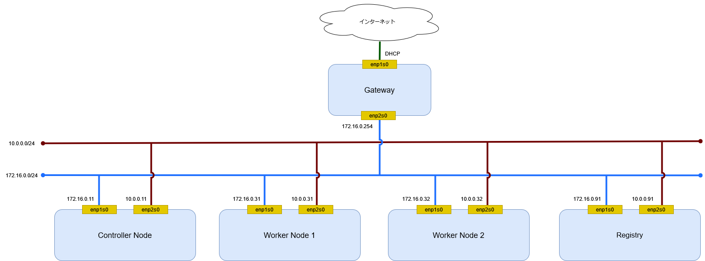
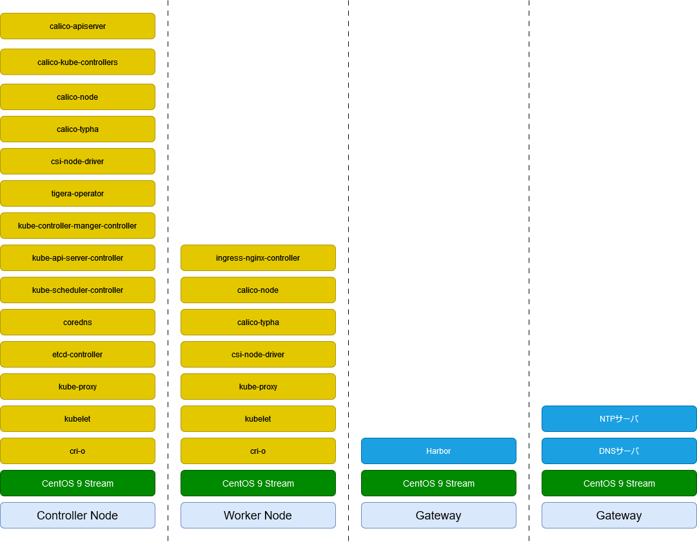

# 環境

## 構成図

ネットワーク構成図を記載する。

## ハードウェア構成

ハードウェア構成を記載する。

|          | Controller Node | Worker Node 1 | Worker Node 2 | Gateway |
| -------- | --------------- | ------------- | ------------- | ------- |
| CPU 数   | 4               | 4             | 4             | 1       |
| メモリ   | 8GiB            | 8Gib          | 8GiB          | 1GiB    |
| ディスク | 64GiB           | 64Gib         | 64GiB         | 16GiB   |

## ソフトウェア構成図

ソフトウェア構成を記載する。

