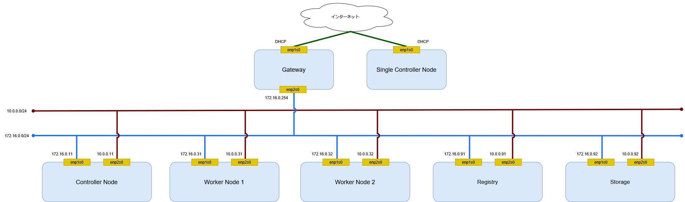
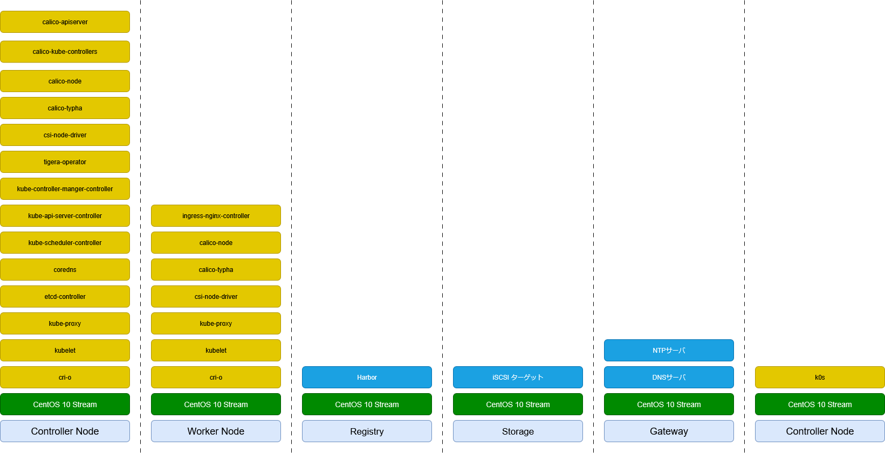

# 環境

## 構成図

ネットワーク構成図を記載する。

## ハードウェア構成

ハードウェア構成を記載する。

|          | Controller Node | Worker Node 1 | Worker Node 2 | Gateway |
| -------- | --------------- | ------------- | ------------- | ------- |
| CPU 数   | 2               | 2             | 2             | 1       |
| メモリ   | 4GiB            | 4Gib          | 4GiB          | 1GiB    |
| ディスク | 32GiB           | 32Gib         | 32GiB         | 16GiB   |

## ソフトウェア構成図

ソフトウェア構成を記載する。

